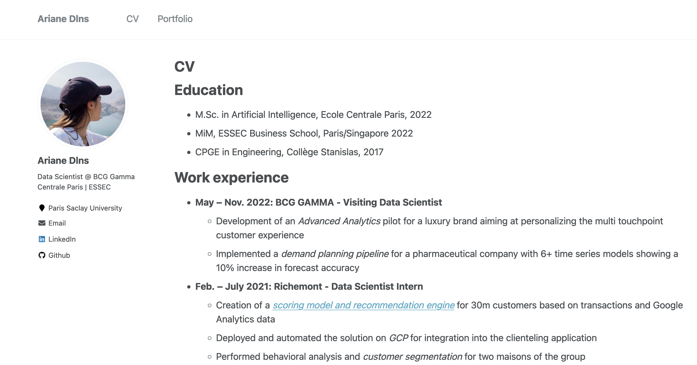

## License

A Github Pages template for academic websites. This was forked (then detached) by [Stuart Geiger](https://github.com/staeiou) from the [Minimal Mistakes Jekyll Theme](https://mmistakes.github.io/minimal-mistakes/), which is © 2016 Michael Rose and released under the MIT License. See LICENSE.md.

## Thanks

To support this, all changes to the underlying code appear as a closed issue with the tag 'code change' -- get the list [here](https://github.com/academicpages/academicpages.github.io/issues?q=is%3Aclosed%20is%3Aissue%20label%3A%22code%20change%22%20). Each issue thread includes a comment linking to the single commit or a diff across multiple commits, so those with forked repositories can easily identify what they need to patch.
