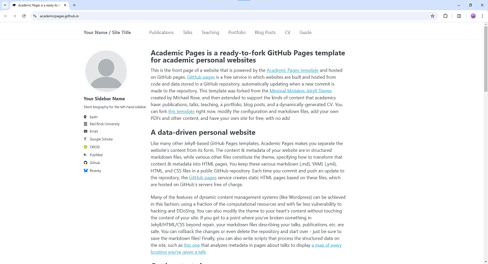

# Academic Pages
**Academic Pages is a Github Pages template for academic websites.**

# Getting Started

1. Register a GitHub account if you don't have one and confirm your e-mail (required!)
1. Click the "Use this template" button in the top right.
1. On the "New repository" page, enter your repository name as "[your GitHub username].github.io", which will also be your website's URL.
1. Set site-wide configuration and add your content.
1. Upload any files (like PDFs, .zip files, etc.) to the `files/` directory. They will appear at https://[your GitHub username].github.io/files/example.pdf.
1. Check status by going to the repository settings, in the "GitHub pages" section
1. (Optional) Use the Jupyter notebooks or python scripts in the `markdown_generator` folder to generate markdown files for publications and talks from a TSV file.

See more info at https://academicpages.github.io/
