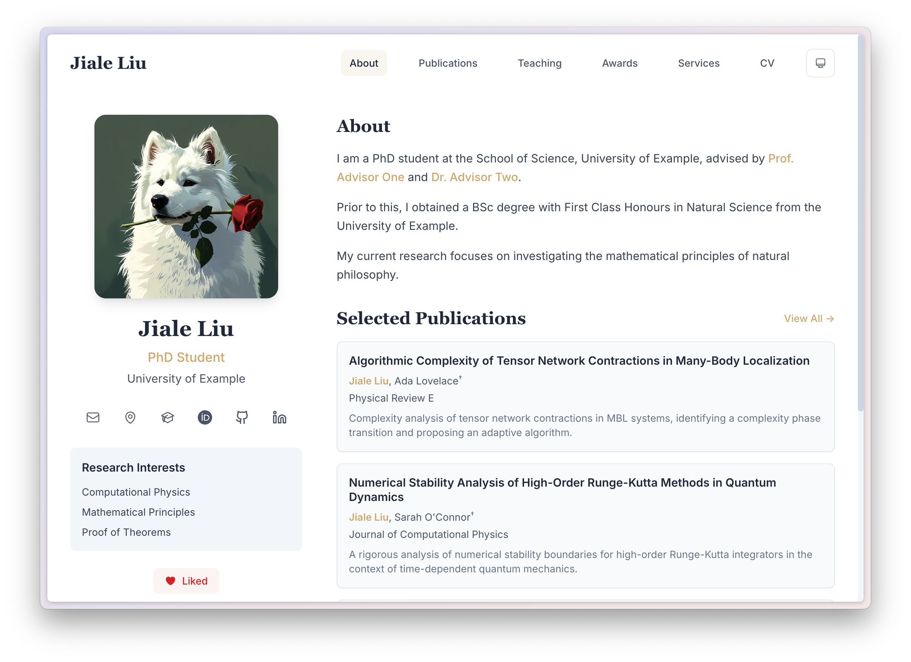

<div align="center">
  
</div>

# PRISM

[English](README.md) · **中文** · [在线演示](https://prism-demo.pages.dev) · [更新日志](CHANGELOG.md)

**如果你喜欢这个项目，请给一个 Star ⭐️**

PRISM 是 **P**ortfolio & **R**esearch **I**nterface **S**ite **M**aker（作品集与研究主页生成器）的缩写。这是一个基于 Next.js、Tailwind CSS 和 TypeScript 构建的现代化、高性能个人网站模板。

PRISM 专为**研究人员、开发者和学者**量身打造，只为让你能以最优雅、最轻松的方式，向世界展示你的工作成果、学术论文和个人履历。

你也可以借助编程智能体自定义属于自己的 PRISM 版本。



## ✨ 核心特性

*   **📄 配置驱动**：无需繁杂的代码！你只需在 `content/` 目录下编辑简单的 `TOML`、`Markdown` 和 `BibTeX` 文件即可管理全站内容。更新网站就像写文档一样简单。
*   **📚 原生 BibTeX 支持**：直接读取你的 `.bib` 文件渲染论文列表。支持按年份、类型筛选，支持搜索，甚至还能自动生成引用格式。
*   **🎨 现代美学设计**：干净清爽的响应式 UI，精心调配的衬线/无衬线字体排印，丝般顺滑的 Framer Motion 动画，以及完美支持深色模式。
*   **⚡️ 极致性能体验**：基于 Next.js 20 和 Turbopack 构建。静态导出确保了闪电般的加载速度，也让部署变得前所未有的简单。
*   **🔍 SEO 友好**：为每个页面自动动态生成元数据，让你的主页更容易被检索。
*   **🧩 灵活的动态路由**：只需新建一个配置文件，系统会自动为你处理好路由。

## 🚀 快速开始

### 前置要求

*   Node.js 22 或更高版本
    *   **重要提示**：请务必前往 [https://nodejs.org/en/download](https://nodejs.org/en/download) 手动下载并安装 Node.js。
    *   最好不要使用系统自带的包管理器安装的版本，因为它们通常较旧且可能导致兼容性问题。
*   npm, pnpm, 或 yarn

### 安装步骤

1.  **克隆仓库：**

    ```bash
    git clone https://github.com/xyjoey/PRISM.git
    cd PRISM
    ```

2.  **安装依赖：**

    ```bash
    npm install
    ```

3.  **启动开发服务器：**

    ```bash
    npm run dev
    ```

    在浏览器中打开 [http://localhost:3000](http://localhost:3000)，即可实时预览你的网站。

## 🛠️ 配置指南

所有的内容数据都存放在 `content/` 目录中，结构清晰，一目了然。

### 1. 全局站点配置 (`content/config.toml`)

在这里设置你的网站标题、作者信息、社交媒体链接以及顶部导航菜单。

```toml
[site]
title = "你的名字"
description = "某某某的个人主页"
url = "https://your-website.com"

[author]
name = "你的名字"
title = "博士生 / 研究员"
# ... 其他信息

[features]
enable_likes = true # 是否开启点赞功能
```

### 2. 首页内容 (`content/about.toml`)

自定义首页的“关于我 (About)”、“最新动态 (News)”以及“精选论文 (Selected Publications)”板块。

### 3. 论文列表 (`content/publications.bib`)

直接从 Google Scholar、Zotero 或 Mendeley 导出你的论文列表到 `content/publications.bib`。PRISM 会自动解析并生成精美的论文页面。
*   **小贴士**：你可以在 bib 文件中通过添加 `selected`, `preview` 和 `description` 字段来自定义论文的展示效果（例如是否在首页置顶、添加封面图等）。
*   论文标题支持部分 BibTeX 行内格式命令，包括 `\textit{}`、`\emph{}`、`\textbf{}`、`\textsc{}`、`\textsuperscript{}` 和 `\textsubscript{}`。

### 4. 添加新页面

想增加一个“项目展示”页？很简单：
1. 在 `content/` 下新建一个 TOML 文件（例如 `content/projects.toml`）。
2. 在 `content/config.toml` 的 `navigation` 列表中把这个新页面加进去。

PRISM 支持以下几种页面类型：

*   `text`: 纯文本渲染（Markdown），非常适合用来放 **个人简历 (CV)** 或 **详细介绍 (Bio)**。
*   `card`: 卡片列表布局，适合展示 **项目 (Projects)** 或 **获奖经历 (Awards)**。卡片条目的 `content` 字段支持 Markdown。
*   `publication`: 完整的论文列表页，自带搜索和筛选器。

### 5. 多语言支持（`content_<locale>/`）

PRISM 现已支持多语言：

*   默认语言内容放在 `content/`
*   其他语言内容放在 `content_<locale>/`（例如：`content_zh/`、`content_en/`）。
*   各语言目录保持同名文件。例如：`content/cv.md`（默认）、`content_zh/cv.md`
*   若某个语言文件缺失，PRISM 会自动回退到默认 `content/` 中的同名文件。

在 `content/config.toml` 中配置多语言行为：

## 📦 部署上线

PRISM 针对静态部署进行了深度优化，你可以轻松将其托管在任何支持静态网站的平台上。

```bash
npm run build
```

运行上述命令后，会生成一个 `out/` 目录，这就是你网站的全部静态文件。

👉 **[点击阅读完整的部署指南](docs/deployment_cn.md)** （包含部署到 **GitHub Pages** 和 **Cloudflare Pages** 的详细教程）。

## 📂 项目结构概览

```
PRISM/
├── content/              # ✨ 用户内容区 (在此编辑 TOML, BibTeX, MD 文件)
├── public/               # 静态资源 (图片, PDF论文等)
├── src/
│   ├── app/              # Next.js App Router 核心逻辑
│   ├── components/       # React 组件库
│   ├── lib/              # 工具函数 (解析器, 配置加载器)
│   └── types/            # TypeScript 类型定义
├── next.config.ts        # Next.js 配置文件
└── tailwind.config.ts    # Tailwind CSS 配置文件
```

## 🤝 参与贡献

如果你有好的想法或发现了 Bug，欢迎提交 Pull Request 或 Issue。让我们一起把 PRISM 变得更好！

## 📄 开源协议

本项目遵循 MIT 开源协议 - 详情请参阅 [LICENSE](LICENSE) 文件。
