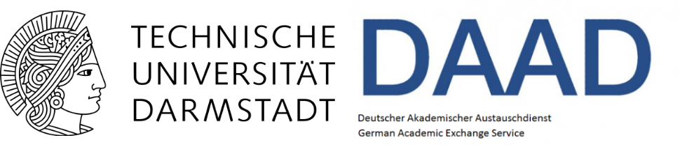

April 2024
======
I have receive the **IGARSS Student travel grant** to present my research at the IGARSS-2024 to be held in Athens.

{: width="800" }   

November 2023
======
Our **ML-CASCADE** app has won the open house competition held at IIT-Delhi and was covered by the [Times of India](https://timesofindia.indiatimes.com/city/delhi/pollution-problem-to-climate-crisis-iit-open-house-tries-to-address-all/articleshow/104977470.cms).  

{: width="600" }  

 

September 2023
======
I have received the prestigious **SERB OVDF** to pursue reseaarch at the University of Alberta. I will be working on development of an experimental Landslide Early Warning System for India.

{: width="300" }    

March 2020
======
I received the **DAAD-KOSPIE** scholarship for masters students from Indian Institutes of technology. I will complete my masters theses at TU Darmstadt

{: width="300" }  

December 2019
======

I received the **Mukhyamantri Protsahan Yojna** grant from government of himachal pradesh for pursuing masters IIT-Guwahati.

March 2014
======
I received the **ACC cement scholarship** to pursue Bachelors in Civil Engineering due to my performance in Joint Entrance Examination  
