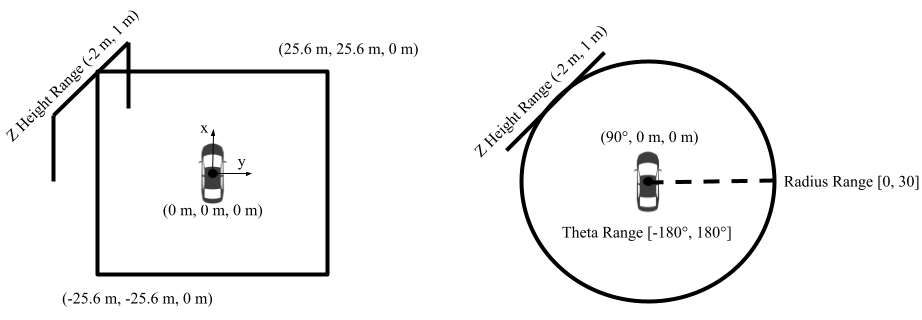
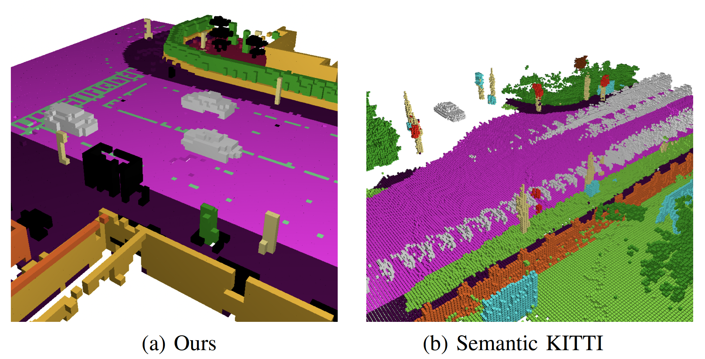
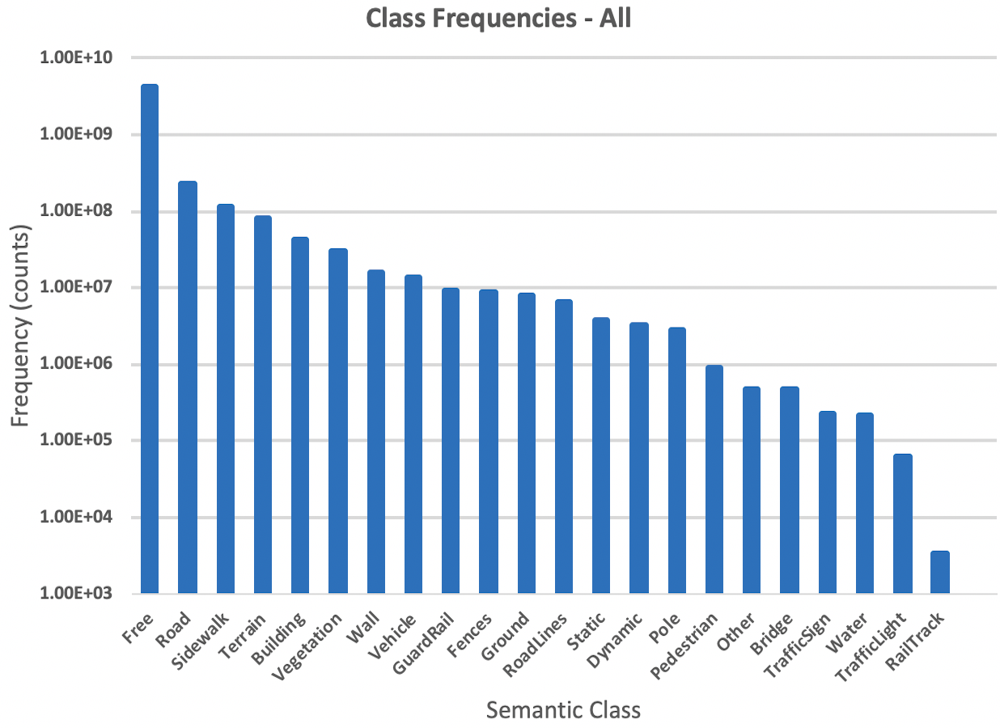
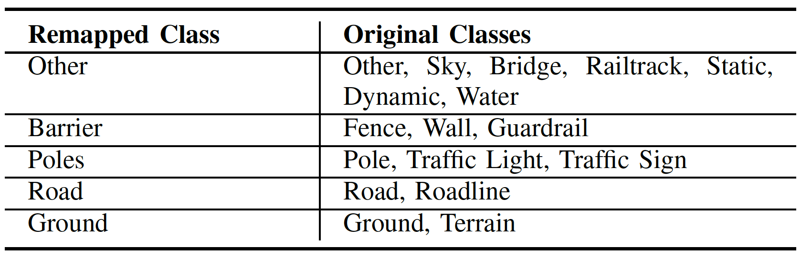
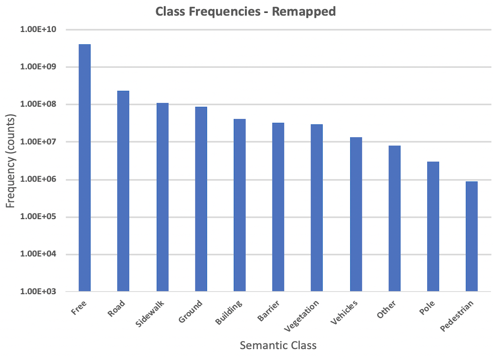
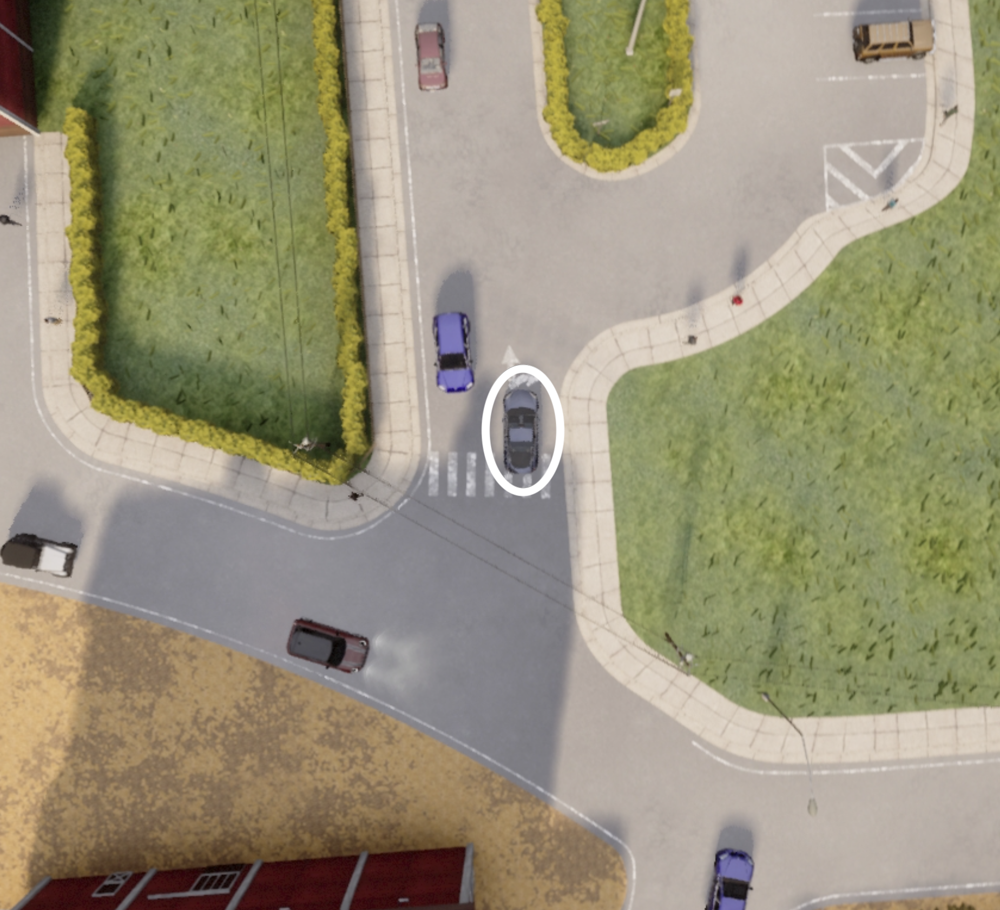
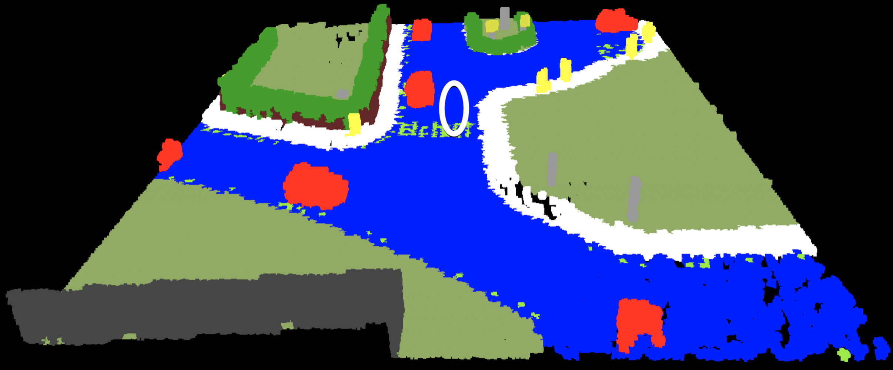
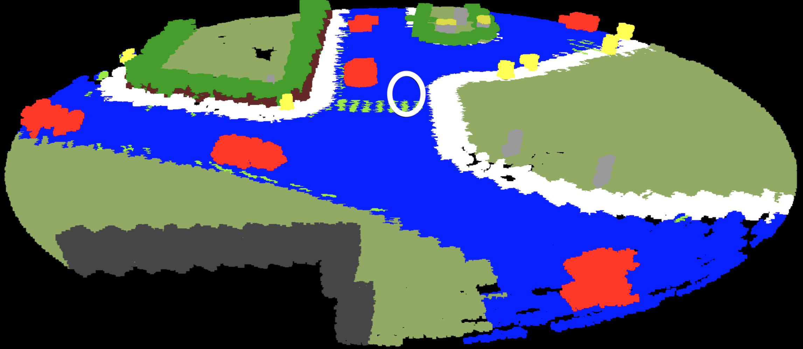

    <video autoplay="autoplay" src="../images/DataVideo.mp4" controls="false" width="100%" />

Welcome! **CarlaSC** is a semantic scene completion dataset with the aim of increasing scene understanding in dynamic environments. Dynamic environments are challenging for scene understanding because dynamic objects leave behind traces and occlusions in completed scenes. As a result, quantifying performance and supervising training of algorithms from real world data is challenging. Therefore, we propose **CarlaSC**, a synthetic outdoor driving dataset generated from *randomly sampled multi-view geometry*.

## Overview

Our dataset consists of 24 sequences, generated from eight maps with a light traffic, medium traffic, and heavy traffic sequence for each. We obtain data from the [CARLA](https://carla.org/) simulator for its realism, autonomous traffic, and synchronized ground truth. Each sequence consists of three minutes of driving sampled at 10 Hz, for a total of 1800 frames. Each frame contains ground truth data including:

* Observed **point clouds** with **semantic labels** and ego-motion compensated **scene flow** for each point.
* **Pose** and **time** of each observation.
* **Complete semantic scene** represented in Cartesian and Cylindrical coordinates. The scene is obtained from twenty randomly placed LiDAR sensors, placed in new locations for every sequence.
* **Bird's Eye View** image for verification.

## Scan Properties

To maintain consistency with SemanticKitti, each scene in **CarlaSC** contains 131,702 cells, which is roughly equal to the number of points in each scan. Scan coordinates are in the ego Lidar frame, where the x direction is forward, y direction is to the right, and z direction is up. The limits on both the cartesian and cylindrical coordinate systems were chosen to be roughly the same as Kitti, and the total volume contained by each nearly the same as well. The resolution for resolution of the cartesian and cylindrical scene is (2.81 degrees, 0.23 m, 0.375 m). While Semantic KITTI voxelizes only the region 51.2 meters in front of the vehicle, we include the region in front and behind the vehicle, as the both regions are important for safe and efficient operation. 

The exact dimensions for each scene in cartesian and cylindrical coordinates is shown below.

  

Our multi-view scenes include free space labels and minimal occlusions. Each map divided into a low traffic, medium traffic, and high traffic setting. Low traffic is defined as 25 autonomous pedestrians and vehicles, medium traffic as 50 of each, and high traffic as 100. An example image from our dataset compared to a similar frame in the well-known [Semantic KITTI](http://www.semantic-kitti.org/) dataset is shown below. 

  

## Classes

There are 23 semantic [classes](https://carla.readthedocs.io/en/latest/ref_sensors/#semantic-segmentation-camera) in the CARLA simulator. We remove all unlabeled points, and use class 0 to instead represent free space. We also remove any observations of the ego-vehicle, resulting in a clean dataset. A histogram of the frequency of all classes is shown below. 

 

As can be seen, the distribution of classes is very uneven. Some classes are nearly identical to others, and some classes such as sky do not show up at all. Therefore, we also propose a remapping of the classes to aid with training supervised learning algorithms.

  

   

  

## Format

Our data set is split into two coordinate systems with three splits each. There is a Cartesian and Cylindrical semantic scene completion data set, each with a training, validation, and testing split. Note that the coordinate system is only modified for the *output semantic scene*, while the coordinate system for point clouds and poses is Cartesian in both. An example of the same scene in both coordinate systems is shown below, with a Bird's Eye View camera image for reference. Cylindrical coordinates represent objects near to the ego vehicle in high resolution while further away objects are granular. Cartesian coordinates maintain a consistent resolution throughout the volume. 

  

   
   

The file structure of our data is shown below. Formats are similar to that of Semantic KITTI, where semantic labels are stored as a [NumPy](https://numpy.org/) uint32 file with the extension ".label" and other files including point locations, number of points per cell, and scene flow are stored as a [NumPy](https://numpy.org/) float32 file with the ".bin" extension. Files are stored as a six character string indicating the frame number followed by an extension, which may be mapped to an exact time using the "times.txt" file. Note that all files use the ego sensor coordinate frame. 

  
   <b>Split</b> (Train, Val, and Test)

  
   <b>Sequence</b> 

  
   <b>Coordinates</b> (cartesian or cylindrical)

  
   <b>bev</b> bird's eye view image of each frame

  
   <b>evaluation</b> semantic scene completion ground truth

  
   <b>labels</b> semantically labeled point cloud for each frame

  
   <b>predictions</b> ego-motion compensated scene flow for each frame

  
   <b>velodyne</b> raw point cloud without intensity

  
   <b>poses.txt</b>

  
   <b>times.txt</b> 

