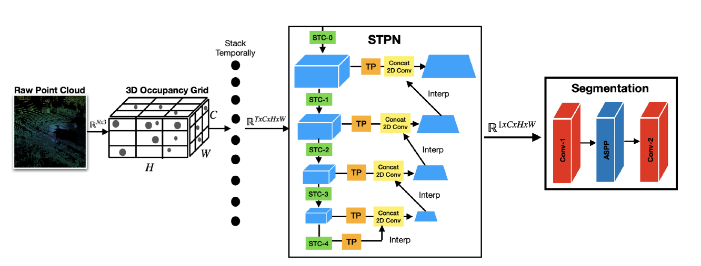
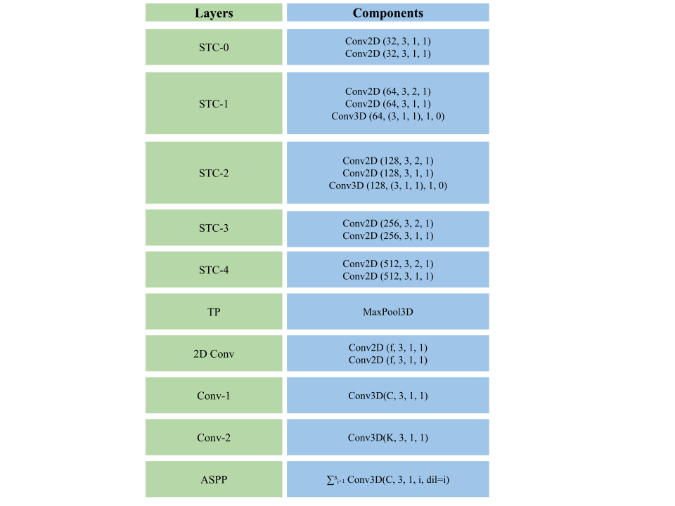
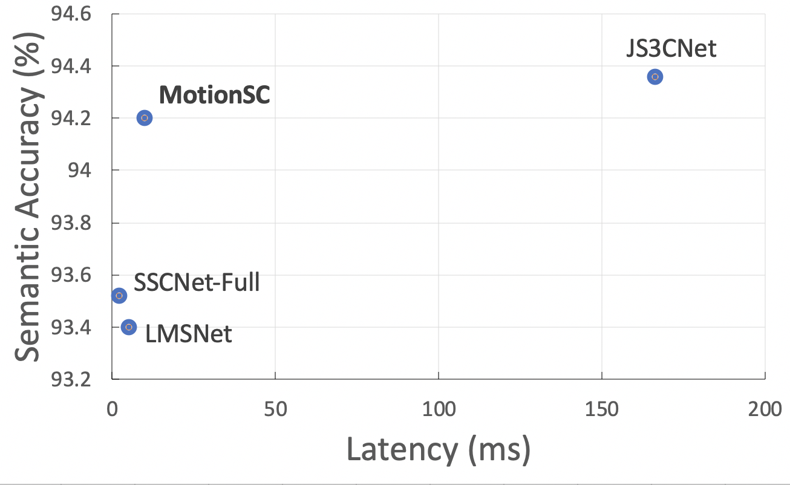
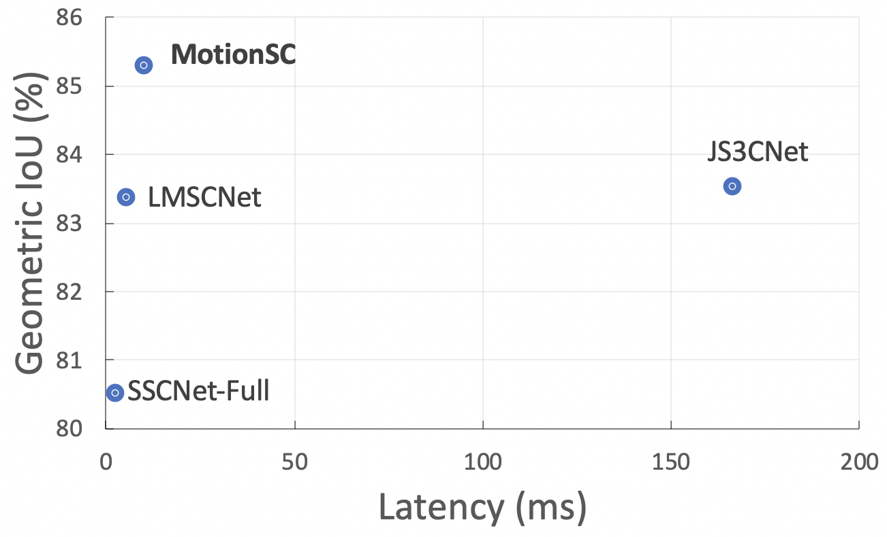

    <video autoplay="autoplay" src="../images/NetworksFast.mp4" controls="controls" width="100%" />

## Overview
We design a real-time dense local semantic mapping algorithm, MotionSC as a benchmark on the CarlaSC dataset. We compare with open source state-of-the-art semantic scene completion networks [SSCNet](http://sscnet.cs.princeton.edu/), SSCNet-Full, [LMSCNet](https://arxiv.org/abs/2008.10559) and [JS3CNet](https://github.com/yanx27/JS3C-Net). You can find our implementations of each network on our [GitHub](https://github.com/UMich-CURLY/3DMapping), where we use open source implementations from the authors of the aforementioned papers. The video above shows a comparison of our lightweight model MotionSC with the baselines. 

## MotionSC

Our approach builds upon the efficient 2D convolution architecture of LMSCNet by incorporating temporal information using temporal pooling layers from [MotionNet](https://arxiv.org/abs/2003.06754). A diagram of our network is shown below, and is comprised of a A Spatio-Temporal Pooling Network backbone with a semantic scene completion head which lifts the dimensionality of the output. The input to the network is a stack of consecutive occupancy grids, which may be maintained without significant additional computational overhead. 

The layers of the network can be seen in the graphic below. Each Conv2D operation is followed by a BatchNorm2D and ReLU operation. The parameters of each convolution operation are the number of filters f, kernel size, stride, and padding. Any stride 2 operation reduces the H and W dimensions by half, while stride 1 operations preserve dimensions. Unless otherwise specified, dilation (dil) is 1. The ASPP block sums three 3D convolutions with dilations [1, 2, 3] and paddings of [1, 2, 3].

  

The MotionSC network balances accurate and complete real-time performance compared with other state-of-the-art algorithms, and gains a smoothing effect from temporal information. These effects may be seen in the graphs below, or video at the top of the page. More details can be found in our paper.

   
   

## Training Logs
We also use the [TensorBoard](https://www.tensorflow.org/tensorboard) to record the training process. You can check how to use the TensorBoard [here](https://pytorch.org/tutorials/recipes/recipes/tensorboard_with_pytorch.html). You can access and download the logs on our [GitHub](https://github.com/UMich-CURLY/3DMapping). The frozen weights for each model may also be found on our GitHub. 

<!-- ## Visualization -->
