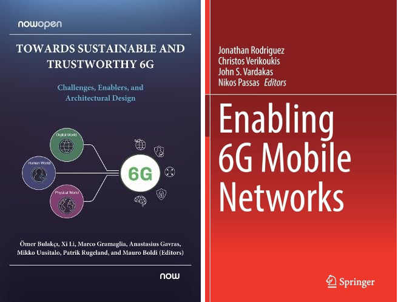

Farhad Rezazadeh (IEEE S'19, M'23) received the Ph.D. degree (*Cum Laude*) in [Signal Theory and Communications](https://tsc.upc.edu/en) from [Technical University of Catalonia (UPC)](https://www.upc.edu/ca), Barcelona, Spain under the supervision of Prof. Christos Verikoukis and with the tutoring of Prof. Luis Alonso. He was honored to have Prof. Dusit Niyato preside over his Ph.D. defense session. He is currently a Researcher (*Senior Applied AI Engineer*) in the [Services as NetworkS (SaS) Research Unit](https://www.cttc.cat/services-as-networks-sas/) at the [Telecommunications Technological Center of Catalonia (CTTC)](https://www.cttc.cat/), Barcelona, Spain. Prior to his current role, he contributed as a Research Assistant at the [Advanced Broadband Communications Center (CCABA)](https://ccaba.upc.edu/en), under the esteemed guidance of Prof. Josep Solé-Pareta. He participated in 8 European and National *5G/B5G/6G* R&D projects with leading and technical tasks in the areas of Applied *AI* and *XAI*. His [*AI innovation*](https://innovation-radar.ec.europa.eu/innovation/52337) in B5G/6G resource allocation was recognized as a great EU-funded Innovation by the European Commission's Innovation Radar. He was awarded the first patent connected to the H2020 5G-SOLUTIONS project. He was a secondee at [NEC Lab Europe](https://www.neclab.eu/research-areas/6g-networks) under the supervision of Prof. Xavier Costa-Pérez and had scientific missions at [Technical University of Munich (TUM)](https://www.ce.cit.tum.de/en/lkn/home/), [Hamburg University of Technology (TUHH-School)](https://www.tuhh.de/tuhh/en/startpage), and [Universitat de Girona (UdG)](https://bcds.udg.edu/news). He is a [Marie Skłodowska-Curie Ph.D.](https://www.5gstepfwd.eu/#home) grantee and won 5 different *IEEE/IEEE ComSoc* grants, 2 [European Cooperation in Science and Technology](https://www.cost.eu/) grants, and a [Catalan Government Ph.D.](https://agaur.gencat.cat/ca/inici/) grant. He is an active member of IEEE Young Professionals and IEEE Spain - Technical Activities and Standards with more than 23 top-tier journals and conferences. He serves as Organizing, Chair, Reviewer, and TPC member in IEEE and Guest Editor in Elsevier.

Research Interests
======
- **Applied AI** [eXplainable AI (eXplainable Reinforcement Learning), Genertaive AI (Generative Reinforcement Learning), Quantum AI (Quantum Reinforcement Learning), Graph Neural Network (GNN-Reinforcement Learning), Lifelong RL (Federated, Distributed, Meta Learning), and MLOps (Reinforcement Learning)]
- **5G/6G** [Zero-Touch, Softwarization, Cloudification, Wireless Communications, Massive Network Slicing, 6G Verticals and Services, MEC, O-RAN-xAPPs, and Smart Grid]

News
======
- [Feb 12, 2024] Our workshop proposal, entitled 'Explainable and Responsible AI/GenAI for 6G Networks (6GBRAIN)', has been accepted at IEEE Meditcom 2024.
- [Feb 04, 2024] Our paper, entitled 'Decentralized Energy Marketplace via NFTs and AI-based Agents,' has been accepted for presentation at IEEE ENERGYCON 2024.
- [Jan 18, 2024] Invited as TPC member of 2024 EuCNC & 6G Summit, 2024.
- [Dec 28, 2023] Invited Speaker at 3rd International Forum on Electronics and Electrical Engineering, 2024.
- [Dec 20, 2023] Awarded IEEE ComSoc Student Grant for 2023 IEEE NFV-SDN.
- [Oct 20, 2023] Our AI innovation in B5G/6G resource allocation was recognized as a great EU-funded Innovation by the European Commission's Innovation Radar. [[Access Link](https://innovation-radar.ec.europa.eu/innovation/52337)]

  

