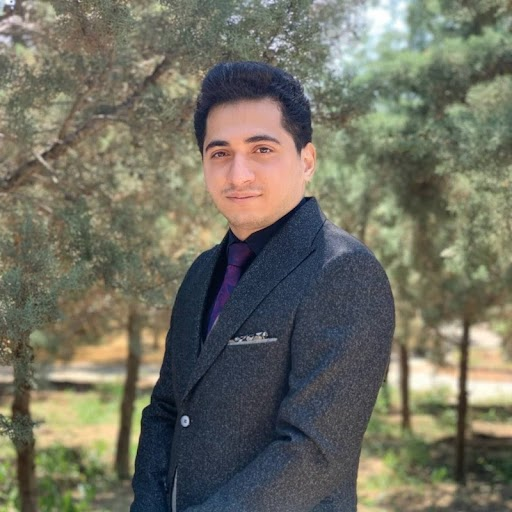

{: .align-rgiht width"300px"}
# about Me 
As a passionate student of computer engineering with a strong interest in Artificial Intelligence, I am eager to explore the frontiers of this rapidly growing field and contribute to innovative research and development projects. Throughout my academic career, I have gained a solid foundation in computer science, mathematics, and related disciplines, and have begun to develop expertise in areas such as machine learning, natural language processing, and computer vision. Through internships and coursework, I have also gained practical experience in applying AI to real-world problems and have demonstrated strong analytical, problem-solving, and communication skills.

  If you are interested in any aspect of me, I would love to chat and collaborate, please email me at - *salarmokhtari0[at]gmail[dot]com*

Academic Background
======
* B.Sc. Computer Engineering, University of Tabriz, <small> Sep 2018- Oct 2023</small> 

 

---

Research Interests
======

| :--------: | :-------: |
| Machine Learning  |  Robotics |
| IoT | Network and Cybersecurity |
| Optimization    | Algorithm    |

 

---

Academic Experience 
======
* Teaching Assistant of **Engineering Probability & Statistics**, <small> Sep 2023- Jan 2023</small> 
  * Faculty of electrical and computer engineering, University of Tabriz, Iran.
  * Lecturer: Dr.Seyed Amir Mortazavi

* Teaching Assistant of **Software Engineer 1**, <small> Sep 2023- Jan 2023</small> 
  * Faculty of electrical and computer engineering, University of Tabriz, Iran.
  * Lecturer: Dr.Leili Farzinvash

* Teaching Assistant of **Algorithm Design**, <small> Feb 2023- Jun 2023</small> 
  * Faculty of electrical and computer engineering, University of Tabriz, Iran.
  * Lecturer: Dr.Pedram Salhpour

* Teaching Assistant of **Linear Algebra and its applications**, <small> Apr 2021- Sep 2022</small> 
  * Faculty of electrical and computer engineering, University of Tabriz, Iran.
  * Lecturer: Dr.Seyed Amir Mortazavi

* Teaching Assistant of **Discrete Mathematics**, <small> Jan 2021- May 2022</small> 
  * Faculty of electrical and computer engineering, University of Tabriz, Iran.
  * Lecturer: Dr.Seyed Amir Mortazavi
  

Volunteer work & Affiliations 
======
* Member of the Computer Engineering Association of Tabriz University , <small> Jan 2021 – Jan 2023</small> 
  * Computer Engineering Association of Tabriz university.
    * Responsible for proposing and arranging scientific and recreational events for students of Electrical and Computer Engineering faculty at the University of Tabriz.

* Writer,  <small> Apr 2020 – Mar 2021</small>
  * Logisia Magazine.
     * Author and translator on the topics of Artificial Intelligence and Software engineering in Logisia magazine in the university of Tabriz Electrical and Computer Engineering Faculty.

 

---

Tests
======

* GRE General Test:
  * Q: 168; V: 162; AW: 4.0
  * Test date: August 30, 2023

 

---

References 
======

| :--------: | :-------: |
| **Dr. Seyed Amir Mortazavi**   <small>Director of the Department of Information and Technology, Faculty of Electrical & Computer Engineering, University of Tabriz, Tabriz,ran</small>  sa.mortezavi@tabrizu.ac.ir |  Robotics |
| IoT | Network and Cybersecurity |
| Optimization    | Algorithm    |
