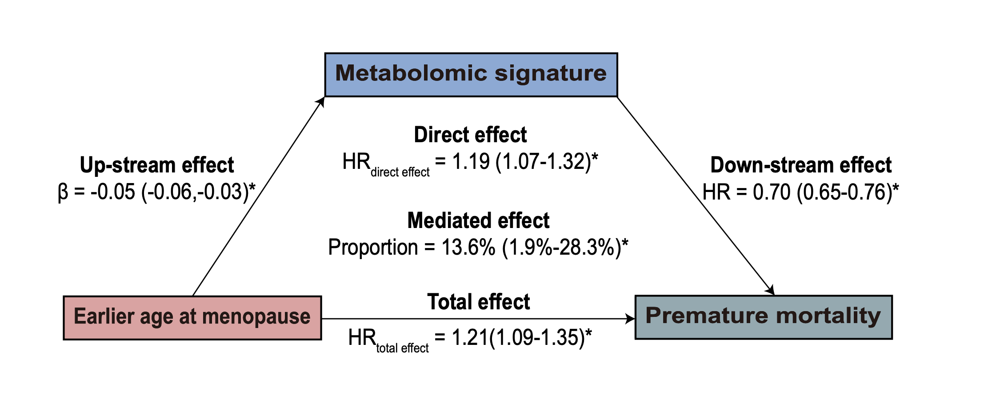

  Welcome to Mr. Zeping Yang’s academic webpage! This page is established to document my academic journey, where I share my academic experiences, skills and achievements. You can also have a quick access to knowing me. I am currently pursuing a Master’s degree in the [Institute of Reproductive and Child Health](https://irch.pku.edu.cn/), [School of Public Health](https://sph.pku.edu.cn/), [Peking University](https://www.pku.edu.cn/), China. During my Master’s program, I received comprehensive training in multiple disciplines, including Epidemiology, Geographic Information Systems (GIS), and Reproductive Health. I will graduate next year and am actively seeking opportunities for a Ph.D. position in related fields.

I have broad interests in understanding the intricate relationships and mechanisms through which environmental and metabolic exposures influence reproductive health outcomes. My research work has resulted in 4 publications in high-impact journals, including a first-author paper currently under review at *PLOS Medicine* (IF = 10.5). Recently, I have focused on applying interdisciplinary approaches, such as machine learning and GIS, to investigate the associations between air pollution—particularly PM2.5 and its chemical components—and common adverse pregnancy outcomes. 

For more details, you can find my CV here: [Zeping Yang's Curriculum Vitae](../assets/CV Zeping Yang PhD 2024.08.20.pdf). 

If you’d like to get in touch with me, [👉_Click here to scan my WeChat QR Code](../assets/Wechat.jpg).

<h2 id="publications">📝 Publications</h2>

**Earlier age at menopause, plasma metabolome, and risk of premature mortality: A cohort study in the UK Biobank**
**Zeping Yang**, Ninghao Huang, ... Nan Li*.

- **Question** What is the metabolomic signature associated with the age at menopause, and does it mediate the relationship between earlier age at menopause and increased risk of premature mortality?
- **Findings** In this prospective cohort study of 33,687 participants, earlier menopause was significantly linked to a 60% higher risk of premature mortality for those experiencing menopause before 40 years old. A metabolomic signature of 106 metabolites correlated with premature mortality mediated 13.6% (1.9%–28.3%) of this association.
- **Meaning** An identified metabolomic signature may potentially predict and manage premature mortality risks associated with early menopause.

[👉_Click here to check out my full publications_](https://scholar.google.com/citations?user=A8k3EK4AAAAJ&hl=zh-CN) **…**

<h2 id="honors-and-awards">🎖 Honors and Awards</h2>

- *2023.05* Silver Award. 8th China International "Internet+" Innovation and Entrepreneurship Competition 
- *2021.05* The First Prize. 29th “Challenge Cup” Peking University Interdisciplinary Group 
- *2020.05* The First Prize. 28th “Challenge Cup” Peking University Interdisciplinary Group

<h2 id="educations">📖 Educations</h2>

- *2023.09 - 2025.06*, MM, School of Public Health, Peking University, Beijing, China
- *2018.09 - 2023.06*, MB, School of Public Health, Peking University, Beijing, China

<h2 id="internships">🪪 Internships</h2>

- *2022.09 - 2022.12*, Departmental Assistant, Beijing Chaoyang District Center for Diseases Prevention and Control, Beijing, China.
- *2021.02 - 2022.01*, Medical Intern, Beijing Haidian Hospital, Beijing, China.

<h2 id="skills">🧰 Skills</h2>

- Data Analysis: R, Stata, SPSS (Learning: SAS)
- Machine Learning: Ridge, Lasso, Elastic Regression (Improving: mlr3 book)
- Epidemiological Tools: EpiData, PASS
- GIS Tools: ArcGIS, ENVI, IDL
- Programming: Python, C, Linux Command
- Office Softwares: Word, Excel, PowerPoint, WPS
- Project Communication: GitHub, Markdown
- Adobe Series: Adobe Photoshop, Adobe Illustrator, Adobe Premiere Pro
- Language: Chinese, English (Learning: Janpanese)
- Sports: Table Tennis, Badminton, Basketball, Swimming (Learning: Tennis)
