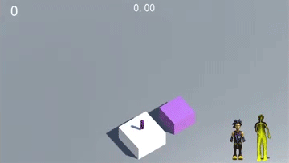

I am a **First-year M.S. student in Electrical and Computer Engineering** at the **University of Michigan, Ann Arbor**. 

My research interest lies in **Generative Models**, **Multi-Modal AI** and their real world applications.

📣 I am actively seeking for **Internship / Summer Research / RA** opportunities and a PhD position starting in 26 Spring/Fall.

## 📚 Education  

- **M.S. in Electrical and Computer Engineering**  
  *University of Michigan, Ann Arbor (Aug 2024 - May 2026)*  

- **B.E. in Digital Media Technology**  
  *Communication University of China (Sept 2020 - June 2024)*  

## 🔬 Research  
In my past research, I mainly focus on designing ultra-low bitrate image compression frameworks utilizing generative models (GANs, Diffusion Model, etc). Please refer to my [CV](http://deoxyribonucleic-acid.github.io/files/Ruijie_Chen_CV.pdf) and [Publications](https://scholar.google.com/citations?user=gF5htwwAAAAJ) for more details.

**State Key Laboratory of Media Convergence and Communication**  
*Communication University of China, Beijing | Research Assistant (Nov 2022 – Dec 2024)*  
**Advisor**: [Prof. Qi Mao](https://sites.google.com/view/qi-mao/)  
- Conducted research on scalable image compression and generative models.  
- Developed frameworks integrating AI methods for human-machine collaborative vision.  
- Contributed to cross-modal compression techniques utilizing generative models like Stable Diffusion.  

## 📝 Publications  

1. **Scalable Face Image Coding via StyleGAN Prior: Towards Compression for Human-Machine Collaborative Vision.**  
   Qi Mao, Chongyu Wang, Meng Wang, Shiqi Wang, ***Ruijie Chen***, Libiao Jin, Siwei Ma.  
   Published in **IEEE Transactions on Image Processing (TIP), 2024**.  
   - [IEEE Link](https://ieeexplore.ieee.org/document/10372532)  

2. **Stable Diffusion is a Natural Cross-Modal Decoder for Layered AI-Generated Image Compression.**  
   ***Ruijie Chen***, Qi Mao, Zhengxue Cheng.  
   Accepted by **Data Compression Conference (DCC), 2025**.  
   - [ArXiv Link](https://arxiv.org/abs/2412.12982)  

## 🧑🏻‍💻 Internship Experience  
**Algorithm Intern**  
*DeTool Technology Co., Ltd. (July 2023 – Aug 2023)*  
- Researched, verified, and adopted open-source implementations of solvers for large sparse linear systems using algebraic multigrid methods.  
- Designed ablation experiments to optimize computational modules.  

## 🎮 Projects

  <table rules="none" style="border-collapse: collapse; border: none;">
    <tr>
      <!-- 左侧图像单元格 -->
      <td style="border: none;">
        
      </td>
      <!-- 右侧文本单元格 -->
      <td style="border: none; vertical-align: middle;">
        <strong style="font-size: 24px;">Jump Jump @ Kinect</strong>
        

          A somatosensory replica of 
          <strong>
            <a href="https://zh.wikipedia.org/wiki/%E8%B7%B3%E4%B8%80%E8%B7%B3" target="_blank">
              跳一跳
            </a>
          </strong> 
          based on Kinect.
        

        

          <a href="https://github.com/deoxyribonucleic-acid/Kinect-JumpJump" target="_blank">💾 Code</a> | 
          <a href="#">▶️ Video</a>
        

      </td>
    </tr>
  </table>    

