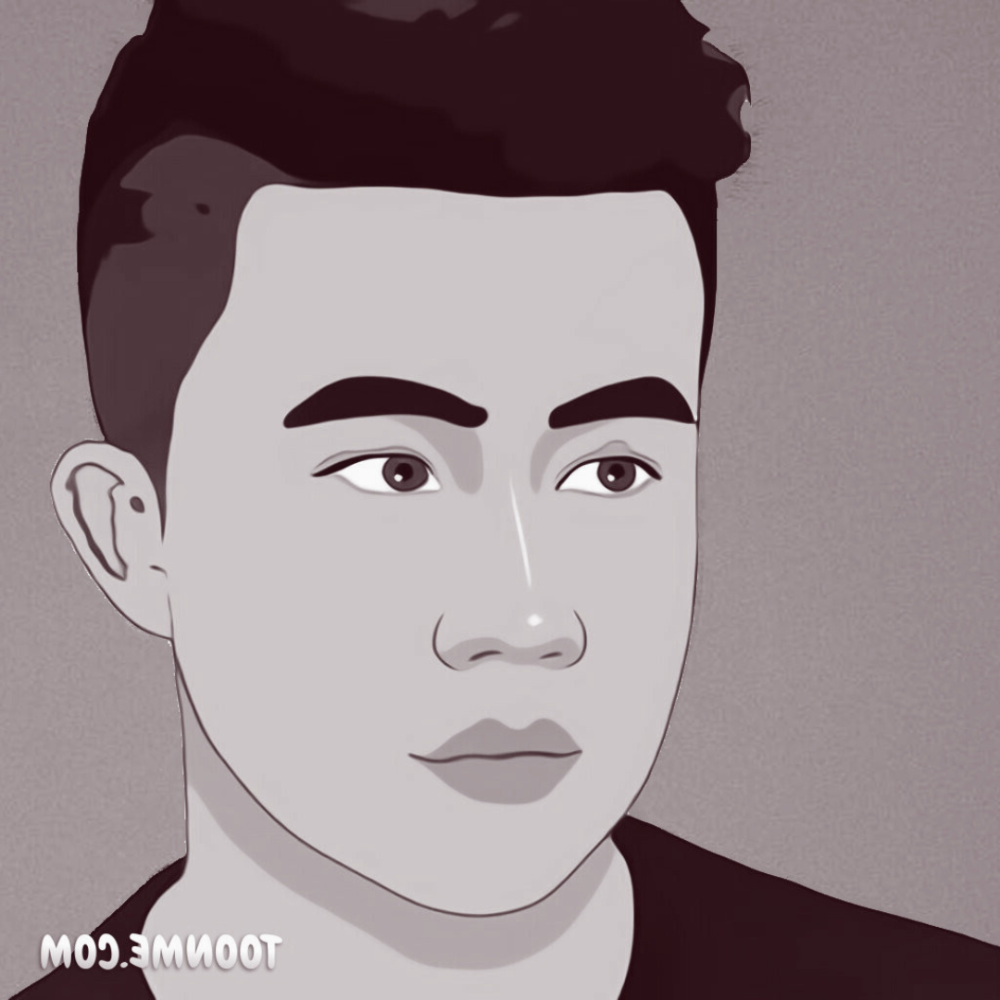

I am Owen Xingjian Zhang, a CS 2nd year Master's student at Princeton University. Currently, I am interested in Social Computing and Human Computer Interaction(HCI), working with [Dr. Andrés Monroy-Hernández](https://www.andresmh.com/) at [Princeton HCI](https://hci.princeton.edu/). I did my summer intern at [Stanford Social Media Lab](https://sml.stanford.edu/), advised by [Dr. Sunny Liu](https://sml.stanford.edu/people/sunny-xun-liu) and [Dr. Jeffrey Hancock](https://sml.stanford.edu/people/jeff-hancock). I graduated from UIUC in 2023, where I was fortunate to be advised by [Dr. Karrie Karahalios](https://cs.illinois.edu/about/people/faculty/kkarahal) and [Dr. Brian Bailey](https://cs.illinois.edu/about/people/faculty/bpbailey). Before coming to US, I studied in Hong Kong and I was born in Guiyang, China.

Research Interests
======
**Social Computing, Social Media, Mental Health, Human-AI Interaction, Decentralization, Computational Social Science**

I have a broad interest in these areas, and at a deeper level, I am eager to explore answers to the following questions:

1. How can we design scalable and accessible mental health services using the power of emerging technologies like Generative AI?

1. What are the challenges and opportunities for the future of social media, especially on decentralized platforms?

1. What is the best way for AI to emulate and interact with humans to provide support that feels genuinely human-like?

**Currently, I am looking for HCI-related PhD positions 2025 Fall.**

    
Chat with Virtual Owen

    

        

            
            
Hello, I am virtual Owen, what do you want to know about me?

        

    

    

        <input type="text" id="inputMessage" placeholder="Type your message here...">
        <button id="sendButton">Send</button>
    

