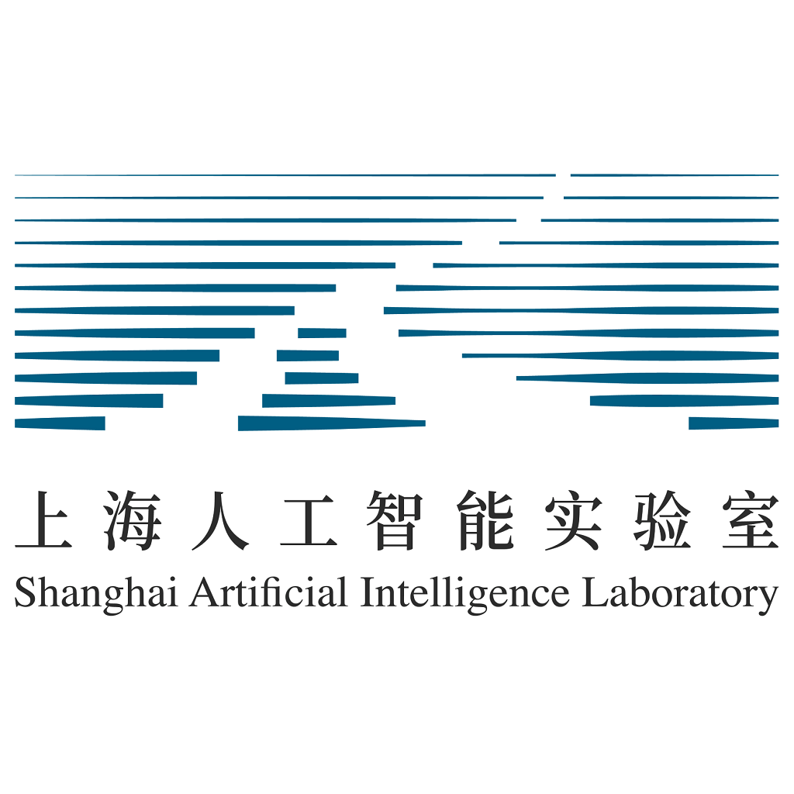
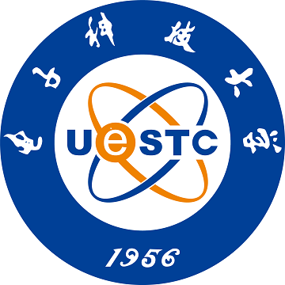

I am a research assistant at Shanghai Artificial Intelligence Laboratory, supervised by [Prof. Yu Cheng](https://scholar.google.com/citations?user=ORPxbV4AAAAJ). I also hold a research assistant position at Westlake University, working closely with [Prof. Stan Z. Li](https://scholar.google.com/citations?user=Y-nyLGIAAAAJ). Prior to this, I received my bachelor's degree in Computer Science & Mathematics and Applied Mathematics from University of Electronic Science and Technology of China, where I worked as a research intern under the supervision of [Prof. Wen Li](https://wenli-vision.github.io/).

My research interests primarily revolve around **(1)** interpretability and representation capability of deep neural networks
(e.g., sparsity in large language models), **(2)** fundamental structures of neural network design (e.g., mixture of experts), and **(3)** applications of artificial intelligence in other research areas (e.g., AI for biology, psychology). Currently, I am engaged in the research on fundational Large Language Models (LLMs), with a specific focus on designing efficient and effective structures.

 **I am actively looking for a PhD program. If you find our research interests align or if there is potential for collaboration, please feel free to get in touch with me.** 

## News

- [2023/12] We release [LLaMA-MoE](https://github.com/pjlab-sys4nlp/llama-moe), a series of open-sourced Mixture-of-Expert (MoE) models!
- [2023/05] One paper is accepted by [ACL 2023](https://2023.aclweb.org/).
- [2022/10] One paper is accepted by [EMNLP 2022](https://2022.emnlp.org/).
- [2022/08] One paper is accepted by [WACV 2023](https://wacv2023.thecvf.com/).

## Research Experiences

<dl>
  <dt></dt>
  <dt>Shanghai Artificial Intelligence Laboratory</dt>
  <dd>2023/07 - Now</dd>
  <d>Research Assistant, supervised by <a href="https://scholar.google.com/citations?user=ORPxbV4AAAAJ">Prof. Yu Cheng</a></d>
  <dd>Large Language Models, Natural Language Processing</dd>
</dl>

<dl>
  <dt></dt>
  <dt>Westlake University</dt>
  <dd>2023/04 - Now</dd>
  <d>Research Assistant, supervised by <a href="https://scholar.google.com/citations?user=Y-nyLGIAAAAJ">Prof. Stan Z. Li</a></d>
  <dd>Molecular Generation, AI for Drug Discovery and Development</dd>
</dl>

<dl>
  <dt></dt>
  <dt>University of Electronic Science and Technology of China</dt>
  <dd>2022/07 - 2023/03</dd>
  <d>Research Intern, supervised by <a href="https://wenli-vision.github.io/">Prof. Wen Li</a></d>
  <dd>Domain Adaptation, Transfer Learning</dd>
</dl>

## Publications

1. Shwai He, Liang Ding, **Daize Dong**, Boan Liu, Fuqiang Yu, Dacheng Tao, "***PAD-Net: An Efficient Framework for Dynamic Networks***", Proceedings of The 61st Annual Meeting of the Association for Computational Linguistics (ACL 2023). [[Paper](https://aclanthology.org/2023.acl-long.803.pdf)]
2. Shwai He, Liang Ding, **Daize Dong**, Miao Zhang, Dacheng Tao, "***SparseAdapter: An Easy Approach for Improving the Parameter-Efficiency of Adapters***", Findings of The 2022 Conference on Empirical Methods in Natural Language Processing (EMNLP 2022). [[Paper](https://aclanthology.org/2022.findings-emnlp.160.pdf)]
3. Shwai He, Chenbo Jiang, **Daize Dong**, Liang Ding, "***SD-Conv: Towards the Parameter-Efficiency of Dynamic Convolution***", IEEE/CVF Winter Conference on Applications of Computer Vision, 2023 (WACV 2023). [[Paper](https://openaccess.thecvf.com/content/WACV2023/papers/He_SD-Conv_Towards_the_Parameter-Efficiency_of_Dynamic_Convolution_WACV_2023_paper.pdf)]

## Preprints

1. Zhangyang Gao\*, **Daize Dong**\*, Cheng Tan, Jun Xia, Bozhen Hu, Stan Z. Li, "***A Graph is Worth K Words: Euclideanizing Graph using Pure Transformer***", Under Review by The 41st International Conference on Machine Learning (ICML 2024).
2. Xingran Chen, Zhangyang Gao, Cheng Tan, Siyuan Li, **Daize Dong**, Stan Z. Li, "***OmniMixup: Generalize Mixup with Mixing-Pair Sampling Distribution***", Under Review by The 41st International Conference on Machine Learning (ICML 2024).
3. Tong Zhu, **Daize Dong**, Xiaoye Qu, Jiacheng Ruan, Wenliang Chen, Yu Cheng, "***Dynamic Data Mixing Maximizes Instruction Tuning for Mixture-of-Experts***", Under Review by The 62nd Annual Meeting of the Association for Computational Linguistics (ACL 2024).
4. Tong Chu, **Daize Dong**, Jinhong Deng, Lixin Duan, Wen Li, "***Blending and Aggregating the Target for Blended-Target Domain Adaptation***", Under Review by IEEE Transactions on Image Processing (IEEE-TIP).

## Projects

1. ***LLaMA-MoE: Building Mixture-of-Experts from LLaMA with Continual Pre-training***. [[Code](https://github.com/pjlab-sys4nlp/llama-moe)] [[Technical Report](https://github.com/pjlab-sys4nlp/llama-moe/blob/main/docs/LLaMA_MoE.pdf)]

