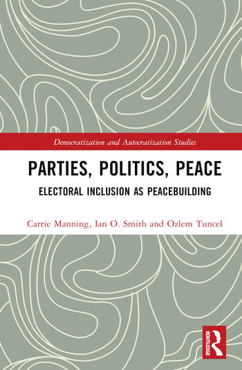

---
layout = archive
title: "Book"
permalink: /book/
author_profile: true
---

*(with [Carrie Manning](https://scholar.google.com.tr/citations?user=1-6khNgAAAAJ&hl=en) and [Ian Smith](https://www.stmarytx.edu/academics/faculty/ian-smith/), Routledge, 2023)*

Pre-order this book online at [Routledge](https://www.routledge.com/Parties-Politics-Peace-Electoral-Inclusion-as-Peacebuilding/Manning-Smith-Gurlek/p/book/9781032318936).

This path-breaking book uncovers the important, under-appreciated role of armed opposition groups turned political parties in shaping long-term patterns of politics after war. Based on an empirically grounded and theoretically informed retrospective on nearly thirty years of post-conflict democratic state-building efforts, it examines whether this practice has contributed to peace and finds that engaging post-rebel parties in electoral politics has proven to be a viable long-term strategy for bringing political stability, that disparate post-rebel parties from different political contexts invest heavily in electoral politics and that few post-rebel parties actively seek return to civil conflict as a solution after becoming a political party. This book will be of key interest to scholars, students and practitioners in democracy, governance, elections, political parties, post-conflict peacebuilding, and more broadly to international relations, comparative politics, and regional politics.

