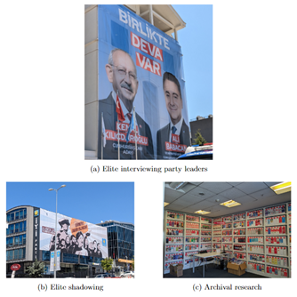

# Ousting an Autocrat: Temporary Alliances of Opposition Parties in Electoral Authoritarian Regimes

## Rewards, Grants, and Fundings
- **Best Paper Award** at ISA-South for third emprical chapter 
- **Best Fieldwork Award -- Honorable Mention** from APSA's Democracy and Autocracy section
- **2nd place at 3MT** (The Three Minute Thesis) Competition at GSU
- My book project is based on my dissertation research which has been supported by the [William A. Steiger Fund for Legislative Studies](https://connect.apsanet.org/centennialcenter/2022/09/01/pre-electoral-opposition-coalitions-in-authoritarian-regimes/) of the APSA Centennial Grant, Craigie Fellowship, and GSU's [Library Dissertation Award](https://graduate.gsu.edu/dissertation-library-travel-awards/).

## Research Question and Motivation
The success of opposition coalitions is not a common phenomenon. Opposition coalitions win against autocratic incumbents 20 percent of the time in executive elections and 30 percent of the time in legislative elections. However, once an opposition coalition wins an election, the quality of democracy in these regimes increases drastically. Despite the importance of opposition coalitions and their electoral success, we still have a limited understanding of the coalitions formed by opposition parties. In this book, I explore the electoral strategies used by these opposition parties to confront entrenched dictatorships, focusing particularly on the temporary alliances formed prior to national-level elections. These alliances are critical to understanding democratization because, as I argue, only coordination among internally strong and ideologically disparate opposition parties holds any chance of "ousting an autocrat." My book project examining opposition political parties' electoral strategies in authoritarian settings aims to unravel mechanisms leading to liberalizing outcomes. To understand how and when opposition political parties pave the way for autocratic reversal, I start from the assumption in the literature that opposition coalitions are needed to effectively challenge autocratic incumbents. I investigate an understudied aspect of autocratic reversal: ``**under what conditions do some opposition parties in electoral authoritarian regimes successfully form a pre-electoral coalition (PEC), while others fail to coordinate?**''

## Argument
My key argument in the book is that, first, the internal organization of each political party and, second, the ideological congruence of different opposition political parties come together to mediate the formation of temporary alliances. I show that political parties with greater leader discretion over internal decision-making structures and more cohesiveness in their internal institutions are more likely to form temporary alliances. Specifically, political parties with strong leadership (an indication of a centralized party structure) encounter fewer impediments during the decision-making process and have flexibility in bargaining with other political parties, as the leader is not challenged within the party. However, internal structures are not the only factors that matter. If opposition parties are highly different from each other ideologically, unwillingness to cooperate is a more likely outcome. Parties that cannot overcome these differences are likely to fail to unite against the incumbent. Cross-ideological cooperation requires convincing both the voter base and party elites that this unlikely alliance is beneficial.

More importantly, these two factors -- internal cohesion and external positioning -- work simultaneously. How a party is organized affects its relationship with other parties, and the ideological positioning of these parties can define their organizational characteristics. In addition to the internal organization and ideological positioning of these parties, this book further shows that coalition formation in electoral authoritarian regimes requires significant time, effort, and learning. Parties and elites undergo a critical learning process through positive and negative experiences in the electoral field. These experiences shape the perception of these parties in understanding collaboration and force parties to adopt various strategies over the years.

## Methodological Approach
In some parts of the world, such as Hungary and Kenya, opposition-led coalitions have proven to be critical mechanisms in the fight against autocrats. In other countries, including Venezuela, Brazil, and Togo, forming a coalition has been much more challenging. Coordination has occurred periodically, leading to varying degrees of success. In these contexts, the coordination of opposition parties can seem like a distant dream, and sometimes collaboration may not be possible at all. To address this puzzle, *Ousting an Autocrat* employs a mixed-methodological approach. More importantly, my book explains this critical variation in coordination by exploring three key factors: the internal organization of political parties, the ideological differences among the parties, and the overall learning experiences of these parties over the years. I adopt a mixed-methodological approach -- large-N quantitative analysis, causal case selection, and site-intensive methods -- to explore how political parties' organizational structures and ideological and political agenda diversity explain opposition bargaining prior to the elections. In testing my theory, I draw on an original dataset on elections in electoral authoritarian regimes and archival materials, interviews with party chairs and co-chairs, and shadowing insights. I focus on Turkey in my fieldwork, but I also explore elections in Hungary, and North Macedonia as influential and pathway cases. 

## Empirical Chapters

In the first empirical chapter, I use an original dataset to test the implications of the theory. This chapter provides a detailed exposition of the patterns and characteristics of PEC behavior through the lens of descriptive statistics derived from an original dataset meticulously constructed for this study. And second, it presents the empirical results of the analysis conducted. Given the absence of existing datasets tracking temporary alliances formed within autocratic regimes, this chapter elucidates the methodology behind creating the original dataset and offers key descriptive insights. Encompassing executive and lower-house legislative elections in electoral authoritarian regimes spanning from 1970 to 2019, the dataset comprises 2,867 country-year observations, with 1,149 observations corresponding to election years. 

In the second empirical chapter, I delve into a case study approach to further elucidate my theory, focusing on two cases identified through the analysis conducted in the previous chapter. The rationale behind this chapter is twofold: firstly, to employ diagnostic case selection with causal objectives, enabling a thorough assessment of hypotheses and findings; and secondly, to glean deeper insights into the key causal mechanisms underlying PEC formation, including intra-party divisions, inter-party polarization, and contextual factors. With this chapter, I aim to showcase the nuanced nature of PEC formation by examining cases from within my dataset, highlighting the intricacies of coalition-building processes in various contexts. To achieve this goal, I rely on a diagnostic case study approach to pick case studies and rely on various statistical measures.

In the final empirical chapter, I investigate the proposed question using the case of opposition political parties in Turkey during the Justice and Development Party regime (2002 - present). Mainly, I focus on two elections: (1) the 2018 general election as a negative case in which the opposition formed a coalition but failed to find a joint candidate, and (2) the 2023 general elections as a positive case in which the opposition successfully formed a coalition through joint-lists and joint candidate strategies. This chapter provides further support to my argument and I show that having high levels of intra-party cohesiveness and ideological diversity enabled these parties to form a coalition. This chapter relies on three different pieces of evidence: (1) site-intensive methods that include elite interviews, shadowing, and participant observation, (2) process tracing, and (3) quantitative text analysis of party manifestos and party leaders’ tweets.

## Contributions
The book represents a significant contribution to understanding the success and failure of democratization in electoral authoritarian regimes, the most prevalent form of autocracy in today's world. Theoretical implications are established through three empirical chapters. Chapters 1 and 2 provide an overview of the book and present the theoretical argument. In Chapter 3, I demonstrate how the internal organization and ideological composition of parties influence opposition coordination. Chapter 4 offers additional evidence from Hungary, illustrating how cohesion and ideological polarization impact coalition dynamics. Furthermore, the case of North Macedonia is examined to show how these factors may diminish in relevance, while institutional settings strongly influence coalition outcomes. Chapter 5 presents the final empirical evidence from Turkey, further supporting the findings on intra- and inter-party factors and the learning process within the opposition. 

Beyond its theoretical contributions, *Ousting an Autocrat* also provides important insights from a normative perspective. More than 72 percent of the world population lives under autocracies. Despite this gloomy picture, we also know that most contemporary authoritarian states have elected legislatures either in constrained or fully multi-party politics (making them so-called electoral authoritarian regimes). Free but not fair, flawed elections in these regimes allow opposition parties to challenge the autocratic incumbent and thereby create a potential for returning to democracy. Indeed, despite the tendency of observers to focus on mass movements and prominent dissidents, opposition political parties almost always represent the most organized form of dissent in electoral autocracies. This book also sheds light on how structural factors and learning mediate the options open to political parties for cooperation across the ideological spectrum. In the final analysis, if we want to understand the potential for democratization latent among the world's autocracies, we need to understand opposition parties.
