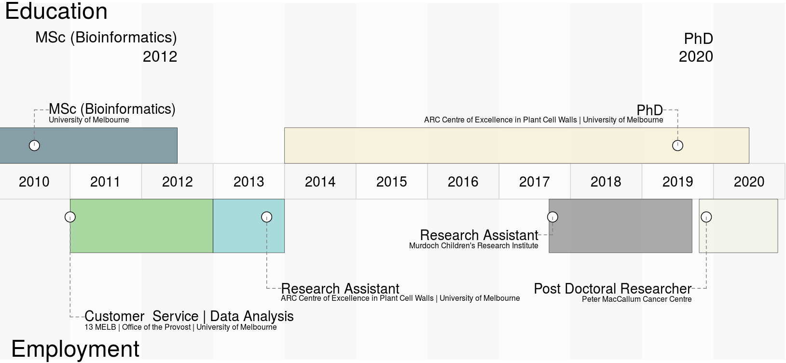



How did I get here?

* BEng (Software), University of Melbourne, 2009
* MSc (Bioinformatics), University of Melbourne, 2012
* PhD (degree requirements completed, graduation pending), University of Melbourne, 2020

I always wanted to do one of those visual resumes. Here is a work in progress, using for a snapshot of the last decade ("The Bioinformatics Years"): 

For more detail, check out [LinkedIn](https://www.linkedin.com/in/andrew-lonsdale-20a771114).

