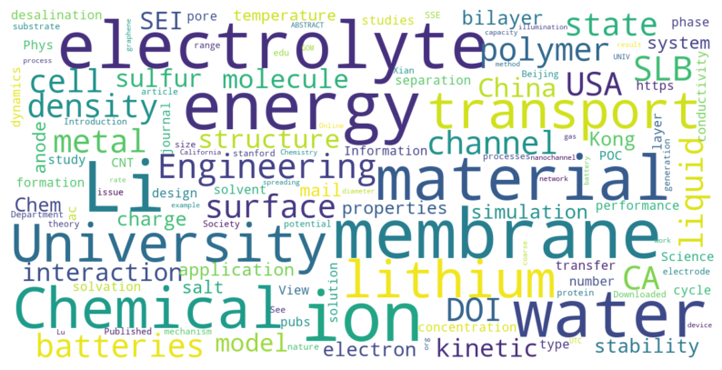
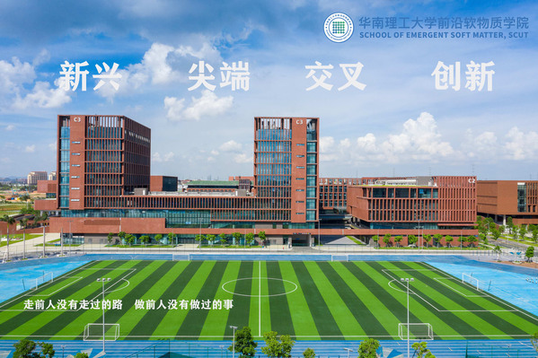

<!-- Google tag (gtag.js) -->

## Briefs on our lab

At the heart of our research endeavor lies the profound exploration of thermodynamics within the realm of cutting-edge systems. As we navigate the exciting domains of energy storage, nanotechnology, and the intricate tapestry of biology, our studies converge on pivotal concepts: electrochemistry, the nanoscale universe, and the captivating world of soft matter. In this ever-evolving landscape, we unveil the hidden intricacies that shape our understanding of the physical world.

**Got Questions or Ready to Dive In?** We're all ears! [Contact us](mailto:xk@scut.edu.cn) for inquiries about our research, joining our team, or exploring collaboration possibilities. We're here to make science awesome! 🚀🔬

**我们期待着与您交流** 如果您对我们的研究有任何疑问，或者有意加入我们的团队，甚至考虑合作，都请随时与我们[联系](mailto:xk@scut.edu.cn)。我们非常愿意倾听您的想法和建议，推动研究的进展。 🚀🔬

**Join Our Research Team! 🌟**

- **Postdocs:** Are you a recent Ph.D. grad with a passion for research? Look no further! We offer competitive financial support and fantastic government benefits. Reach out to our PI with your cover letter, CV, and representative publications.

- **Grad Students:** Whether you're aiming for a Ph.D. or a Master's degree, we have spots open just for you. No need to wait for recommendations or exams. Get in touch with our PI and let's get your academic journey started.

- **Undergrad Students:** Calling all undergrads! You're invited to our group meetings. We have exciting projects suitable for undergraduates. You are free to join us on-site or remotely. Just [send us an email](mailto:xk@scut.edu.cn) or drop by our office.

**诚邀加入我们的研究团队 🌟**

- **博士后:** 我们一直在寻找对我们研究领域充满热情的博士后研究员。博士后研究员将获得具有国际竞争力的待遇和来自当地政府的额外福利。请通过[电子邮件](mailto:xk@scut.edu.cn)与我们联系，附上您的求职信、简历和代表性论文。

- **研究生:** 我们每年有若干博士和硕士研究生名额。您可以在获得研究生推荐名额或考研考试之前通过[电子邮件](mailto:xk@scut.edu.cn)与我们联系。.

- **本科生:** 课题组有一些适合本科生的研究课题。学生可以选择实地参与或者远程参与课题研究。同时欢迎感兴趣的本科生参加我们的组会，线上或者线下形式均可。欢迎您通过[电子邮件](mailto:xk@scut.edu.cn)与我们联系

## A quick snapshot

<html> 
  <body> 
     
  </body> 
</html>

## Where we are

We are located in the vibrant city of Guangzhou, situated within the dynamic Greater Bay Area of Southern China. Our research hub is affiliated with the renowned <a href="http://www2.scut.edu.cn/aismst_en/">School of Emergent Soft Matter</a> at <a href="https://www.scut.edu.cn/en/">South China University of Technology (SCUT)</a>. SCUT has earned global recognition for its pioneering works in polymer science and engineering, ranked <a href="https://www.usnews.com/education/best-global-universities/south-china-university-of-technology-505115">#1 in this field</a> by prestigious institutions such as US News in the year 2022.

 <html> 
  <body> 
     
  </body> 
</html>