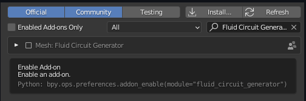
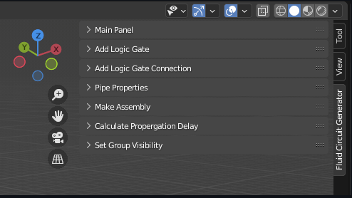

## Open Source Software

**STREAM**

This is a well-developed Blender add-on for automatically routing Macrofluidic logic circuits. We have designed a straightforward UI, an efficient path-finding algorithm, and a Macrofludic circuit components library. The only requirement for using our software is to install Blender. For more details, please refer to our [GitHub repository](https://github.com/roboticmaterialsgroup/FluidLogic)

{: .align-left width="480px"}

{: .align-left width="480px"}
