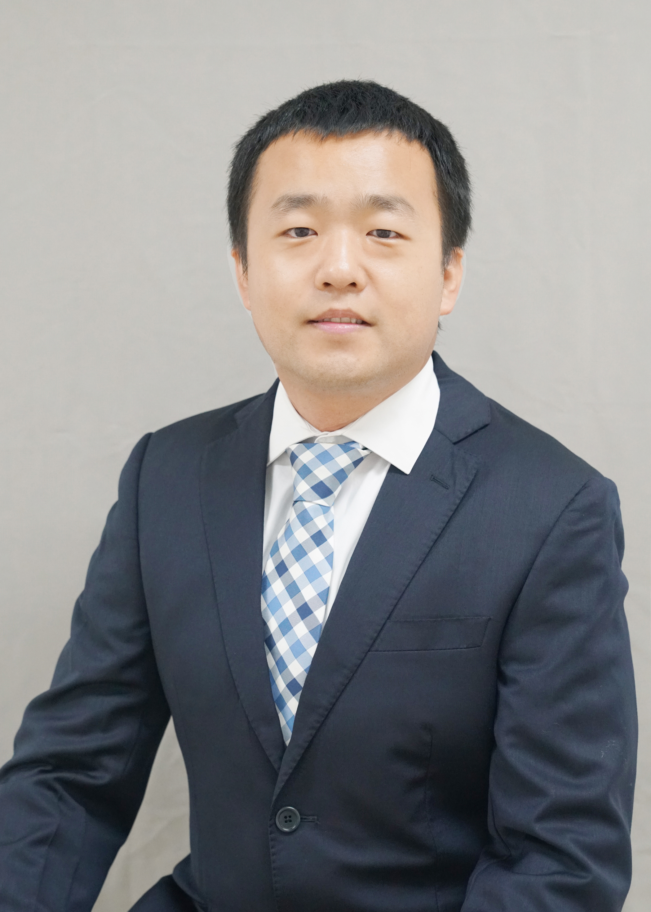
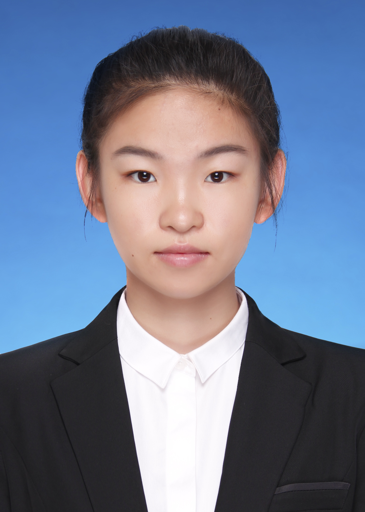
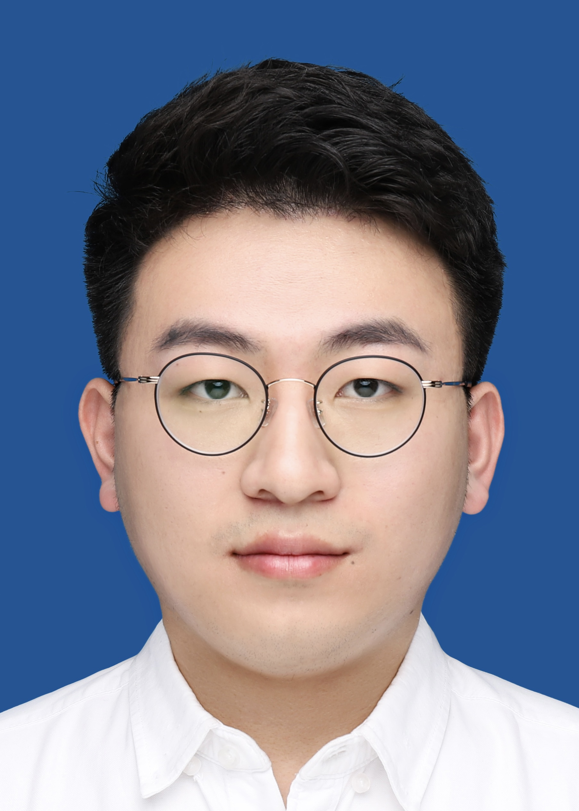
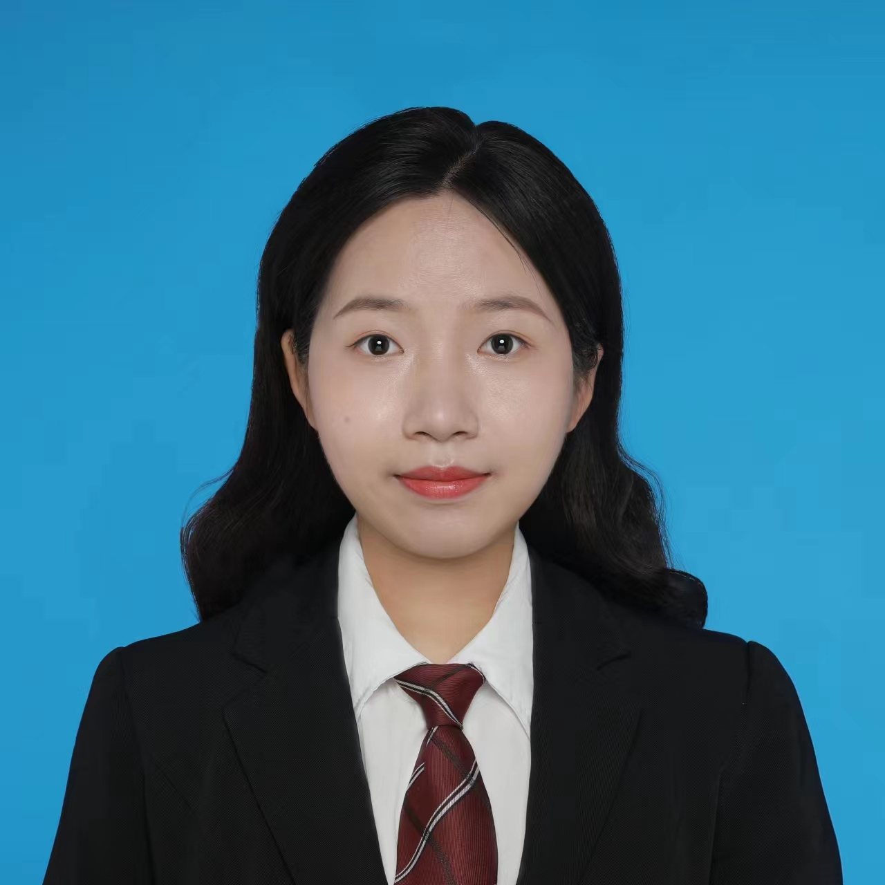
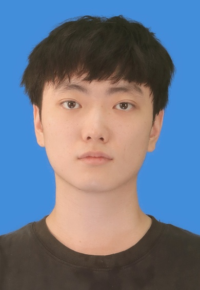
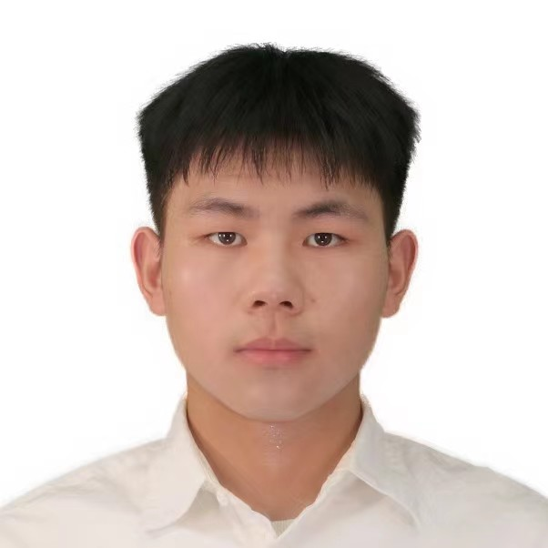

<!-- Google tag (gtag.js) -->

## Principal Investigator

  

    &ensp;&ensp;&ensp;&ensp;
    
    
 Xian Kong (孔宪)

    
 
    South China University of Technology  

    
 
    华南理工大学  

    
 
    Email: xk@scut.edu.cn  

    
 
    &ensp; 招生方向:   
    &ensp; 软物质科学与工程 (学术博士/硕士)   
    &ensp; 材料与化工 (专业硕士)  
  

    
  

  

    <!-- 
 &ensp; 孔宪 
 -->
    
 &ensp; 

    
 
    &ensp; Education 

    
 
      &bull; B.S. in Beijing, China, Tsinghua University, 2010 

    
 
      &bull; Ph.D in Beijing, China, Tsinghua University, 2016 

    
 &ensp; Work experience 

    
 
      &bull; 2021- &nbsp;: Professor, South China University of Technology, School of Emergent Soft Matter
    

    
 
      &bull; 2017-2021: Postdoctoral Research Fellow (with Jian Qin),  Stanford University 

    
 
      &bull; 2016-2017: Postdoctoral Research Fellow (with Jianwen Jiang), National University of Singapore 
  
    
 
      &bull; 2013-2014: Visiting PhD student (with Jianzhong Wu), University of California, Riverside 
 
  

<!-- 

  

    
    
Additional text below the image

  

  

    
Your text goes here

    
Your paragraph goes here

  

 -->

## Current members

  

    
    
 
    隋岩 (Yan Sui)  

    
 
    2022 PhD student  

    
 
    Email: 202210191706@mail.scut.edu.cn  

  

  

    
    
 
    袁雪迎 (Xueying Yuan)  

    
 
    2022 PhD student  

    
 
    Email: 202210191713@mail.scut.edu.cn  

  

  

    
    
 
    赵若廷 (Ruoting Zhao)  

    
 
    2023 PhD student  

    
 
    Email: 202310192911@scut.edu.cn  

  

  

    
    
 
    廖汉东 (Handong Liao)  

    
 
    Postdoc (PhD from Tsinghua Univ.)  

    
 
    Email: xxxxxx@scut.edu.cn  

  

  

    
    
 
    李子昭 (Zizhao Li)  

    
 
    2021 Master student  

    
 
    Email: 202120162453@scut.edu.cn  

  

  

    
    
 
    陈修棚 (Xiupeng Chen)  

    
 
    2021 Master student  

    
 
    Email: 202120162445@scut.edu.cn  

  

  

    
    
 
    尹婷婷 (Ting-ting Yin)  

    
 
    2022 Master student  

    
 
    Email: 202220161898@mail.scut.edu.cn  

  

  

    
    
 
    刘新强 (Xinqiang Liu)  

    
 
    2022 Master student  

    
 
    Email: 202220161872@mail.scut.edu.cn  

  

    

    
    
 
    吕尚禹 (Shangyu lv)  

    
 
    2022 Master student  

    
 
    Email: 202220161884@mail.scut.edu.cn  

  

  

    
    
 
    周媛欣 (Xuanxin Zhou)  

    
 
    2023 Master student  

    
 
    Email: 201930176470@mail.scut.edu.cn  

  

  

    
    
 
    游文强 (Wenqiang You)  

    
 
    2023 Master student  

    
 
    Email: 202320162290@scut.edu.cn  

  

  

    
    
 
    张泽昕 (Zexin Zhang)  

    
 
    2023 Master student  

    
 
    Email: 202320162302@scut.edu.cn  

  

  

   

    
    
 
    杨子霄 (Zixiao Yang)  

    
 
    2022 Undergraduate  

    
 
    Email: 202264640132@mail.scut.edu.cn  

  

  

    
    
 
    张钊(Zhao Zhang)  

    
 
    2020 Undergraduate  

    
 
    Email: 202030040173@mail.scut.edu.cn  

  

  

    
    
 
    龙浩天（Long Haotian)  

    
 
    2020 Undergraduate  

    
 
    Email: 202030040265@mail.scut.edu.cn  

  

  

  

    
    
 
    黄瑜（Yu Huang)  

    
 
    2020 Undergraduate  

    
 
    Email: 202030040227@mail.scut.edu.cn  

  

## Alumni

  

    
    
 
    何嘉桐 (Jiatong He)  

    
 
    2022 Undergraduate  

    
 
    Email: 202264641184@mail.scut.edu.cn  

  

  
  

  

  

  

  

## Group snapshot on Sep 12, 2023

<html> 
  <body> 
     
  </body> 
</html>