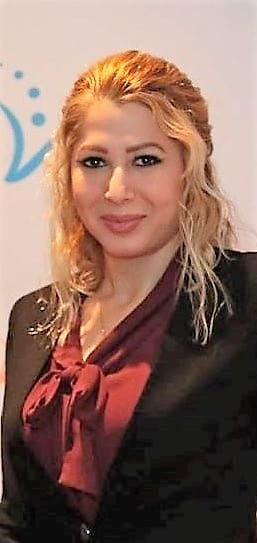
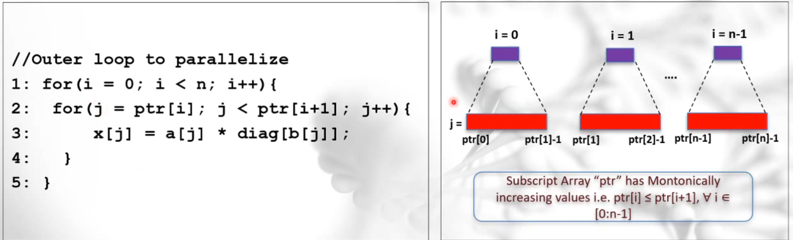
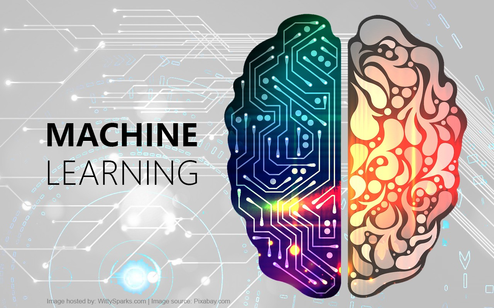

<h2>Parinaz Barakhshan</h2>

  

    
  

  

    

        I am a third-year Ph.D. candidate and Research Assistant at the University of Delaware, Department of Electrical and Computer Engineering.

        I have always loved learning, growing, developing, and challenging myself to contribute to something significant. The whole point of learning more is to be able to make a difference in the world. My purpose is to help the world run better.
    

  

---------------------------------------------------------------------------------------------------
<h2>Akshay Bhosale</h2>

I am currently working towards my PhD at the University of Delaware in Newark,DE . My major is Computer Engineering.My Undergrad major was Electronics Engineering. I have completed coursework in a variety of areas ranging from web application security, computer architecture, secure software design to parallel programming, compilers , ML and cryptography. This page will give you a comprehensive overview of all my work.
Principal Research Interests

    Automatic Parallelization
    Multi-Level Intermediate Representation (MLIR)
    Source to Source Translators
    Parallel programming paradigms
    Compile-time analysis and transformation techniques

Other subjects/research areas of interest

    Machine Learning
    Computer Systems Architecture

For more information, see the <a href="https://subscripted-subscript.akshayud.me/">Personal Web Site</a>
 
<b>Research Topic: Subscripted subscript patterns</b>
 

 
<b>Project Description: </b> A number of scientific applications comprise of loops wherein an array is subscripted by another array - a[b[i]]. With write references to the host array (array ‘a’) within a loop, current compile-time techniques are incapable of detecting such loops as parallelizable. If left unparallelized, these loops can in-turn prevent the performance obtained through automatic parallelization, matching that of the hand parallelized version. Hence, Subscripted subscript analysis is the next big challenge in Automatic Parallelization.

---------------------------------------------------------------------------------------------------
<h2>Miguel Rosas</h2>

I am a 24 years old P.hd student from the department of Computer Engineering at the University of Delaware. I am  from Cali-Colombia  and am an alumni from the Community College Initiative program  2017-2018 at Houston Community College. Also, I am a community leader with a solid professional and academic background in human rights and Software Engineering. Throughout my work at the Universidad ICESI in COlombia, I have contributed to original concepts for  software engineering, and machine learning methodologies. Right now, I am part of the National Science Foundation-supported project designed to expand access to artificial intelligence, led by The Ohio State University. Last but not least, I have  been awarded with several scholarships by the national and international industry, such as One Young World 2021 sponsored by Pfizer company, the summer internship program 2021, Global Rights Connection2021 sponsored by EQUITAS in Canada, where I obtained the social award for my  project called "I have a Dream 2021", The Youth Ambassador Program 2020 sponsored by the Department of State and among others."

<b>Principal Research Interests</b>

    Automatic Parallelization
    Software Development
    Artificial Intelligence
    Parallel programming paradigms
    Compile-time analysis and transformation techniques

<b>Other subjects/research areas of interest</b>

    Human Rights
    Diplomacy

<b>Research Topic: Artificial Intelligence in Compilers</b>
 

<b>Project Description: </b>

<nbsp>

<!-- 




  
 -->
