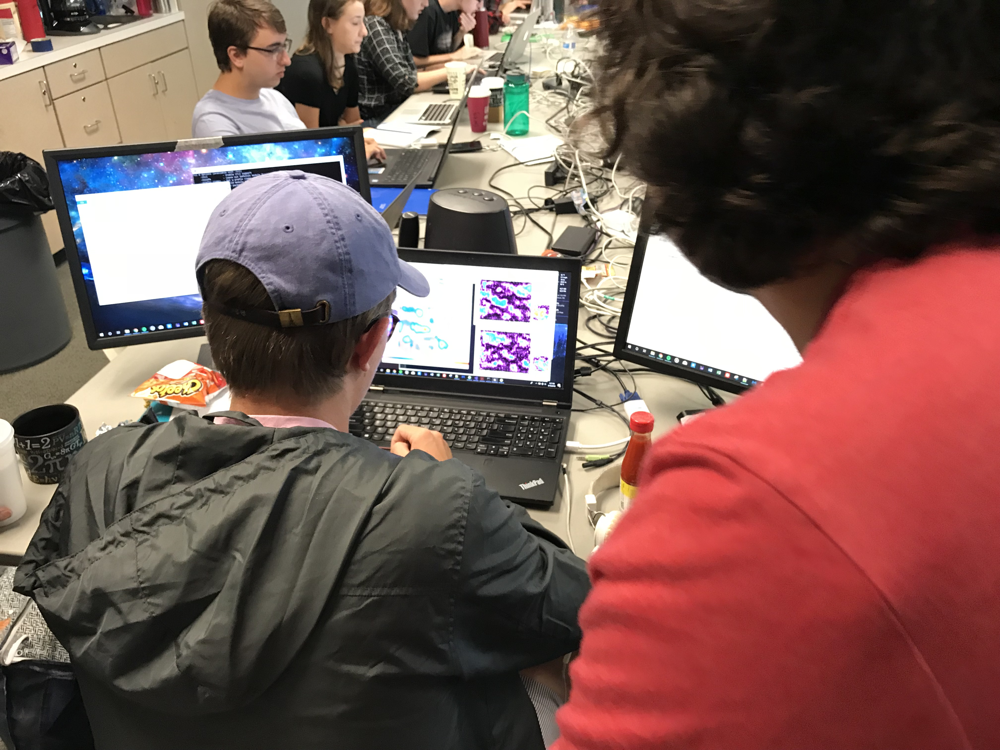

## ERIRA (Educational Research in Radio Astronomy)

Since 2018, I’ve been a mentor for ERIRA (Educational Research in Radio Astronomy), a week-long intensive astronomy research program that takes place at the Green Bank Radio Observatory (NRAO), WV during the summer, founded and led by my undergraduate advisor Prof. Dan Reichart, for almost 30 years. During ERIRA, I mentor (mostly college) students in topics such as machine learning and data science, physical modeling, computer programming, and other skills that are useful for astronomy.

Group project topics that I have mentored have include:
1. Using a 40-ft radio telescope to (1) image the arms of the Milky Way Galaxy, and use their Doppler-shifted observed frequencies to infer our height above the plane of the Galaxy.
2. Using a 40-ft radio telescope to image the Milky Way's North Polar Spur and the Orion Nebula, and analyze and resolve polarized light and resolved structures.
3. Using deep learning to classify images of galaxies from scratch.
4. Using deep learning to automate the prediction of physical parameters of star clusters from images.

