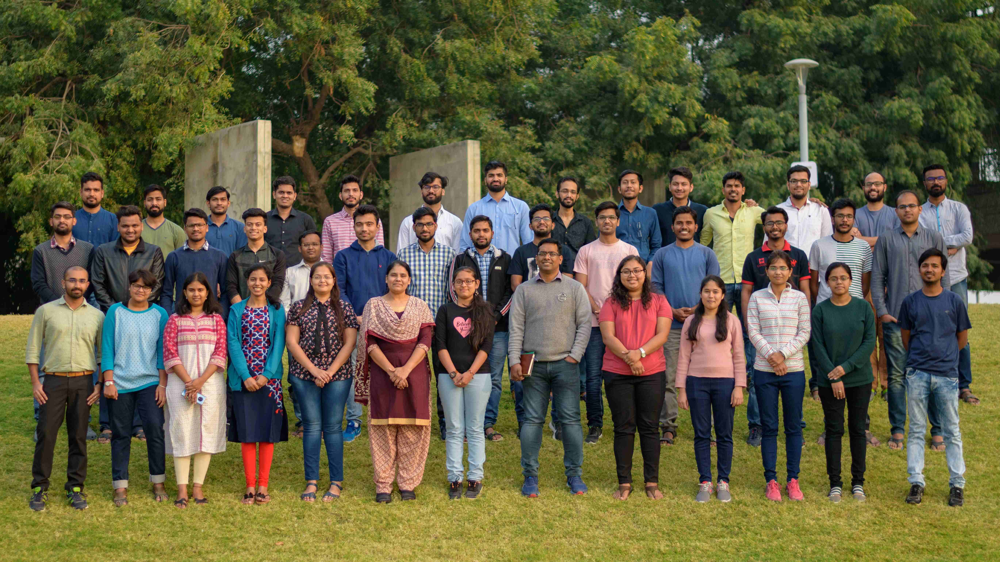

## Current
### Ph.D.
- Pramod Kumar
- [Tom Glint Isaac](https://sites.google.com/view/tomglint/home) (Ph.D 2023)
- [Kailash Prasad](https://kailashprasad.com/) (Ph.D 2023) (Prime Minister Research Fellow, Intel India Research Fellow)
<!-- |  |  |  |  |
| :------------------------------: | :------------------------------: | :------------------------------: | :------------------------------: |
|          Name 1                   |          Name 2                   |          Name 3                   |          Name 4                   | -->

<!-- ::: {layout-ncol=5} -->

<!-- |  |  |  |  |
| ------------------------- | ------------------------- | ------------------------- | ------------------------- |
| Name 1                    | Name 2                    | Name 3                    | Name 4                    |

|  |  | |
| ------------------------- | ------------------------- | ------------------------- | |
| Name 1                    | Name 2                    | Name 3                    | | -->

<!--  -->

### M.Tech

### B.Tech
- [Neel Shah](https://www.linkedin.com/in/neel-shah-756612218/)
- [Jinay Dagli](https://jinay08.github.io/)
- [Aryan Gupta](https://www.linkedin.com/in/aryan-gupta-4a4682202/)
- [Patel Vrajesh](https://www.linkedin.com/in/vrajesh-patel-b3b76a214/)
- [Nitesh Maurya](https://www.linkedin.com/in/nitesh-maurya/)
- [Aravind Krishna](https://www.linkedin.com/in/aravind-krishna-919a26202/)
- [Ruchit Chudasama](https://www.linkedin.com/in/ruchit-chudasama-a04465219/)
- [Sukanya More](https://www.linkedin.com/in/sukanya-more-341485202/)
- [R Yeeshu Dhurandhar](https://www.linkedin.com/in/ryeeshudhurandhar/)
- [Mithil Pechimuthu](https://www.linkedin.com/in/mithil-pechimuthu-82830525a/)
- [Zaqi Momin](https://www.linkedin.com/in/zaqi-momin-9969aa233/)
- [Mihir Agarwal](https://www.linkedin.com/in/mihir-agarwal-33b913188/)

### Research Staff
- Govind Prasad
- Daya Prashanth

### Outside IITGn Interns

## Alumni 

### Ph.D.
- Neelam Surana - Senior ASIC Engineer, NVIDIA
- [Chandan Kumar Jha](https://chajha.github.io/) - Post Doctoral Researcher at the Cyber-Physical Systems of the Deutsches Forschungszentrum für Künstliche
- [Sneha N Ved](https://www.linkedin.com/in/sneha-ved/) - Senior Product Manager, Pushpay

### M.Tech
2023
- [Alok Pradhan](https://www.linkedin.com/in/alokpradhan0001/)
- [Yaswanth](https://www.linkedin.com/in/yaswanth-ram-mittapalli/)

2022
- [Aditya Biswas](https://www.linkedin.com/in/aditya-biswas-330886179/) - Thesis Title SRAM based In Memory Computing for Energy Efficient AI system - Working as R&D Engineer, Synopsys Inc.

2021
- Anoop Kumar - Working as Hardware Engineer, Qualcomm
- Ayush Agarwal - Working as DFT Engineer, NVIDIA
- Naveen Puri - Working as Memory Design Engineer at Ceremorphic
- Rajesh Kumar - Working as Senior Design Engineer at Marvell Technology
- Roshni Dhandamudi - Working as Memory Design Engineer at Ceremorphic
- Rajat Borkar - Working as Graphics Hardware Engineer at Intel Corporation
- Smit Shah - Working as Graphics Hardware Engineer at Intel Corporation
- Tushar Agarwal - Working as Graphics Hardware Engineer at Intel Corporation
- Varun Tej - Working as ASIC Design Engineer at NVIDIA
- Mallikarjun P

2020
- Ankita Nandi - Thesis Title Co-optimizating Energy and Quality Using Approximate Designs and Techniques - Joined IIT Gandhinagar as PhD Scholar
- Jitesh Sah - Thesis Title Framework for Synchronous to Asynchronous Design Conversion - Working as a Digital Design Engineer at Ceremorphic
- Gyanendra Tiwari - Thesis Title Design of Memory Compiler for Embedded Memories - Working as a Memory Design Engineer at Ceremorphic
- Diptesh Datta - Thesis Title Application-Centric Efficient SRAM/CAM/TCAM Memory Design - Working as Design Engineer at Micron Technology
- Surendra Maurya - Thesis Title Energy Efficient Sense-Amplifier Designs using Different Replica Circuits - Working as a Memory Design Engineer at Ceremorphic

2019
- Arun Singh Tomar - Thesis Title Configurable Approximate Circuits for Low Power FPGA based Applications - Working as Design Verification Engineer at Marvell Semiconductor
- Mili Lavania - Thesis Title Building Energy Efficient Radiation Hardened Memories and Memory Subsystem - Working as Design - Verification Engineer at Marvell Semiconductor
- Abhishek Barma -Thesis Title High Performance Radiation Hardened Random Access and Content Addressable Memory Designs - Working as Silicon Design Engineer at Advanced Micro Devices
- Joydeep Devnath - Thesis Title An approach towards building Energy Efficient Architectures for Neural Networks - Working as Junior Research Fellow at IIT Gandhinagar

2018
- Shubhanshu Gupta - Thesis Title Single and Double Node Upset Hardened Flip-Flops for Space Applications - Working as Design Verification Engineer at NXP Semiconductor
- Ishant Anand - Thesis Title Design of Radiation Hardened Memories and Memory Compiler - Working as Senior Engineer at MediaTek
- Smriti Gupta - Thesis Title Building of Radiation Hardened Processor Designs - Working as Engineer at MediaTex
- Vishwanath Hiremath - Thesis Title Approximate Neural Networks on FPGA - Working as Senior Engineer at MediaTek

2017
- Hemal Shah - Thesis Title Soft Error Tolerant Designs using Guarded Dual Rail Logic - Working as Design Verification Engineer at Marvell Semiconductor
- Neha Kumar - Thesis Title Interfaces for Ratiochronous Network on Chips - Working as Senior Tapeout Engineer at GlobalFoundries

2016
- Raminder Kaur - Thesis Title Guarded Dual Rail Logic for Soft Error Tolerant Standard Cell Library - Working as Digital Verification Engineer at Texas Instruments
- Omkar Pujari - Thesis Title Study of Variability and Technology Scaling on  Synchronizers and Design of Metastable-hard Synchronizers - Working as Digital Design Engineer at Analog Devices

2015
- Fathima Sinin - Thesis Title Design and implementation of efficient neuromorphic architectures - Working as Air Traffic Controller at Airport Authority of India
- Chandrashekhar Tunga - Thesis Title Design and implementation of efficient neuromorphic architectures - Working as Senior Lead Engineer at Qualcomm

2014

- Bala Saranya Y - Thesis Title Evaluating the scaling effects on synchronizers and global interconnects in multi-core SoCs - Working as SSC at Infosys

### B.Tech
- [Sai Shubham](https://www.linkedin.com/in/sai-shubham-38218a190/)
- [Shubham Pandit](https://www.linkedin.com/in/shubham-pandit-065667193/)
- Earandi Saineeth
- Dheeraj Kumar
- Sai Ruthvik
- Varun Gohil
- Nisarg Ujjainkar
- Madhulika L
- Shreyas Singh
- Pranjali Jain
- Urvish Patel
- Deepika Soni
- Sumit Walia
- Vinu Sankar S
- Sai Aparna Aketi
- Anmol Gaur
- Samarth Kathal
- Sarabjeet Singh
- Swathi G
- Subrahmanya Teja
- Dipen Somani
- Ashwini Nagare
- Kimaya Kale
- Chandrakanth P
- L. Thrinath Reddy
- Gandham Mahendranadh
- Pranav Kumarl
- Sai Theja Lolla
- Sushmitha Yalla

### Research Staff
- Ankit Kumar Verma
- Sumit Walia
- Divya Gajera
- Vibhor Srivastava

### Outside IITGn Interns