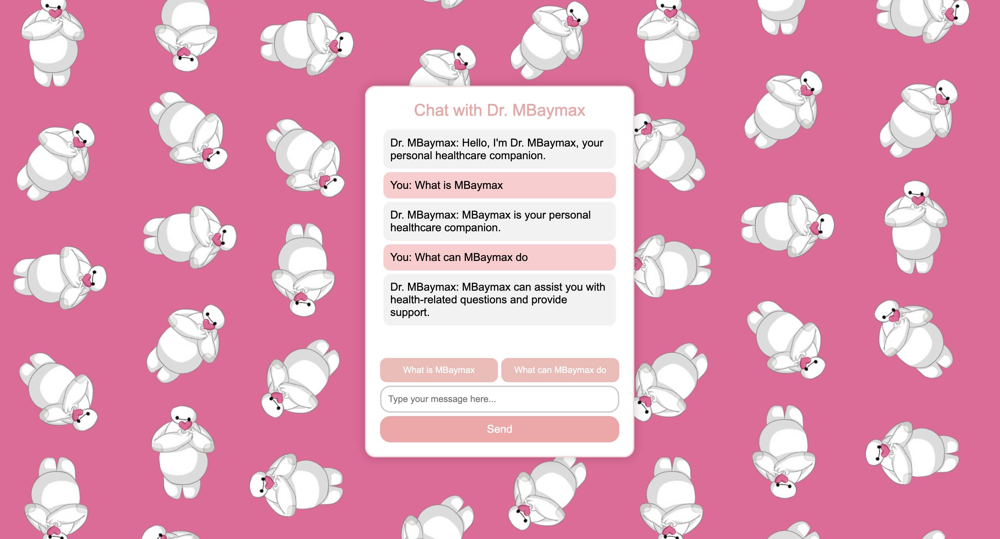

<!-- 
  You can also find my articles on <u><a href="{{author.googlescholar}}">my Google Scholar profile</a>.</u>





  
 -->
Project: MBaymax, a mental health specific supporting chatbot [Demo](https://mbaymax-79971309b29b.herokuapp.com/)

Blog: Five Themes Discussed at Princeton’s Workshop on Decentralized Social Media [Link](https://freedom-to-tinker.com/2024/03/19/five-themes-discussed-at-princetons-workshop-on-decentralized-social-media/)

Project: Graph Visualization on Music App [Video](https://www.youtube.com/watch?v=gTI0JKvbVX8)

Project: Creative particle simulation using Clion, Cinder [Video](https://www.youtube.com/watch?v=3d94nCH5cv0&t=1s)