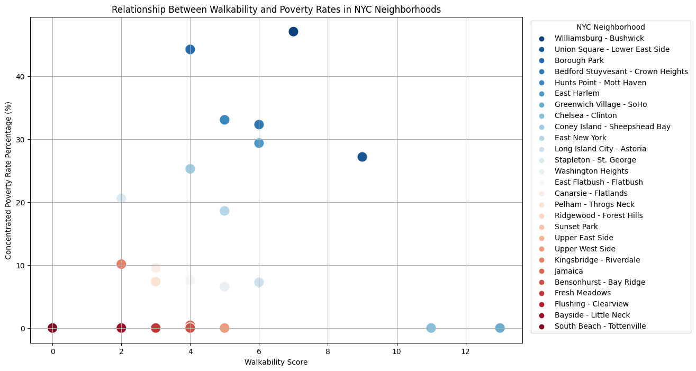
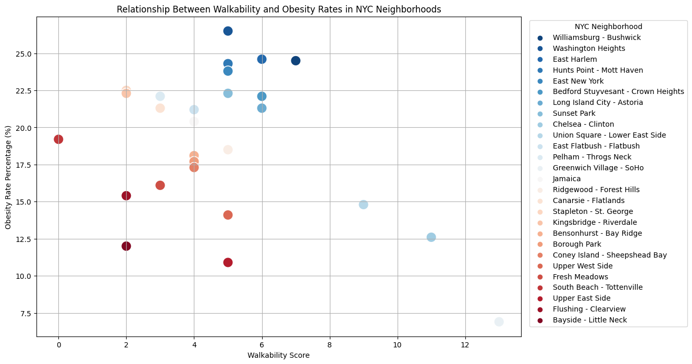

  <button class="tablinks" onclick="openProject(event, 'NetflixFilmAnalysis')"><b>Netflix Film Analysis</b></button>
  <button class="tablinks" onclick="openProject(event, 'CourseCompanion')"><b>Course Companion</b></button>
  <button class="tablinks" onclick="openProject(event, 'UrbanAnalysis')"><b>Walkability & Well-Being</b></button>
  <button class="tablinks" onclick="openProject(event, 'CPUScheduling')"><b>CPU Management</b></button>

  <h2>Netflix Film Analysis</h2>
  <a href="https://github.com/ethanlanders/netflix-film-analysis" class="github-button">View on GitHub</a>
  <h3>Video Demo:</h3>
  <iframe width="560" height="315" src="https://www.youtube.com/embed/GDShteNxp6c?si=8WDGTLSQgJd4Rcyd" title="YouTube video player" frameborder="0" allow="accelerometer; autoplay; clipboard-write; encrypted-media; gyroscope; picture-in-picture; web-share" referrerpolicy="strict-origin-when-cross-origin" allowfullscreen></iframe>
   to view the project report.

  <h2>Course Companion</h2>
  <a href="https://github.com/ethanlanders/Course-Companion" class="github-button">View on GitHub</a>
  
<b>Old Dominion University, Fall 2023 & Spring 2024</b>

  
Worked with a team of eight on our senior year capstone project to develop Course Companion, a tool designed to help university instructors improve the accessibility and quality of their course materials. This software allows educators to upload course materials for in-depth analysis, providing valuable insights and suggestions for enhancement.

  <h3>Key Features:</h3>
    <ul>
      <li>Navigable GUI for easy use</li>
      <li>Document analysis for course materials in various file types</li>
      <li>Accessibility suggestions for educators</li>
      <li>Detailed report generation for easy review and reference</li>
      <li>View and save previously generated reports</li>
    </ul>
    <h3>Technologies Used:</h3>
    
Python, PyQt5, Pandoc

  <h2>Walkability and Well-Being - An Urban Analysis</h2>
  <a href="https://github.com/ethanlanders/Walkability-And-Well-Being-Analysis-CS620-Data-Project" class="github-button">View on GitHub</a>
  
<b>Old Dominion University, Fall 2023 & Spring 2024</b>

  <h3>Video Demo:</h3>
  <iframe width="560" height="315" src="https://www.youtube.com/embed/W4uXdOSEJTo?si=CW39xMWMVd9xYa0k" title="YouTube video player" frameborder="0" allow="accelerometer; autoplay; clipboard-write; encrypted-media; gyroscope; picture-in-picture; web-share" referrerpolicy="strict-origin-when-cross-origin" allowfullscreen></iframe>

  
Collaborated with classmates on a project exploring the intricate relationship between community walkability and various facets of well-being in urban environments, focusing on New York City neighborhoods.

  <h3>Objective:</h3>
  
Investigate correlations between walkability and well-being indicators, such as concentrated poverty rates and student obesity rates.

  <h3>Methodology:</h3>
  
Collected data on New York City walkability, poverty, and obesity. Utilized Python, Pandas, Matplotlib, and Seaborn for preprocessing and visualization. Merged datasets for comprehensive analysis.

  <h3>Results:</h3>
  
No significant correlation between walkability and poverty. Identified higher obesity rates in less walkable New York City neighborhoods.

  
  

  <h2>CPU Scheduling & Process Synchronization</h2>
  <a href="https://github.com/ethanlanders/CPUScheduling-ProcessSynchronization-CS471Project" class="github-button">View on GitHub</a>
  
<b>Old Dominion University, Fall 2023 & Spring 2024</b>

  <h3>Video Demo:</h3>
  <iframe width="560" height="315" src="https://www.youtube.com/embed/MF5aDcGZ3pQ?si=n0fAuwoORmq0cF2d" title="YouTube video player" frameborder="0" allow="accelerometer; autoplay; clipboard-write; encrypted-media; gyroscope; picture-in-picture; web-share" referrerpolicy="strict-origin-when-cross-origin" allowfullscreen></iframe>

  
Collaborated with a classmate on a comprehensive project addressing CPU scheduling algorithms and process synchronization.

  <h3>CPU Scheduling Problem:</h3>
  <ul>
    <li>Developed a CPU scheduler simulation with FIFO, SJF, and Priority algorithms.</li>
    <li>Utilized C++ to handle 541 simulated processes, addressing arrival time, CPU burst length, and priority.</li>
    <li>The problem incorporates well-documented code and sample input data files and produces detailed statistics for each scheduling algorithm.</li>
  </ul>

  <h3>Process Synchronization Problem:</h3>
  <ul>
    <li>Classmate led the development of the Producer-Consumer problem using Pthreads, with comprehensive testing and performance measurement.</li>
    <li>The solution is implemented in C++ and covers various scenarios, providing insights into overall turnaround time.</li>
  </ul>

  
This project allowed us to delve into the intricacies of operating systems, applying theoretical concepts to practical problem-solving.

