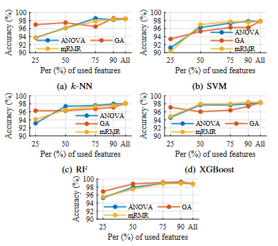
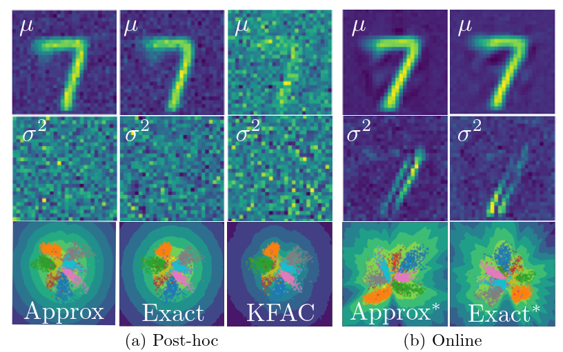
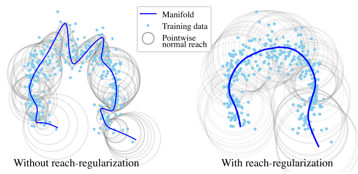
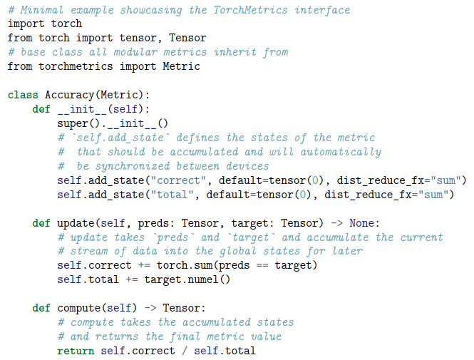
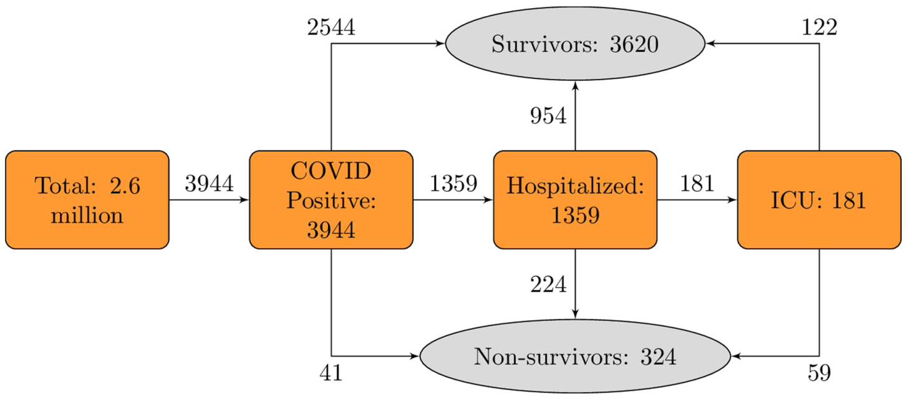
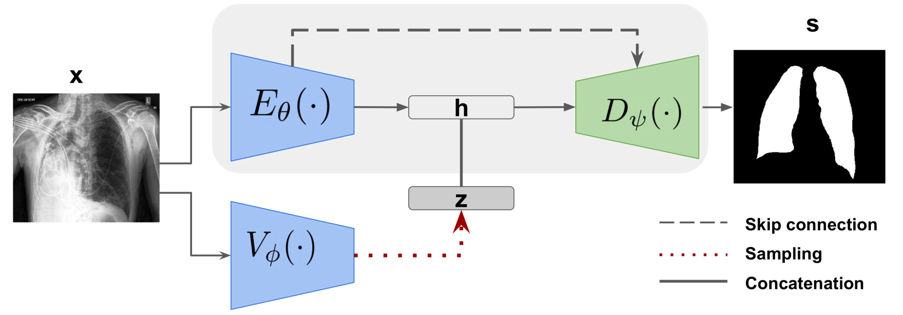
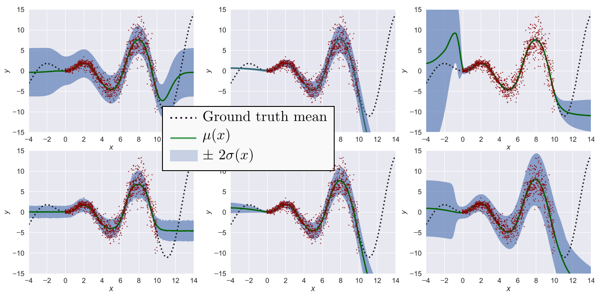
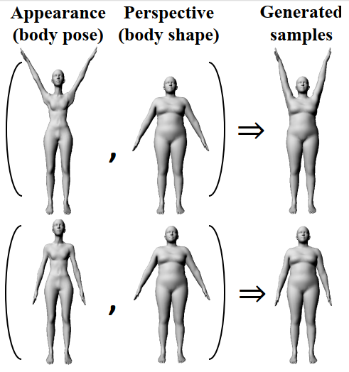
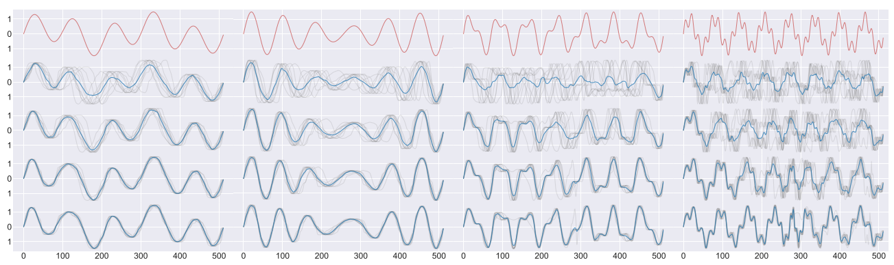
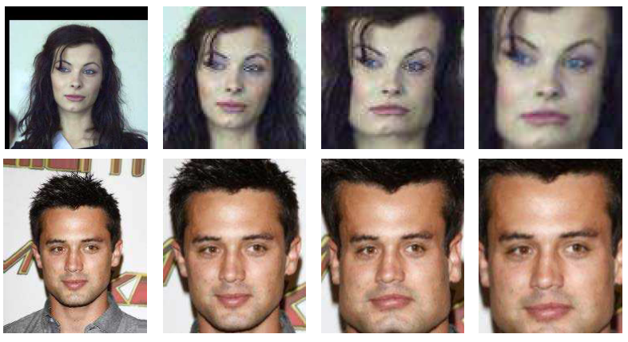

## 2023

<table>
<tr>
<td style="width:70%">
<b> Developing a spontaneous speech-based artificial intelligence for Alzheimer’s disease detection </b>
 
Laurine Dargaud, Abhista Partal, Anton Birn, <em>Nicki Skafte Detlefsen</em>
 
To be released in Journal of the International Society for Telemedicine and eHealth
 
<!-- <a href="https://github.com/SkafteNicki/SkafteNicki.github.io/blob/master/files/2022_protein.pdf">PDF</a> -->
</td>
<td style="width:30%">

<!--  -->

</td>
</tr>
</table>

<table>
<tr>
<td style="width:70%">
<b> Neuro-Tech Revolution: AI-EEG Integration for Advanced Depression Diagnosis </b>
 
Bekarys Gabdrakhimov, <em>Nicki Skafte Detlefsen</em>, Cihan Uyanik, Osama Ejaz, Muhammed Ahmed Khan, Muhammad Abul Hasan,
Saad Ahmed Qazi, Sadasivan Puthusserypady
 
Preprint available
 
<a href="https://github.com/SkafteNicki/SkafteNicki.github.io/blob/master/files/2023_ai_eeg.pdf">PDF</a>
</td>
<td style="width:30%">

</td>
</tr>
</table>

## 2022

<table>
<tr>
<td style="width:70%">
<b> Laplacian Autoencoders for Learning Stochastic Representations </b>
 
Marco Miani, Frederik Warburg, Pablo Moreno-Muñoz, <em>Nicke Skafte Detlefsen</em>, Søren Hauberg
 
In Advances in Neural Information Processing Systems (Neurips) 2022
 
<a href="https://github.com/SkafteNicki/SkafteNicki.github.io/blob/master/files/2022_laplacian.pdf">PDF</a>
</td>
<td style="width:30%">

</td>
</tr>
</table>

<table>
<tr>
<td style="width:70%">
<b> Is an encoder within reach? </b>
 
Helene Hauschultz, Rasmus Berg Palm. Pablo Moreno-Muños, <em>Nicki Skafte Detlefsen</em>, Andrew Allan du Plessis, Søren Hauberg
 
arXiv, 2022.
 
<a href="https://github.com/SkafteNicki/SkafteNicki.github.io/blob/master/files/2022_reach.pdf">PDF</a>
</td>
<td style="width:30%">

</td>
</tr>
</table>

<table>
<tr>
<td style="width:70%">
<b> What is a meaningful representation of protein sequences? </b>
 
<em>Nicki Skafte Detlefsen</em>, Søren Hauberg, Wouter Boomsma
 
In Nature Communications, 2022
 
<a href="https://github.com/SkafteNicki/SkafteNicki.github.io/blob/master/files/2022_proteins.pdf">PDF</a>
</td>
<td style="width:30%">

</td>
</tr>
</table>

## 2021

<table>
<tr>
<td style="width:70%">
<b> TorchMetrics - Measuring Reproducibility in PyTorch </b>
 
<em>Nicki Skafte Detlefsen</em>, Jiri Borovec, Justus Schock, Ananya Harsh Jha, Teddy Koker, Luca Di Liello, Daniel Stanc,
Changsheng Quan, Maxim Grechkin, and William Falcon
 
In Journal of Open Source Software (JOSS), 2021
 
<a href="https://github.com/SkafteNicki/SkafteNicki.github.io/blob/master/files/2021_torchmetrics.pdf">PDF</a>
</td>
<td style="width:30%">

</td>
</tr>
</table>

## 2020

<table>
<tr>
<td style="width:70%">
<b> Developing and validating COVID‑19 adverse outcome risk prediction models from a bi‑national European cohort of 5594 patients </b>
 
Espen Jimenez-Solem, Tonny S Petersen, Christina Lioma, Christian Igel, Wouter Boomsma, Oswin Krause, Casper Hansen,
Christian Hansen, Stephan Lorenzen, Raghavendra Selvan, Janne Petersen, Martin Erik Nyeland, Mikkel Zöllner Ankarfeldt,
Gert Mehl Virenfeldt, Anne Helms Andreasen, Matilde Winther-Jensen, Mostafa Ghazi, <em>Nicki S. Detlefsen</em>,
Andreas Lauritsen, Abraham Smith, Marleen de Bruijne, Bulat Ibragimov, Jens Petersen, Martin Lillholm, Jon Middleton,
Stine Hasling Mogensen, Hans-Christian Thorsen-Meyer, Anders Perner, Maria Helleberg, Benjamin Skov Kaas-Hansen,
Alexander Bonde, Akshay Pai, Mads Nielsen Martin Sillesen
 
In Scientific Reports, Nature 2020
 
<a href="https://github.com/SkafteNicki/SkafteNicki.github.io/blob/master/files/2020_covid.pdf">PDF</a>
</td>
<td style="width:30%">

</td>
</tr>
</table>

<table>
<tr>
<td style="width:70%">
<b> Lung Segmentation from Chest X-rays using Variational Data Imputation </b>
 
Raghavendra Selvan, Erik B. Dam, <em>Nicki Skafte Detlefsen</em>, Sofus Rischel, Kaining Sheng, Mads Nielsen, Akshay Pai
 
In ICML Workshop on Learning from Missing Data (Artemiss) 2020
 
<a href="https://github.com/SkafteNicki/SkafteNicki.github.io/blob/master/files/2020_lung_segmentation.pdf">PDF</a>
</td>
<td style="width:30%">

</td>
</tr>
</table>

## 2019

<table>
<tr>
<td style="width:70%">
<b> Reliable training and estimation of variance networks </b>
 
<em>Nicki Skafte Detlefsen</em>, Martin Jørgensen, Søren Hauberg
 
In Advances in Neural Information Processing Systems (Neurips) 2019
 
<a href="https://github.com/SkafteNicki/SkafteNicki.github.io/blob/master/files/2019_variance_estimation.pdf">PDF</a>
</td>
<td style="width:30%">

</td>
</tr>
</table>

<table>
<tr>
<td style="width:70%">
<b> Explicit Disentanglement of Appearance and Perspective in Generative Models </b>
 
<em>Nicki Skafte Detlefsen</em>, Søren Hauberg
 
In Advances in Neural Information Processing Systems (Neurips) 2019
 
<a href="https://github.com/SkafteNicki/SkafteNicki.github.io/blob/master/files/2019_disentanglement.pdf">PDF</a>
</td>
<td style="width:30%">

</td>
</tr>
</table>

<table>
<tr>
<td style="width:70%">
<b> Diffeomorphic Temporal Alignment Nets </b>
 
Ron Shapira Weber, Matan Eyal, <em>Nicki Skafte Detlefsen</em>, Oren Shriki, Oren Freifeld
 
In Advances in Neural Information Processing Systems (Neurips) 2019
 
<a href="https://github.com/SkafteNicki/SkafteNicki.github.io/blob/master/files/2019_dtan.pdf">PDF</a>
</td>
<td style="width:30%">

</td>
</tr>
</table>

## 2018

<table>
<tr>
<td style="width:70%">
<b> Deep Diffeomorphic Transformer Networks </b>
 
<em>Nicki Skafte Detlefsen</em>, Søren Hauberg, Oren Freifeld
 
In Proceedings of the IEEE Conference on Computer Vision and Pattern Recognition (CVPR) 2018
 
<a href="https://github.com/SkafteNicki/SkafteNicki.github.io/blob/master/files/2018_ddtn.pdf">PDF</a>
</td>
<td style="width:30%">

</td>
</tr>
</table>
