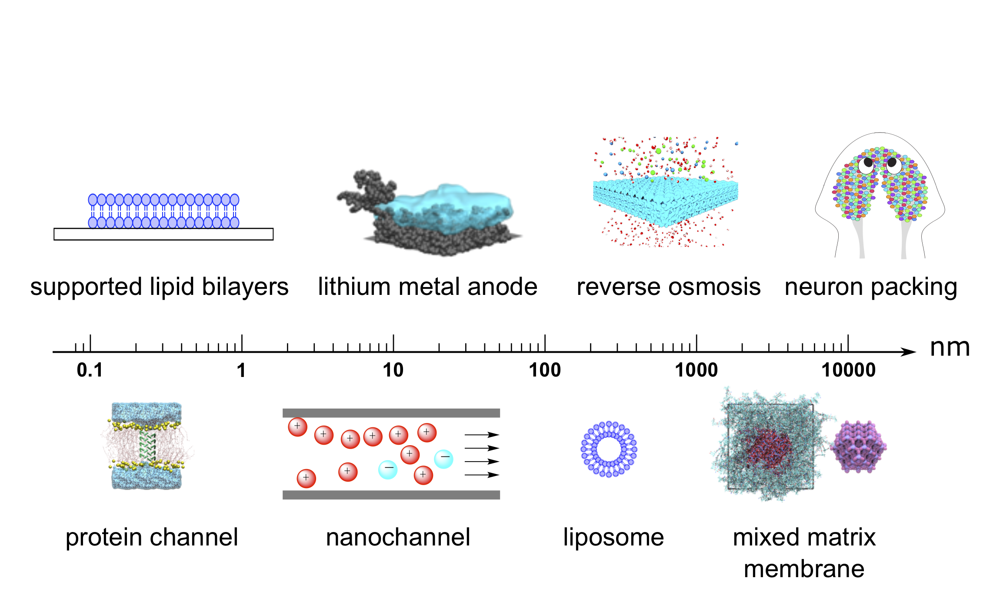
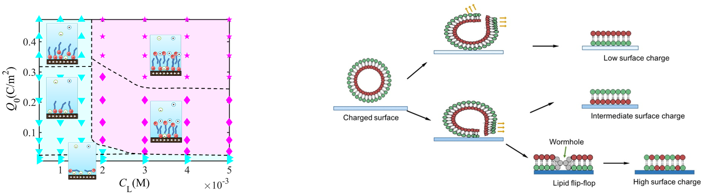
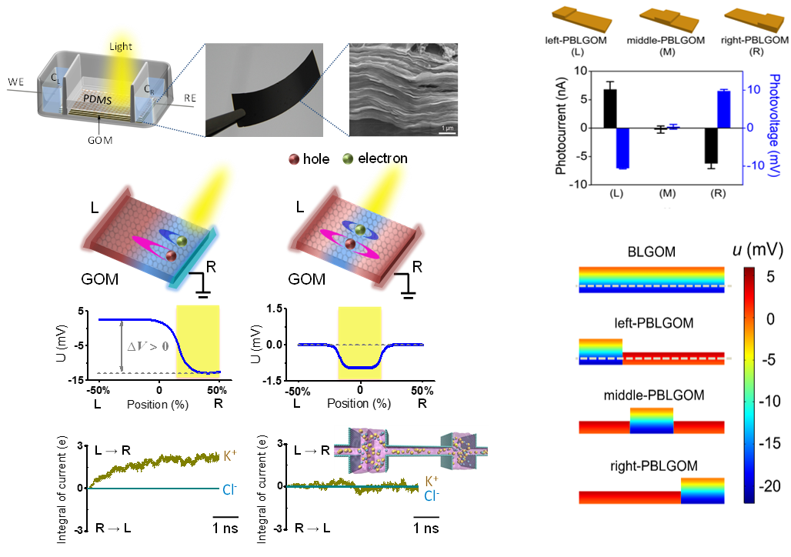
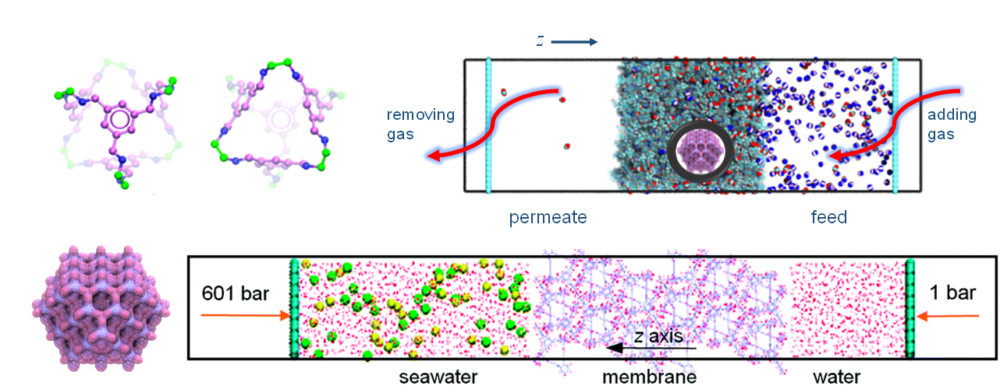
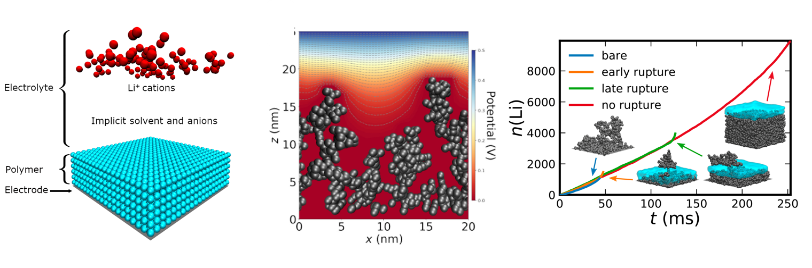
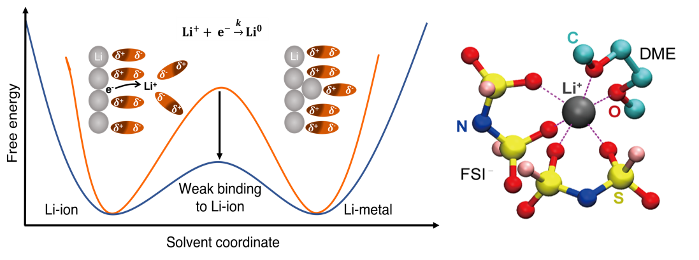
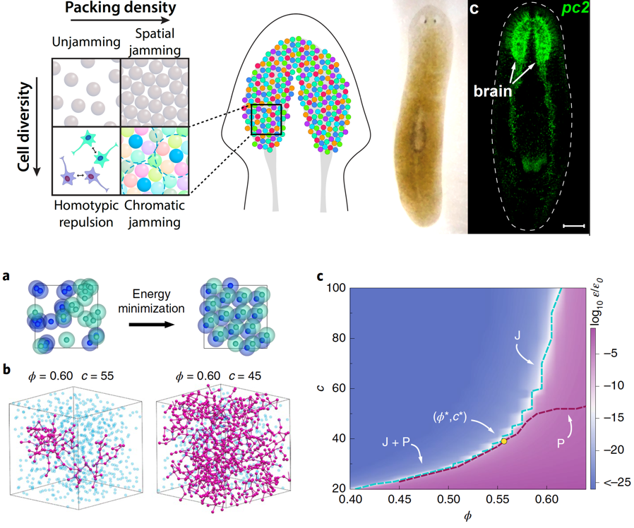



.center {
  text-align: center;
}

Advancements in material science and nanotechnology allow the fabrication of complex microscopic devices with molecular design rule. As a chemical engineer, I am interested in understanding the rules and laws that underlie the behaviors and functions of various materials. My overall research goal is to achieve rationale functional material design based on fundamental knowledges of the structure-property-function relationship. Specifically, I use advanced molecular theory and simulation techniques to probe thermodynamic relationships relevant in diverse systems that include soft materials, electrolytes, and nano-materials. These thermodynamic relationships not only help us to understand the materials, but also allow us to control and to engineer materials as we need and even enable rational design of novel materials. Beyond simulation and theory, working closely with experimental collaborators is indispensable for me because it leads to validation, improvement, and application of theoretical results.

{:height="60%" width="60%"}

1. Soft matter assembly
    
    Assembly on a surfaces are imperative and relevant in many applications. It usually occurs via substance transfer from bulk solution to the surface accompanied with conformation evolution and/or chemical reactions.

    * Supported lipid bilayer

    The supported lipid bilayer (SLB) is usually prepared through such an assembly process. SLB has practical importance in many biomimetic technologies including drug delivery, biosensing, high-performance membranes, and biomedical apparatus. Previous SLB preparation usually entails self-assembly that allows little artificial intervention. I studied how to control the assembled SLB structure and the dynamics of the assembly process by controlling the substrate
    charge density.

    {:width="600px"}

2. Transport in nano-confined space
    
    Mass transport in confined space underlies many processes such as desalination, DNA
    sequencing, and supercapacitor. Mass transport in nanochannels or nanoporous membranes is
    fundamentally different from transport in bulk phase. In these systems with molecular scale
    confinement, molecular interactions are dominant for mass transport and fluctuations becomes so
    immense that undermines the conventional continuum based transport theories.

    * Ion nanochannels

    {:width="500px"}

    * Porous organic cages

    {:width="600px"}

3. Advanced electrolytes

    Advanced electrolytes are essential for next-generation energy storage devices, such as batteries, supercapacitors, solar cells, and fuel cells. Different electrolytes are needed for different application conditions. To make effective choice of electrolytes, or to achieve rationale design of electrolytes, call for a good understanding of the thermodynamics, transports, and kinetics of the electrolytes. Using molecular simulation and advanced molecular theories, I try to unviel the fundamental rules for different electrolytes, such as solid polymer electrolytes, polyelectrolytes, ionic liquid, and lithium salt electrolytes.

    * Soft polymer coating for lithium dendrite supression

    {:width="600px"}

    * Solvation effects in liquid lithium electrolytes

    {:width="500px"}

    * Phase diagrams of solid block copolymer electrolytes

4. Percolation in biological systems

{:width="500px"}