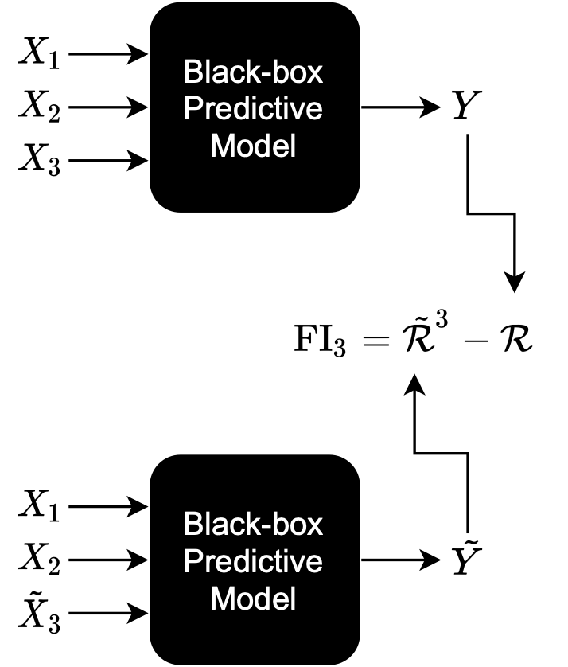

## How does human vision directly leverage perceptual features as optimal proxies for intuitive physical reasoning?

Collaborators: [Colin Conwell](https://psychology.fas.harvard.edu/people/colin-conwell) and [George Alvarez](https://scorsese.wjh.harvard.edu/George/)
* Conwell, C., Doshi, F., Alvarez, G.A.(2019). Shared Representations of Stability in Humans, Supervised, & Unsupervised Neural Networks. In Shared Visual Representations in Human and Machine Intelligence (SVRHM) workshop at NeurIPS 2019.
* Conwell, C., Doshi, F., Alvarez, G.A.(2019). Human-Like Judgments of Stability Emerge from Purely Perceptual Features: Evidence from Supervised and Unsupervised Deep Neural Networks. In Proceedings of the 3rd Conference on Cognitive Computational Neuroscience (CCN), 2019.

## What representations explain capacity limits in visual working memory?
Collaborators: [Hrag Pailian](https://www.hragpailian.com) and [George Alvarez](https://scorsese.wjh.harvard.edu/George/)

* Doshi, F., Pailian, H.,  Alvarez, G.A.(2020). Using Deep Convolutional Neural Networks to Examine the Role of Representational Similarity in Visual Working Memory. In Vision Science Society, 2020.

<!-- 

_Full publication list on [Pubmed](https://www.ncbi.nlm.nih.gov/myncbi/1T7XaRDS9jyQh/bibliography/public/), [ORCID](ttp://orcid.org/0000-0001-8180-3267), [ResearchGate](https://www.researchgate.net/profile/Emily_Jones50), and [Google Scholar](https://scholar.google.com/citations?user=YGv9YqAAAAAJ&hl=en)_

## Investigating how medial entorhinal cortical sequences support spatial navigation and learning
_Postdoctoral fellow in Dr. Lisa Giocomo's lab at Stanford University, November 2019 - Present_

**Questions that interest me**
* What content do entorhinal replays represent?
* How does theta drive by medial septum organize entorhinal activity?
* How do entorhinal theta sequences relate to replay?
* How might organization of spatial information into theta sequences online and replays offline support reinforcement learning of goal-directed navigation?

## Sharp-wave ripple alterations mark memory decline and interneuron drive
_PhD Student in Dr. Yadong Huang's lab at the Gladstone Institutes & co-mentored by Dr. Loren Frank at University of California, San Francisco, January 2015 - October 2019_

Hippocampal sharp-wave ripples (SWRs) – electrophysiological signatures of memory reactivation in the hippocampus – play an important role in memory processes. We tested the relationship between SWRs and memory impairment in an Alzheimer’s disease (AD) mouse model and the role of GABAergic interneurons in modulating SWRs. First, there is a pressing need to identify early pathophysiological alterations that predict subsequent memory impairment in AD. Mouse models of AD show reductions in both SWR abundance and associated slow gamma (SG) power during aging, suggesting SWRs may be a compelling candidate biomarker. In aged AD model mice, we found that reduced SWR abundance and associated CA3 SG power predicted spatial memory impairments measured 1–2 months later. Importantly, SWR-associated CA3 SG power reduction in young apoE4-KI mice also predicted spatial memory deficits measured 10 months later. Second, SWRs in CA1 are driven by inputs from upstream area CA3 and also engage the dentate gyrus (DG), but little is known about whether and how GABAergic interneurons in either CA3 or the DG regulate activity in CA1. The majority of hippocampal interneurons are parvalbumin-expressing (PV+), soma-targeting or somatostatin-expressing (SST+), distal dendrite-targeting subtypes, which are differentially impaired in AD. We find that that PV+ and SST+ interneurons bidirectionally modulate sleep SWRs in CA1 and coincident SG observed throughout the hippocampus. Overall, our results suggest that PV+ interneurons reduce CA3 coupling to CA1, while SST+ interneurons reduce entorhinal cortex coupling to CA1. These results establish features of SWRs as potential functional biomarkers of memory impairment in AD and probe how GABAergic interneuron subtypes impaired in AD modulate these SWR features.

* [Thesis talk](https://youtu.be/sbPYf-Ka7zY) and [slides](../files/Thesis seminar.pdf)

**Publications**
* [PhD Thesis](https://escholarship.org/uc/item/2bc340d2)
* _Jones, E. A. A._, Rao, A., Zilberter, M., Djukic, B., Gillespie, A. K., Koutsodendris, N., Nelson, M., Yoon, S. Y., Huang, K., Yuan, H., Gill, T. M., Huang, Y., & Frank, L. M. Dentate Gyrus and CA3 GABAergic Interneurons Bidirectionally Modulate Signatures of Internal and External Drive to CA1. Submitted.
	* [bioRxiv preprint](https://www.biorxiv.org/content/10.1101/2021.01.04.425303v1.full)
	* [code](https://github.com/emilyasterjones/interneurons_modulate_drive)
	* [Twitter paper thread](https://twitter.com/EmilyAsterJones/status/1346489819891830785)
* Najm, R., Zalocusky, K.A., Zilberter, M., Yoon, S.Y., Hao, Y., Taubes, A., _Jones, E. A._, Koutsodendris, N., Nelson, M., Rao, A., Huang, Y. (2020, July). In Vivo Chimeric Alzheimer’s Disease Modeling of Apolipoprotein E4 Toxicity in Human Neurons. [Cell Reports](https://www.sciencedirect.com/science/article/pii/S2211124720309438).
* _Jones, E. A._, Gillespie, A. K., Yoon, S. Y., Frank, L. M., Huang, Y. (2019, November). Early Hippocampal Sharp-Wave Ripple Deficits Predict Later Learning and Memory Impairments in an Alzheimer’s Disease Mouse Model. [Cell Reports](https://www.cell.com/cell-reports/fulltext/S2211-1247(19)31370-1). 
	* [bioRxiv preprint](https://www.biorxiv.org/content/10.1101/596569v1.full)
	* [dataset](http://crcns.org/data-sets/hc/hc-26/about-hc-26)
	* [code](https://github.com/emilyasterjones/SWR-predictions)
	* [Twitter paper thread](https://twitter.com/EmilyAsterJones/status/1196872251192168448)
* Najm, R.+, _Jones, E. A.+_ & Huang, Y. (2019, June) Apolipoprotein E4, Inhibitory Network Dysfunction, and Alzheimer’s Disease. [Molecular Neurodegeneration](https://molecularneurodegeneration.biomedcentral.com/articles/10.1186/s13024-019-0324-6). (+equal contribution)
* Gillespie, A. K., _Jones, E. A._ & Huang, Y. (2017, February) Approaching Alzheimer's Disease from a Network Level. [Oncotarget](https://www.ncbi.nlm.nih.gov/pmc/articles/PMC5354704/).
* Gillespie, A. K., _Jones, E. A._, Lin, Y.-H., Karlsson, M. P., Kay, K., Yoon, S. Y., Tong, L. M., Nova, P., Carr, J. S., Frank, L. M., Huang, Y. (2016, May). Apolipoprotein E4 causes age-dependent disruption of slow gamma oscillations during hippocampal sharp-wave ripples. [Neuron](https://www.sciencedirect.com/science/article/pii/S089662731630068X).
	* [This paper was highlighted in Nature Reviews Neuroscience](https://www.nature.com/articles/nrn.2016.71)
				
**Invited Talks**
* July 2019: Hippocampal GABAergic Interneurons Bidirectionally Modulate Sharp-Wave Ripples. Inhibition in the CNS Gordon Research Seminar in Newry, MA.
* April 2019: Ripple Deficits Predict Memory Impairments in an Alzheimer’s Disease Mouse Model. Discovery Fellows Michael Page Research Symposium in San Francisco, CA.
* August 2018: Optogenetic Study of ApoE4-Related Alzheimer’s Disease. NIA Optogenetics RFA Annual Investigators Meeting in Bethesda, MD.
* September 2017: Apolipoprotein E4-induced Hippocampal Network Activity Deficits Reflect Cell-Type-Specific Gains of Toxic Function. Alzheimer’s Researcher Symposium in San Francisco, CA.
* August 2017: Optogenetic Study of ApoE4-Related Alzheimer’s Disease. NIA Optogenetics RFA Annual Investigators Meeting in Bethesda, MD.
* June 2017: Apolipoprotein E4-induced Hippocampal Network Activity Deficits Reflect Cell-Type-Specific Gains of Toxic Function. Gladstone Institutes Scientific Retreat, Asilomar, CA.

**Posters**
* July 2019: Hippocampal GABAergic Interneurons Bidirectionally Modulate Sharp-Wave Ripples. Inhibition in the CNS Gordon Research Seminar in Newry, MA.
* November 2018: Apolipoprotein E4-induced Hippocampal Network Activity Deficits Correlate with Learning and Memory Impairments. Society for Neuroscience Annual Meeting in San Diego, CA.
* June 2018: Apolipoprotein E4-induced Hippocampal Network Activity Deficits Correlate with Learning and Memory Impairments. Advances in Neurodegenerative Research and Therapies Keystone Symposium in Keystone, CO.
* November 2017: Apolipoprotein E4-induced Hippocampal Network Activity Deficits Reflect Cell-Type-Specific Gains of Toxic Function. Society for Neuroscience Annual Meeting in Washington, D.C.
* June 2017: Apolipoprotein E4-induced Hippocampal Network Activity Deficits Reflect Cell-Type-Specific Gains of Toxic Function. Inhibition in the CNS Gordon Research Conference, Les Diablerets, Switzerland.

				
## Natural selection of intrinsic disorder characteristic of proteins
_Undergraduate Research Assistant in Dr. Sridhar Hannenhalli's lab at the University of Maryland Center for Bioinformatics and Computational Biology, May 2013 - August 2014_

Intrinsically disordered proteins lack stable tertiary structure, are recent in molecular evolution, and are highly regulated due to their low affinity for their substrates. This disorder is selected for even when the underlying sequence is not conserved; thus, I developed a new method of modeling in silico evolution which measures selection for protein properties not directly encoded in the sequence. My algorithm used protein orthologs to create synthetic proteins using the same parameters as in vivo sequence evolution, then measured purifying selection for disorder by comparing selected mutations to non-selected ones. The resulting selection showed enrichment for disorder in particular between less conserved sequences. This algorithm could be used in the future to measuring purifying selection of other protein properties not directly encoded in the sequence, such as overall charge or polarity. Moreover, since proteins with high intrinsic disorder are enriched in cell signaling, transcription, and chromatin remodeling, identifying proteins with high selective pressures could help detect novel proteins involved in cancer and neurodegenerative diseases.

**Posters**
* November 2013: [Natural Selection of Intrinsic Disorder Characteristic of Proteins](../files/IDP poster.pdf). University of Maryland Bioscience Research Day, College Park, MD.

## The impact of prenatal nicotine exposure on impulsivity and neural firing in the medial prefrontal cortex
_Gemstone Honors Program Member of Team RITALIN in Dr. Matthew Roesch's lab at the University of Maryland Department of Psychology, May 2011 - May 2014_

Behavioral, neurochemical, and neuroanatomical disturbances following prenatal nicotine exposure (PNE) suggest that PNE could serve as a model of ADHD, a disorder which has not been well-characterized in animal models. To confirm the face and construct validity of this model, we measured single-unit neuronal firing in the medial prefrontal cortex (mPFC) in PNE rats during the stop-signal task, which measures inhibition of an already-initiated action. Consistent with our hypothesis, we found that PNE rats were faster and more impulsive, and that mPFC activity was modulated by trial direction and type. PNE mPFC neurons were overall hypoactive as compared to controls, but the directional encoding was not affected. This suggests that reduced firing in the mPFC may promote impulsive behavior and that general increases in mPFC activity might rescue the deficits observed following PNE. Our research is the first connection between an environmental cause of ADHD, impulsivity symptoms, and the underlying neural firing patterns. Thus, we discovered PNE rats could be a unique model of this multi-faceted disorder.

* Thesis talk: Barnett, B. R., Cohen, V. J., Hearn, T. N., _Jones, E. A._, Kariyil, R. J., Kunin, A., Kwak, S. I., Lee, J., Lubinski, B. L., Rao, G. K.,  Zhan, A. (2014, April). [The Impact of Prenatal Nicotine Exposure on Impulsivity and Neural Firing in the Medial Prefrontal Cortex](../files/RITALIN Thesis Presentation.pdf)
						
**Publications**
* [Thesis](https://drum.lib.umd.edu/handle/1903/15539)
* Bryden, D. W., Burton, A. C., Barnett, B. R., Cohen, V. J., Hearn, T. N., _Jones, E. A._, Kariyil, R. J., Kunin, A., Kwak, S. I., Lee, J., Lubinski, B. L., Rao, G. K., Zhan, A., Roesch, M. R. (2016, February). Prenatal Nicotine Exposure Impairs Executive Control Signals in Medial Prefrontal Cortex. [Neuropsychopharmacology](https://www.nature.com/articles/npp2015197)

**Posters**
* November 2013: [Impact of Prenatal Nicotine Exposure on Impulsivity and Neural Acitivity in Medial Prefrontal Cortex](../files/RITALIN SfN poster.pdf). Society for Neuroscience Annual Meeting, San Diego, CA.
* May 2013: [Validating an Animal Model of Attention Deficit Hyperactivity Disorder: Neural and Behavioral Correlates of Impulsivity in Rats Prenatally Exposed to Nicotine](../files/RITALIN URD poster.pdf). University of Maryland Undergraduate Research Day, College Park, MD.
* March 2013:  [Validating an Animal Model of Attention Deficit Hyperactivity Disorder: Neural and Behavioral Correlates of Impulsivity in Rats Prenatally Exposed to Nicotine](../files/RITALIN HHMI poster.pdf). Howard Hughes Medical Institute (HHMI) Undergraduate Research Symposium, College Park, MD.

			
## Western blot semi-quantitative analysis of non-canonical cAMP-dependent protein expression induced by PACAP
_Montgomery Blair Magnet Program Senior Research Project in Dr. Lee Eident's lab at the National Institute of Mental Health, June 2009 - August 2009_

* [Thesis talk](../files/SRP seminar.pdf)

**Publications**
* [Senior thesis](../files/SRP paper.pdf)
* I am not an author on any publications from this research. However, I contributed data collection and analysis to two papers: [Holighaus et al, 2011](https://www.ncbi.nlm.nih.gov/pmc/articles/PMC3163081/) and [Holighaus et al, 2012](https://www.ncbi.nlm.nih.gov/pmc/articles/PMC3256285/)

**Posters**
* April 2010: [Western Blot Semi-Quantitative Analysis of Non-Canonical cAMP-Dependent Protein Expression Induced by PACAP](../files/SRP poster.pdf). Blair Magnet Senior Research Symposium in Silver Spring, MD. -->