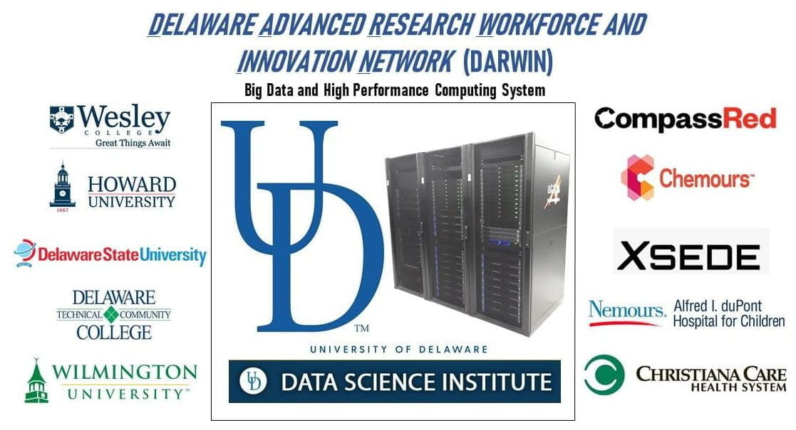
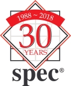
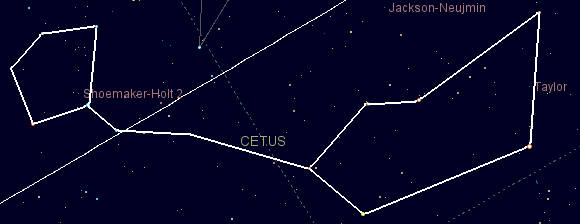

<h3>DARWIN -- Delaware Advanced Research Workforce and Innovation Network</h3>

DARWIN is a compute and storage resource supporting computational and data-intensive research at the University of Delaware and in the Delaware Region. DARWIN is funded by an NSF MRI (Major Research Instrumentation) grant.
For more information, see the <a href="https://dsi.udel.edu/core/computational-resources/darwin">DARWIN project page</a>

In a new avenue of research, I leverage social media data to explore
participation in extremist movements across multiple contexts, gaining insight
into the early stages of radicalization.

---------------------------------------------------------------------------------------------------
<h3>The Xpert Network --A Peer Network for the exchange of computational best practices and support environments</h3>

Through a series of online and face-to-face meetings we are aiming to create synergy among teams that assist researchers in developing, optimizing, and running computational and data-intensive applications. We also connect developers of tools that help accomplish these tasks. We welcome participation from large, national projects as well as from individuals that assist computational researchers or develop supporting environments.
For more information, see the <a href="https://sites.udel.edu/xpert-cdi/">project page</a>
<a href="https://nsf.gov/awardsearch/showAward?AWD_ID=1833846">NSF Award Page</a>
<b>Research Staff: Parinaz Barakhshan</b>

----------------------------------------------------------------------------------------------------
<h3>Real-Application Benchmarks for High-Performance Computing</h3>

We are creating HPC benchmarks that are representative of real-world applications. This is a collaboration with the Standard Performance Evaluation Corporation, <a href="http://spec.org">SPEC</a> and Indiana University. <a href="https://www.nsf.gov/awardsearch/showAward?AWD_ID=1842623">NSF award page</a>. <a href="https://www.udel.edu/udaily/2020/june/sunita-chandrasekaran-rudi-eigenmann-supercomputer-benchmarks/">News release</a>

<b>Collaborators: </b> <a href="https://www.eecis.udel.edu/~schandra/">Sunita Chandrasekaran</a>, <a href="https://itnews.iu.edu/people/henschel.php">Robert Henschel</a>

<h3>Cetus Source-to-Source Compiler Infrastructure</h3>

 
 Cetus is a compiler and transformation infrastructure for transforming C source code. The original purpose of Cetus was for automatic parallelization - translation of C code into C code annotated with OpenMP directives. Many other uses of the translator have emerged, such as the translation of OpenMP programs into CUDA and MPI. Cetus is being maintained as a community infrastructure and has been used for many projects worldwide (see the list of publications on the Cetus web page).
The Cetus project is a collaboration with Purdue University. NSF awards:
<a href="https://www.nsf.gov/awardsearch/showAward?AWD_ID=0707931">0707931</a>
<a href="https://www.nsf.gov/awardsearch/showAward?AWD_ID=1405954">1405954</a>

<a href="https://sites.udel.edu/cetus-cid/">Cetus Website</a>

<b>Research Staff: </b> <a href="https://akshayud.me">Akshay Bhosale</a>, Parinaz Barakhshan, Jan Sher Khan, Hao Wang  
<b>Collaborators: </b> <a href="https://engineering.purdue.edu/~smidkiff/">Samuel Midkiff</a>, Milind Kulkarni.

<nbsp>






  

