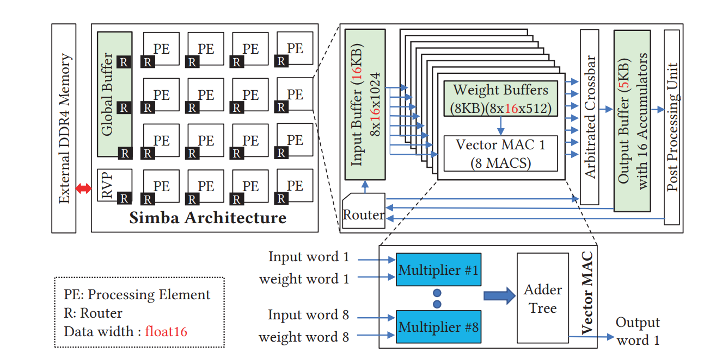

## 2024 

Hardware-Software Codesign of DNN Accelerators using Approximate Posit Multipliers

Tom Glint, Kailash Prasad, Jinay Dagli, Krishil Gandhi, Aryan Gupta, Vrajesh Patel, Neel Shah, Joycee Mekie

<i>Asia and South Pacific Design Automation Conference (ASPDAC) 2023</i>

<a href="../files/Papers/2023/Hardware_Software_Codesign_of_DNN_Accele.pdf" class="paper-button">PDF</a>
<!-- <a href="https://github.com/rishi-a/JoulesEye-Release" class="paper-button">Github</a>
<a href="../slides/2024/JoulesEye-ACM-PIC.pdf" class="paper-button">Poster</a>
<a href="https://www.youtube.com/watch?v=5J9KqrDnj20" class="paper-button">YouTube</a>
<a href="https://indianexpress.com/article/cities/ahmedabad/research-scholar-at-iitgn-develops-device-to-overcome-fitness-monitoring-limitations-9180741/" class="paper-button">News coverage</a>
<a href="https://medium.com/@lalitagod100/iitgn-researcher-creates-gadget-to-get-around-restrictions-on-fitness-tracking-80869cea0264" class="paper-button">Medium Article</a>
<a href="https://www.cs.cmu.edu/news/2024/jouleseye" class="paper-button">CMU News</a>
<a href="https://www.hackster.io/news/your-wearable-is-lying-to-you-28f2e5f56338" class="paper-button">Hackster</a> -->

## 2023
