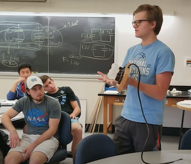

## Duke University
*(Graduate Teaching Assistant)*

- ECE 685D: Introduction to Deep Learning (Upcoming, Fall 2022)
  - Professor Vahid Tarokh

## The University of North Carolina at Chapel Hill
*(Undergraduate Teaching Assistant)*

- MATH 528: Mathematical Methods for the Physical Sciences (Spring 2018)
  - Professor Katherine Newhall
- MATH 233: Multivariable Calculus (Fall 2017)
  - Professor Linda Green
- PHYS 119: Introductory Calculus-Based Electromagnetism (Fall 2017)
  - Professor Jennifer Weinberg-Wolf