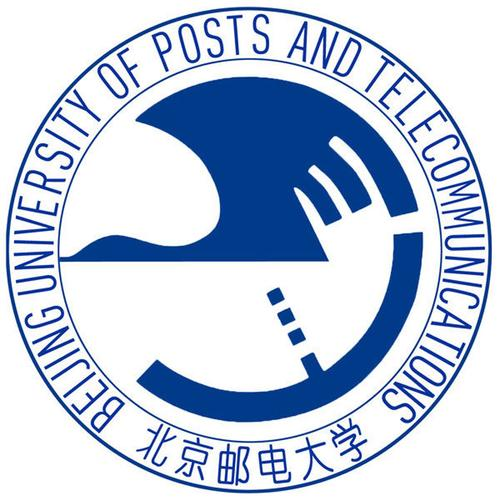
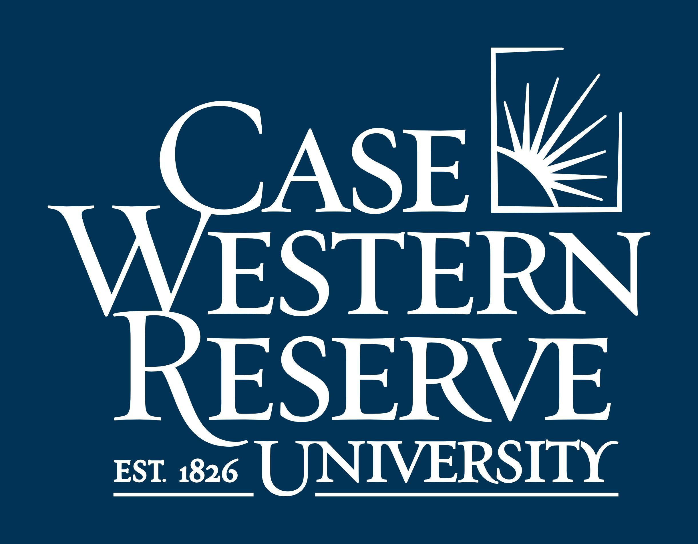




- 2021.06-2022.12 State Key Laboratory of Networking And Switching Technology
  - Interests: Data mining and Knowledge graph (Mentor: Chunhong Zhang)
  - Duty: I constructed more than one hundred knowledge graphs of Electronic Information automatically by NER and RegEx; Our team built a web system that can mark examination papers automatically by OCR and vue, and we applied a patent for it; 
        Our team studied KG fusion and entity alignment, and we propose an automated knowledge extraction, data cleaning and graph fusion framework for heterogeneous learning resources. Our paper was submitted to ``ICALT2023".
        

- 2022.05-2023.5 National Engineering Research Center of Mobile Network Security 
  - Interest: Multimodal and Semantic communication (Mentor: Prof. Guoshun Nan)
  - Duty: I do research in multimodal information fusion and semantic communication based on deep learning.
We propose a practical physical layer black-box attack method to destroy the robustness of  deep learning-based semantic communication systems, where the adversaries are imperceptible to humans. Our work has been accepted by ICC2023.And then, we propose SemProtector: A Unified Framework for Semantic Protection in Deep Learning-based Semantic Communication Systems. Our work was submitted to Communication Magazine.

- 2023.04-Now The National Laboratory of Pattern Recognition (NLPR) at the Institute of Automation of the Chinese Academy of Sciences (CASIA).

  - Interest: Diffusion model and AI4Science. (Mentor: Prof.Yifan Zhang)
  - Duty: I do research in combinatorial optimization, image generation and AI4Science.

- 2023.06-Now The Department of Computer and Data Science in Case Western Reserve University

  - Interest: multimodal and image generation. (Mentor: Prof.Yu Yin)
  - Duty: I do research in image generation and multimodal.

