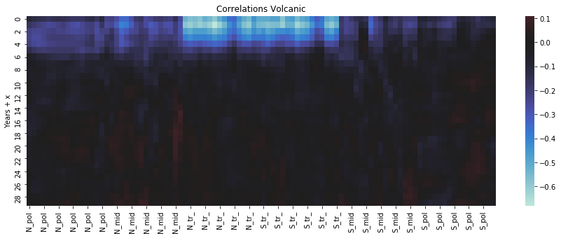

# 02-03 April 2020 HIDA-datathon

This remote/online 36h datathon was organized by the [Helmholtz Information & Data Science Academy](https://www.helmholtz-hida.de/), inplace of the big datathon: [Grand Challenges on Climate Change](https://www.helmholtz-hida.de/angebote/veranstaltungen/detail/artikeldetail/hida-datathon/), which couldn't take place due to the coronavirus.

This was a very interesting experience, participating in a challenge to analyse and find structure in
previously unknown dataformats (especially map information) and fields (geo/climate science).
After the challenge was stated, we realized that there were a couple of teams who had really concrete
ideas as how to analyse the data and what kind of computational models to use.

Our team `agnostic` decided that not assuming anything in particular would be the best approach,
and using our very different background and levels of expertise, we were able to put together
a good summary of the data at hand.
Deciding to throw many conventions out of the window, we also found out some things that were
surprising to the domain experts, for example that longitudinal data (even in summary chunks)
provides valuable information for modeling aspects.