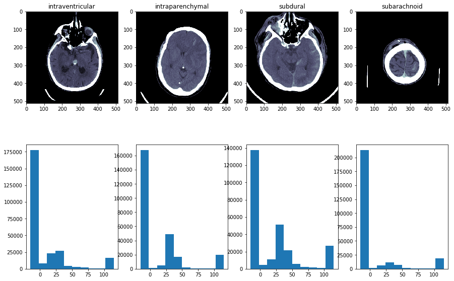
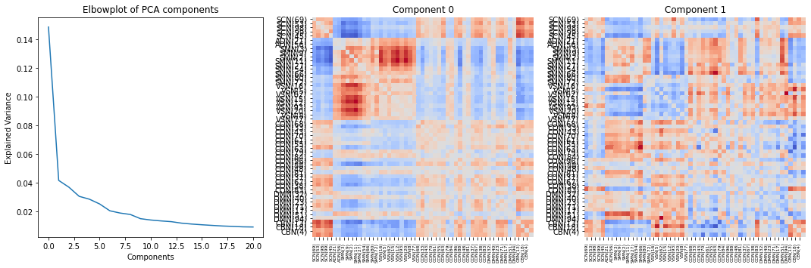
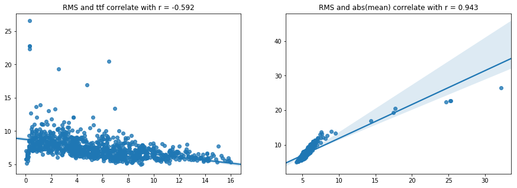

# [Kaggle](https://kaggle.com)

I participated in a number of Kaggle challenges, sometimes successfully, sometime not really so.
While I was often struggling with time and/or hardware constraints, Kaggle kernels
provide a good way to present initial data analysis.
Here are a number of the more popular public kernels. The one presented here are all Exploratory
Data Analyses (EDA). They might give you an overview how I generally approach data, which
I am more or less familiar.

## [RSNA Intracranial Hemorrhage Detection](https://www.kaggle.com/c/rsna-intracranial-hemorrhage-detection)

This challenge was about classifying different subtypes of hemorrhages from CT images. A task
that might in the future help to assist medical decision making. I've also been interested in
stroke as my visual-spatial attention research has a lot of its neuroanatomical basis in stroke.

Here is the [Kernel](https://www.kaggle.com/srsteinkamp/intuitions-ideas-basic-preprocessing)

## [TReNDS Neuroimaging](https://www.kaggle.com/c/trends-assessment-prediction)

This challenge is still going on, but this is my original assessment of the underlying data. Coming from neuroimaging research. I am really happy that there is another challenge where I have at least some domain knowledge. This interesting challenge is about the prediction of `age` and different (unknown) assessment scores from already preprocessed data.

Here is the [Kernel](https://www.kaggle.com/srsteinkamp/trends-eda).

# [LANL Earthquake Prediction](https://www.kaggle.com/c/LANL-Earthquake-Prediction)

This is my most successful challenge so far (got silver), after a tremendous shake up of the leader board. This is a typical time series analysis challenge, where only an auditory measure was given which had to be used to predict the time to the next upcoming earthquake. 

Here is the [Kernel](https://www.kaggle.com/srsteinkamp/quick-look-at-data-and-just-for-fun-analysis).