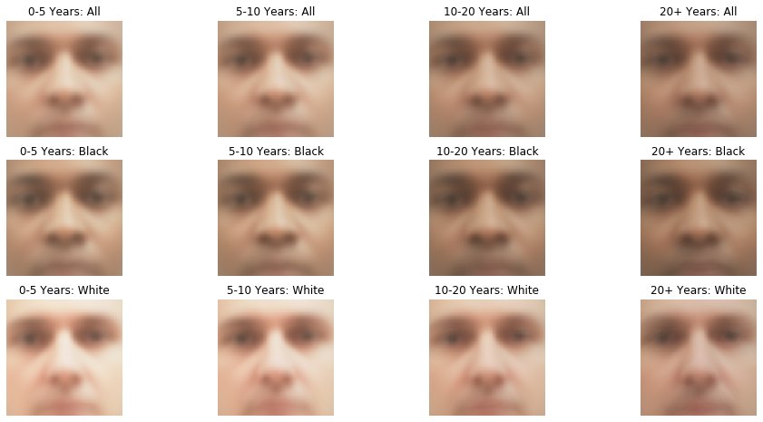

---

##Colorism in Sentencing: 

Abstract: Utilizing machine learning can help researchers leverage new forms of data, such as photos, to shed light on understudied questions in the social sciences. In this paper, I apply image processing techniques and transfer learning to detect if darker skinned individuals are sentenced to longer prison terms using data from Mississippi prisons. I find that for a one standard deviation increase in skin color, individual sentence length increases by approximately 445 days. Using FaceNet architecture, I create a model to predict the probability an individual is black using his or her prison photo. I find for a one standard deviation increase in probability of black, sentence length increases by approximately 200 days. Both results are largely driven by individuals in the latter part of the distribution of skin tone and probability of black. These results, while not causal, highlight the additional nuances that photo analysis can add to studies of disparate outcomes in the criminal justice system. Beyond criminal justice, this project highlights the potential for machine learning to add insights in the social sciences' study of bias in numerous fields including education, employment, and healthcare.

##The Impact of Ideological Diversity on Educational Performance: A Pilot Study 
with Jason Chin, Betsy Paluck, John-Henry Pezzuto, and Cecilia Rouse 

