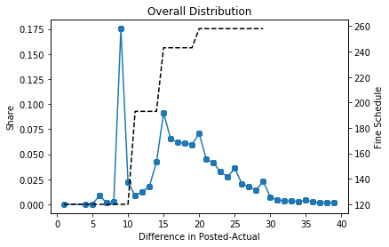
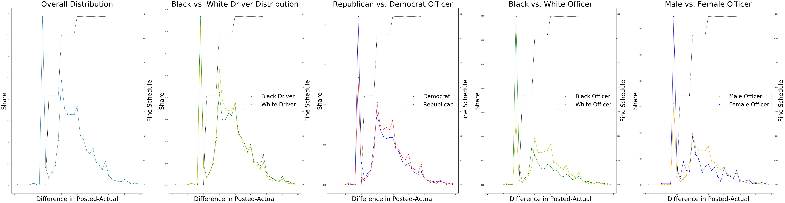

One of the most direct ways citizens and police officers interact is through police stops. Police stops may seem like a minor interaction but they can both impact citizens through fines and attitudes about policing.

Using Polk and Hillsborough County Voter Registration data and Police Stop data from Hillsborough County, we are able to link police officers to information on political party. We find suggestive evidence that democratic officers are more likely to speed discount. We also evaluate the privacy issues with open police stop and document different levels of data censoring that would result from using k and l diversity. 

#### Overall Distribution of Police Stops 

#### Distribution of Police Stops by Driver/Officer Characteristics 

[Jupyter Notebook of Analysis](https://github.com/awickett/APCOMP221/blob/master/APCOMP221_Final_redacted.ipynb/)

[Write Up of Results](https://github.com/awickett/APCOMP221/blob/master/FinalAPI221.pdf)

---

