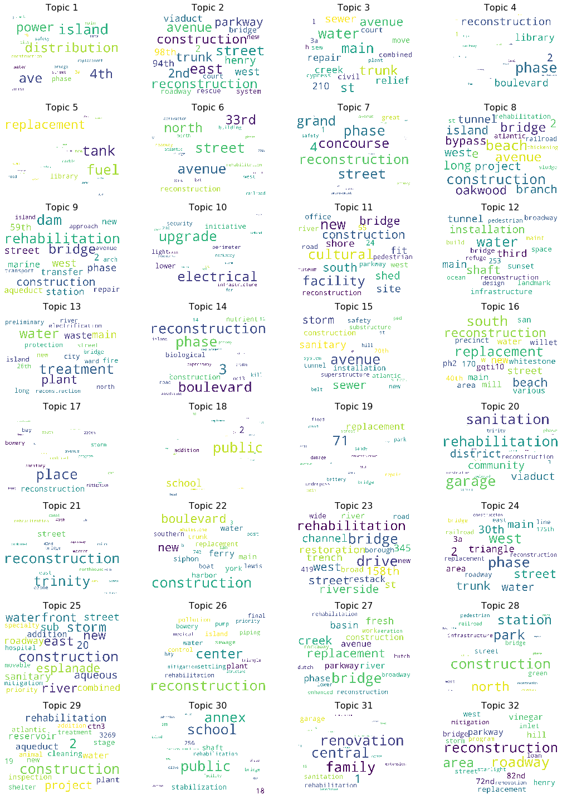

---

In this exploration, we evaluate project bids from the NYC government to predict if the project will be finished on time and under budget.

We focus on two primary questions:
1. How to evaluate project success and what project features are most predictive of project success
From the perspective of the NYC government, the ideal and most efficient outcome of a project is its completion within the original scope of the project, namely with respect to time and cost. We thus try to predict the percentage of budget and schedule change.

2. With defined measures of project success in place, we next explore characteristics of projects that might be indicative of project success. Does project success depend on the magnitude of schedule budget, the magnitude of cost budget, the project location, the type of project, the agencies involved in the project, or an interaction among several project characteristics? 

Our most successful mode uses Latent Dirichlet Allocation (LDA) to discover topics inherent in the corpus, classify the corpus according to the learned topics and use them as features for the regression model.  Below are sample wordclouds based on the LDA analysis. More details on the underlying data, cleaning process, all models ran, etc. can be found  [here](https://github.com/awickett/GovtProjects/blob/master/FinalProjectDraft_BaseModel_v3.ipynb)

