高精地图
------

## Introduction
  在目前的无人驾驶领域内，从对地图的依赖情况来看，大致可以分为两个流派，一种重度依赖高精地图，其代表公司有waymo,mobileye，baidu, pony.ai, momenta;另一种偏向于不依赖地图，如tesla；在我看来，telsa目前提供的功能更像是一种高级别辅助驾驶系统，而非真正的无人驾驶系统。在依赖地图的无人驾驶技术中，地图扮演着核心角色，在定位，路径规划，感知等各个模块均发挥着重要的作用，这篇博客会对两种高精地图的格式做简单介绍，　opendrive format and apollo hdmap format. 同时，会对地图处理中比较有用的一些工具进行介绍。希望这篇blog会对你的工作研究产生帮助

### OPENDRIVE

定义：　\
OpenDRIVE is an open format specification to describe a road network‘s logic. Its objective is to standardize the logical road description to facilitate the data exchange between different driving simulators (WIKIPEDIA)

特征：　\
* XML format  ,  hierarchical structure  ,  analytical definition of road geometry
* plane elements,  elevation,  crossfall ,  lane width etc.
* various types of lanes ,  junctions incl. priorities  ,  logical inter-connection of lanes
* signs and signals incl. dependencies
* signal controllers (e.g. for junctions)
* road surface properties
* road and road-side objects

结构说明：\

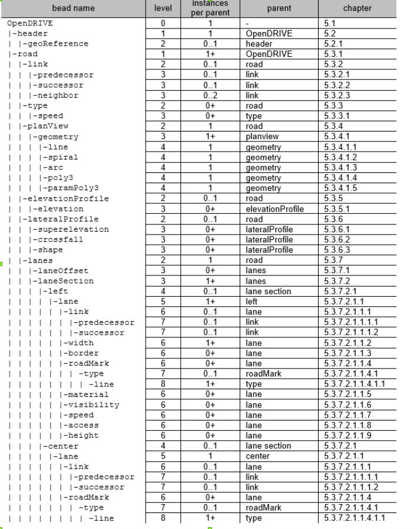     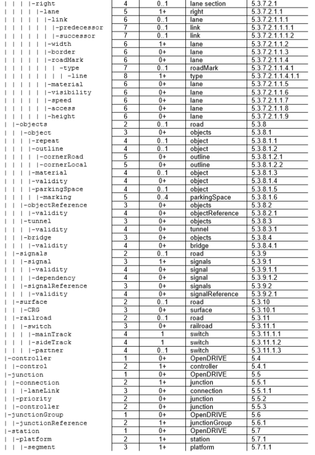

其第一部分，　header结构如下图所示：

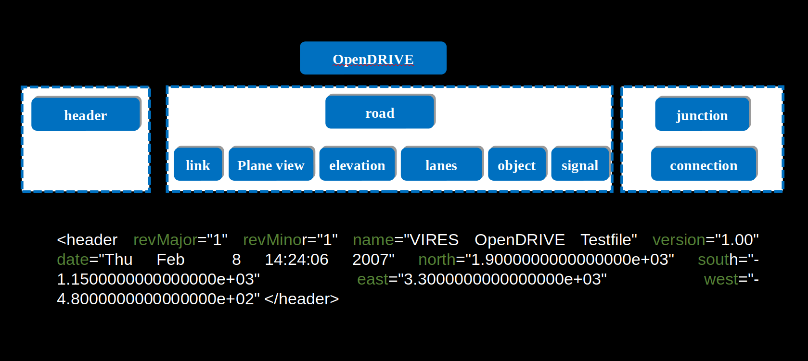

其第二部分，road的基本组成如下所示：

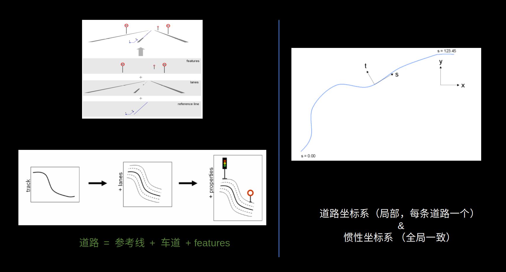

参考线为不同线型的序列，线型包括直线，螺旋线，圆弧，三次多项式，　如图所示：

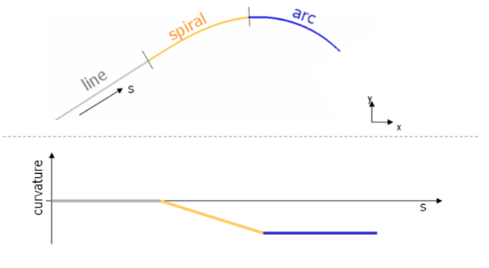

xml 语言描述：

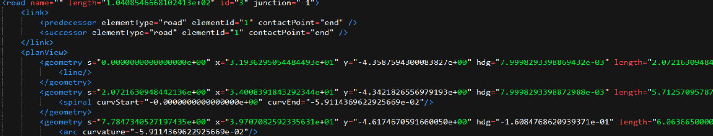

about lane and lane-section

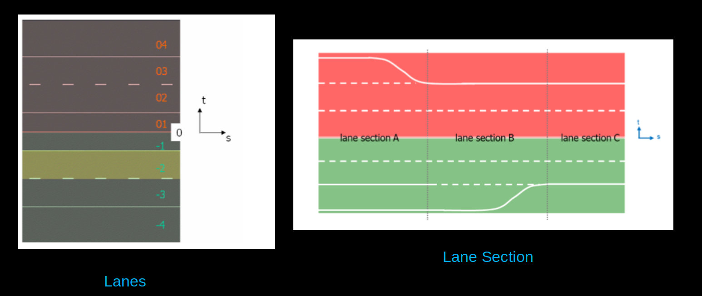

road整体的xml语言描述：

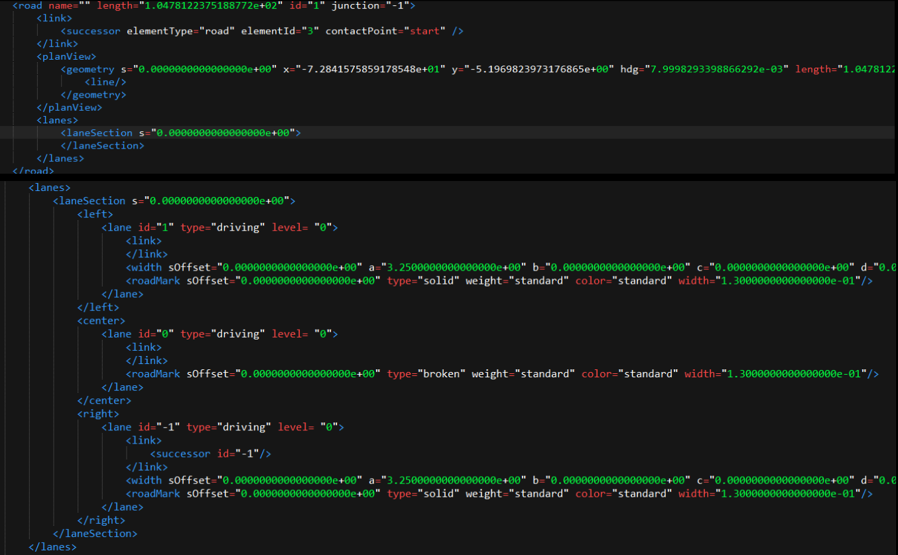

其第三部分，junction的基本组成如下所示：

道路拓扑连接方式包括两种，其中是道路的前驱后继连接，另一种是在路口处的连接方式。入路的每一条车道和连接道路的每一条
车道若可以连接，则建立连接关系，　如图所示：

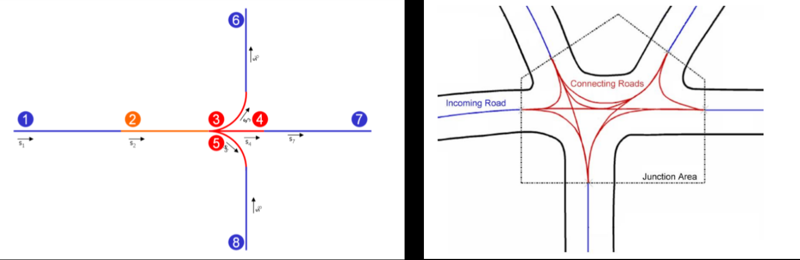

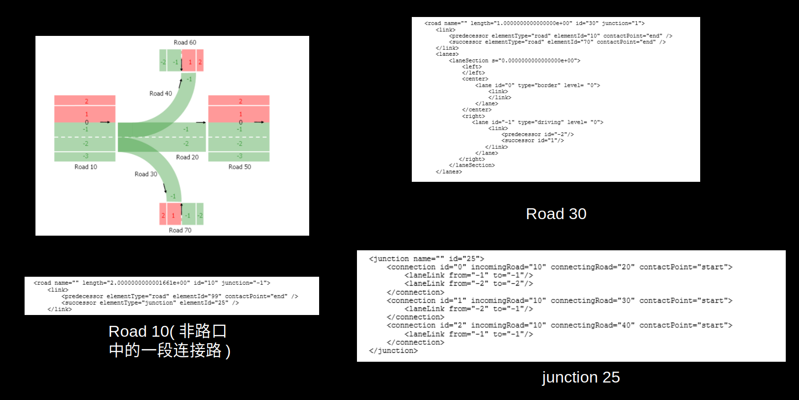

### APOLLO HDMAP

百度高精地图数据格式采用（XML）文件格式的数据组织方式，是基于国际通用的OpenDrive    规范，并根据百度自动驾驶业务需求拓展修改而成。(reference from: baidu apollo hdmap open source material)
其整体结构如图所示:

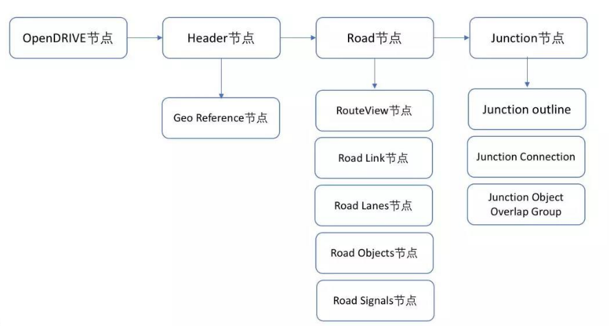

其地图总体上有三种，分别为base map, routing map, sim map，其中routing map和sim map分别应用的路径规划和仿真，其由base map进行生成。

由于apollo map和opendrive　map整体上比较相似，这里仅介绍其差异点，最大的一点不同是opendrive中用多项式来对线型进行描述，而在apollo　map中则是用序列点集进行描述；增加了对更多的物体类别的描述，如禁停区，减速带，横栏，电子屏幕等，主要描述方式为其对应轮廓的三维坐标；在junction的描述上，除了对连接关系进行描述外，还增加了对路口轮廓和描述以及路口与物体overlap的描述

* some detail about apollo map from code:
在系统启动的时候load整个地图，　加载的时候会同时构建相应的kdtree,以便之后进行地图要素查询的时候可以高效索引，　query支持包括所有地图要素的范围内查询，包括车道线，路口，道路物体元素等。

### Useful Tools
* proj.4 (c++, python) https:://github.com/OSGeo/PROJ　\
proj是一个非常全面的地理坐标转换库

* gdal (c++, python) www.gdal.org \
最为全面的栅格文件，矢量文件处理驱动库，包括OGR(shapefile, gdb), cad , geojson, open street map...

* arcgis/qgis www.qgis.org　\
地理信息处理软件，提供了丰富的地理位置相关的编辑功能

* nlohmann json(c++)
json 序列化与反序列化工具，　msgpack转换

* xml2dict
可以将任意python字典结构转换为对应的xml元素

* sqlite(database), protobuf, shp(point, polyline, polygon)
map的储存结构

* more...

* **
如果你觉得这篇blog对你产生了帮助，可以考虑sponsor me, 让我可以更有动力进行博客的更新

