基于先验地图的视觉定位
------

### Visual Localization In Hdmap

** *

#### 问题定义：
给定一份高精度地图或环境模型，给定相机（不限于单目，双目，多目，针孔或者鱼眼），输出相对于这份地图的高精度的相机的pose,在这个过程中其他传感器信息是可选的(optional)

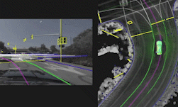

https://news.developer.nvidia.com/drive-labs-how-localization-helps-vehicles-find-their-way/

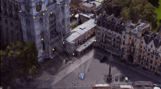  
https://github.com/ethz-asl/hfnet

#### 高精地图， 高精定位， 感知的关系
禾多科技的一篇材料中提到(https://www.zhihu.com/org/he-duo-ke-ji)：

高精地图、高精定位和感知三者相辅相成。
* 假如具备高精地图和感知结果，就可为定位提供先验信息
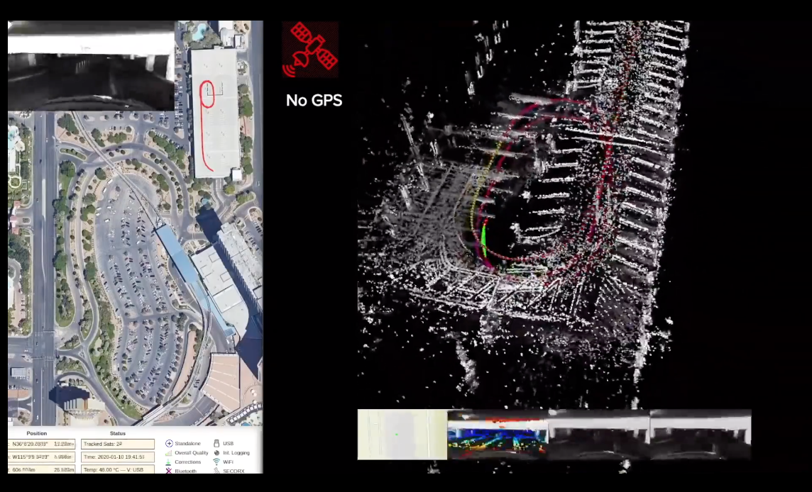
(artisense visual slam preview)

* 假如具备高精地图和定位结果，就可把地图元素投影到车体坐标系中，为感知提供先验信息
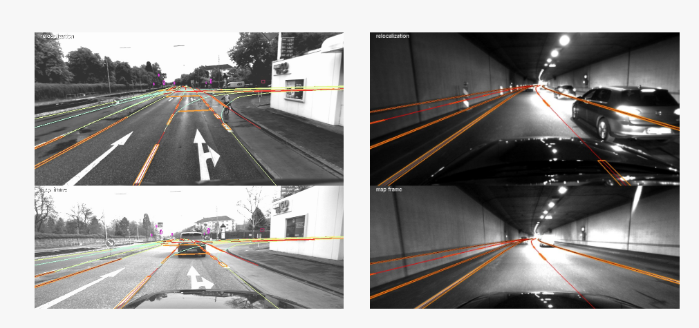
https://www.atlatec.de/localization.html
* 假如具备定位和感知结果，就可把感知元素反向投影回地图坐标系，将感知元素与地图已有元素进行比对更新或者构建新的地图

#### 行业现状

* NVIDIA

在国内和高德，四维，宽凳合作，在国外和tomtom, here, zenrin等合作.
DRIVE LOCALIZATION, localization within the world robustly and accuratly
https://www.bilibili.com/video/BV1cp4y1e7NM

* Mobileye

Localization in the road book (REM)

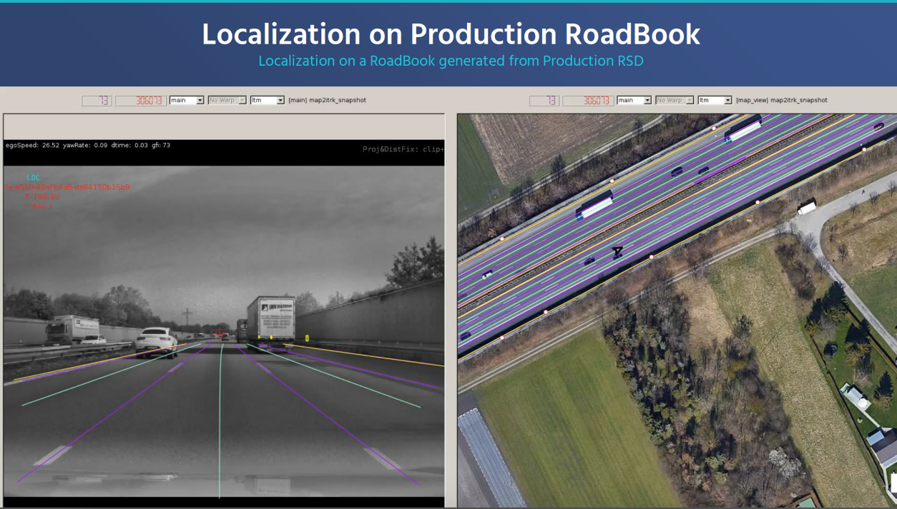

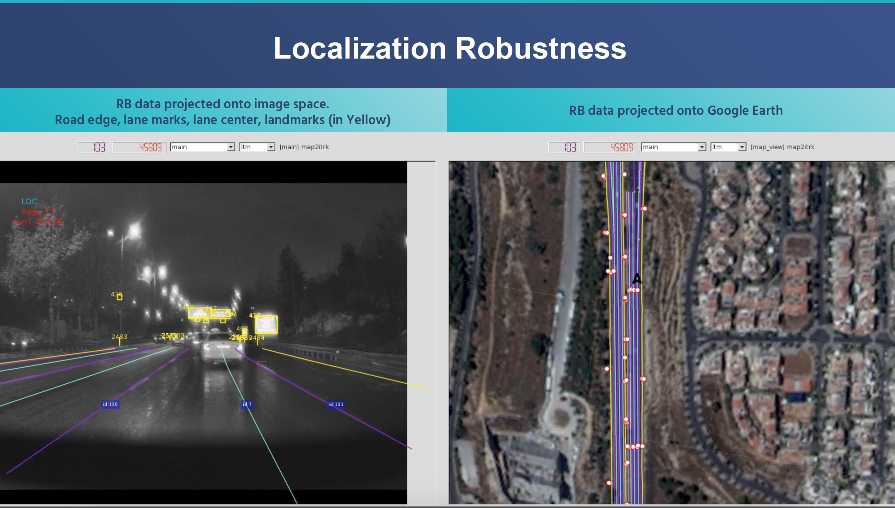

上图分别是road book 投影到图像空间上和投影到google earth的结果, 个人觉得mobileye一方面是一家自动驾驶公司，随着rem系统不断发展，可能也是一家全球地理数据资产管理公司

http://news.eeworld.com.cn/mp/ICVIS/a77059.jspx

* Baidu

structure based 
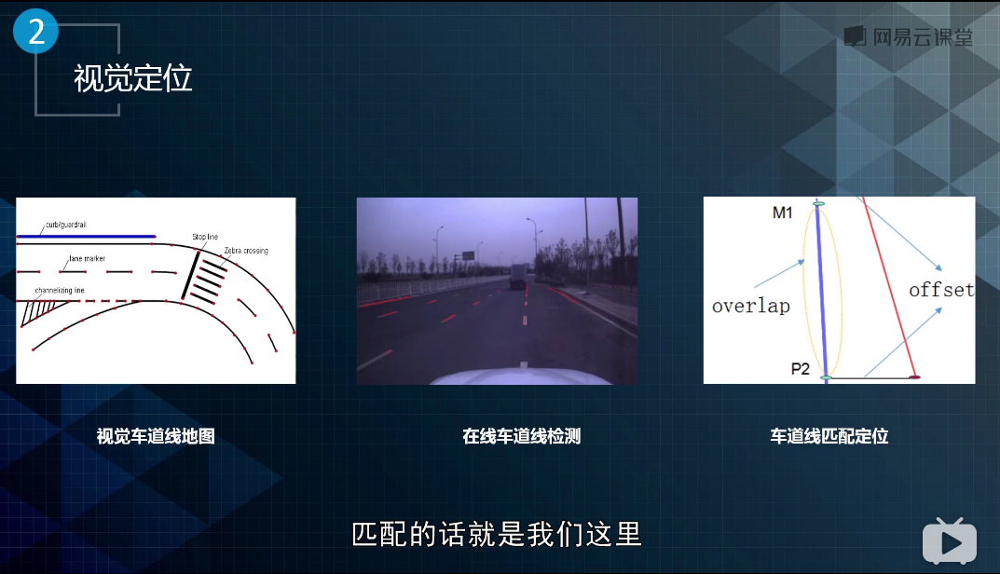
https://www.bilibili.com/video/BV1ib411z7Zx?from=search&seid=12997973010477634399

deep attention based
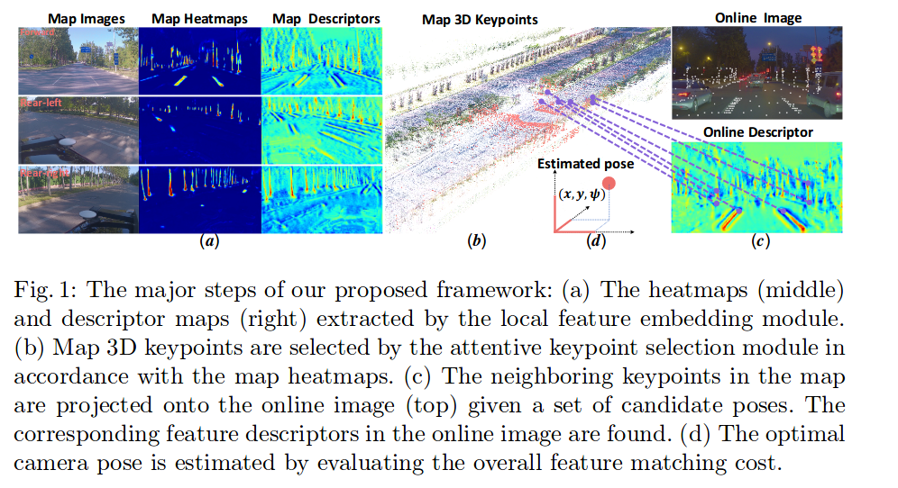
DA4AD: End-to-End Deep Attention-based Visual Localization for Autonomous Driving,ECCV 2020

* NIO 蔚来   
高精地图加持下定位精度20cm
https://www.bilibili.com/video/BV1Bf4y1D7Lx

* Boash
https://www.bilibili.com/video/BV13a4y1a7wk
* GM: Super Cruise 
https://www.bilibili.com/video/BV1Ba4y1J7Zs?from=search&seid=16396162737053386863
* 广汽新能源（埃安V）
https://www.zhihu.com/question/395047744/answer/1249197198)

* Momenta

https://www.momenta.cn/our.html

* HeDuo

http://www.holomatic.cn/news/read/121.html

### Related Paper

#### Monocular Vehicle Self-localization method based on Compact Semantic Map (2018)
Input: 单目相机 + 地图 Output: 6DOF pose，总体流程图如下：

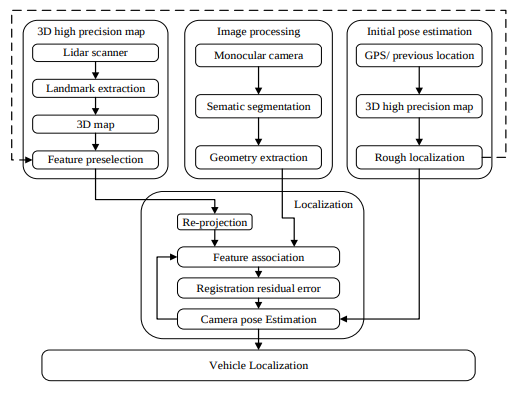

中间结果：
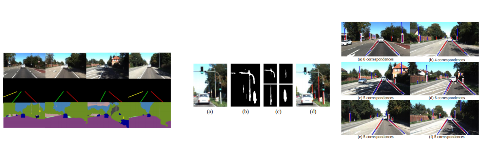

通过地图投影建立数据关联，定位结果：kitti odometry dataset sequence 4: 0.345m

#### Monocular Localization with Vector HD Map(MLVHM): A Low Cost Method for Commerial IVs (2020)

提出了一种耦合单目相机和轻量级矢量地图的定位方法，建立地图特征和图像检测出的相对稳定的语义特征之间的关联，从而进行相机的位姿估计，同时为了增加约束让轨迹更加鲁棒平滑，引入了两帧之间的视觉里程计的约束，最终达到了约24cm的定位的rmse精度.

众所周知，GNSS-RTK + 高质量的IMU + 多线束激光雷达在室内外都可以交付高精度的定位结果，然后由于成本的原因无法大规模商业化使用。然后作者团队也希望能够只需要一个单目相机 + hdmap来完成这件事情，尽管hdmap本身是需要昂贵的传感器来构建，当然也有公司采用众包技术使用消费级传感器就可以进行地图的构建与更新，但是地图一旦构建起来的边际成本接近于0，通过云端分发，分发的车辆越多，其分摊的构建成本也越低，自动驾驶中使用的地图形式也五花八门，如下图, 有激光定位需要使用的包含环境原始几何信息的激光点云图，也有如特征点法视觉slam中建立的特征点地图，也有对环境进行拓扑表达的类似于右图中的矢量地图，这些地图都可以完成定位任务，考虑到地图大小，简洁的要求，矢量地图可能是一个更合适的选择，并且在这篇文章中被使用，当然同样一份矢量地图，国际上存在大量的格式标准，如opendrive, apollo, nds等. 如下展示了两种不同形式的地图：

由于在室外环境中，光照变化，视角变化，遮挡等会频繁发生，所以选择从环境特征中选择一些相对这些条件更加鲁棒的特征是必要的，借助于CNN对图像极强的表达能力，我们可以获得这些稳定的语义特征所在的像素或者描述，而矢量地图中存储的也是这些不变的相对稳定的东西，所以问题很自然的简化为数据关联问题。文章所提出的方法的整体流程如下:

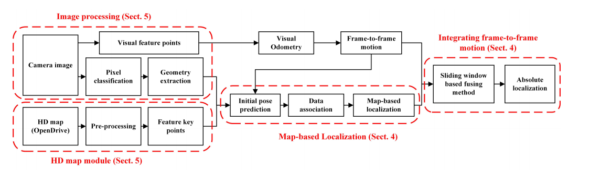

与前作不同的是，同时解算帧间vo（利用了传统视觉特征orb）,并在滑窗中引入帧间的约束来提升鲁棒性。

在影像处理模块，通过分割提取关键像素，并将其拟合成point feature(sign)和line feature(lane and pole),同时为了进行帧间vo的计算，会进行orb特征的提取；在基于地图的定位模块会进行初始pose估计，利用初始pose通过随机采样的方式确定最优的匹配，然后根据匹配关系就可以进行pose的优化求解；最后为了确保定位输出的鲁棒，增加了滑窗的位姿优化。

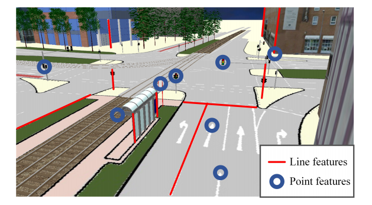

residual的定义:point feature就是最基本的点的重投影误差，line feature是地图中线的投影点到图像中检测到的线段的距离 (residual这里我们目前采用的方法应该是更有优势的 1.是统一了所有的特征的描述，都是用点来进行描述 2. 不需要显式的进行数据关联)

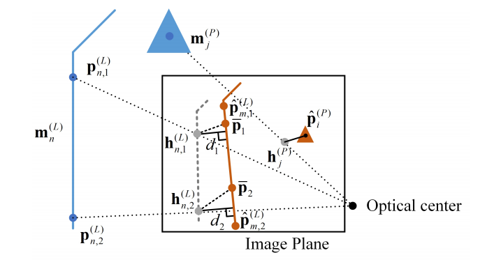

数据关联的过程：确定地图上的特征和图像上的特征的对应关系
1. 先生成可能的对应关系集合，从集合中随机采样三条同语义的线特征的对应关系来进行相机pose的计算，
2. 根据计算出的相机的pose投影地图元素，如果和图像feature距离低于设定的阈值则认为是inlier，然后会计算估计出的pose和初始pose的距离，如果满足阈值，则对应关系会加入假设集合
3. 最终选择inlier数最多的一组对应关系作为最终的对应关系

耦合帧间的位姿约束（pose fusion）
构建优化问题，状态变量包括每帧的pose和尺度， 结合单目orbslam给出的没有尺度的帧间的约束和每一帧的map-localization的定位结果来求解状态变量,能量函数如下:

求解出VO的第一帧相对于Map的旋转平移以及尺度，align VO的pose和基于地图定位的pose

实现细节：
1. 图像特征提取层面，用修改版的pspnet来对图像进行分割，然后根据置信度概率选择特定的像素，用区域生长的方法划分为不同的区域，线特征进行最小二乘拟合，从sign区域拟合点特征，从图像域上得到这些特征分别的位置描述
2. compact map的使用，所使用的地图是opendrive格式，sign使用的是质心点，pole使用的是两个端点，lane用0.2m进行采样散点，然后每两个散点构成拟合成一条线来进行使用
3. 优化与初始化, 系统初始化也是使用了低成本的GNSS的测量值作为初值，优化就是标准的LM算法

实验：

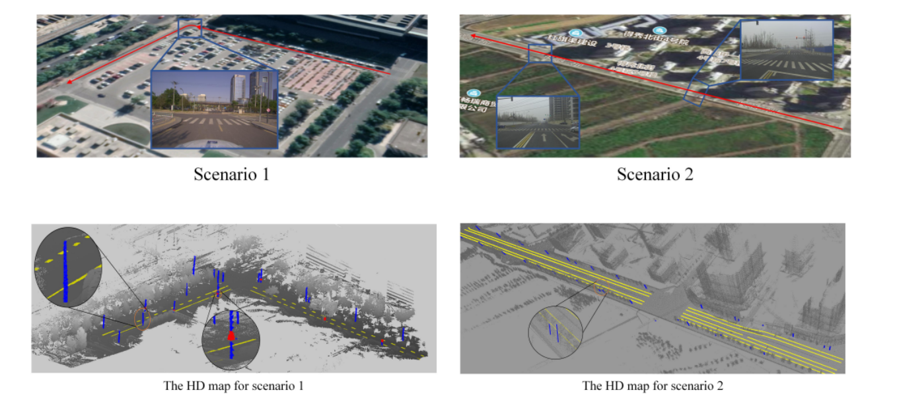

分别是校园场景和外部道路场景，首先是相应场景的地图生成, 使用loam生成道路的点云图，然后手工的方式提取车道线，杆子，信号牌（去年的时候我们也做过类似的东西），然后再生成对应的opendrive格式的矢量地图，每公里约50kb,而对应的点云地图没公里约600MB,通过全站仪验证地图精度约为9.25cm

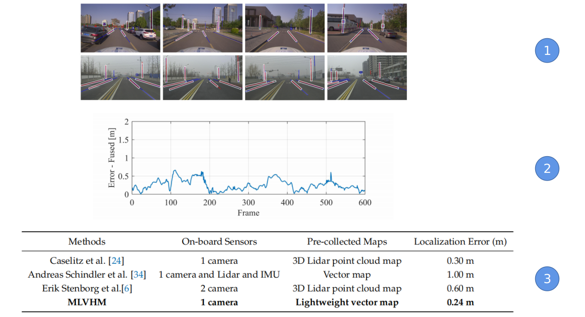

1. 投影过来的匹配的特征 2. 融合后的定位误差 3. 与其他方法的定位精度的比较

#### HDMI_LOC: Exploiting High Definition Map Image for Precise Localization vai Bitwise Particle Filter (IROS 2020)

文章提出了一种方法，结合双目相机和hdmap来进行6dof的位姿估计，将地图转换为8bit的影像代表，使得query image可以和地图进行bitwise operation(位运算)来进行匹配，使用粒子滤波框架来进行pose优化估计，11km的测试条件横纵向误差约为0.3m,运行速度为10hz,整个定位过程可以分为4步：
1. 图像处理步骤， 从双目图像中得到语义分割图和视差图（所以这个方法比较慢）
2. 将hdmap转化为8 bit image
3. 利用粒子滤波估计4dof （三个平移 + yaw）pose, 通过当前影像的patch和地图影像，因为这两个东西都是8bit影像，所以可以进行位与操作来快速计算
4. 通过优化额外计算roll和pitch来估计完整的6自由度pose

整体流程图如下：

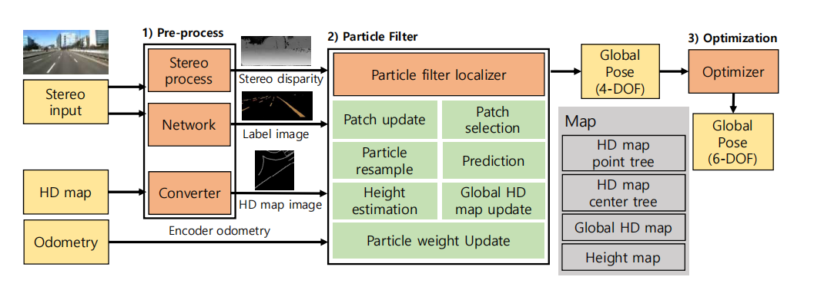

地图直接采用了naver labs(韩国一个自动驾驶机构, https://hdmap.naverlabs.com
)公开的矢量格式的Hdmap,以shapefile进行储存，地图中包括了车道，停止线，地面sign等特征

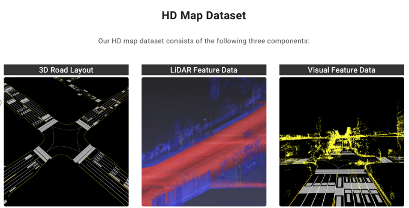

* 矢量地图向图像的转换:
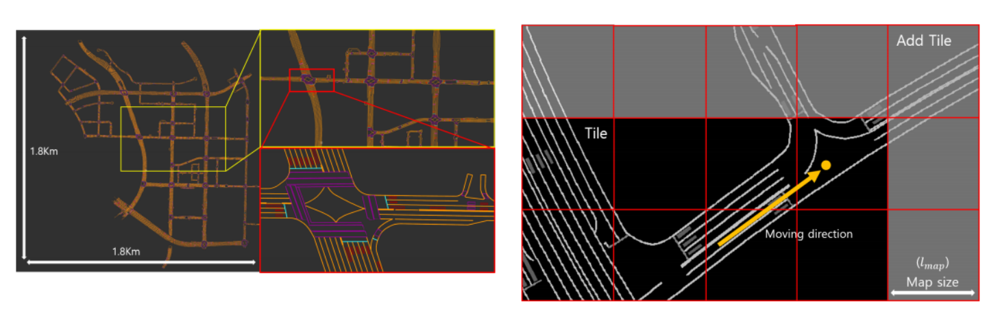

灰度上的128， 64， 32分别代表车道线，停止线和路牌.每个tile是30m * 30m，且存储了相应的中心点的全局utm坐标系下的坐标.
预处理和8bit的代表：上图展示了一个全局的hdmap image, 其会根据当前车辆pose进行地图的拓展，在预处理的步骤中，会同时生成hdmap center tree 和hdmap point tree,通过中心点可以很方便的查找到附近的tile, 而point tree由shapefile中的点集构成，用来查找到最近点进行高度获取

* 双目影像向点云的转换:
立体影像生成labeled点云： opencv stereoBM 生成视差图，结合cnn的语义分割图可以很容易的得到labeled pointcloud

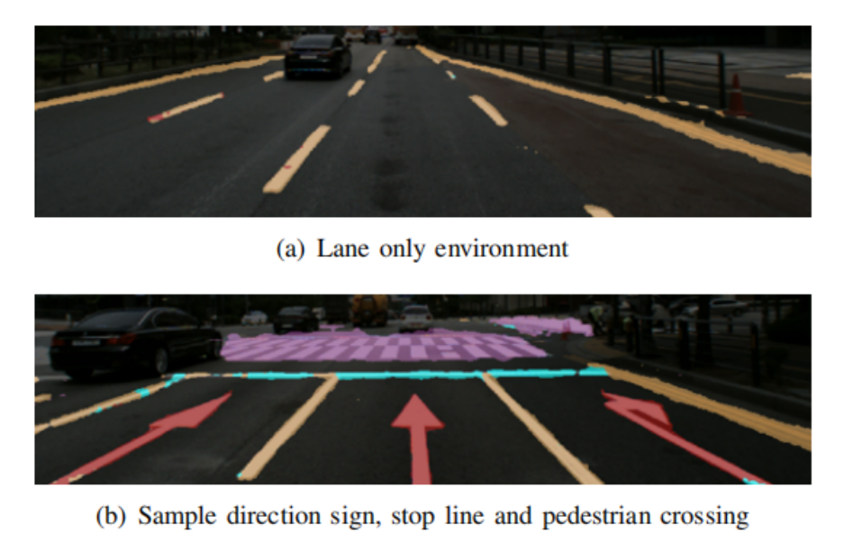

* 关于patch的维护与选择：
对于每一个新进入的subpatch,会根据当前情况更新当前最新的patch或者在新增一个patch；在更新patch的时候，首先将双目相机坐标系下的语义坐标点转换到世界坐标系下，然后将世界坐标系下的点投影到patch image上：
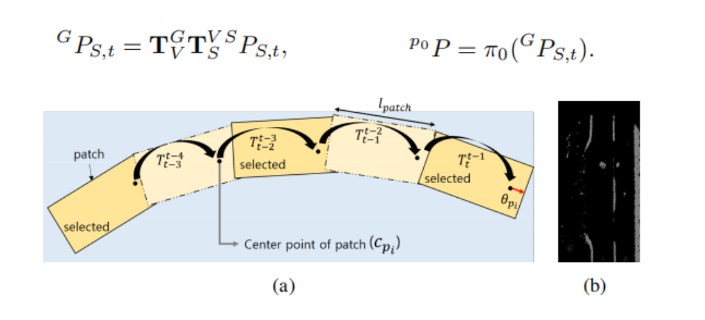
这样新的信息就加到了最近的patch image上面，如果最近的patch已经超过了五个，就会根据当前的subpatch构建新的patch.同时每个patch记录一个age,因为新的patch加入了，老的patch的age会衰减，在后面粒子滤波的过程中当一个patch的权重再使用

关于patch的选择：最终是拿这些patch和地图进行匹配，为了更有计算效率，拿最有信息量的那些patch来进行匹配得分的计算，比如一个同时包含车道，杆子和路牌的patch会比只包含两条车道的patch更加重要。最后就是根据设定的每种路标的阈值，选择一些更加重要的patch

* 粒子滤波

粒子滤波的目的是估计出当前车辆的二维的pose(tx, ty, yaw), 因为采用了patch和tile的两个平面的匹配，所以只能估计出二维的pose, 高度是根据最近点的高度直接查找获得，所以粒子滤波最终的输出可以得到（tx, ty, tz, yaw）这样的4自由度pose

过程包括：

1. 粒子重采样

2. 粒子预测， 根据运动模型并施加高斯噪声来进行粒子的传递

3. 根据当前的位置获取候选的tileset

4. 利用“与”操作更新粒子权重

从“与”操作的结果图像中可以获得lane, stopline, sign的像素数量，数量越多，表明当前pose的估计结果越好，相应的粒子权重也越高

5. 最终选择权重最高的top 3%的粒子的平均pose作为最终pose

* 优化估计roll. pitch
其核心是构建一种residual,当车体的roll, pitch变化的时候residual能够产生相应的连续的变化。步骤如下：

1. 首先将双目点云转换到车体坐标系下面
2. 根据车体坐标系下的点ransac拟合平面，得到平面方程参数nt = （nx, ny, nz, dt）
3. 将hdmap中的点转换为车辆坐标系（需要用到当前车辆的pose），将车辆坐标系中这些点到平面的距离作为residual

实验结果：

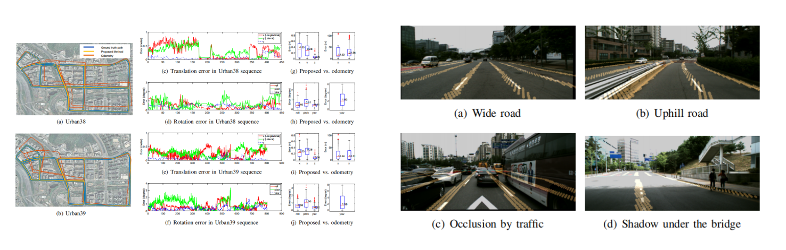

#### From Coarse to Fine: Robust Hierarchical Localization at Large Scale（CVPR 2019）

视觉定位是指，在大尺度场景下，已知环境地图，给定任意一张图片，计算出该图片对应的位姿。
在视觉定位领域，基本上有两种主要的方向，一种是所谓的 End-to-end 方法，代表作是 PoseNet，这类方法直接用图片和 pose 真值作为监督学习，对于给定的同一场景的图片可以回归出 6dof 的真值。这种方法优点是数据库很小，一个网络可以覆盖一个很大的场景，而且虽然需要 Pose 真值但并不需要显式的空间三维重建。但是缺点也很明显，这类方法无非是简单地通过学习建立起了图像和pose之间的映射关系，本质上就是一个图像相似度匹配的过程，因此不可能回归出精确地真值以及获得对于未学习场景的迁移能力。目前比较流行的方法是，由粗到细两步定位。先通过图像检索的方式找到最接近的关键帧，再与该关键帧匹配局部特征。由于关键帧位姿已知，所以通过PnP等方法可以估计出当前帧位姿。两步定位可以避免从所有关键帧中直接匹配带来的时间复杂度，同时避免了将整个环境地图加载进内存带来的空间复杂度。文章主要提出了一种由粗到精的hierarchical的定位网络，hfnet, 对输入的query image, 会通过一个单一的CNN同时预测影像的局部特征和全局特征来进行6自由度的精确定位，采用的这样一种coarse to fine的定位范式: 先通过一个全局的retrieval获取候选帧，然后和候选的位置做局部特征匹配来进行定位。类似于人类定位的模式一样，作者希望利用这样一种coarse to fine的定位范，同时又希望能够结合深度学习在图像特征检测和描述领域的一些进展，这些学习到的detector 和descriptor提高了对环境变化的鲁棒性。为了达到上面的目的，并且最大的提升效率，提出了HF-NET（hierarchical feature network）,同时估计局部和全局特征，并且最大化的共享计算。通过多任务蒸馏的方式进行网络的训练

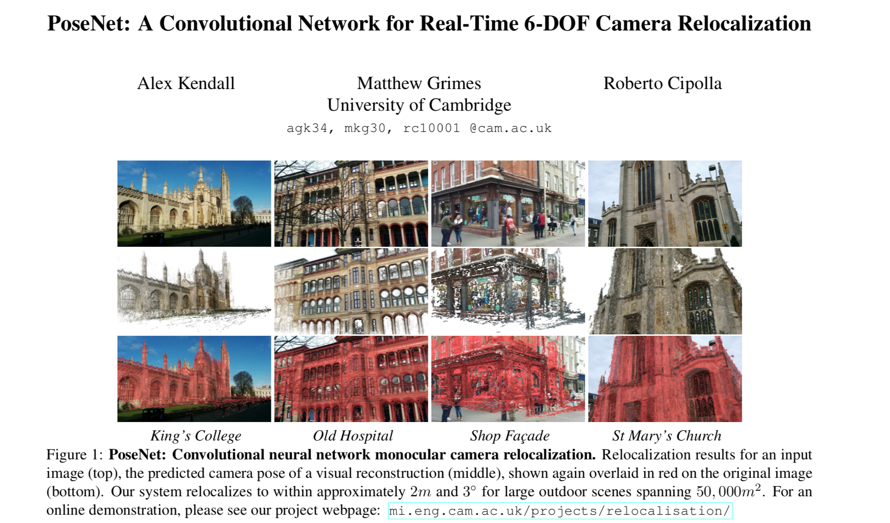

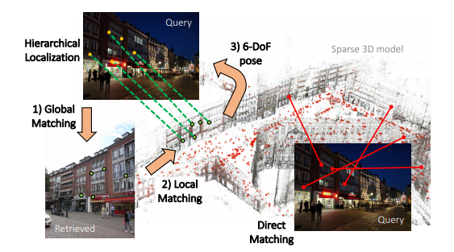

一种是先全局再局部的方法，一种是根据描述子直接匹配

类似于人类定位的模式一样，作者希望利用这样一种coarse to fine的定位范式，同时又希望能够结合深度学习在图像特征检测和描述领域的一些进展，这些学习到的detector 和descriptor提高了对环境变化的鲁棒性。为了达到上面的目的，并且最大的提升效率，提出了HF-NET（hierarchical feature network）,同时估计局部和全局特征，并且最大化的共享计算。通过多任务蒸馏的方式进行网络的训练

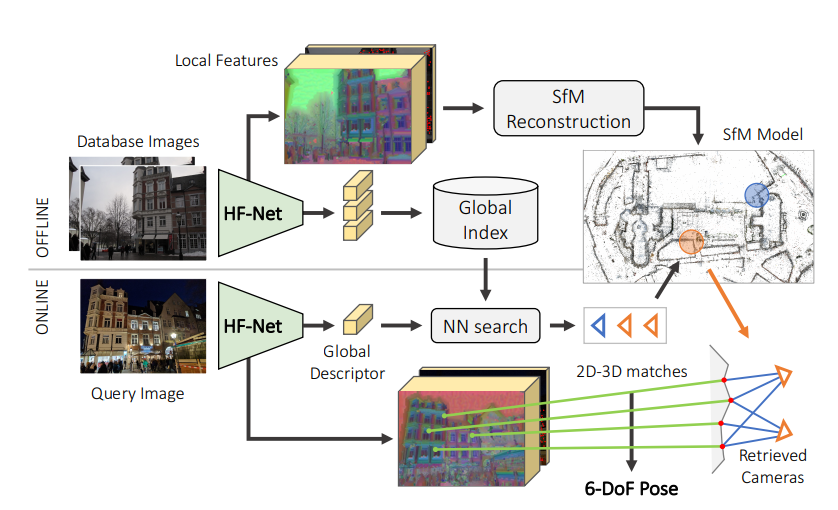

离线模式下，根据db image利用网络提取局部特征和全局特征，局部特征传入到sfm三维重建框架进行环境模型构建，全局特征构建参考图像索引db, 然后在线运行的时候，对query image 做相同的特征提取操作，根据全局描述子利用NN搜索得到候选帧，建立候选帧共视的地图点和query图像特征点的对应关系利用ransac + pnp框架求解pose

hfnet的结构：

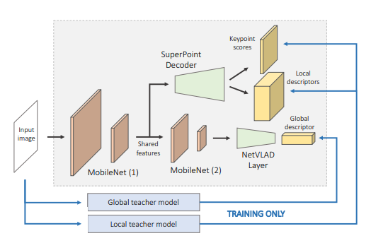

其结构包含了一个单一的编码器和三个heads predicting,分别是图中的关键点得分，密集的局部描述和全局的描述子，图中的计算共享也是比较自然的，我们知道图像的全局描述可以通过聚合局部特征来得到（比如orbslam中使用的dbow词袋的生成），所以一开始的负责特征提取的解码器部分是参数共享的。其解码器部分是一个mobilenet的backbone,为了提取全局的描述子，在mobileeye net的最后一个feature map上接了一个netvlad层，对于局部特征的提取，接了一个super point的解码器来得到keypoint和局部描述子

对于local feature 的这个branch，局部特征更加需要的的是图像上的定位精度，对空间分辨率要求更高，而对语义特征的要求较低，和全局描述是相反的，所以为了保持空间分辨率，local feature的分支提前建立

网络结构细化：
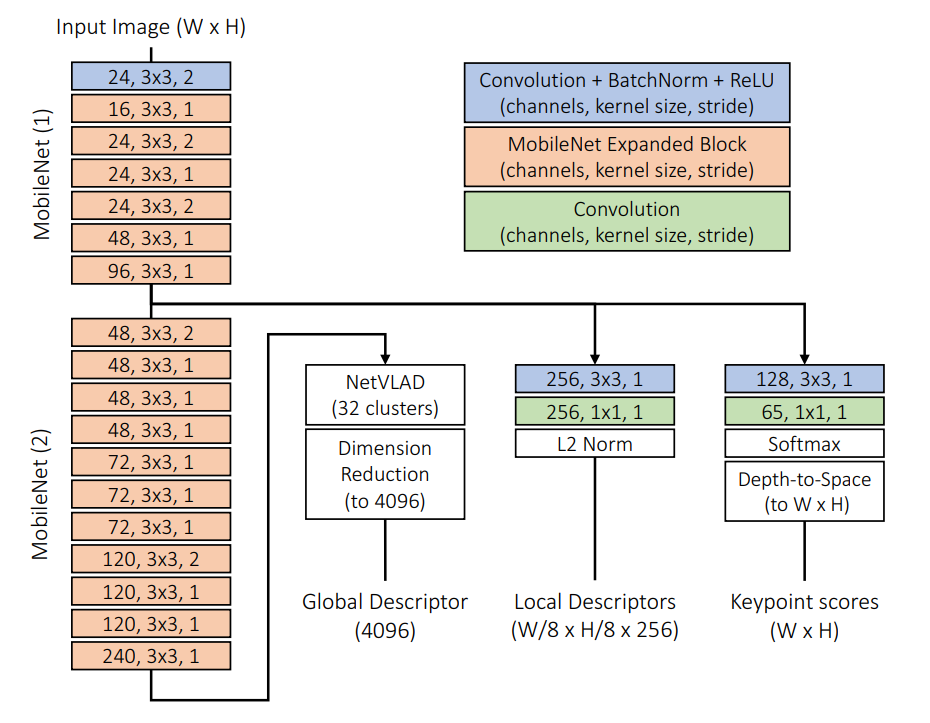

* 关于训练的过程
因为数据方面的问题，数据稀缺（很难获取特征对应的真值） 数据增强（增强会破坏影像的全局一致性，从而导致很难进行全局描述的学习），作者采用了多任务蒸馏的方式来进行网楼训练。核心思想是找一些现成的老师模型来指导学生模型的学习， loss 如下：

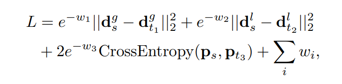

将老师模拟为真值进行训练， 分别是全局描述子的二范数loss, 局部特征描述的二范数loss, 关键点得分的交叉熵loss以及优化变量w的正则化 loss， 学生是同一个，学习的是不同的state of the art的老师，这里聚集了t1, t2, t3三位老师，最终证明了知识蒸馏在多任务上的有效性, w1, w2, w3是需要自动学习的权重

作者采用的是知识蒸馏的方法，简单来说就是用已经确定有效的大网络模型训练得出的结果，作为小网络模型的监督信号，最终实现小网络模型近似模拟大网络的效果。希望能够同时达到像大网络那么准确，但也要像小网络一样高效

关于老师的选择:

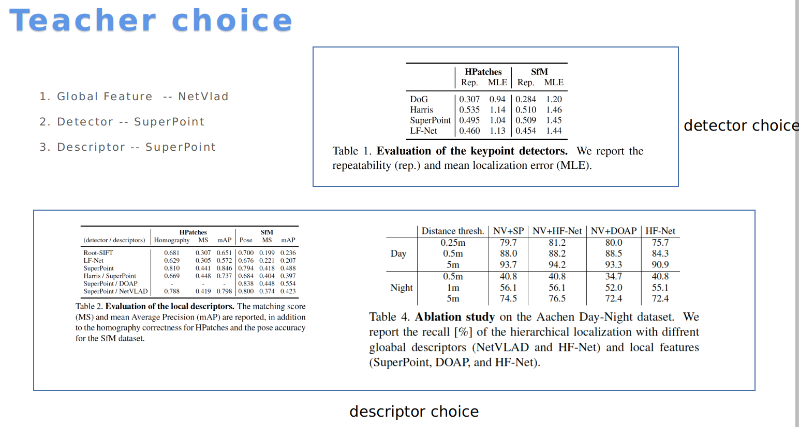

NetVlad & SuperPoint

* 局部特征检测的一些结果
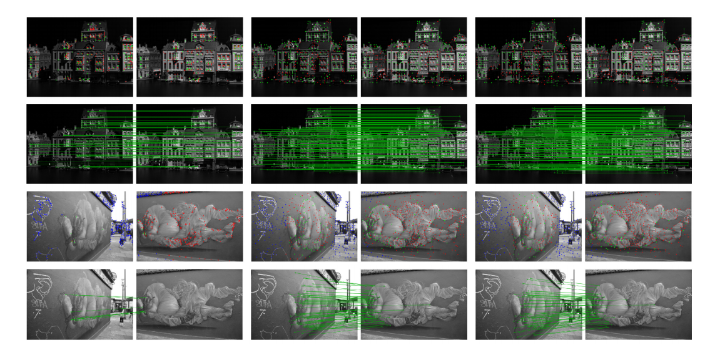
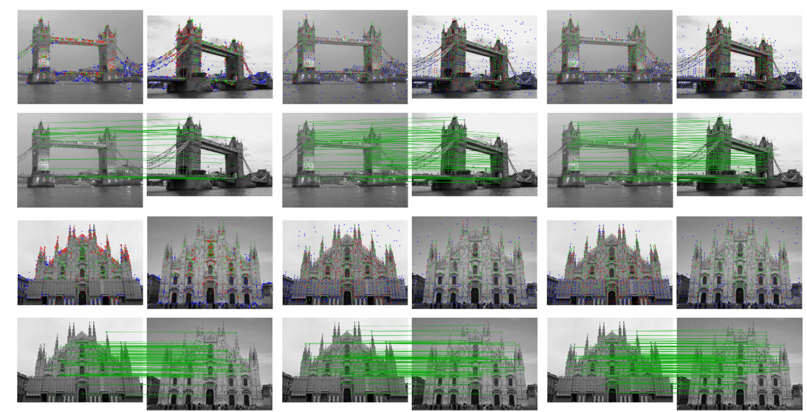

绿色的是重复检测到的一些特征，红色是没有重复检测到的特征，蓝色是在另一张图像上没有被看到的特征，图中是inlier match，从左到右依次是sift, super point, HF-NET

* 定位的实验
在三个数据集上进行实验，aachen day-night dataset(一个欧洲小城)， RobotCar Seasons dataset (跨域多个城市街区的城市数据集)， CMU Seasons dataset(8.5km的urban 和suburban),每个数据集上都有相应的database images and query images.

因为再做pnp的时候需要构建一个sfm model.基本过程如下：
1. 利用提取的特征在参考影像之间执行2d - 2d的匹配， 并进行一个初始的ratio test匹配过滤
2. 使用两视几何进行在colmap框架中进行匹配的再次过滤
3. 根据匹配关系和参考影像的ground truth pose进行三角化从而生成环境的3d model

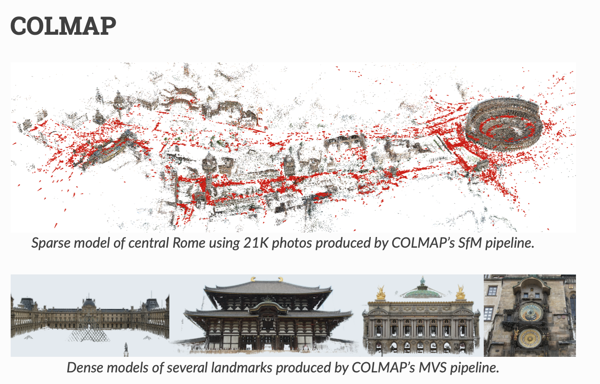

定位成功的帧的统计：

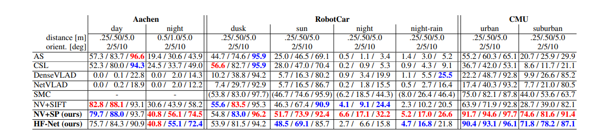

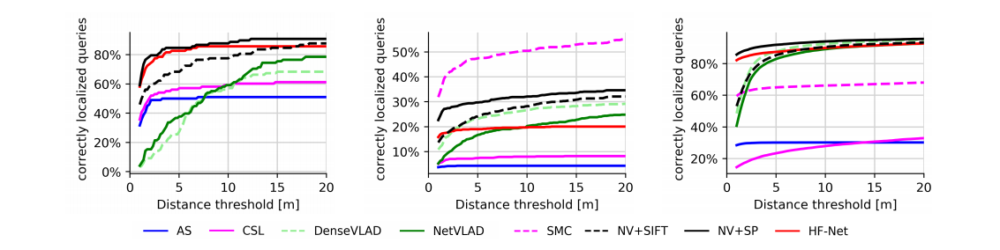

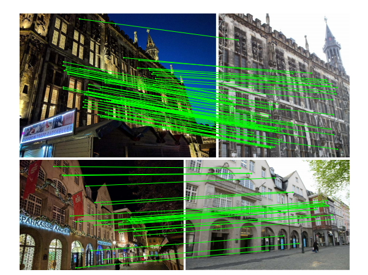

在aachen day-night dataset上成功定位的结果，左图是query帧，右图是retrieved到的含有最多inlier match的database image,通过pnp ransac得到的inlier数量

运行时间分析：

不同步骤花费的时间统计，比目前最快的方法active search要快10倍以上

* 一些定位结果
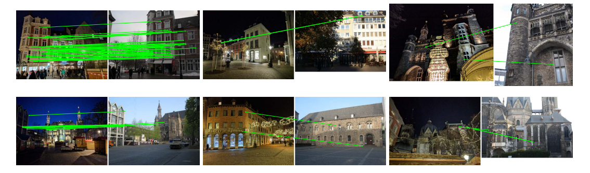
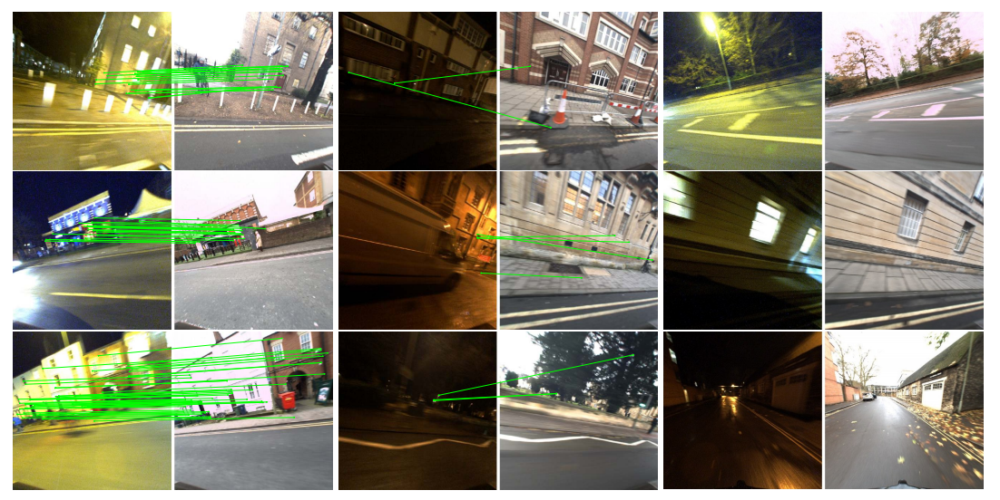
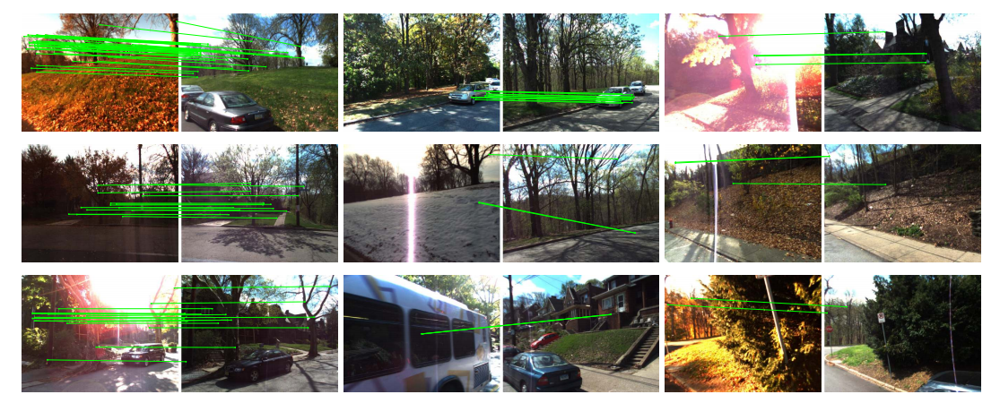

对于每一个影像对，左边是query image, 右边是最多inlier match的retrieved images, left 是在有挑战的情况下成功定位的，中间是因为全局retrieved 错误导致失败的以及右边是因为局部匹配不足导致失败的

和netvlad + sift的比较：

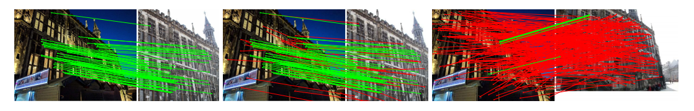

相对于sift, 匹配数少一点，降低了局部匹配的计算量，同时，inlier match更多，提升了定位的鲁棒性且降低了对ransac迭代次数的要求

* **
以上是关于visual localization的简单总结，有任何问题，欢迎与我联系

cell phone: 13162517010 \
email: candyguo_fly@163.com

如果你觉得这篇blog对你产生了帮助，可以考虑sponsor me, 让我可以更有动力进行博客的更新

