立体匹配
------

### Stereo Matching

** *


### 双目匹配

在双目匹配的范畴里，本次内容主要局限在以下两个小的部分:

* SGM(经典) 原理解析
* comparation with monodepth

#### SGM

* 半全局匹配算法（SGM）是实时立体视觉里最流行的一个算法，已经大规模的在很多产品里得到了应用。其最早由H. Hirschmuller 在2005年发表于CVPR的文章中被提出

  **'Accurate and efficient stereo processing by semi-global matching and mutual information'**

  立体匹配算法在深度学习算法强势来袭之前，可以分为3大流派，包括局部派（SAD, SSD, NCC, Census-Transform, Mutual Information ...）,全局派 (Graph Cut, Belief Propagation, Dynamic Programming ...), 以及半全局派 (SGM).
  SGM是半全局领域的代表之作，相对于局部派的简单粗暴，SGM更加优雅复杂，同时也没有全局派那么time-consuming (https://blog.csdn.net/rs_lys/)

  SGM算法步骤较多，整体上比较复杂。希望经过这次分享，能够对其原理有更好的理解。

  * opencv 接口

  ```
  cv::Ptr<cv::StereoSGBM> sgbm = cv::StereoSGBM::create(minDisparity, numDisparity, SADWindowSize, p1, p2, diso12MaxDiff,preFilterCap, uniqueRatio, speckleWindowSize, speckleRange, fullDp);
  cv::Mat disparity_sgbm;
  sgbm->compute(frame->left, frame->right, disparity_sgbm);
  disparity_sgbm.convertTo(frame->disparity, CV_32F, 1.0 / 16.0f);
  ```
  参数含义解释:
  1. minDisparity: 最小视差
  2. numDisparity: 视差个数(64 / 96 / 128 / 256 ...)
  3. SADWindowSize: 灰度相关时的窗口大小 (3 / 5 / 7 ...)
  4. p1, p2, 平滑性惩罚系数， 下文会介绍详细含义
  5. diso12MaxDiff 左右视差检查中允许的最大差异
  6. preFilterCap 预滤波图像像素的截断值 (下文中未用到),主要是图像预处理的操作，用来排除噪声干扰，提高边界的可区分性
  7. uniqueRatio 唯一性比值 (ratio test)
  8. speckleWindowSize 平滑视差区域的最大尺寸 (过滤一些斑点噪声)
  9. speckleRange 连接组件(斑点)内的最大视差变化

  * reference: (docs.opencv.org)

  **
  样例双目输入与输出:

  left
  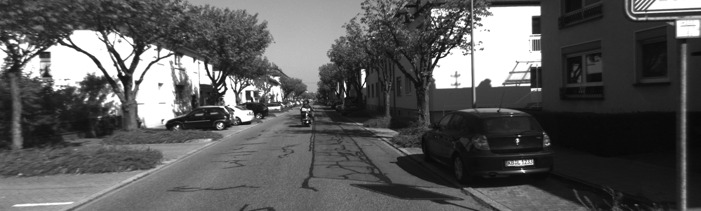
  
  right
  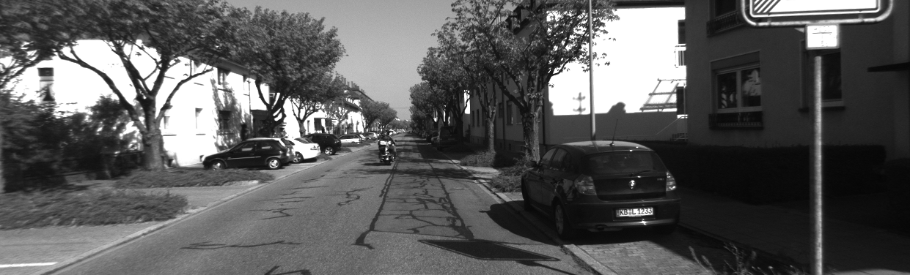
  
  gray-scale show
  

  color map show
  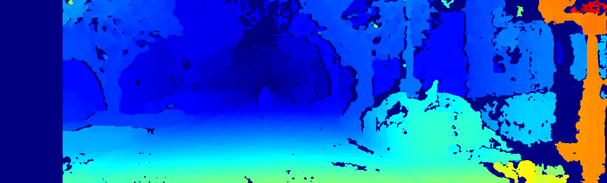

可以看到有比较多的空洞和视差不连续的地方，正常的流程中还包括一步视差图滤波后处理(weighted least square filtering)

opencv接口

```
wls_filter = createDisparityWLSFilter(left_matcher);
wls_filter->filter(left_disp,left,filtered_disp,right_disp);

```

应用滤波之后:

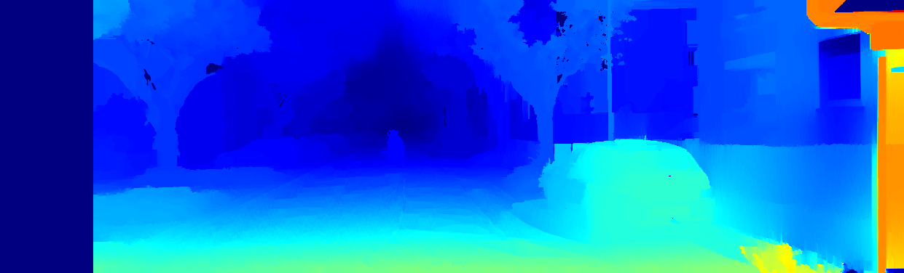

Reference: "Fast Global Image Smoothing Based on Weighted Least Squares", 大意是使用加权最小二乘算法进行优化，使得图像全局平滑的同时能够进行边缘的保持, 与双边滤波的整体功能相近, 可以看到在经过后处理后，视差图更加平滑，轮廓更加清晰

* 利用开源的monodepth,不加任何参数修改的进行训练，然后推断上面图片对应的深度结果(https://github.com/OniroAI/MonoDepth-PyTorch)：

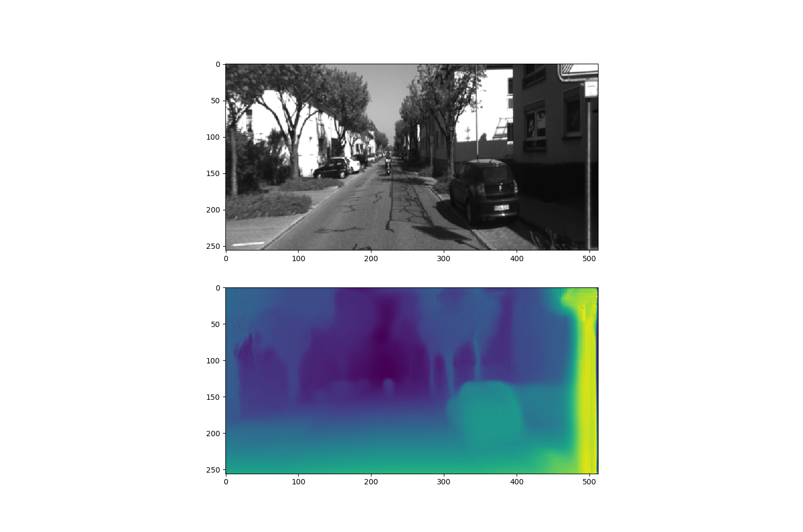

从上图中可以看出，在整体表现上，深度学习方法要优于传统方法(The overall performance outperforms by a larger marjin then traditional SGM method)

* **

* SGM整个算法流程如下:
  1. Census-Transform 将原始图像转换为census图像，为了便于匹配代价体计算
  2. Compute-Cost 通过两幅census图像进行初始的匹配成本计算
  3. Cost-Aggregation 代价体聚合， 'key step'
  4. Compute-Disparity 基于聚合后的代价体进行每个像素的视差值计算
  5. LR-Check 左右视差一致性检查 (optional)
  6. Remove-Sparkles 零散的斑点移除(optional)
  7. Fill-Holes 空洞填充（optional）
  8. Middle-Filter 中值滤波去噪平滑

  其中1-4是基本步骤， 5-8为视差优化步骤

分别对每一步进行阐述：

1. **census transform**
    H 老爷子最早的匹配代价选择的是MI(互信息)，但相对于census-transform其计算效率比较低，所以主流方式变成了census变换. 所谓census image就是通过census-transform将原始图像逐像素变换得到的，每个像素的census值是明暗相对关系比较的一个比特串。 ok, 以一个例子简单说明，加入选择的census的窗口是3*3, 有这样的一个小的image patch: 

                         [1, 4, 6] 
                         [2, 5, 8]
                         [1, 9, 3]

  那中间像素5的census值为(110100101), 这个二进制比特串所代表的十进制数字421就是对应的census image的像素值. 所有经过census变换后可以分别得到左图的census image和右图的census image

  reference: https://www.cnblogs.com/riddick/p/7295581.html

2. **compute cost 匹配代价成本计算**

    这一步的过程主要是为了构建初始代价立方体，注意是三维的立方体
    ```
    print(cost_init_.shape)
    [D, H, W]
    ```
    其中D为disparity range, H为图像高度，W为图像宽度

    ok,现在的输入是census_left, 一个二维矩阵， census_right, 一个二维矩阵，想要的输出是cost_init, 一个三维矩阵， 如何构造，不失一般性的公式如下：

   ​                            ***cost_init[k, j, i] = hamming_dist(census_left[j, i], census_right[j, i - k])***

    计算当前像素在每个视差下的汉明距离作为度量，这里汉明距离的计算有个面试点分享给有需要的同学：
    ```
    int SGMUtils::hamming_dist(const unsigned int census_x, const unsigned int census_y){
      int dist = 0;
      int val = census_x ^ census_y;
      while(val) {
        dist++;
        val &= (val - 1);
      }
      return dist;
    }
    ```
     <div align="center"> 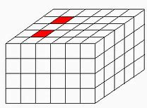 </div>
　　          cost_init_volume(代价立方体)

横方向代表图像列，纵方向代表图像行，朝里的方向代表深度范围， 当代价体构造好之后，如果不进行关键的代价聚合， 也可以进行视差计算， 这里先跳过代价聚合，直接基于代价体进行视差计算.

4. **compute-disparity**

    视差计算的方法很直观，对于代价体中的每个像素，在视差方向进行遍历，当前像素的视差满足对应的代价最小这一原则，三重循环过后，可以生成相应的视差图，也就是所谓的WTA（winner take all）准则。经过上面简单的几步， 可以获得如下的结果，来自明德学院的经典的左右样图:

<center class="half">
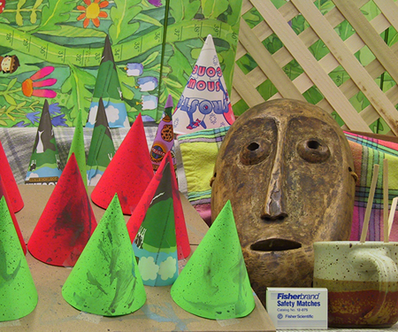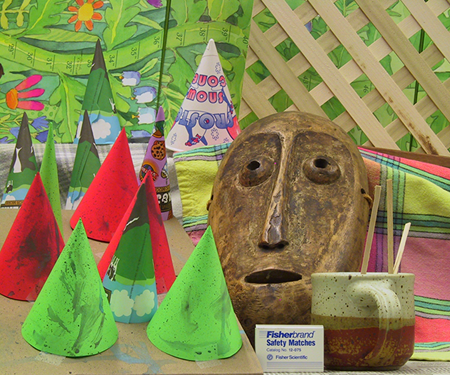
</center>
<div align="center"> 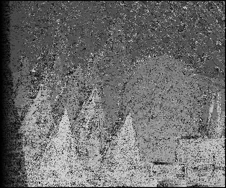 </div>

3. 代价聚合

    现在讨论下最关键的代价聚合步骤，这一步是sgm的灵魂，先看下效果
<div align="center"> 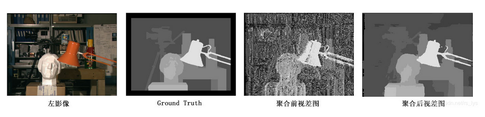 </div>
    目前常用的代价聚合有4path聚合和8path聚合， 4路聚合包括从上到下， 从下到上， 从左往右， 从右往左， 8路聚合增加了45度方向和135度方向的聚合路径，路径聚合的目的就是不仅考虑局部的代价信息， 还要加入全局的平滑信息，只是用多个方向一维的聚合来对二维进行近似，精度相似，效率大幅度提升（这句话是否很多时候都可以听到）

以四路聚合为例，会分别得到四个聚合的代价立方体，将其相加得到最终的代价立方体：
```
for(sint32 i =0;i<size;i++) {
    	cost_aggr_[i] = cost_aggr_1_[i] + cost_aggr_2_[i] + cost_aggr_3_[i] + cost_aggr_4_[i];
    	if (option_.num_paths == 8) {
            cost_aggr_[i] += cost_aggr_5_[i] + cost_aggr_6_[i] + cost_aggr_7_[i] + cost_aggr_8_[i];
        }
    }

这里的size = width * height * disparity_range    
```

以1路聚合，方向从左到右为例，看看如何得到其对应的代价立方体

代价立方体某一元素的计算公式：
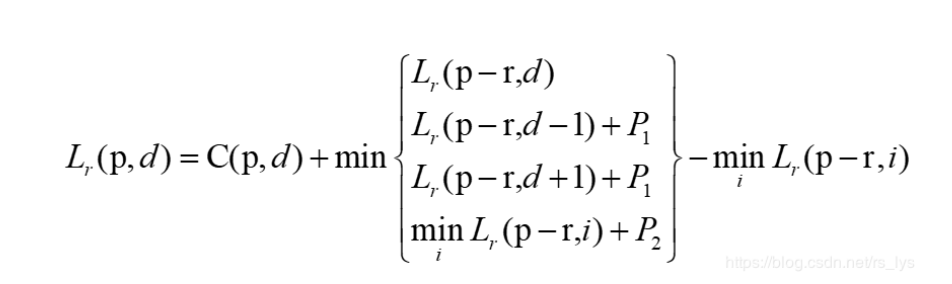

其中p代表像素位置， d代表视差值， r是移动的路径，在当前例子中为从左到右，所以当前的Lr 为代码中的cost_aggr_1_, 代表聚合后的代价立方体，Ｃ为初始代价立方体， 公式的含义翻译成中文就是：

聚合后的代价立方体中像素p,视差d位置处的值 = 这个位置的初始代价值 + min(L1, L2, L3, L4) - L4 

其中：
* L1 代表当前立方体像素p-r处，视差d位置处的值，在从左到右的例子中则代表当前像素左侧的像素

* L2 代表同样的左侧像素， 但视差为d-1位置处的代价值， 再加上p1惩罚项 （小小的对视差变化1进行惩罚）

* L3 代表同样的左侧像素， 视差为d+1位置处的代价值，再加上p1惩罚项 （小小的对视差变化1进行惩罚）

* L4 代表同样的当前像素的左侧像素，所有视差位置（disparity channel）中的代价最小值， 再加上p2惩罚项 （视差变化较大， 对应大一点的惩罚）

其中

```
                              p2 = p2_init / (I(p) - I(p-r))
```

灰度变化越大，相应的惩罚会越小， 为什么呢?

* 在物体的边界处，深度会发生很大变化，对应的视差也会发生很大变化，这时候的惩罚应该要小一点，所以要除以灰度的变化值来抑制惩罚项。这样设计的聚合代价不仅包括了原始匹配代价，也包括了视差变化(平滑项的代价)


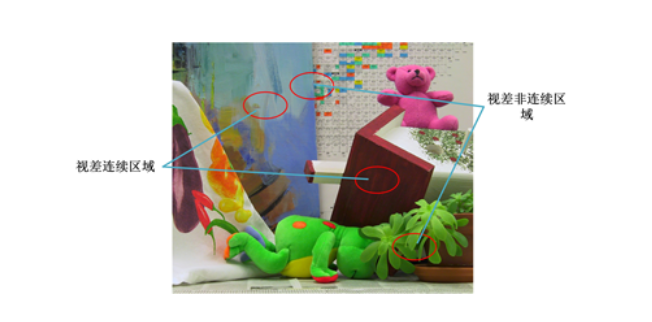

经过上面的一通操作，可以得到最终想要的聚合代价立方体，然后基于代价立方体再进行后面的最优视差计算等。说完了代价聚合的整个过程，再看看理论上为何要做这个？与全局算法相似，sgm希望能做到全局最优，意味着希望当每个像素的视差值确定之后，整体上的能量函数达到最优：

```
​                                   E(d) = E_data(d) + E_smooth(d)
```

其中第一项是匹配代价能量，第二项是表面连续性的平滑约束

所以核心问题就是如何求解这个二维最优问题，SGM没有直接求解，采用了单方向聚合一维近似的方法求解，也可以理解为一种一维的动态规划.


只经过从左到右的一路聚合，形成的视差图如下:

<div align="center"> 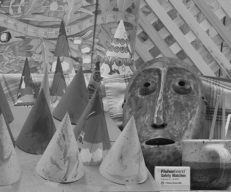 </div>
<div align="center"> 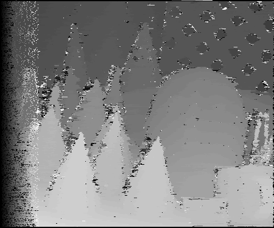 </div>
只作四路聚合后的视差图:

<div align="center"> 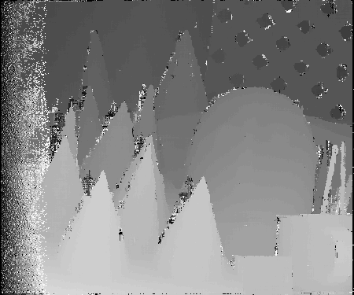 </div>
相比于不进行代价聚合，可以看到聚合这一灵魂一步的巨大作用. 一般来说，追求效率的话四路就足够了，若希望能够更好的效果，则可以选择8路聚合。可以看到经过聚合后，已经有了基本的样子，后续的所有操作都是对聚合后的视差图进行优化处理，优化处理中的很多步骤都可以根据实际情况进行合理的取舍. OK, 现在可以进入繁杂细碎的视差优化处理阶段

**5 -- 8 视差优化**

视差优化的目的：提高视差精度,剔除错误视差,使得视差值精确,可靠

2-4均是为了剔除掉错误视差，同时要保持左右一致性和唯一性。加入视差图的中值滤波可以去掉视差噪声,采用双边滤波也可以,可以同时保持边缘的精度,但效率稍低

视差优化部分包括的子模块：

* **子像素拟合**
  3个点 （x1, y1）, (x2, y2), (x3, y3)抛物线拟合，求最小值或最大值 （初1数学）,高考后，数学回到了小学水平。。。

* **左右一致性检查**

 LR check, 左右影像同名像素的视差应该一致， 若二者的差大于一定的阈值，则将这一像素的视差置为无效值
```
dl = Left_Disparity(i,j)
dr = Right_Disparity(i, j - dl)
```

左右一致性检查的图形含义为:
<div align="center"> 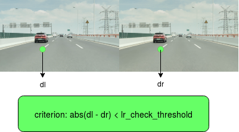 </div>

下图为monodepth中的左右一致性损失，不同于SGM中同名点像素距离损失，monodepth等深度学习方法采用的是根据右目图像和左目视差生成虚拟左目，和真实的左目构造灰度域（appearence）上的loss，类似于slam中的直接法中的光度误差

<div align="center"> 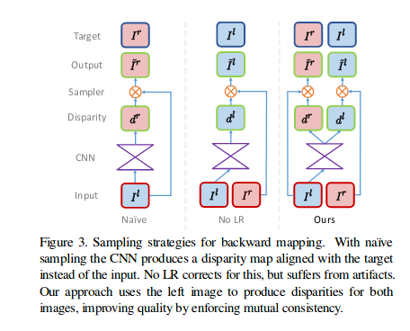 </div>

​    问题来了，右视差图如何生成?
​    1) 通过左影像聚合代价立方体生成右影像聚合代价立方体 

```
             right_cost_aggr[d, h, w] = left_cost_aggr[d, h ,w+d]
```
​    2) 根据右影像聚合代价立方体生成右影像视差图， 如步骤4

* 唯一性约束(ratio test)
  ratio = best_score / second_score
  如果唯一性没有那么的显著，则将当前视差值置为无效值

​      note: 这也是特征点匹配中常用的一种鲁棒化策略, 其对应的图形含义为:

<div align="center"> 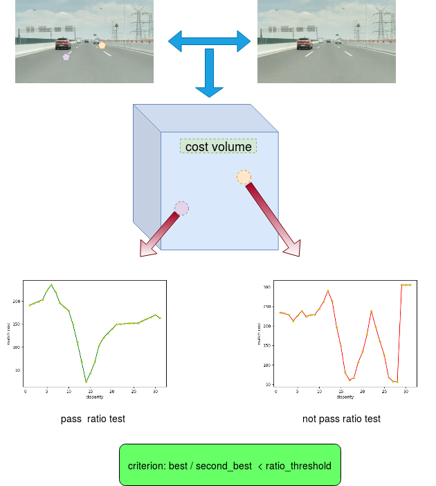 </div>

* 小连通区域剔除 
<div align="center"> 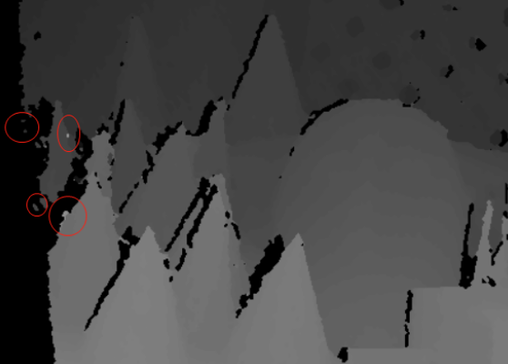 </div>
  存在一些小的连通域，与物体的整体视差很不协调，这样的连通域，一般的滤波又很难弄掉它，所以使用一种区域跟踪的方法，寻找灰度变化在一定范围内的区域，这样的区域面积如果小于一定的阈值，则将区域内的所有像素的视差置为无效值

​       method: 深度优先遍历，寻找连通区域 (DFS)

* 中值滤波
  去掉不合群的值 (middle filter)

* 弱纹理区优化

* 空洞填补（视差填充）
  按照实际的需求来确定是否需要进行视差填充, 如果要求每个像素都尽量精确, 而不要求完整,那就不需要做视差填充,如果要求视差图完整,而对精确性要求不高,那就需要做视差填充.区分遮挡区域和误匹配区域，对于遮挡区域，用背景像素的视差进行填充，对于误匹配区域，取周围视差的中值

  * 和monodepth等学习方法的比较
  <div align="center"> 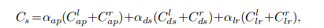 </div>

  loss项总共有3项, 第一项appearance matching loss:
  
  <div align="center"> 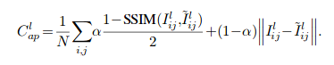 </div>

光度误差 + 结构相似度误差，本质上和sgm中汉明距离的匹配代价是等效的。


第二项Disparity Smooth Loss:
<div align="center"> 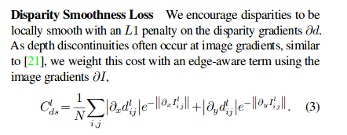 </div>


  从公式中可以定性的看出 平滑性loss与视差的变化成正比，与图像的梯度成指数反比,公式所阐述的现实物理含义是不希望在平坦区域视差会有大的变化，但又不能压制在物体边界区域视差应该有较大的突变这样一个事实，sgm中的灵魂一步“代价聚合”不就做的是这样一件事情么？

　　

　　第三项Left-Right Disparity Consistency Loss:
<div align="center"> 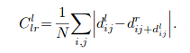 </div>


　　sgm中的左右一致性检查在monodepth里面得到的应用


看了上面的几个技术点的比较，是否觉得所谓的monodepth也只是sgm技术集中的子集，在深度学习的背景下，采用各种方式对sgm中的东西进行包装，使其能够运行在学习的范式之下，从而能够以巨量参数的形式对深度进行估计。借助于深度学习强大的表达能力，视差估计的精度显著提升。但不可否认，深度学习方法可能会存在一些泛化性问题

* loss 层面的tight fuse

同时monodepth有很多sgm中的东西没有包装，是否有进一步发展的可能？同时我们也可以看到，推出monodepth2的组织nianticlabs(https://github.com/nianticlabs)去年也推出了新的改进版本，depth hints,(https://arxiv.org/pdf/1909.09051.pdf)，通过在训练过程中融合sgm的监督信息，更好的深度估计结果:

<div align="center"> 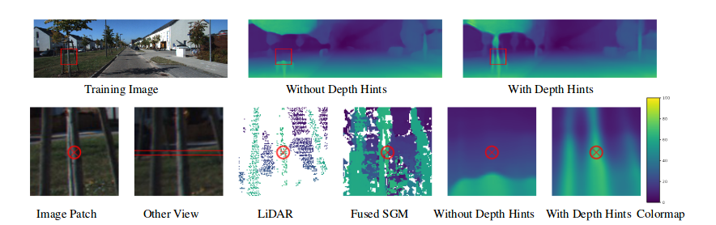 </div>

<div align="center"> 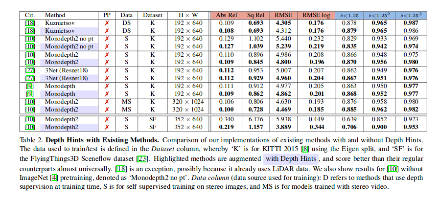 </div>

* **

以上是关于立体匹配的个人简单总结，如果对您的工作研究产生帮助，将是我最大的荣幸，有任何问题，欢迎与我联系。

cell phone: 13162517010 \
email: candyguo_fly@163.com