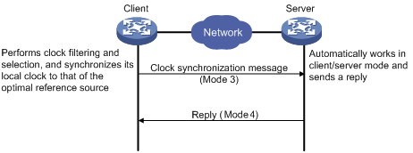
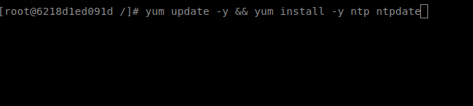

 

# How Can I configure a NTP Client?

Recently I had this problem, where a Linux Server was with the date out of date.

The Ntp or Network Time Protocol is a service that synchronized with Ntp Server get the right time.

<h1 align="center">Example</h1>
<p align="center">
  
</p>

## Installation ##

The Ntp can be installed by using various package managers like BSD, Linux, Windows and MacOS.

I'm going to do a example with Linux because I prefer.

```bash
$ yum -y update && yum install -y ntp ntpdate
```
#### Picture with example:

  

In this case I'm using the Centos version 7 running in [Docker](https://www.docker.com/why-docker).

Ok, is it configurable?

Yes!!


## Where Can I Configure?

```bash
$ vim /etc/ntp.conf
```

Search by line with server text, for example:

`server 0.centos.pool.ntp.org iburst`

So, Let's change this information.

```bash
$ sed -i 's/.\.centos.pool.ntp.org/a.ntp.br/g' /etc/ntp.conf
```

Basically, this command replace centos ntp server per brazil ntp server because I\'m from Brazil :).

**Command Description:**
**-i** = Edit file in place.
**s/from/to/g** = Replace texto into from to text after /.

#### Ok, Will We Apply the rules?

## Applying

```bash
$ ntpdate a.ntp.br #Same server that is into ntp.conf..
```

The command ntpdate does a "brute force" for apply immediately the sinchronization with Brazil NTP Server.

```bash
$ systemctl start ntpd.service
```

This command start the ntp service.

# References

[tldp](https://www.tldp.org/LDP/sag/html/basic-ntp-config.html)
[geekdiary](https://www.thegeekdiary.com/centos-rhel-how-to-configure-ntp-server-and-client/)

Thanks :D