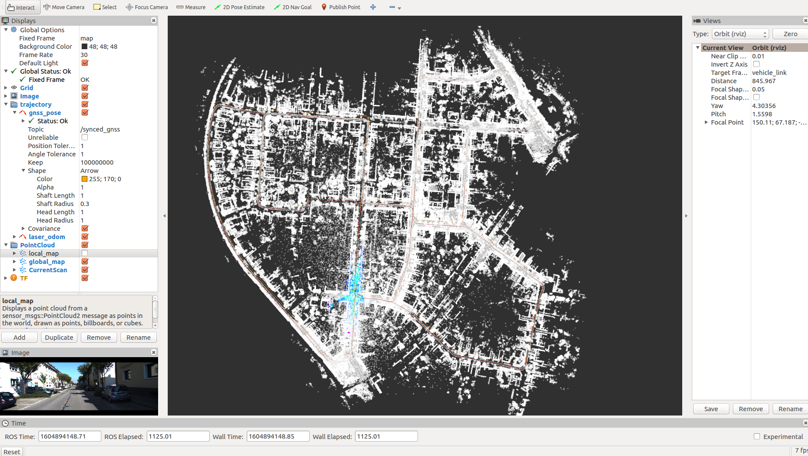

lidar slam study note
------

### INTRODUCTION
最近阅读了知乎上任乾大佬的“从零开始做自动驾驶定位”专栏文章，学习到很多东西，这里对其内容记录一些学习心得。总体上说，任佬的系列文章从0到1的讲述了利用激光传感器进行建图和定位的全过程，代码上具有扩展性并且分模块进行开发，通过ros系统进行不同节点的消息通信，每个节点都有对应的模块的工作流，在工作流中调用相应模块的核心算法。模块包括了数据预处理节点，前端激光里程计节点，后端图优化节点，回环检测节点，可视化地图发布节点，相当于是一种多进程的并行处理，下面对每部分进行详细介绍。

####数据预处理模块

```c++
int main(int argc, char *argv[]) {
    google::InitGoogleLogging(argv[0]);
    FLAGS_log_dir = WORK_SPACE_PATH + "/Log";
    FLAGS_alsologtostderr = 1;

    ros::init(argc, argv, "data_pretreat_node");
    ros::NodeHandle nh;

    std::string cloud_topic;
    nh.param<std::string>("cloud_topic", cloud_topic, "/synced_cloud");

    std::shared_ptr<DataPretreatFlow> data_pretreat_flow_ptr = std::make_shared<DataPretreatFlow>(nh, cloud_topic);

    ros::Rate rate(100);
    while (ros::ok()) {
        ros::spinOnce();

        data_pretreat_flow_ptr->Run();

        rate.sleep();
    }

    return 0;
}
```
可以看到其主体就是不断的订阅rosbag发布的消息，然后交给DataPretreatFlow进行处理，数据预处理模块所做的工作主要是订阅如下消息：
1. /kitti/velo/pointcloud 点云消息
2. /kitti/oxts/imu imu消息
3. /kitti/oxts/gps/vel 速度消息
4. /kitti/oxts/gps/fix gnss消息

发布如下消息：
1. /synced_cloud 运动畸变补偿后的点云消息
2. /synced_gnss 时间同步后的gnss消息（transformation）

数据预处理流的基本流程如下
```c++
bool DataPretreatFlow::Run() {
    if (!ReadData())
        return false;

    if (!InitCalibration()) 
        return false;

    if (!InitGNSS())
        return false;

    while(HasData()) {
        if (!ValidData())
            continue;

        TransformData();
        PublishData();
    }

    return true;
}
```
1. 订阅器解析消息到数据队列，将除点云外的其他数据（imu, velocity, gnss）做时间同步
2. 获取lidar到imu之间的外参变换矩阵，以便将pose, 速度转到lidar坐标系下
3. 利用GeographicLib将gnss坐标系转换为以第一个gnss坐标为原点的局部笛卡尔坐标系
4. when当前要处理的同步后的数据队列(cloud_data_buff, imu_data_buff, velocity_data_buff, gnss_data_buff)中含有数据的时候，对数据进行变换.将gnss pose，velocity从imu坐标系变换为lidar坐标系, 根据匀速模型进行点云运动补偿
5. 发布去除运动畸变的点云数据和gnss pose(lidar 相对于世界的pose)

其中运动补偿功能根据匀速模型对点云进行畸变补偿，即将一帧点云的坐标点转换到同一时刻，如将0-100ms的一帧扫描点云转换到50ms的地方。补偿的核心代码如下：

```c++
    for (size_t point_index = 1; point_index < origin_cloud_ptr->points.size(); ++point_index) {
        float orientation = atan2(origin_cloud_ptr->points[point_index].y, origin_cloud_ptr->points[point_index].x);
        if (orientation < 0.0)
            orientation += 2.0 * M_PI;
        
        if (orientation < delete_space || 2.0 * M_PI - orientation < delete_space)
            continue;

        float real_time = fabs(orientation) / orientation_space * scan_period_ - scan_period_ / 2.0;

        Eigen::Vector3f origin_point(origin_cloud_ptr->points[point_index].x,
                                     origin_cloud_ptr->points[point_index].y,
                                     origin_cloud_ptr->points[point_index].z);

        Eigen::Matrix3f current_matrix = UpdateMatrix(real_time);
        Eigen::Vector3f rotated_point = current_matrix * origin_point;
        Eigen::Vector3f adjusted_point = rotated_point + velocity_ * real_time;
        CloudData::POINT point;
        point.x = adjusted_point(0);
        point.y = adjusted_point(1);
        point.z = adjusted_point(2);
        output_cloud_ptr->points.push_back(point);
    }
```
对于每个扫描点，计算其平面坐标系x, y计算其扫描角，根据其扫描角度计算以中间时刻为原点的补偿时间，根据时间，速度，角速度计算补偿的旋转矩阵和平移向量，最后根据旋转平移对坐标系进行变换得到补偿后的点云，利用补偿后的点云进行后续的pose的计算

####前端激光里程计模块

顾名思义，其作用就是输入序列点云数据，输出激光里程计pose,其订阅"/synced_cloud"消息，发布/laser_odom消息，前端里程计的思路也比较简单，即将当前点云和局部地图进行匹配求解pose,匹配方法可以是icp, ndt或各种变种方法，当然也可以用其他现成的激光里程计方法，如LOAM及其各种变种方法，局部地图是前端维护的关键帧窗口，是匹配时的target pointcloud,核心代码如下：
```c++
bool FrontEnd::Update(const CloudData& cloud_data, Eigen::Matrix4f& cloud_pose) {
    current_frame_.cloud_data.time = cloud_data.time;
    std::vector<int> indices;
    pcl::removeNaNFromPointCloud(*cloud_data.cloud_ptr, *current_frame_.cloud_data.cloud_ptr, indices);

    CloudData::CLOUD_PTR filtered_cloud_ptr(new CloudData::CLOUD());
    frame_filter_ptr_->Filter(current_frame_.cloud_data.cloud_ptr, filtered_cloud_ptr);

    static Eigen::Matrix4f step_pose = Eigen::Matrix4f::Identity();
    static Eigen::Matrix4f last_pose = init_pose_;
    static Eigen::Matrix4f predict_pose = init_pose_;
    static Eigen::Matrix4f last_key_frame_pose = init_pose_;

    // 局部地图容器中没有关键帧，代表是第一帧数据
    // 此时把当前帧数据作为第一个关键帧，并更新局部地图容器和全局地图容器
    if (local_map_frames_.size() == 0) {
        current_frame_.pose = init_pose_;
        UpdateWithNewFrame(current_frame_);
        cloud_pose = current_frame_.pose;
        return true;
    }

    // 不是第一帧，就正常匹配
    CloudData::CLOUD_PTR result_cloud_ptr(new CloudData::CLOUD());
    registration_ptr_->ScanMatch(filtered_cloud_ptr, predict_pose, result_cloud_ptr, current_frame_.pose);
    cloud_pose = current_frame_.pose;

    // 更新相邻两帧的相对运动
    step_pose = last_pose.inverse() * current_frame_.pose;
    predict_pose = current_frame_.pose * step_pose;
    last_pose = current_frame_.pose;

    // 匹配之后根据距离判断是否需要生成新的关键帧，如果需要，则做相应更新
    if (fabs(last_key_frame_pose(0,3) - current_frame_.pose(0,3)) + 
        fabs(last_key_frame_pose(1,3) - current_frame_.pose(1,3)) +
        fabs(last_key_frame_pose(2,3) - current_frame_.pose(2,3)) > key_frame_distance_) {
        UpdateWithNewFrame(current_frame_);
        last_key_frame_pose = current_frame_.pose;
    }

    return true;
}
```
首先去除当前点云中的异常值并进行过滤，如果是第一帧，则把当前数据置为关键帧（UpdateWithNewFrame）,对于其他帧则进行scanMatch(如ndt::align)计算当前帧的pose,然后更新运动模型以获得下一帧的预测值，同时根据当前帧的pose以及上一关键帧的pose进行关键帧判断。
关键帧的生成和局部地图的构建如下：
```c++
bool FrontEnd::UpdateWithNewFrame(const Frame& new_key_frame) {
    Frame key_frame = new_key_frame;
    // 这一步的目的是为了把关键帧的点云保存下来
    // 由于用的是共享指针，所以直接复制只是复制了一个指针而已
    // 此时无论你放多少个关键帧在容器里，这些关键帧点云指针都是指向的同一个点云
    key_frame.cloud_data.cloud_ptr.reset(new CloudData::CLOUD(*new_key_frame.cloud_data.cloud_ptr));
    CloudData::CLOUD_PTR transformed_cloud_ptr(new CloudData::CLOUD());
    
    // 更新局部地图
    local_map_frames_.push_back(key_frame);
    while (local_map_frames_.size() > static_cast<size_t>(local_frame_num_)) {
        local_map_frames_.pop_front();
    }
    local_map_ptr_.reset(new CloudData::CLOUD());
    for (size_t i = 0; i < local_map_frames_.size(); ++i) {
        pcl::transformPointCloud(*local_map_frames_.at(i).cloud_data.cloud_ptr, 
                                 *transformed_cloud_ptr, 
                                 local_map_frames_.at(i).pose);

        *local_map_ptr_ += *transformed_cloud_ptr;
    }

    // 更新ndt匹配的目标点云
    // 关键帧数量还比较少的时候不滤波，因为点云本来就不多，太稀疏影响匹配效果
    if (local_map_frames_.size() < 10) {
        registration_ptr_->SetInputTarget(local_map_ptr_);
    } else {
        CloudData::CLOUD_PTR filtered_local_map_ptr(new CloudData::CLOUD());
        local_map_filter_ptr_->Filter(local_map_ptr_, filtered_local_map_ptr);
        registration_ptr_->SetInputTarget(filtered_local_map_ptr);
    }

    return true;
}
```
其主要工作就是维护局部地图，将局部地图作为前端匹配的目标点云, 如下图为ndt点云匹配里程计的一个结果：


####后端建图
前端激光里程计提供了帧间的相对约束，这些约束会被发送给后端，放到优化的因子图里，任佬的后端主要包括三种因子，一种帧间的里程计约束，一种gnss的先验约束，一种检测到的回环约束，总体而言就是一个典型的pose-graph优化问题。
其接收的输入消息为：
1. /sync_cloud 点云消息（后端会将关键帧点云存到硬盘里）
2. /sync_gnss 同步的gnss消息
3. /laser_odom　激光里程计消息（因子图中要添加的帧间约束）
4. /loop_pose 回环的消息（当前帧，回环帧，相对pose）

其计算输出的发布消息为:
1. /transformed_odom gnss坐标系下的pose
2. /key_frame　最新的关键帧消息(pose, index, time)
3. /key_gnss　最新的gnss消息
4. /optimized_key_frames 后端优化后的关键帧序列

后端流程依然是读取相应的数据消息，将当前帧的点云数据，laser_odom数据以及gnss_pose数据交给后端进行处理，最后发布处理后的结果，其核心算法代码如下：
```c++
bool BackEnd::Update(const CloudData& cloud_data, const PoseData& laser_odom, const PoseData& gnss_pose) {
    if (MaybeNewKeyFrame(cloud_data, laser_odom, gnss_pose)) {
        AddNodeAndEdge(gnss_pose);
        
        if (MaybeOptimized()) {
            SaveOptimizedPose(); // save backend optimized pose
        }
    }

    return true;
}
```
首先只将关键帧加入optimize graph,根据距离进行关键帧判别，如果是关键帧，则：
```c++
    if (has_new_key_frame_) {
        // 把关键帧点云存储到硬盘里
        std::string file_path = key_frames_path_ + "/key_frame_" + std::to_string(key_frames_deque_.size()) + ".pcd";
        pcl::io::savePCDFileBinary(file_path, *cloud_data.cloud_ptr);

        KeyFrame key_frame;
        key_frame.time = laser_odom.time;
        key_frame.index = (unsigned int)key_frames_deque_.size();
        key_frame.pose = laser_odom.pose;
        key_frames_deque_.push_back(key_frame);
        current_key_frame_ = key_frame;

        current_key_gnss_.time = gnss_odom.time;
        current_key_gnss_.index = key_frame.index;
        current_key_gnss_.pose = gnss_odom.pose;
    }
```
即将关键帧点云存到disk上，pose等信息存到关键帧队列中，并同时设置current_key_frame_和current_key_pose_,用于后续factor graph的node和edge的插入，分别添加关键帧节点，激光里程计对应的边，gnss位置的先验边以及loop closure edge.当满足优化条件的时候（一定的关键帧个数，一定的loop个数，一个gnss测量个数），进行优化：
```c++
bool G2oGraphOptimizer::Optimize() {
    static int optimize_cnt = 0;
    if(graph_ptr_->edges().size() < 1) {
        return false;
    }

    TicToc optimize_time;
    graph_ptr_->initializeOptimization();
    graph_ptr_->computeInitialGuess();
    graph_ptr_->computeActiveErrors();
    graph_ptr_->setVerbose(false);

    double chi2 = graph_ptr_->chi2();
    int iterations = graph_ptr_->optimize(max_iterations_num_);

    LOG(INFO) << std::endl << "------ 完成第 " << ++optimize_cnt << " 次后端优化 -------" << std::endl
              << "顶点数：" << graph_ptr_->vertices().size() << ", 边数： " << graph_ptr_->edges().size() << std::endl
              << "迭代次数： " << iterations << "/" << max_iterations_num_ << std::endl
              << "用时：" << optimize_time.toc() << std::endl
              << "优化前后误差变化：" << chi2 << "--->" << graph_ptr_->chi2()
              << std::endl << std::endl;

    return true;
}
```
当优化完成的时候，将优化后的pose赋值给关键帧，得到优化之后的关键帧（当前因子图中的所有帧）并发布给其他需要订阅的模块

####回环检测模块
loop closure模块包括回环检测和匹配两步，将通过验证的回环关系发送给后端因子图中，以在满足条件的时候进行优化，且订阅的消息包括后端发布的关键帧消息和关键gnss消息：
1. /key_frame 关键帧消息
2. /key_gnss 关键帧对应的gnss消息
其计算的输出为：
1. /loop_pose (index0, index1, relative_pose)

回环检测负责计算距离当前关键帧最近的关键帧，但为了避免小回环，需要与当前帧相距一定的帧数，同时考虑到计算量，当检测到回环的时候，需要跳过一些帧再做回环检测；检测到关键帧之后需要进行配准，实现如下：
```c++
bool LoopClosing::CloudRegistration(int key_frame_index) {
    // 生成地图
    CloudData::CLOUD_PTR map_cloud_ptr(new CloudData::CLOUD());
    Eigen::Matrix4f map_pose = Eigen::Matrix4f::Identity();
    JointMap(key_frame_index, map_cloud_ptr, map_pose);

    // 生成当前scan
    CloudData::CLOUD_PTR scan_cloud_ptr(new CloudData::CLOUD());
    Eigen::Matrix4f scan_pose = Eigen::Matrix4f::Identity();
    JointScan(scan_cloud_ptr, scan_pose);

    // 匹配
    Eigen::Matrix4f result_pose = Eigen::Matrix4f::Identity();
    Registration(map_cloud_ptr, scan_cloud_ptr, scan_pose, result_pose);

    // 计算相对位姿
    current_loop_pose_.pose = map_pose.inverse() * result_pose;

    // 判断是否有效
    if (registration_ptr_->GetFitnessScore() > fitness_score_limit_)
        return false;
    
    static int loop_close_cnt = 0;
    loop_close_cnt ++;

    std::cout << "检测到闭环 "<<  loop_close_cnt
              << ": 帧" << current_loop_pose_.index0 
              << "------>" << "帧" << current_loop_pose_.index1 << std::endl
              << "fitness score: " << registration_ptr_->GetFitnessScore() 
              << std::endl << std::endl;
    return true;
}
```
首先根据检测到的关键帧索引生成匹配的局部地图（keyframe_index-extend_frame_num, keyframe_index+extend_frame_num）,生成的局部点云地图是gnss坐标系下拼接的一份点云，然后利用当前扫描生成当前坐标系下的点云，通过点云匹配计算出相对位姿，将最终形成的loop(keyframe_index, current_index, relative_pose)发送给后端加入到因子图中即可。加入回环可以有效的降低重影误差，因为其目标函数就是最小化重影误差，有效的提高建图的一致性。如下图是回环校正的一个过程：


可以看到经过校正后回环误差得到了有效的矫正

###可视地图发送模块
经过前后端的处理，会生成当前scan, local map和global map,将这些信息处理发布给rviz，通过rviz进行显示，可视化方便结果的显示与调试
其订阅的输入为：
1. /synced_cloud 当前帧扫描点云
2. /key_frame 后端处理的关键帧
3. /transformed_odom gnss坐标系下的里程计
4. /optimized_key_frames 后端优化后的关键帧
其发布的输出为：
1. /optimized_odom　经过后端优化后的里程计
2. /current_scan
3. /local_map
4. /global_map

这里的pose修正代码或许有点问题，需要进一步分析（todo）

程序运行过程中可以随时调用save map这样的ros service来进行地图的保存，其调用的代码为：
```c++
bool Viewer::SaveMap() {
    if (optimized_key_frames_.size() == 0)
        return false;
    // 生成地图
    CloudData::CLOUD_PTR global_map_ptr(new CloudData::CLOUD());
    JointCloudMap(optimized_key_frames_, global_map_ptr);
    // 保存原地图
    std::string map_file_path = map_path_ + "/map.pcd";
    pcl::io::savePCDFileBinary(map_file_path, *global_map_ptr);
    // 保存滤波后地图
    std::shared_ptr<VoxelFilter> map_filter_ptr = std::make_shared<VoxelFilter>(0.5, 0.5, 0.5);
    map_filter_ptr->Filter(global_map_ptr, global_map_ptr);
    std::string filtered_map_file_path = map_path_ + "/filtered_map.pcd";
    pcl::io::savePCDFileBinary(filtered_map_file_path, *global_map_ptr);
    return true;
}
```
利用修正后的pose和储存在硬盘上的点云生成全局地图进行保存，同时可以保存滤波后的地图进行基于地图的定位

###matching模块
Matching模块完成的工作就是基于前述建立的点云地图进行lidar localization,实际上就是一个current_scan和local map进行配准的过程，local map是通过BoxCrop从全局地图中截取得到的。Matching模块完成的是定位工作，不需要后端优化建图，其全局地图是通过load的方式直接载入
其订阅的输入为：
1. /synced_cloud 当前扫描帧点云
2. /synced_gnss 同步的gnss消息

其输出为：
1. /global_map 载入的全局地图
2. /local_map　根据当前帧位置截取的局部地图
3. /current_scan
4. /laser_localization 激光相对于地图的定位信息（lidar relative to map）

局部地图截取的代码：
```c++
bool Matching::ResetLocalMap(float x, float y, float z) {
    std::vector<float> origin = {x, y, z};
    box_filter_ptr_->SetOrigin(origin);
    box_filter_ptr_->Filter(global_map_ptr_, local_map_ptr_);

    registration_ptr_->SetInputTarget(local_map_ptr_);

    has_new_local_map_ = true;

    std::vector<float> edge = box_filter_ptr_->GetEdge();
    LOG(INFO) << "new local map:" << edge.at(0) << ","
                                  << edge.at(1) << ","
                                  << edge.at(2) << ","
                                  << edge.at(3) << ","
                                  << edge.at(4) << ","
                                  << edge.at(5) << std::endl << std::endl;

    return true;
}
```
用一个立方体截取local map,作为匹配的目标点云。

其根据当前帧点云定位更新的方法如下：
```c++
bool Matching::Update(const CloudData& cloud_data, Eigen::Matrix4f& cloud_pose) {
    //去掉异常值　＋　cloud filter
    std::vector<int> indices;
    pcl::removeNaNFromPointCloud(*cloud_data.cloud_ptr, *cloud_data.cloud_ptr, indices);

    CloudData::CLOUD_PTR filtered_cloud_ptr(new CloudData::CLOUD());
    frame_filter_ptr_->Filter(cloud_data.cloud_ptr, filtered_cloud_ptr);

    static Eigen::Matrix4f step_pose = Eigen::Matrix4f::Identity();
    static Eigen::Matrix4f last_pose = init_pose_;
    static Eigen::Matrix4f predict_pose = init_pose_;

    if (!has_inited_) {
        predict_pose = current_gnss_pose_;
    }

    // 与地图匹配
    CloudData::CLOUD_PTR result_cloud_ptr(new CloudData::CLOUD());
    registration_ptr_->ScanMatch(filtered_cloud_ptr, predict_pose, result_cloud_ptr, cloud_pose);
    //根据pose将当前帧点云转换到全局坐标系下进行发布
    pcl::transformPointCloud(*cloud_data.cloud_ptr, *current_scan_ptr_, cloud_pose);

    // 更新相邻两帧的相对运动
    step_pose = last_pose.inverse() * cloud_pose;
    predict_pose = cloud_pose * step_pose;
    last_pose = cloud_pose;

    // 匹配之后判断是否需要更新局部地图
    std::vector<float> edge = box_filter_ptr_->GetEdge();
    for (int i = 0; i < 3; i++) {
        if (fabs(cloud_pose(i, 3) - edge.at(2 * i)) > 50.0 &&
            fabs(cloud_pose(i, 3) - edge.at(2 * i + 1)) > 50.0)
            continue;
        ResetLocalMap(cloud_pose(0,3), cloud_pose(1,3), cloud_pose(2,3));
        break;
    }

    return true;
}
```
比较多的使用了static的特性

Lidar map based lidar localization的示意图如下：


最后，感谢任佬（https://www.zhihu.com/people/ren-gan-16）的工作！！！