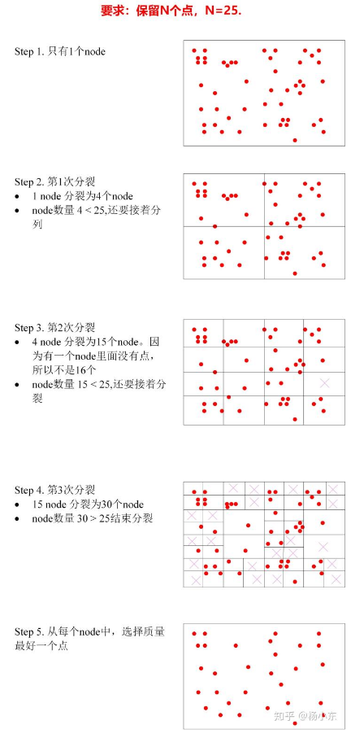
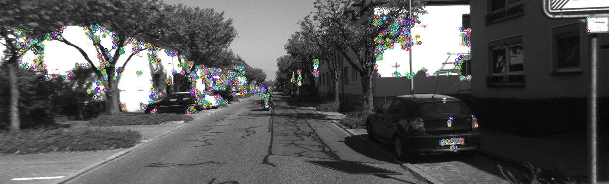
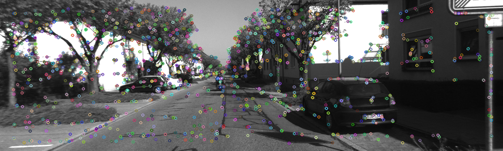

### ORBSLAM2解析 - Feature Extration

#### 特征提取

最近又看了一遍orbslam2的源代码，深感作者能力的强大，这里对其orb特征的提取做一次总结。知乎大神小葡萄(https://zhuanlan.zhihu.com/p/61738607)就这个东西已经做了很好的总结，我这里对照着代码再做一次知识的搬运工。

####orb特征的几个特性：
1. 尺度不变性: 首先计算图像金字塔，在一定范围内可以保证特征点的尺度不变性
2. 旋转不变性: 利用灰度质心法计算特征点的方向，然后在计算描述子的时候利用旋转后的邻域点对
3. 一定的光照不变性: fast提取和brief计算的时候都是灰度值相对大小的一个比较
4. 速度快，特征提取方法和描述子计算方法都远快于sift和surf
5. 抗噪能力，描述子计算的时候会对图像做高斯模糊，邻域点对灰度比较的时候会用周围区域的灰度而非单点灰度（orbslam2中没有这样用）

#### 其提取流程如下：
1. 金子塔计算
orbslam中对图像的每一个层级都会做特征提取，按照缩放尺度决定的等比数列的方式来确定每一层提取的特征点数目，最终每个特征点所包含的信息有（pt.x, pt.y, octave, angle, size）
```c++
    resize(mvImagePyramid[level-1],	//输入图像
            mvImagePyramid[level], 	//输出图像
            sz, 						//输出图像的尺寸
            0, 						//水平方向上的缩放系数，留0表示自动计算
            0,  						//垂直方向上的缩放系数，留0表示自动计算
            cv::INTER_LINEAR);		//图像缩放的差值算法类型，这里的是线性插值算法
```
根据缩放尺度构建mvImagePyramid

2. FAST提取特征点&四叉树均匀化
对每层图像的所有CELL(30 * 30的正方形)进行特征点提取，如果初始阈值无法提取到特征点则降低阈值进行提取，对于每一层提取到的特征点进行四叉树均匀化
```c++
        keypoints = DistributeOctTree(vToDistributeKeys, 			
									  minBorderX, maxBorderX,		
                                      minBorderY, maxBorderY,
									  mnFeaturesPerLevel[level],
									  level);            
```
四叉树均匀提取的过程如图所示（知乎小葡萄的图）：


每一次分裂是对当前所有节点的分裂，新分裂出来的节点会放到node列表的最前端，等待下一次的最先分裂，最终分裂退出后会从每个节点中选择响应最大的特征点加入到最终的特征点集合中

然后对提取出的特征点进行方向的计算（灰度质心法），从而得到特征点的所有信息

3. 描述子计算
对每层特征点计算其相应的描述子，描述子计算采用了Sterred BRIEF的方法，即根据特征点的角度对pattern中的点对进行旋转，再进行灰度的比较。但这种方向虽然让特征点的描述具有了旋转不变性，但也造成了性能的下降，不同特征的区分性变小。Rotation-Aware BRIEF貌似可以解决这个问题，用统计的方法选出了最好的256个点对

4. 将特征点坐标归到第０层
现在已经得到了每一层的特征点信息，将其他层的特征点按照scale归约到第零层，形成最终的特征点集合，最终得到所有的特征点和其对应的描述子

#### 提取结果
opencv orb extration:


orbslam2 orb extration:


可以看到特征点更加的均匀，有利于提高位姿解算的精度