文章解析
------

### Vision Global Localization with Semantic Segmentation and Interest Feature Points (IROS 2020)

文章作者来自阿里巴巴和oppo, 其中的定位算法在阿里物流无人配送车上得到了部署。

#### INTRODUCTION

视觉全局定位主要分为两类:

1. 使用全局地图的基于tracking & matching的非线性优化（如orbslam2中的localization mode)

   

2. 用于地点识别的端到端的learning network (posenet, hfloc等)

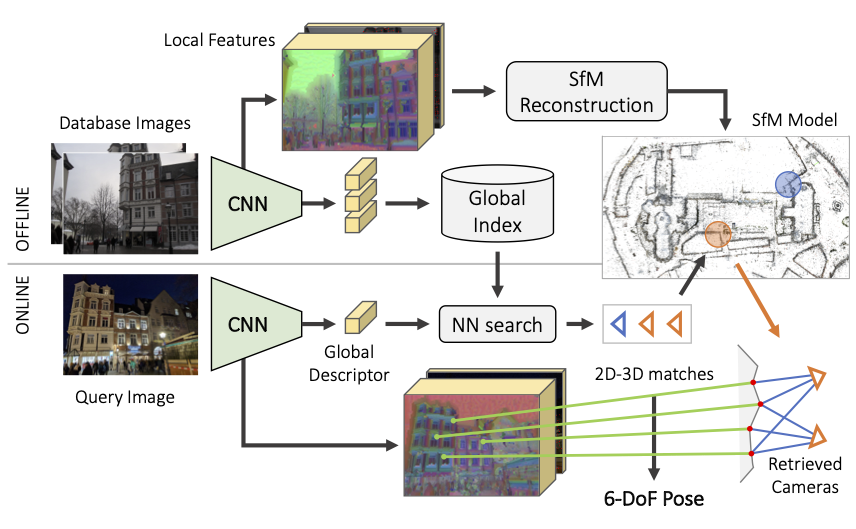

​                                                                                     - hfloc diagram -

作为传统方法，structure based的视觉定位方法也可以分为两类:

1. 将当前帧所提取到的特征和预先构建的地图做匹配，非常依赖于特征在不同条件下的重复度和一致性，以superpoint为代表的深度学习特征展现出了更好的鲁棒性和性能。

   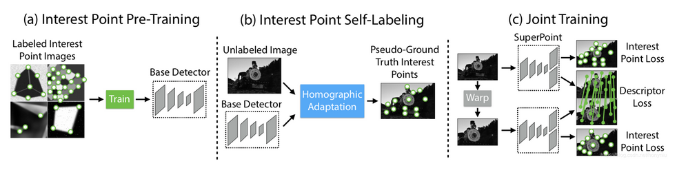

2. 使用语义分割特征来做定位估计的线索，特征相对鲁棒，但并非所有地方的语义信息都是丰富的，使得其应用场景受到了限制

   

考虑到语义分割特征的鲁棒性和兴趣特征点的广泛性，在状态估计的时候同时使用这两种特征的约束来进行鲁棒高精度的定位。

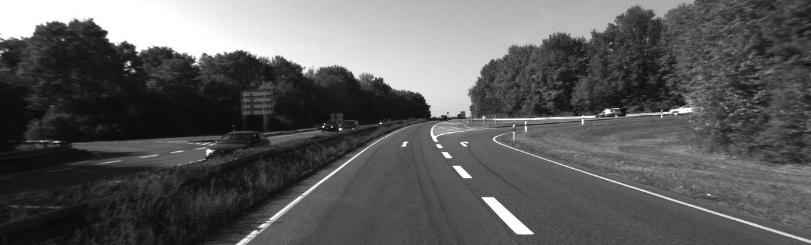

　　　　　　　　　　　　　　　- 语义特征充足，feature point特征不丰富 -

​                                                         - 语义特征缺失，feature point特征丰富 -

### METHOD OVERVIEW

首先对前视单目影像应用pixel-wise的语义分割来进行语义特征提取，如:

* pole-like objects

* lane-markings 

* curb，

这些high-level的特征对光照变化，视角变化是鲁棒的.　考虑到很多地方的语义特征并不丰富，

然后会在静态的场景上进行interest feature point的提取，同时也可以用语义分割的mask进行过滤。

由于同时使用了两种特征，需要建立地图的两个图层:

* 语义地图图层，通过lidar点云语义地图进行构建，
* 特征点地图图层，通过固定pose的SFM过程构建，这个fixed-pose可以来自高精度的INS系统，也可以来自相对于视觉精度更高的3D lidar slam系统。

最后整合两种特征的观测形成的残差，通过lm优化算法来求解使得cost最小的pose.

#### PIPELINE

整体流程图如下：
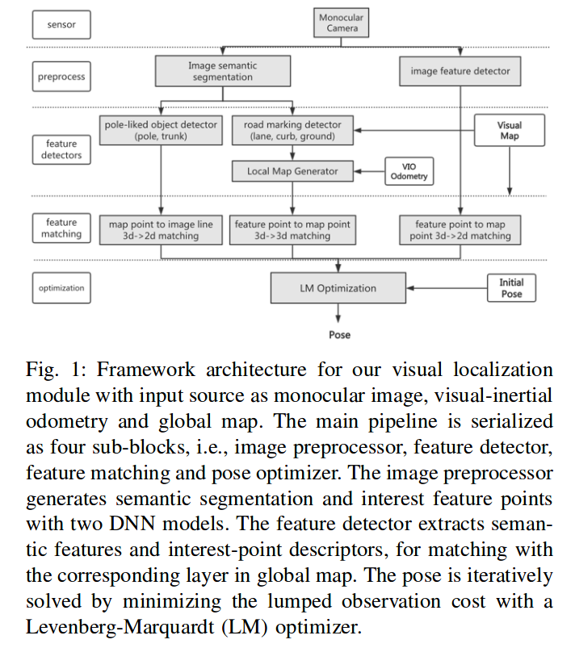

两个深度学习模型分别做特征点提取和语义分割，然后对不同的特征做不同的匹配和残差的构建，最后进行pose的优化求解

#### IMAGE PRE-PROCESS
因为使用的处理器是resource-confined,　需要网络efficient，同时要保持高的miou，分割网络选择了BiSeNet,　特征点检测和描述选择了superpoint.

BiSeNet Speed-accuracy diagram:

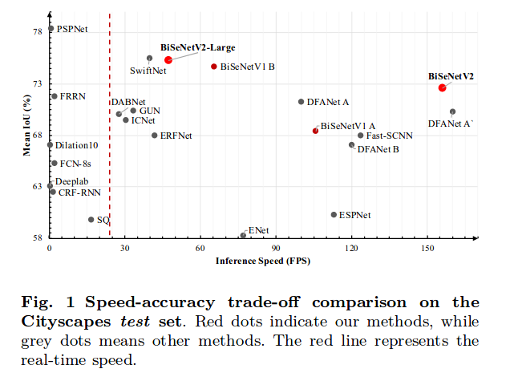

BiSeNet原始的网络架构图如下：
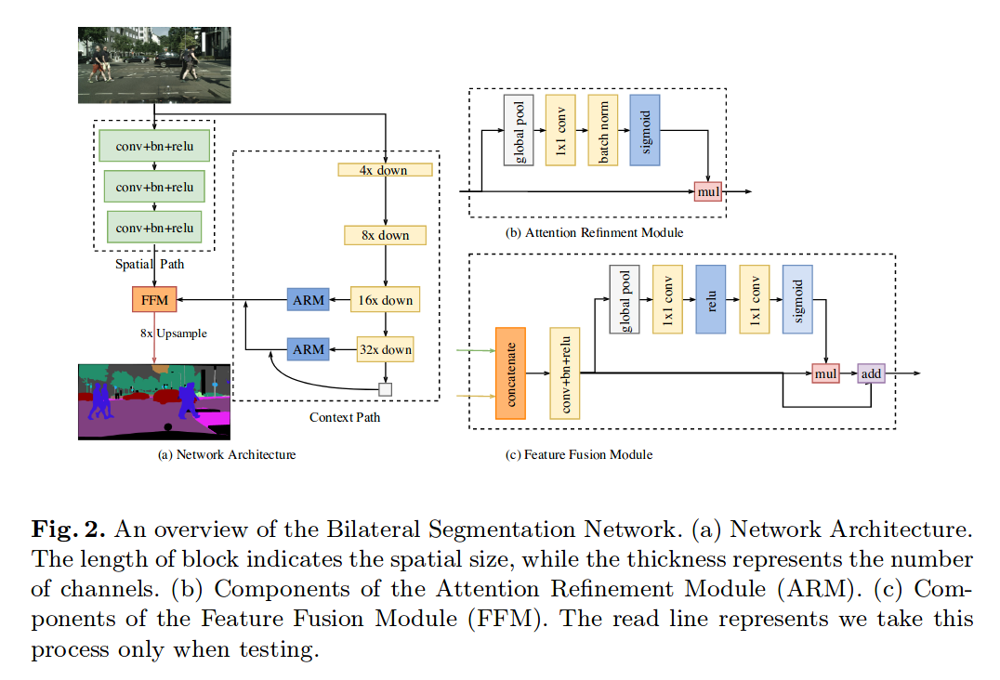

可以看到包含了两条路径:

1. spatial path

   spatial path是三个conv + bn + relu的组合，每个卷积的stride为２，最终输出的是原始图像分辨率1/8的feature map.spatial path编码丰富的空间信息

2. context path

   context path则提供足够的感受野(在语义分割中，感受野对于最终的性能具有重要的影响)，用轻量级的模型来down-sample，然后接一个ARM模块传递给FFM进行最终的特征融合，在ARM模块中，使用global average  pooling来捕获全局信息，通过计算一个attention vector来指导特征的学习。

两条路径并行运行，spatial path得到的是细节的低层信息，context编码的是高层的背景信息，通过concatenate进入FFM模块

但是BiSeNet在做pole-like objects的分割的时候效果较差，通过将上采样步骤进行改进，达到了一个较好的效果：

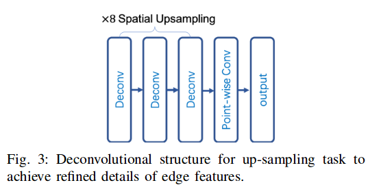

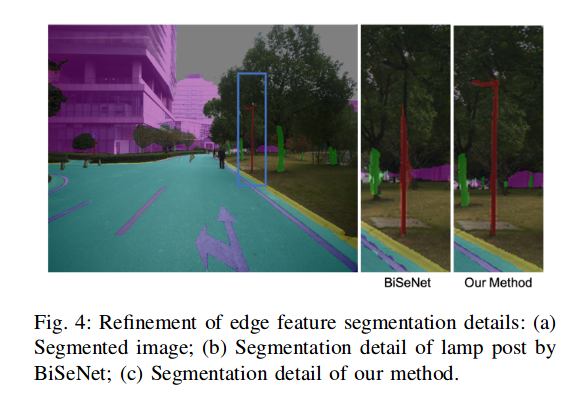

对于super point的特征点提取网络，结构如下：

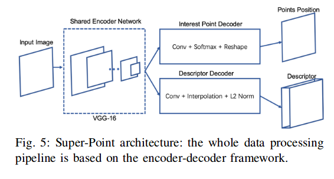

#### VISION FEATUR EXTRACTION

* 对于地面特征的提取，如图所示：
  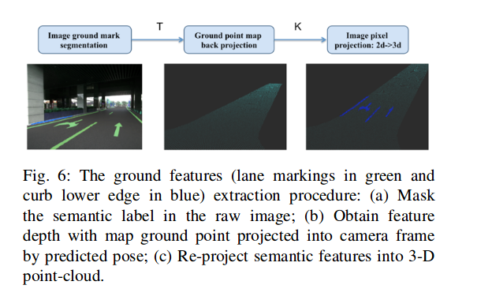

将语义特征点根据深度值反投到3d, 形成3d-3d的匹配residual,　其中深度值是通过搜索地图中的邻近的mark点投影恢复的，投影过来相近的点的深度作为marker点的深度。深度恢复后根据深度再反投影回3d

* ground  sampled features

  提取过程和lane marking过程类似

* pole-like特征的提取

1.  将柱子的分割结果处理成二值图像，通过形态学操作来fill holes
2.  对列进行直方图统计
3.  最小二乘拟合

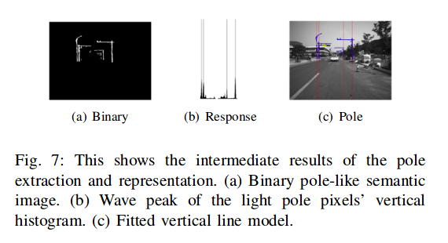

* Interest feature point

选择那些能够稳定跟踪多帧的特征点，并去除动态物体上的特征点

#### Global Map的构建

1. 语义特征地图(具有语义label的特征地图)

   先根据INS SYSTEM和多个3d-lidar来构建高精度点云map,　然后利用点云上的DNN模型（kpconv）进行分类，从而得到语义级别的点云
   
   KPConv (kernel point convolution) (https://github/HuguesTHOMAS/KPConv)是一种点云上的卷积方法，可以用来进行点云的分割和分类
   
   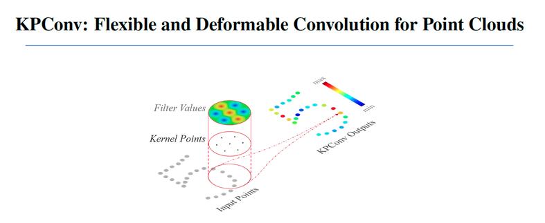
   
   
   
   对于lane-marking points 和curb points可以直接从网络输出中得到
   
   
   
   对于地面点的处理，由于地面点在重投影的过程中对深度估计很重要，会做进一步的处理:
   
   1. 对地面点进行去噪
   2. hole filling

　　基于mls(moving least square)方法

* 3D pole map的构建方法：
  a. 点云欧几里得聚类得到实例级的 pole-like object points
  b. ransac拟合七参数pole-like object圆柱模型
  c. 合并在竖直方向上断开的多个柱子
  d. 在地图中保存柱子端点和cylindrical参数
  
  

2. 对于Feature Point Map, Fixed Pose SFM, Align 两种地图.

 采用colmap (https://github.com/colmap/colmap)进行特征点地图构建, pose来自于LIDAR SLAM Backend

由于视觉特征对光照不鲁棒, 在重投影和特征匹配的过程中会有误差，导致重建的效果次于Lidar Mapping，在lidar point cloud的辅助下利用kd-tree最近邻搜索的方法去除视觉map的一些outlier点

####  Optimization

1. ground marker feature
   聚合多帧的ground marker形成一个局部地图，通过kd-tree搜索全局地图形成3d-3d的对应关系, 从而形成匹配残差

2. ground sampled point
   残差为采样的地面点到平面的距离

3. pole-like object
   配对地图投过来的杆子和图像上的杆子，将地图投影点到图像上直线的距离作为残差，用三个点描述地图中的杆子，残差是三个点到直线的距离之和

4. interest point feature
   地图中的point feature根据预测的pose投射到图像上，然后根据描述子距离进行配对，通过执行ransac来去掉mismatch,最后将inlier match加入到最终的cost term,　构建重投影误差

* solver:

huber loss function, 不同类型的特征不同的权重，stack rediduals and jacobians，ceres solver进行非线性优化求解

#### 实验结果

* 硬件配置：

1. 无人配送车

2. 海康机器人的工业图像传感器　(1280 * 1024, 10hz)

3. low cost mems imu

4. wheel encoder (2,3,4 for vio running)

5. Intel 8700 CPU, NVIDIA 2080 GPU

为了对方法充分的验证，既选择了包含丰富语义信息的场景，如公开的道路，也选择了没有语义信息的地方，如居民区，工业园区中很窄的道路，其中一个场地如下：

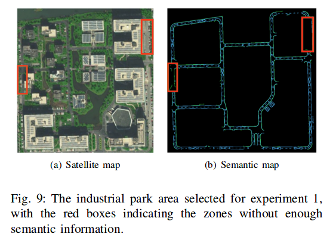

不同情形下匹配的feature point, 语义元素和地面点

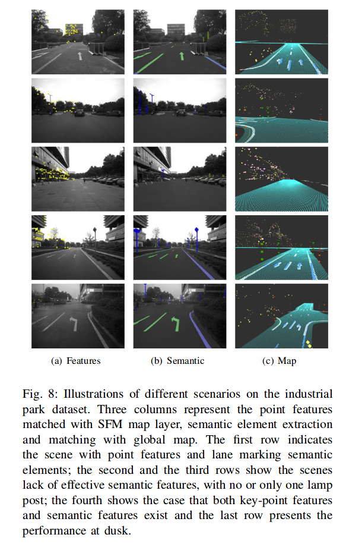

分成了几个单独的模块进行精度的评估：

1. LC (lane curb): 只利用lane 和 curb的优化
2. PCG(Pole-Curb-Ground): 利用pole, curb,　ground point优化
3. FO(feature only): 只利用key-point  feature
4. Fusion:　融合方法

精度和鲁棒性:

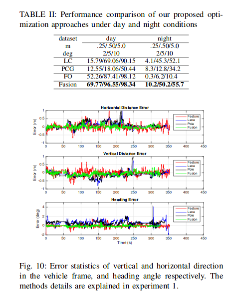

不同场景下的定位有效性:

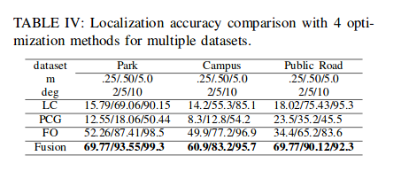

52km的测试数据，不同的方法分别适合用不同的场景，fusion is better.

* Kaist dataset上进行实验

  在kaist urban39数据上进行实验，其中场景包括了urban, highway, suburban,　平移旋转结果的RMSE如下表：

  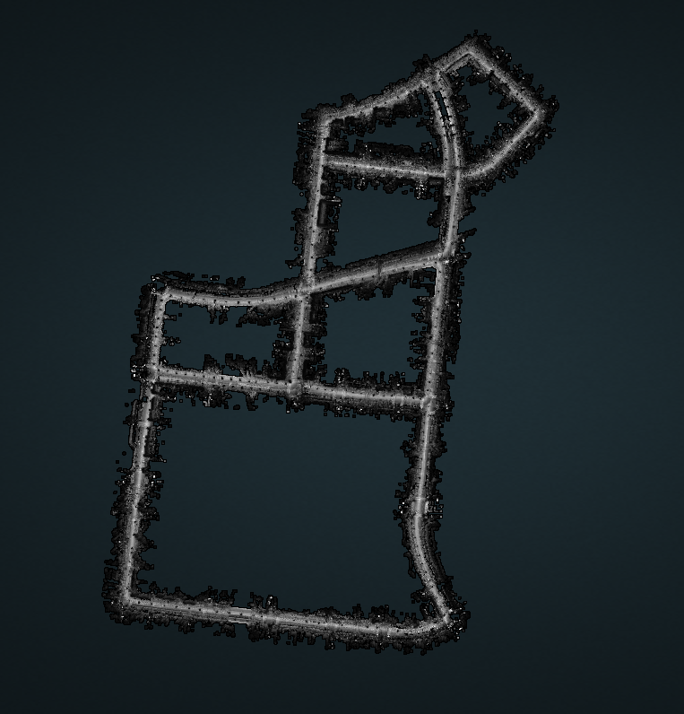

[17]: coarse to fine visual localization using semantic compact map

megivll基于pole的定位, 解耦了平移和旋转的估计

[27]: long term visual localization using semantically segmented images

chalmers university of technology 基于语义的粒子滤波定位

* Run time分析

10hz影像的实时pose估计，时间统计:

1. 语义分割（15ms）
2. 特征点提取 (< 10ms)
3. 优化（20ms）

