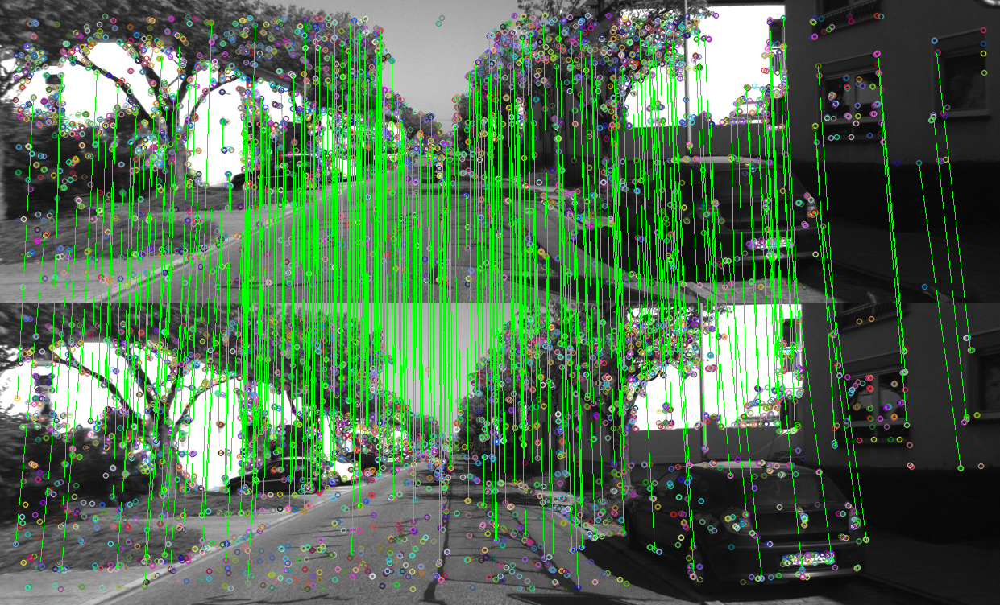
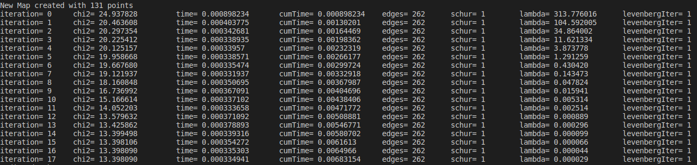
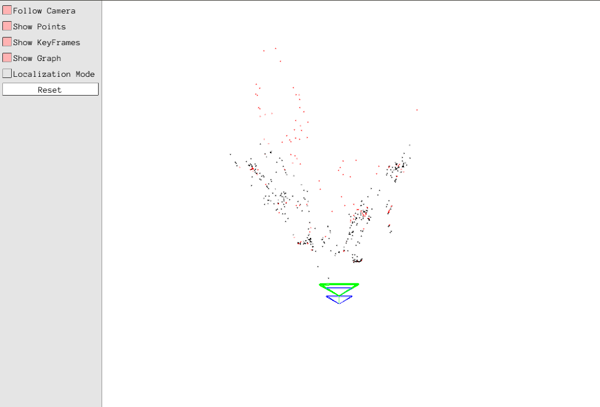
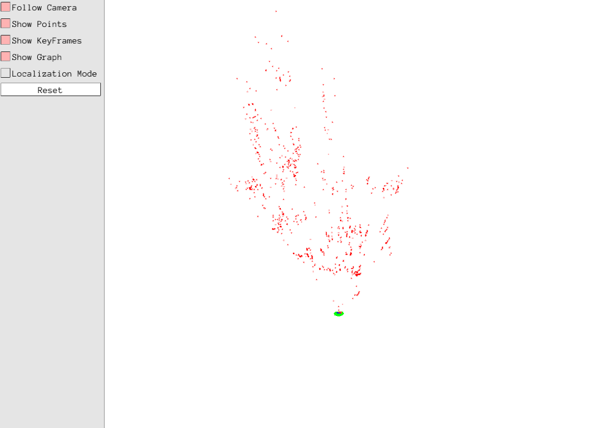

### orbslam2-initializer

这篇blog主要对orbslam2中的初始化过程进行描述

* 单目初始化

首先当系统未进行初始化的时候，对当前系统进行初始化，当然前提是当前帧的特征点数目满足要求，以当前帧来构建initializer,当下一帧的特征点数目也满足要求的时候，利用matcher进行特征点匹配，如果匹配数量满足要求，则尝试进行初始化，如下图，对kitti数据中的前后连续两帧进行初始化，两帧的特征点匹配结果如图所示：



通过调用：
```c++
mpInitializer->Initialize(
            mCurrentFrame,      //当前帧
            mvIniMatches,       //当前帧和参考帧的特征点的匹配关系
            Rcw, tcw,           //初始化得到的相机的位姿
            mvIniP3D,           //进行三角化得到的空间点集合
            vbTriangulated)
```
得到两帧之间的旋转平移，初始的三角化的点和三角化是否成功的标志，然后根据初始化的结果创建单目初始化地图，流程如下：
1. 根据当前帧和参考帧构建关键帧，并将关键帧插入地图
2. 根据初始匹配关系生成地图点，建立地图点，并插入到地图中；关键帧，地图三方的观测连接关系
3. 对初始化的两帧和地图点进行全局优化
如图是优化过程中残差的变化：

4. 根据三角化的地图点计算场景的中值深度，利用中值深度对变换和地图点进行归一化(optional)
5. 构建局部地图，局部关键帧，局部地图点

初始化完成后得到的结果如下图所示:

其中蓝色框是初始化成功的两帧关键帧，绿色框为当前相机，红色点为初始化过程中的参考地图点，黑色点是所有的地图点，其中比参考地图点多出来的部分是local mapping线程通过特征点匹配新生成的一些地图点,因为初始化时候的特征匹配并不充分，跟踪线程给局部建图线程每发送一个关键帧，都会进入local mapping的loop,通过对两个关键帧之间进行bow match来新增一些地图点

这样就完成了单目初始化，下面对初始化函数Initialize进行分析,基本步骤如下：
1. 根据参考帧和当前帧的特征点匹配关系，建立用于ransac的８点索引集合
2. 双线程并行计算homography和fundamental矩阵
3. 根据评分(双向重投影误差)选择其中一个来恢复帧间变换和三角化的空间点

其中单应矩阵和基础矩阵的计算均是用８个归一化的点，采用svd分解进行计算。根据H, F进行变换矩阵恢复的时候会产生多组解，选择能够产生最多三角化点的一组解作为最终的解，同时有相应的ratio test(最佳解的三维点个数要远多于次佳解)，视差角要满足阈值，三角化点的个数要满足阈值等条件

* 双目和rgbd初始化

通过反投影直接进行初始化，将地图点插入地图，将初始帧作为关键帧也插入地图。将初始帧传送给local mapping,设置局部关键帧等。如图所示：


这个时候参考地图点就是所有的地图点，通过第一帧就直接完成初始化，local mapping中因为只有一帧，所以并没有产生新的地图点。双目初始化简单，相比单目能够对尺度进行确定，是一个较大的优势