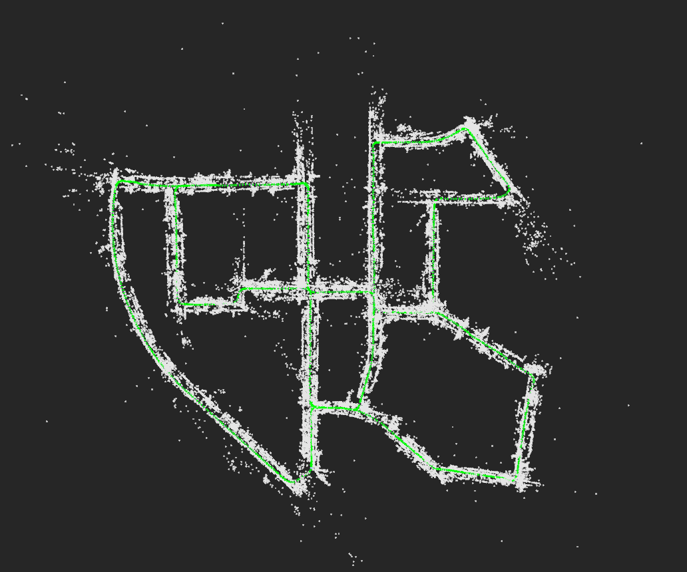
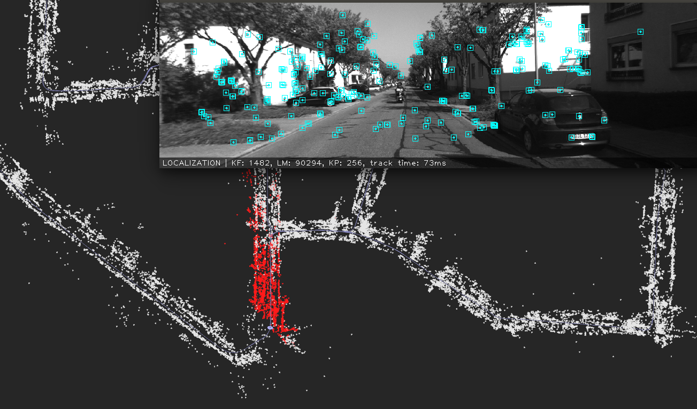
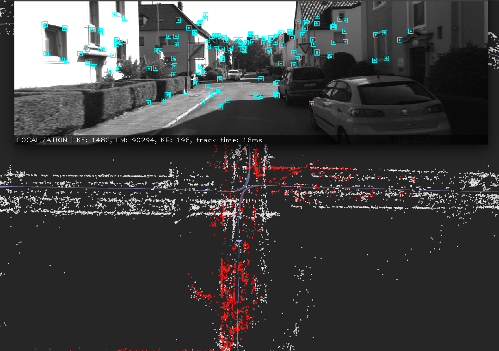

### OPENVSLAM Map-Localization

这篇blog主要想描述一下特征点法slam中基于prior feature-map进行localization的细节，这里以openvslam为例，和orbslam2中的流程基本一致，只是openvslam中提供了地图的dump, load, localizaton and slam等多种功能

#### Feature-Map Format
在运行openvslam slam模式的条件下，可以生成特征点地图，这也是后续用来定位的先验地图，这里对其地图内容做简要的描述：

存储的地图中包括了map_db, cam_db等信息，其map_database的数据结构，也就是ORBSLAM2中map的结构如下所示：

1. keyframes
2. landmarks
3. local landmarks
4. origin_keyframes (起始关键帧)

存下来的地图文件中包含的信息主要有关键帧信息，路标信息和它们的对应关系，将地图中的上述信息decode出来

* 构建关键帧

首先对关键帧进行解码，将地图中的关键帧信息解析到map_database中的keyframes里面，首先注入当前关键帧的meta data, 包括：

1. n_keypts keypoint的个数

2. ts 时间戳

3. cam 相机名称

4. depth_thr　深度阈值

然后注入当前关键帧的其他信息：

5. pose信息
6. 关键点信息(坐标，方向，层级)，
7. 关键点的描述子
8. x_right和depth

通过这些信息来构造关键帧，将其加入map_database中的keyframes中。

* 构建landmark

然后对路标点进行解码，将存储的路标信息解析到map_database中的landmarks里面，地图中的路标信息主要有:
1. 1st_keyfrm 第一个看到该路标点的关键帧
2. pow　三维位置
3. ref keyframe 该路标点的参考关键帧
4. n_vis 
5. n_fnd

* 构建spanning tree

然后根据存储的关键帧的链接关系构建spanning tree, 形成关键帧之间的connection graph,
解码的关键帧信息主要有:
1. span_parent 当前关键帧的父亲节点(唯一)
2. span_children 当前关键帧的孩子节点(可能有多个)
3. loop_edges  当前帧的回环帧
通过上述信息可以建立起当前关键帧的graph node(parent , children, loop edges)

* 建立关键帧和地图点的链接

然后建立解析出的关键帧和地图点互相之间的链接关系，解析的关键帧信息为lm_ids,标记了当前关键帧的特征点所对应的地图点在landmarks中的索引，然后就是两个链接关系：
```
keyfrm->add_landmark(lm, idx) \\设定关键帧的第idx个特征点所对应的路标
lm->add_observation(keyfrm, idx) \\设定那个路标点观测到了关键帧的第idx个特征点
```
* update covisibility graph

根据关键帧和地图点的对应关系，通过当前关键帧的地图点的观测信息来更新关键帧的共视关系，形成共视图

* update landmark geometry and desc

根据观测到路标点的多个关键帧更新路标点的法向，深度以及描述子

构建的特征点地图如图所示：


包括了路标点，关键帧, graph

####　Map-Based Relocalization

在有了先验地图的条件下，不需要像slam模式下的单目那样需要初始化，初始的时候跟踪器的状态为lost,然后在第一帧的时候进入重定位模式，利用当前帧和keyframe_database进行重定位，主要步骤包括：
1. 根据当前帧的词袋向量计算当前帧的候选关键帧
2. 对当前帧和候选关键帧逐一进行bow match
3. 根据特征点和对应的路标构建pnp-solver, EPNP-RANSAC计算当前相机的pose的初值
4. 根据pnp的inlier correspondence利用pose-optimizer对当前帧的pose进行优化
5. 利用优化后的pose进行投影匹配来获得更多的2d-3d的对应关系，重新用pose-optimizer 进行优化
6. 如果inlier大于阈值，则重定位成功，否则基于已经找到的路标，在进行一次投影匹配，尝试pose-optimize

可以看到其始终秉承这样一种pose求解的范式：先用代数算法解算一个初始的pose(用了最少的correspondence),然后利用更多的correspondence优化解算pose,再利用更准确的pose通过投影匹配得到更多的correspondence来进行优化求解。Pose的精度from coarse to fine, 所利用的数据量from less to more

如图显示了重定位成功的一帧:


如图显示了每一帧都做重定位的运行结果，基本上都可以进行稳定定位


#### Map-Based Tracking

重定位成功后即开始了定位跟踪模式，其首先会对前一帧或参考帧进行跟踪，跟踪成功后更新局部地图，利用局部地图进行跟踪，重要代码如下:
```
//设置系统内的参考关键帧为当前帧的参考关键帧
curr_frm.ref_keyfrm_ = ref_keyfrm_;
auto succeeded = track_current_frame();
if(succeeded) {
    update_local_map();
    succeeded = optimize_current_frame_with_local_map();
}
if(succeeded) {
    update_motion_model();
}
```

其中，track_current_frame包括四种跟踪模式，分别是跟踪状态下的:
1. motion_based_track
2. bow_match_based_track
3. robust_match_based_track
以及丢失状态下的relocalize(如上已分析过)

正常情况下，在velocity有效的情况下利用motion_track就可以完成跟踪，当(1)失败的时候会利用bow_match的方法完成跟踪，当(2)也失败的时候，利用特征点暴力匹配来完成跟踪。其中motion_track的细节如下:
1. 根据运动模型更新当前帧的pose
2. 根据pose利用投影匹配对当前帧和上一帧进行匹配，确定当前帧的特征点所对应的地图点，如果匹配数过少，尝试扩大搜索半径进行匹配，如果还是太少则运动跟踪失败
3. 根据对应关系利用pose_optimizer进行位姿优化，优化过程中根据路标点的投影误差确定是否是outlier
4. discard当前帧的outlier观测

bow_match_track的流程和motion_track基本一致，只是匹配改为和当前帧的关键帧进行bow match,通过匹配确定当前帧的特征点所对应的地图点，然后设定当前帧的初值,即上一帧的初值，利用pose_optimizer进行位姿优化，并在优化后进行discard_outlier.

robust_match_track的流程和其他类型的track基本一致

只用上一帧或参考帧进行跟踪的效果如图所示:


帧间跟踪成功后，进行update_local_map (update local keyframes, update local landmarks),其中更新局部关键帧的细节如下所示:
1. 根据当前帧匹配上的路标点及其在其他关键帧上的观测，构建keyfrm_weights
2. 将有共视的关键帧加入local_keyfrms,并计算最共视帧
3. 扩大局部关键帧的范围，将first-order keyframe的共视帧，spanning_children, spanning_parent也加入局部关键帧
4. 将最共视帧设为系统的参考关键帧和当前帧的参考关键帧

更新局部路标点的细节如下所示:
1. 遍历局部关键帧
2. 将每一关键帧观测到的路标点添加进入局部路标点

最后根据更新后的局部地图，进行optimize_current_frame_with_local_map(),其实现如下:
1. 过滤出能被当前帧观测到的局部路标点（通过3d点投影）
2. 利用投影匹配获取当前帧的更多的特征点和地图点对应关系
3. 基于correspondence进行pose optimize
