### Pitch Estimation

车辆的pose，离线或在线的 calibration extrinsic parameters 以及实时ipm所需要的pitch角(相机光轴与地面的夹角)，这三个概念从某种程度上看是存在混淆和联系的,如下图所示:
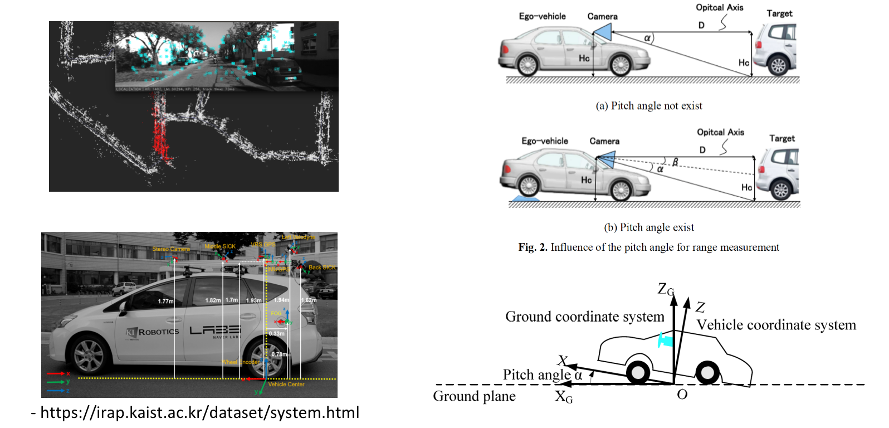

以地图定位为例，pose指的是对每时每刻的载体相对于世界的transform进行估计，这里的世界指的是地图坐标系。标定的外参指的是传感器坐标系相对于车辆坐标系的transform.而实时估计的pitch角指的是相机光轴和水平地面的夹角，由于地面的起伏或者车辆的加减速，这个角度会发生变化，我们希望能够实时的估计出这个transform,也就是相机坐标系和地面坐标系的变换，或者说是车辆坐标系和地面坐标系的变换。

消除图像透视投影影响的一个通用方法是使用IPM(逆透视变换)，IPM的前提是需要知道相机相对于地面的变换关系，而我们通过标定可以获得相机和车辆之间的变换关系，正常情况下，我们使用固定的外参来进行前视图像和bev图像之间的wrap,但是由于不平整的地面， 车辆运动加减速，上下坡的影响，相机的角度(相对于地面的)会以外参为均值发生变化，我们需要实时的估计出这个变化，从而得到正确的IPM图像


#### method1:

根据拟合出的地面和相机的平面，可以确定相机相对于地面的夹角，对于双目相机或者多目相机来说，深度值可以通过三角关系直接计算得到，对于单目来说，需要通过进一步处理，利用神经网络来获得地面像素的深度值

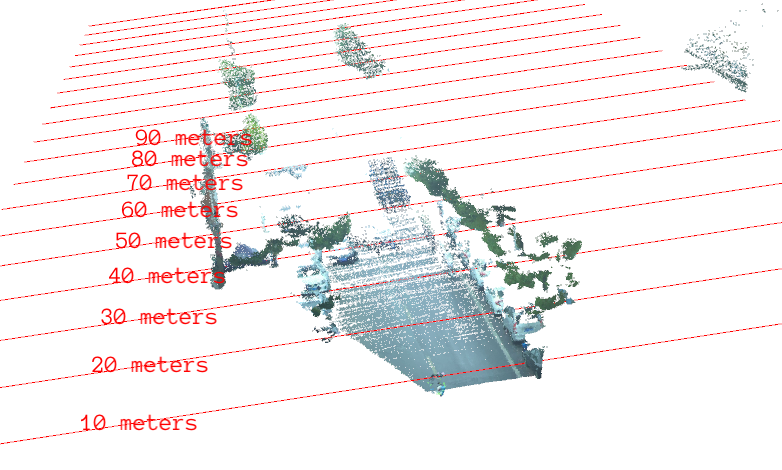

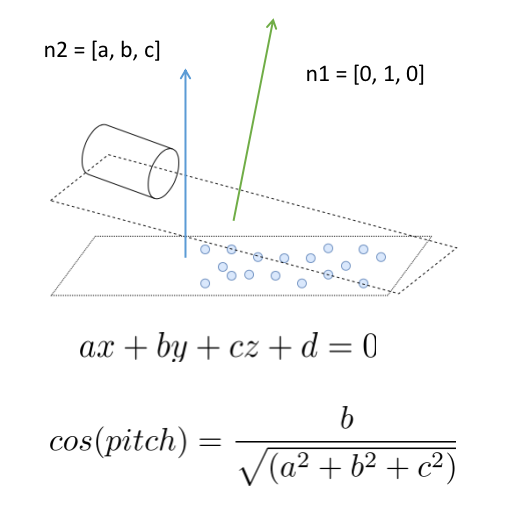

#### method2:

如果能够获得图像的灭点坐标，可以利用灭点的投影性质来进行相机相对于地面的角度的计算，如图所示:

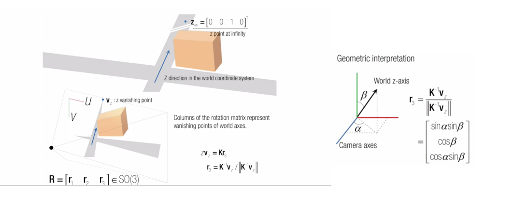

灭点在世界坐标系中的位置为[0, 0, 1, 0],根据其在图像中的位置和内参，可以得到旋转矩阵的第三列，进而可以通过一些三角函数进行角度的求解，这里推荐https://www.coursera.org/lecture/robotics-perception/vanishing-points-how-to-compute-camera-orientation-flqF4 的视频讲解，以及https://github.com/thomasfermi/Algorithms-for-Automated-Driving 的算法介绍

#### method3

相机相对于地面的pitch角和灭点的位置有着直接的联系，当车头扬起，灭点的行坐标会向图像的下部移动，反之当车尾扬起，车头偏下的时候，灭点的行坐标会向图像的上部移动，利用这样的关系，我们可以得到如下式的pitch角计算公式:
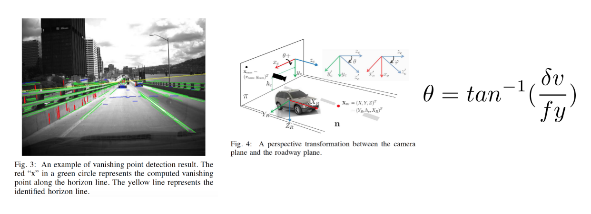

在apollo5.0中的pitch估计中也使用了这样的方法:
```
bool LaneBasedCalibrator::Process(const EgoLane &lane, const float &velocity,
                                  const float &yaw_rate,
                                  const float &time_diff) {
  float distance_traveled_in_meter = velocity * time_diff;
  float vehicle_yaw_changed = yaw_rate * time_diff;

  // Check for driving straight
  if (!IsTravelingStraight(vehicle_yaw_changed)) {
    AINFO << "Do not calibate if not moving straight: "
          << "yaw angle changed " << vehicle_yaw_changed;
    vp_buffer_.clear();
    return false;
  }

  VanishingPoint vp_cur;
  VanishingPoint vp_work;

  // Get the current estimation on vanishing point from lane
  if (!GetVanishingPoint(lane, &vp_cur)) {
    AINFO << "Lane is not valid for calibration.";
    return false;
  }
  vp_cur.distance_traveled = distance_traveled_in_meter;

  // Push vanishing point into buffer
  PushVanishingPoint(vp_cur);
  if (!PopVanishingPoint(&vp_work)) {
    AINFO << "Driving distance is not long enough";
    return false;
  }

  // Get current estimation on pitch
  pitch_cur_ = 0.0f;
  if (!GetPitchFromVanishingPoint(vp_work, &pitch_cur_)) {
    AINFO << "Failed to estimate pitch from vanishing point.";
    return false;
  }
  vanishing_row_ = vp_work.pixel_pos[1];

  // Get the filtered output using histogram
  if (!AddPitchToHistogram(pitch_cur_)) {
    AINFO << "Calculated pitch is out-of-range.";
    return false;
  }

  accumulated_straight_driving_in_meter_ += distance_traveled_in_meter;
  if (accumulated_straight_driving_in_meter_ >
          params_.min_distance_to_update_calibration_in_meter &&
      pitch_histogram_.Process()) {
    pitch_estimation_ = pitch_histogram_.get_val_estimation();
    const float cy = k_mat_[5];
    const float fy = k_mat_[4];
    vanishing_row_ = tanf(pitch_estimation_) * fy + cy;
    accumulated_straight_driving_in_meter_ = 0.0f;
    return true;
  }
  return false;
}
```
在直线行驶一段距离后利用车道线交会得到的灭点来进行pitch角的计算，同时对当前时刻的pitch角度进行了直方图滤波

```
bool LaneBasedCalibrator::GetPitchFromVanishingPoint(const VanishingPoint &vp,
                                                     float *pitch) const {
  assert(pitch != nullptr);
  const float cx = k_mat_[2];
  const float cy = k_mat_[5];
  const float fx = k_mat_[0];
  const float fy = k_mat_[4];
  float yaw_check = static_cast<float>(atan2(vp.pixel_pos[0] - cx, fx));
  if (fabs(yaw_check) > params_.max_allowed_yaw_angle_in_radian) {
    return false;
  }
  *pitch = static_cast<float>(atan2(vp.pixel_pos[1] - cy, fy));
  return true;
}
```

上述代码位于https://github.com/ApolloAuto/apollo/blob/master/modules/perception/camera/lib/calibrator/laneline/lane_based_calibrator.cc

关于灭点估计，其在代码中使用了两条车道线的交点，同时其也提供了一个灭点估计网络，在encoder结束的地方又接了卷积层和全连接层来进行偏移位置dx, dy的预测，其灭点网络的参数是分别训练的，会fix lane encoder的参数

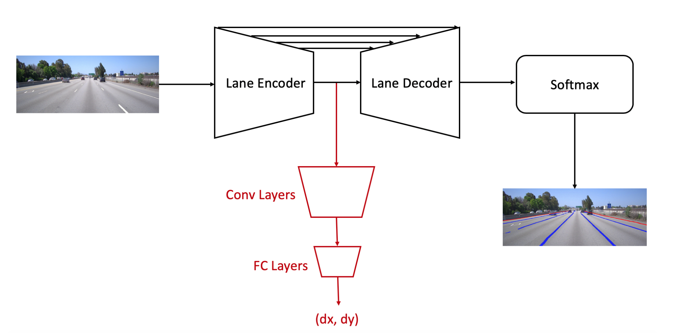

#### method4
由于车辆每一个成像瞬间相对于地面pitch角的变化，bev图像中(也就是现实环境中)车道边界平行的情况会被干扰， 利用两个宽度理想情况下相等的条件可以近似的对pitch角度进行计算.

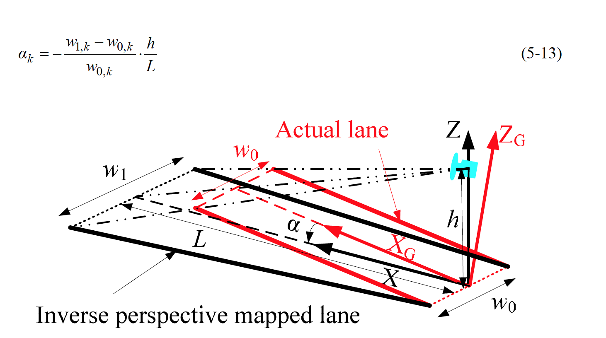

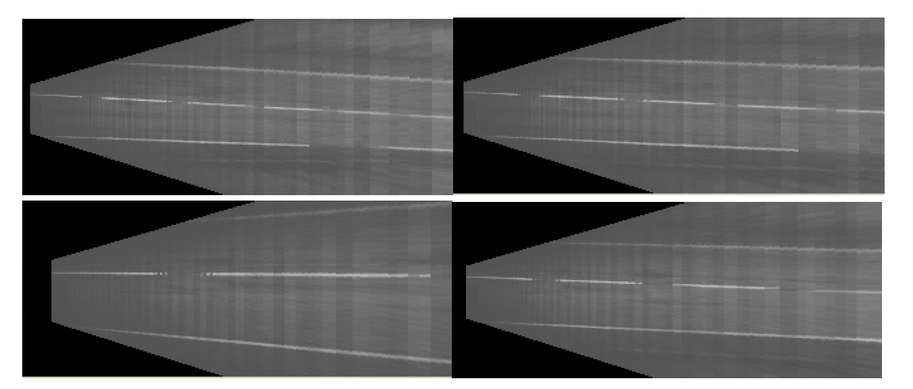

#### method5
因为车辆行驶在道路平面上，两帧的平移向量理论上需要和道路表面平行，而pitch角认为是当前的相机坐标系和平移向量的夹角，也就是平移向量和相机光轴的夹角。如下图所示，通过平移向量我们能够得到每一时刻绝对的pitch角，通过旋转向量能够得到pitch角的变化量，通过对一段时间内的pitch角进行平均来获得绝对pitch角，然后利用旋转矩阵进行传递

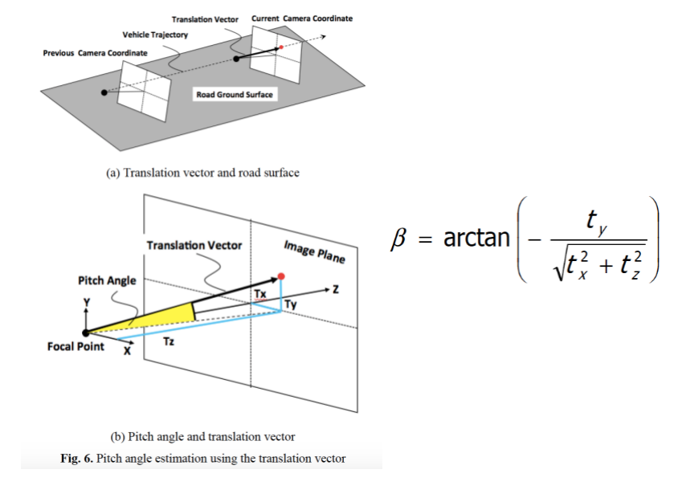

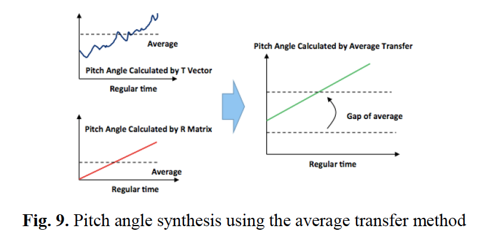

开源代码openpilot中也采用了根据camera odometry信息来进行pitch角计算方法:

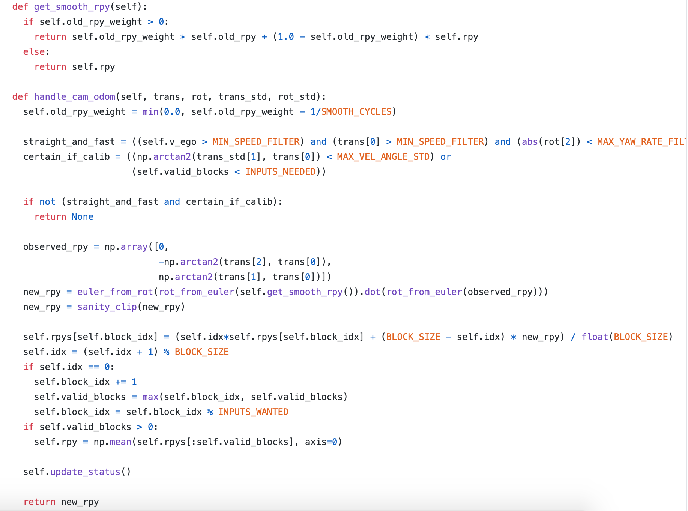

在直行的时候进行计算，同时会和历史的rpy进行加权smooth

#### method6

如果有imu传感器的话，利用imu计算的轨迹和视觉里程计计算的轨迹进行对齐，通过手眼标定的方法可以得到相机和imu之间的外参，求解一个变换能够让不同传感器估计的轨迹最佳的对齐，利用最小二乘求解旋转矩阵，对旋转矩阵分解得到相机相对于imu的俯仰角，imu可以估计重力方向，从而还可以确定相机的绝对俯仰角

#### method7

车辆在地面上的颠簸运动会导致安装在车上的传感器相对于地面的位置和角度发生改变，从而影响感知。我们可以通过计算图像上的消失线的位置来估计成像器件相对于地平面的俯仰角，从而减少因为运动颠簸对感知结果造成的影响，所以实时校准的问题转化为了对消失线位置实时估计的问题，但由于遮挡，或者车道线不完整等原因，并非每一帧都可以进行消失线的估计，所以这篇专利做的事情就是通过建立前后帧的映射关系，并且假设已知前一帧的消失点位置来得到后一帧的消失点位置

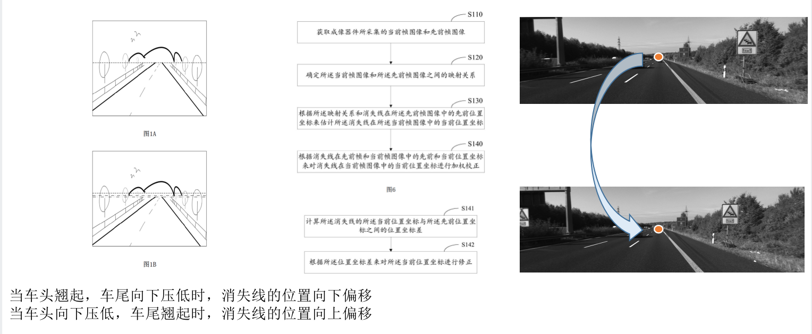

但是盲目的把映射的消失点位置设置为当前帧的消失点位置，在映射关系错误的时候会发生问题，通过观察发现，在车辆平稳驾驶的时候，消失线的位置更加接近于离线标定后的默认位置，而在大幅度颠簸的时候，消失线的位置更加接近于估计的位置，估计位置和默认位置加权平均

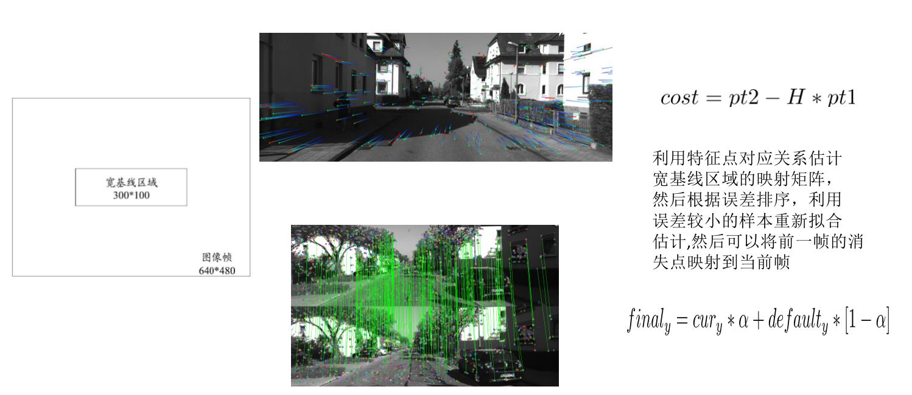

#### 结论

虽然pitch角估计的方法很多，但是均有着很大的限制，如直行的时候，或者能够计算出相机ego-motion的时候，依然是一个未被解决的问题

如果你觉得这篇文章对你的工作认知产生了积极的影响，不妨考虑赞助我一杯奶茶吧!


