## Map Introduction In NuScenes Dataset

### NuScenesMap

#### Brief view 

class NuScenesMap，地图是一份二维语义矢量地图，这个地图类主要是负责进行地图信息的querying and retrieving. 地图以south western corner作为原点，四幅地图的原点经纬度如下:


```
boston-seaport: [42.336849169438615, -71.05785369873047]
singapore-onenorth: [1.2882100868743724, 103.78475189208984]
singapore-hollandvillage: [1.2993652317780957, 103.78217697143555]
singapore-queenstown: [1.2782562240223188, 103.76741409301758]
```


四个地图的维度（width & height）如下, unit(m)：

```
singapore-onenorth: [1585.6, 2025.0]
singapore-hollandvillage: [2808.3, 2922.9]
singapore-queenstown: [3228.6, 3687.1]
boston-seaport: [2979.5, 2118.1]
```

对地图进行了栅格化成像，10pix/m, 因此其图像范围要在上述范围扩大10倍。地图分为两个图层，几何图层和非几何图层，几何图层包括（polygon, line, node）,　非几何图层包括(drivable_area, road_segment, road_block, lane, ped_crossing, walkway, stop_line, 'carpark_area', 'road divider', 'lane divider', 'traffic light'), NuSceneMap Api提供了对不同地图图层的渲染和某一图层下不同record的渲染支持。

#### map element detail

地图json文件中的元素描述:

* node list

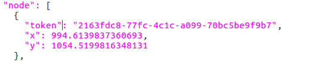

其中token是id标识，x, y是以南西corner为原点的局部坐标

* line list

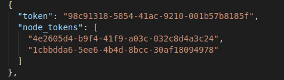

其中token是id标识，node_tokens描述了连接这条线的两个端点

* polygon list


其中token是id标识，exterior_node_tokens描述了polygon的外边界，holes描述了polygon的内边界

* drivable_area


可视化显示

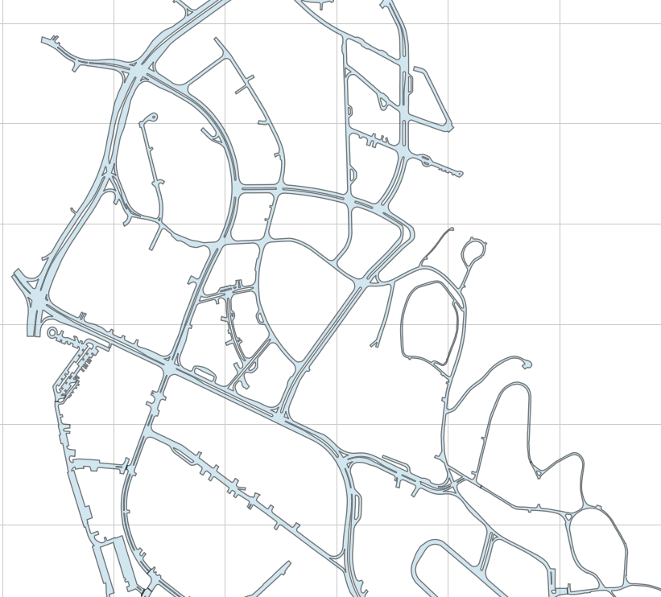

* road segment
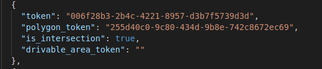

is_intersection表示是否位于路口交汇处

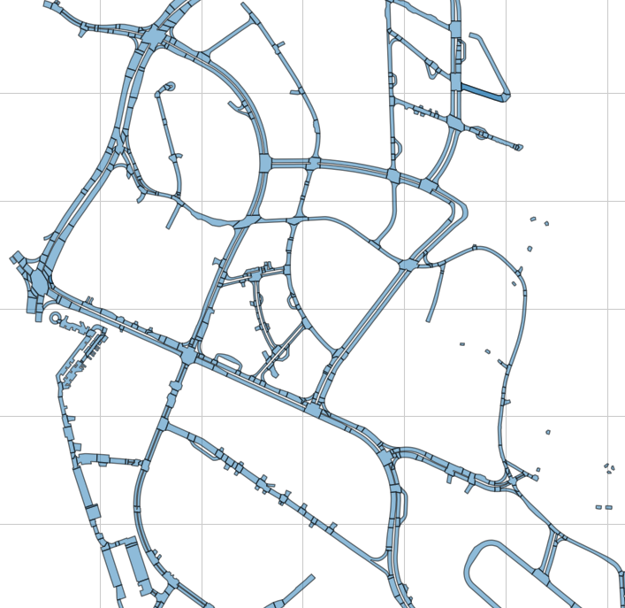

* road block
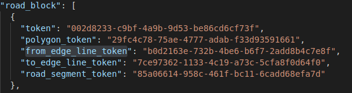

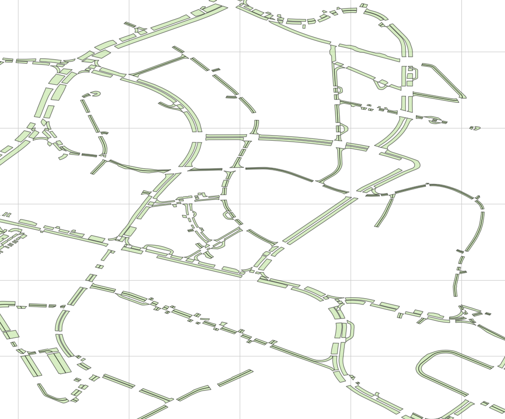

* lane
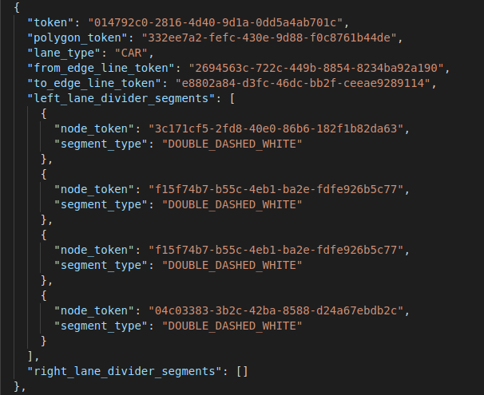

描述了车道的边界，类型等信息

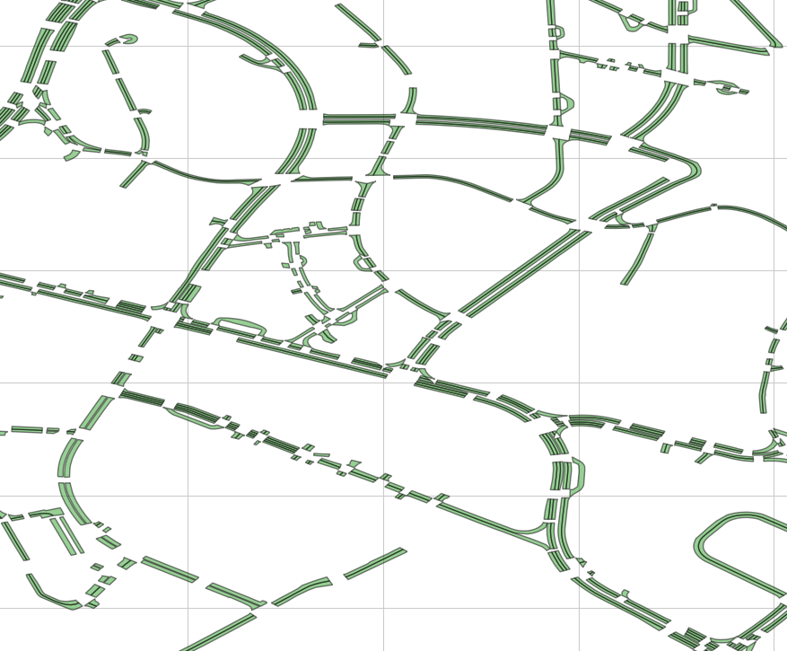

* lane divider
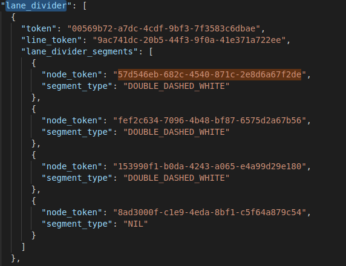

车道线的描述，节点，线段，车道类型

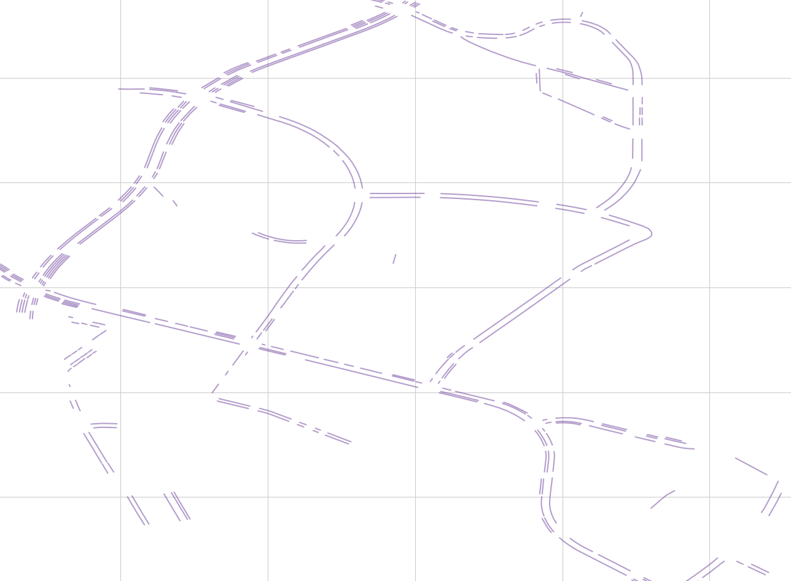

* non_geometry_layer
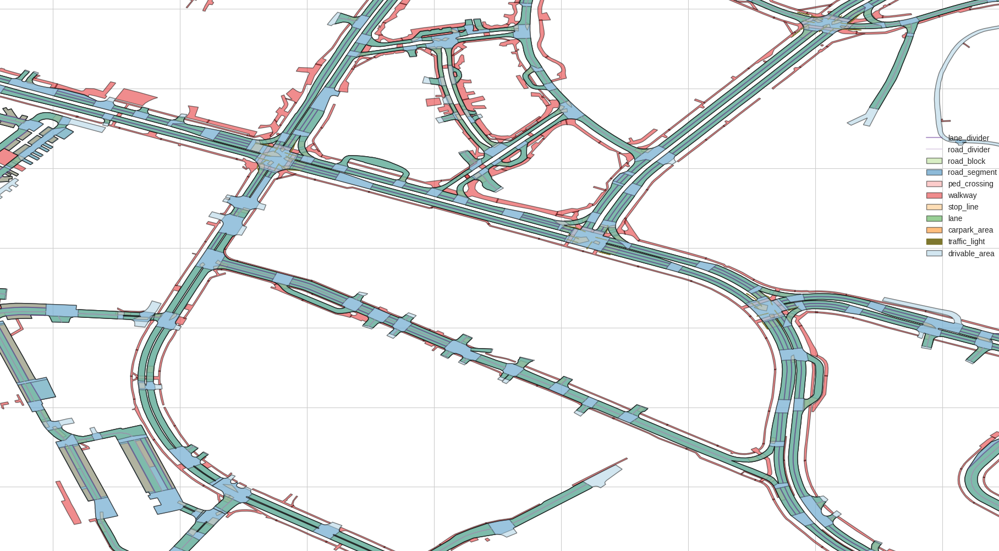

### HD Lidar Basemap

HD lidar base map is used for localization and as general context.　提供了四份相关地图，分别是singapore-onenorth, singepore-hollandvillage, singapore-queenstown, boston-seaport

下图为singapore-onenorth的basemap

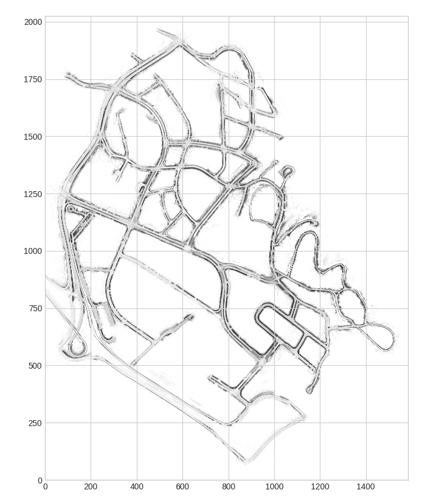

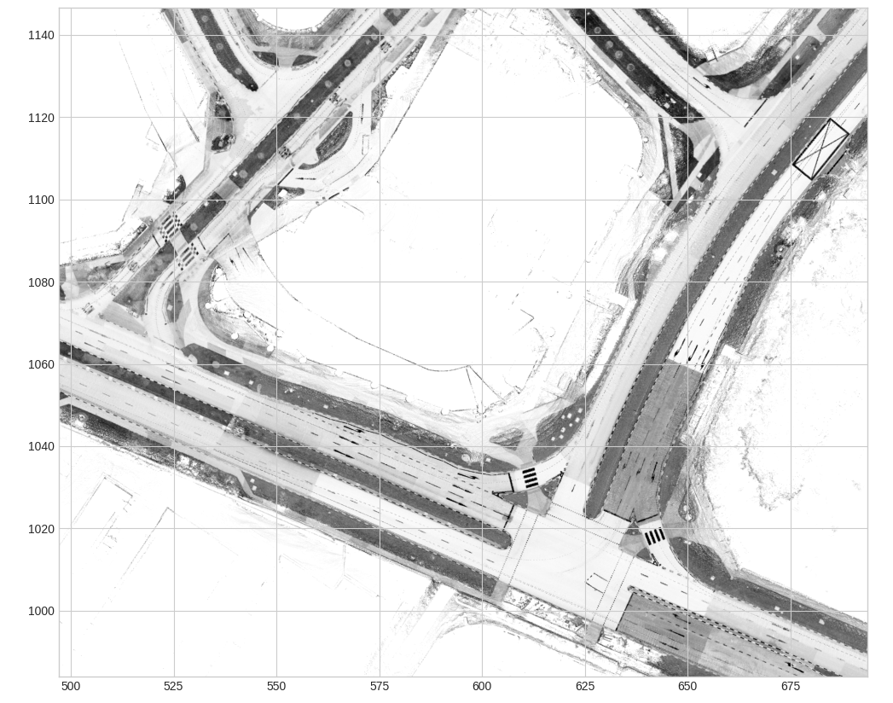

下图为singapore-onenorth的semantic_prior地图

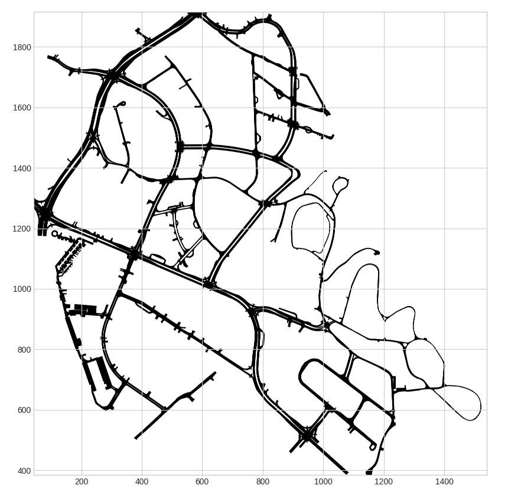

是nuScenes 1.0中提供的semantic prior mask (drivable surface and sidewalks)

车道中心线和lidar base map的叠加:
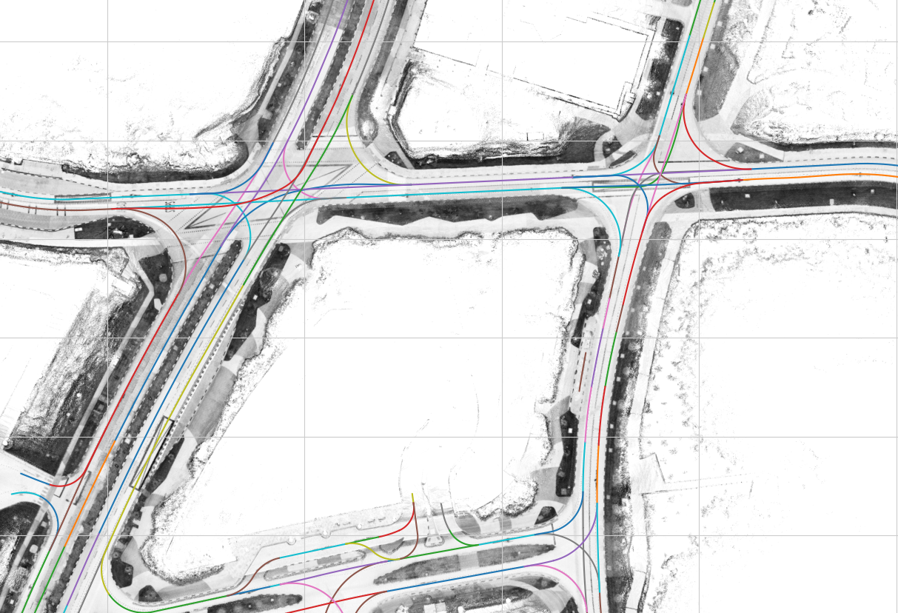

不同的语义图层和lidar base map的叠加

