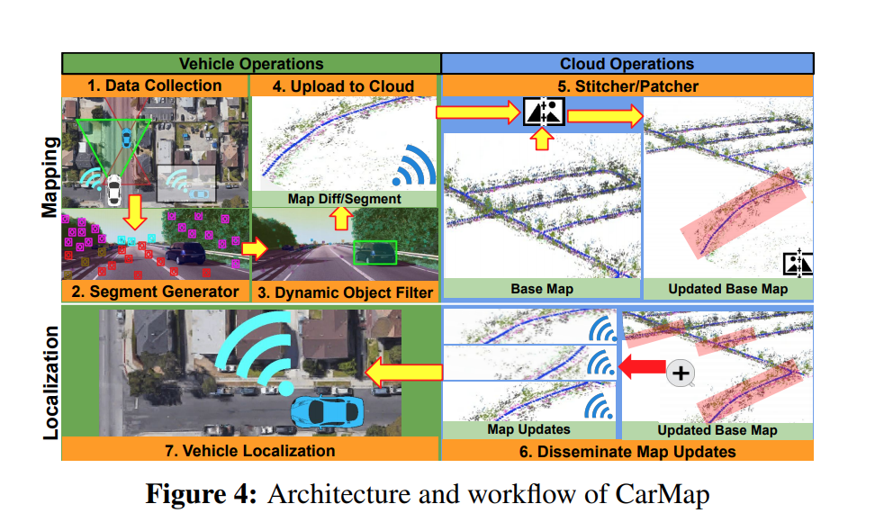
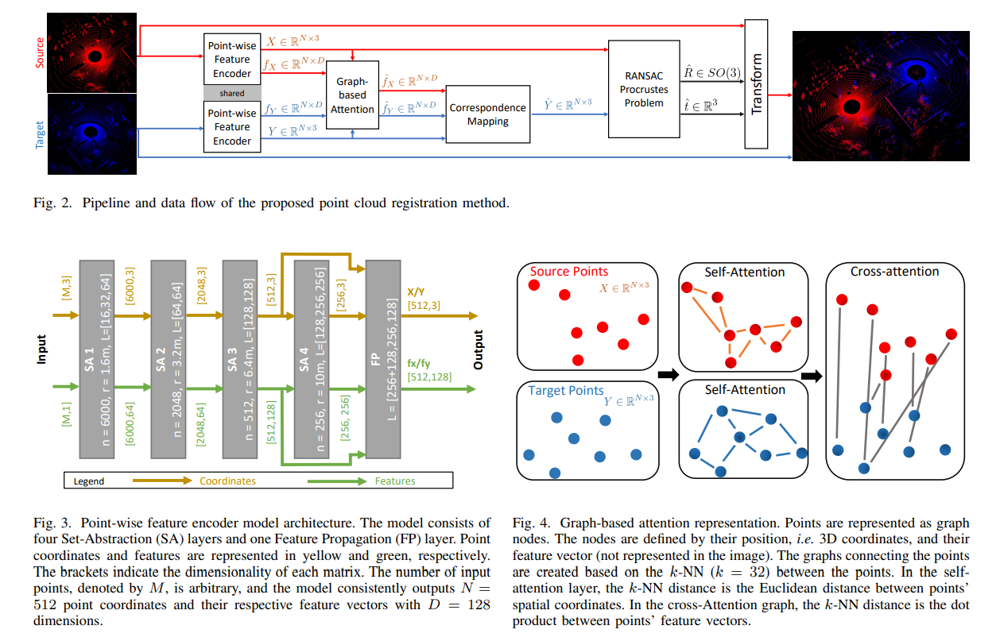
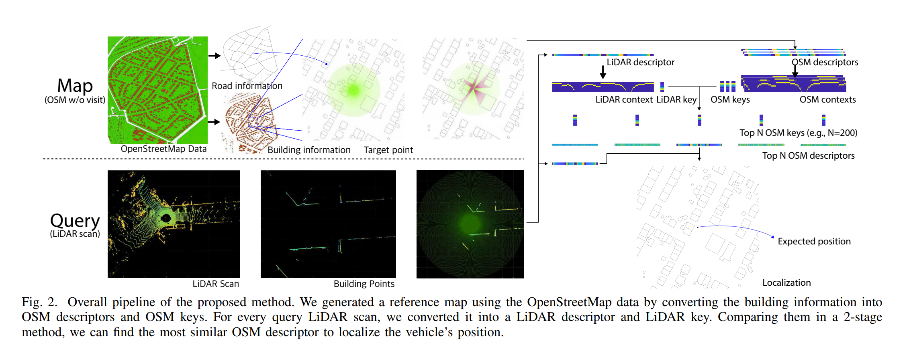
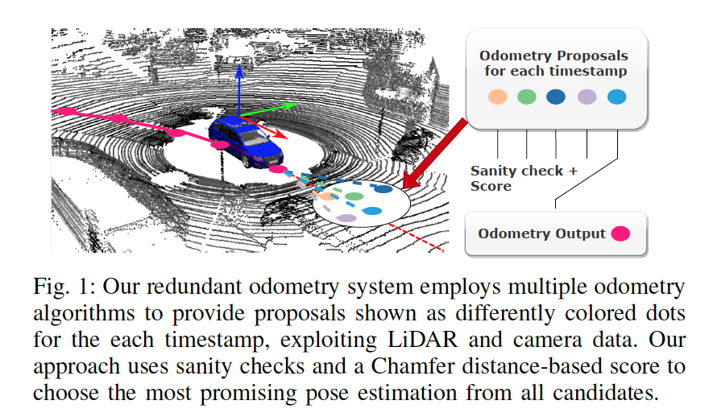
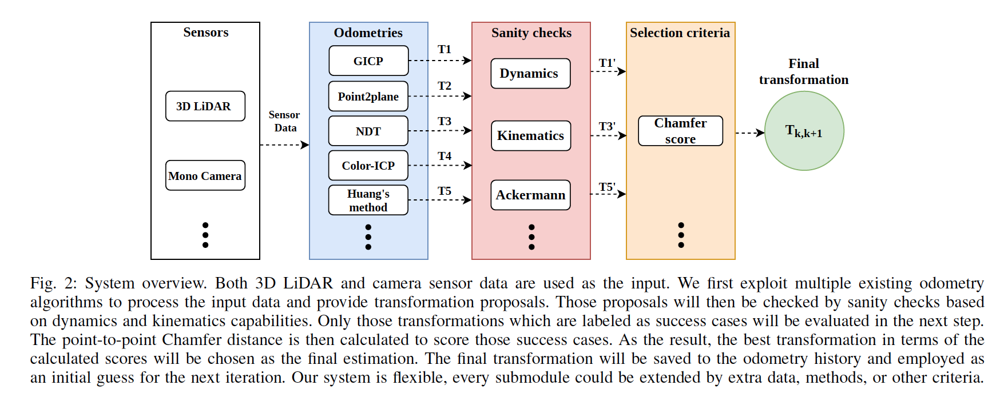
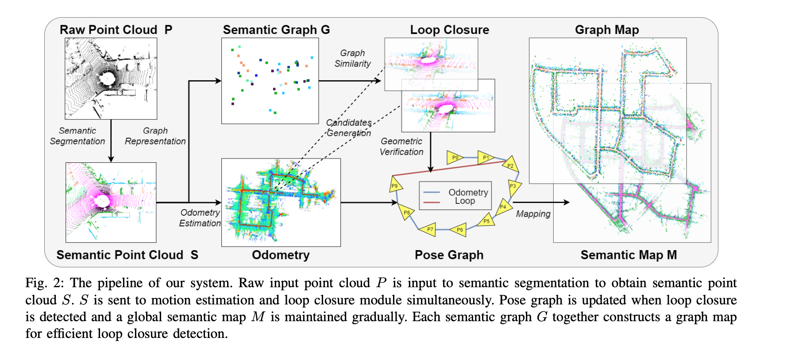
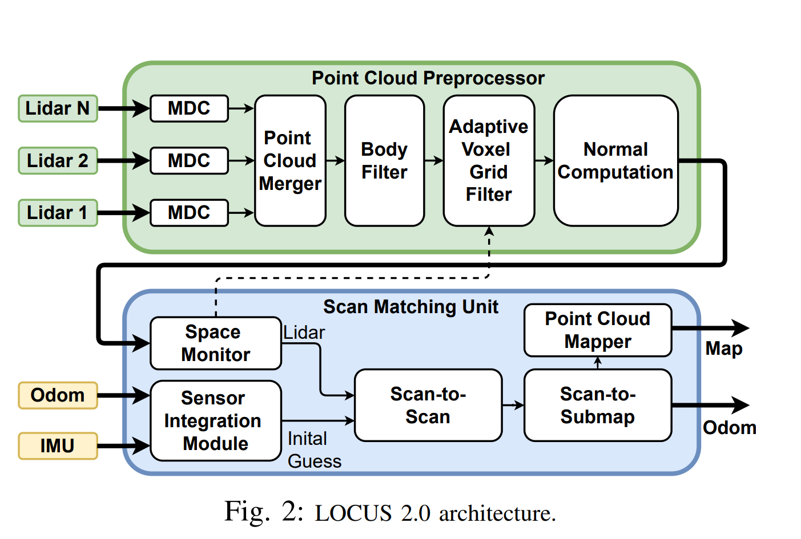
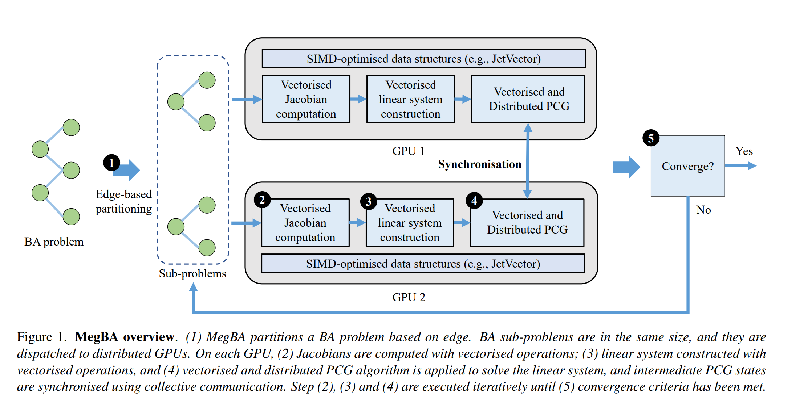

### Vision Localization
1. Monocular Localization in HD Maps by Combining Semantic Segmentation and Distance Transform (IROS 2020, KIT)
2. Road Mapping and Localization using Sparse Semantic Visual Features (ICRA 2021, Alibaba)
3. Compact 3D Map-Based Monocular Localization Using Semantic Edge Alignment (IROS 2021, Alibaba)
4. Monocular Localization with Vector HD Map
(MLVHM): A Low-Cost Method for Commercial IVs (Sensors, 2020)
5. Long-Term Urban Vehicle Localization Using Pole Landmarks Extracted from 3-D Lidar Scans (2019)
6. DA4AD: End-to-End Deep Attention-based Visual Localization for Autonomous Driving (ECCV 2020)
7. Exploiting Sparse Semantic HD Maps for Self-Driving Vehicle Localization (IROS 2019, Uber.ATG)
8. Lane Endpoint Detection and Position Accuracy Evaluation for Sensor Fusion-Based Vehicle Localization on Highways (Korean, 2018, sensors)
9. Visual Semantic Localization based on HD Map for Autonomous Vehicles in Urban Scenarios (ICRA 2021, Huawei)
10. HDMI-Loc:Exploiting high definition map image for precise localization vis bitwise particle filter (IROS 2020)
11. DT-Loc: Monocular Visual Localization on HD Vector Map Using
Distance Transforms of 2D Semantic Detections (IROS 2021)

### Crowdsourced Mapping
1. Real-Time HD Map Change Detection for Crowdsourcing
Update Based on Mid-to-High-End Sensors (sensors 2021)
2. CarMap: Fast 3D Feature Map Updates for Automobiles 

### Lidar Localization
1. Tightly-Coupled Multi-Sensor Fusion for Localization with LiDAR Feature Maps (tusimple, ICRA 2021) (联合了lidar的几何特征和normal distributation feature, 融合了imu, wheel encoder等信息)

2. Direct LiDAR Odometry: Fast Localization with Dense Point Clouds (新颖的submapping method, keyframes association, FAST-GICP + NANO-FLANN)

3. CoFi: Coarse-to-Fine ICP for LiDAR Localization in an Efficient
Long-lasting Point Cloud Map

4. Fast and Robust Registration of Partially Overlapping Point Clouds

5. Patchwork++: Fast and Robust Ground Segmentation Solving Partial Under-Segmentation Using 3D Point Cloud

6. OpenStreetMap-based LiDAR Global Localization in Urban Environment without a Prior LiDAR Map
对lidar scan和osm map分别生成描述子，进行匹配定位

### SLAM
1. CamVox: A Low-cost and Accurate Lidar-assisted Visual SLAM System (2020, SUST)
2. TIMA SLAM: Tracking Independently and Mapping Altogether for an Uncalibrated Multi-Camera System (Sensors 2021)
3. Structure-from-Motion Revisited (CVPR 2016)
4. OV2SLAM : A Fully Online and Versatile Visual SLAM for Real-Time Applications (ICRA 2021)
5. Generalizing to the Open World: Deep Visual Odometry with Online Adaptation (CVPR 2021)
6. LVI-SAM: Tightly-coupled Lidar-Visual-Inertial Odometry via Smoothing and Mapping (ICRA 2021)
7. LIO-SAM: Tightly-coupled Lidar Inertial Odometry via Smoothing and Mapping (IROS 2020)
8. RoadMap: A Light-Weight Semantic Map for Visual Localization towards Autonomous Driving(ICRA 2021)
9. PicoVO: A Lightweight RGB-D Visual Odometry Targeting Resource-Constrained IoT Devices (ICRA 2021) (edge based vo use edges as illumination-robust features and track them through
image alignment upon Distance Transform)
10. Simple But Effective Redundant Odometry for Autonomous Vehicles (ICRA 2021)
11. AVP-SLAM: Semantic Visual Mapping and Localization for Autonomous Vehicles in the Paarking Lot (IROS 2020)
12. DynPL-SVO: A New Method Using Point and Line Features for Stereo Visual Odometry in Dynamic Scenes

11. Lightweight Semantic Mesh Mapping for Autonomous Vehicles (ICRA 2021)
12. Submap-Based SLAM for Road Markings（kit, 2017）
13. SA-LOAM: Semantic-aided LiDAR SLAM with Loop Closure
14. EDPLVO: Efficient Direct Point-Line Visual Odometry

15. MetroLoc: Metro Vehicle Mapping and Localization
with LiDAR-Camera-Inertial Integration

16. A decentralized framework for simultaneous calibration, localization
and mapping with multiple LiDARs

统一的状态，多机执行各自的EKF, 通过网络进行状态通信

17. A General Framework for Lifelong Localization and Mapping in Changing Environment

利用chow-liu spanning tree 对pose graph进行稀疏化 （remove submap的边缘化会引起dense fill in）

17. DSOL: A Fast Direct Sparse Odometry Scheme

18. Vision-based Large-scale 3D Semantic Mapping for Autonomous
Driving Applications

19. LOCUS 2.0: Robust and Computationally Efficient Lidar Odometry
for Real-Time 3D Mapping

### Calibration
1. Online Camera-LiDAR Calibration with Sensor Semantic Information (IROS 2020, Pony.ai)
2. A Novel AVM Calibration Method Using Unaligned Square Calibration Boards (Sensors, 2021)
3. Automatic Calibration of an Around View Monitor System Exploiting Lane Markings (Sensors, 2018)
4. LiDAR-Camera Calibration using 3D-3D Point
correspondences （2017）
5. Online camera pose optimization for the surround-view system (Tongji, 2019, zhanglin)

### BEV Perception
1. Lift, Splat, Shoot: Encoding Images from
Arbitrary Camera Rigs by Implicitly Unprojecting to 3D (ECCV 2020)
2. Orthographic feature transform for monocular 3D object detection (2019 BMVC)
3. BEVSegFormer: Bird’s Eye View Semantic Segmentation From Arbitrary Camera Rigs
4. VectorMapNet: End-to-end VectorizedHD Map Learning
5. Associative Embedding: End-to-End Learning for Joint Detection and Grouping

### LocalMap
1. Augmenting Lane Perception and Topology Understanding with Standard Definition Navigation Maps (2022 NVIDIA)
2. Traffic Flow-Based Crowdsourced Mapping in Complex Urban Scenario (qintong 2023)
   

### Math in SLAM
1. a micro Lie theory for state estimation in robotics (2020)
2. MegBA: A High-Performance and Distributed Library for Large-Scale Bundle Adjustment https://github.com/MegviiRobot/MegBA

### Parking Slot Detection
1. Vacant parking slot detection in the around view image based on deep learning 
