### LVI-SAM: Tightly-coupled Lidar-Visual-Inertial Odometry via Smoothing and Mapping (ICRA 2021)

* [lvi-sam](https://github.com/TixiaoShan/LVI-SAM)
紧耦合的lidar, 视觉惯性里程计: lvi-sam 构建了一个因子图，由两个子系统构成lis, vis。这两个子系统都被设计为紧耦合模式，lis和vis可以相互促进。vis的初始化比较难，需要有一定的加速运动激励，vis可以借助lis的估计来完成初始化，同时视觉特征的深度估计是视觉slam中的一个基础组件，vis的视觉特征可以利用激光雷达的测量来获取深度信息，从而提高vis的精度。而lis在做基于scan-matching的位姿估计的时候，可以利用vis估计作为初值。在闭环部分，可以通过vis利用视觉apperance信息进行确认，然后经过lis经一步优化。由于这是两套互相促进的子系统，当其中之一失败的时候，lvi-sam仍然可以运行，如在纹理缺失(vis容易失败)或是几何特征缺失(lis容易失败)的时候。

[vins](https://github.com/HKUST-Aerial-Robotics/VINS-Mono) + [liosam](https://github.com/TixiaoShan/LIO-SAM)

* 介绍:
过去的20年，基于单个传感器的slam技术迅猛发展，camera based slam , lidar based slam以及radar based slam. 每一种都有显著的优缺点，因为从5，6年前开始，vi系统，li系统被大量的关注以及研究，单一视觉传感器或激光雷达和廉价的惯性测量单元的结合显著提高的各自的精度以及鲁棒性，对于li系统来说，imu可以帮助进行运动中的点云畸变校正，在解决短时间内的特征缺失问题。对于vi系统来说，快速运动，尺度恢复，状态估计的初值提供都可以通过imu信息来得到。本文将目前应用上较广的两个工作，vins-mono和lio-sam进行结合，提出了一个通过平滑建图的紧耦合的lvi-sam框架。
lio-sam中的vis执行视觉特征跟踪，并选择性的使用lidar帧获取特征深度，通过优化视觉重投影误差和imu测量误差获得的vio可以作为lis系统scan matching的初值。使用imu信息对点云进行纠偏后，lis提取边缘点云特征和平面点云特征，并将他们与滑动窗口中的特征图进行匹配。lis估计的状态可以发送给vis,以方便其初始化。来自vo, lo, imu预积分，闭环的约束在因子图中被共同优化。优化后的imu偏差用来对imu测量值进行传播，使得可以以imu的速率进行状态估计。lvio代表了vio和lio中最新技术的独特集成。

lvi-sam的系统架构图，vis和lis可以互相独立的运行，也可以利用对方的信息来提高精度和鲁棒性，系统最终输出imu频率的pose.

视觉惯导系统的流程图

GFTT作特征提取，KLT作帧间的特征跟踪，相对于原始的vins,改进了初始化和特征深度估计部分的内容。

* 初始化
vis系统初始化较难，其初始化质量取决于两个因素，传感器的初始运动和imu参数的准确性，当vins的传感器以较小或恒定的速度行进时，通常无法完成初始化，加速度激励不够时尺度不可观。imu参数包括缓慢时变的bias和白噪声，这会同时影响原始加速度和角速度的测量，初始化的时候对这些参数有一个比较好的估计有利于非线性优化问题的收敛。利用lis的状态估计帮助vis完成初始化，因为激光雷达的深度可观，可以直接利用lidar的测量对系统状态和imu的bias进行估计，然后根据估计的状态以及图像的时间戳对状态进行插值并将其关联到图像关键帧，最后将插值后的图像状态和imu bias作为vis初始化的初值，显著提高的初始化的速度和鲁棒性。
[vis init video](https://www.youtube.com/watch?v=8CTl07D6Ibc)

* 特征深度关联

为了将特征点和深度值进行关联，在相机中心的单位球体上投射视觉特征和激光雷达深度点，多帧lidar点云(单帧太稀疏)通过相机雷达外参投影到相机坐标系下，通过成像模型投影到归一化球面上。深度点被下采样，然后使用极坐标进行存储，利用视觉特征的极坐标搜索二维KD-TREE来找到球面上最近的三个深度点，最终特征的bearing vector与三个深度点在笛卡尔空间中形成的平面相交，如图所示:

通过进一步检查三个特征点的深度的差值来进行有效性判断。

如上图是配准的深度图和视觉特征，绿色点是成功关联上深度的特征，红色点是深度关联失败的特征。

* 故障检测
在剧烈运动，照明变化以及缺失纹理的地方，vis容易失败。因此当跟踪的特征数量低于阈值的时候，或者估计的imu偏差超过阈值的时候，将报告vis失败，并重新初始化并通知lis

* 闭环检测
使用DBOW进行闭环检测，DBOW返回的候选闭环图像时间戳被发送给lins进行进一步验证

lis系统:

整个因子图中包含四种约束，关键帧间的imu预积分约束，视觉里程计约束，激光里程计约束和闭环约束。激光里程计约束来自于scan matching,将当前激光雷达关键帧与全局pointcloud feature map进行匹配，闭环约束的候选帧首先由vis提供，然后通过扫描匹配进一步优化。为激光点云局部地图维护一个激光关键帧的滑动窗口，当载体运动超过一定的阈值后，将新建一个关键帧，选择新的激光关键帧后，新的载体状态将作为节点添加到因子图中。提高系统鲁棒性的两个方面:

1. lis初始化
lis初始化之后，从两个来源获取初始估计，一个是校正偏差的IMU测量积分，一个是vis,当vis信息可用的时候，用vis作为scan-match的初始估计，如果vis失败，则切换到imu测量进行初始化。
2. 故障检测
判断scan matching的有效性，计算A^t * A的最小特征值，当其小于一定的阈值的时候判定lis失败，发生故障的时候，不会将激光雷达里程计约束添加到因子图当中。

$
min(||AT - b||)
$
scan matching所要解决的一个最小二乘问题

在空旷的地方，或者lidar朝下观测的时候，scan matching会发生退化，从而容易匹配失败。

#### 消融实验

* 

A1: 激光的特征点深度对vis的影响，禁用了lis中的scan matching,仅仅依赖vis进行位姿估计，可以看到相对于不用激光点云的深度线索，用激光点提供特征深度可以有效提升精度

A2: 禁用vis,仅用lis做位姿估计，可以看到当遇到退化场景的时候效果较差

A3: lis和vis一起使用，切换深度配准模块，可以看到位姿误差大幅减少

A4:启用闭环检测，消除了累积漂移

* Jackal 数据集

* 手持数据集

增加了传感器，结果上必然有所提高:

精度评估:

### Generalizing to the Open World: Deep Visual Odometry with Online Adaptation

在线自适应深度学习自适应里程计

经典的slam/vo算法依赖底层特征作为图像表达，在弱纹理，动态环境下表现较差，深度神经网络可以提取高级特征，并通过学习进行端到端的优化。在这些算法中，自监督vo算法能通过最小化光度误差同时对学习相机位姿，深度和光流。但是预训练的网络在面对不同的场景的时候，表现性能较差，因此预训练网络需要以自监督的方式实现online adaption.

整体结构如下图所示:

### OV2SLAM : A Fully Online and Versatile Visual SLAM for Real-Time Applications

### Orthographic feature transform for monocular 3D object detection
三维世界的推理能力是3D目标检测任务的一个基本要素，引入了正射特征变换，通过将基于图像的特征映射到正交的3D空间，实现了图像域的转义。使得能够在一个尺度一致，且对象间的距离有意义的域中对场景的空间配置进行整体推理。本文将这个变换应用到了端到端的深度学习架构中的一部分。

在图像的透视投影中，单个物体的尺度随着相机距离的远近而发生较大的变化，当视角变化的时候外观也会发生很大的变化，而且无法直接对3D距离进行推断。一种常用的表达方式是在鸟瞰图的视角下，比如基于lidar的感知，在这种视角下，尺度均匀，外观独立于视角。作者认为尽可能的在这种视角下进行推理，而不是在原始的图像域中进行。基于此，作者提出了oft, 一种可微的正交变换，能够将透视图中提取的一组特征映射到正射的鸟瞰图当中。

整体架构:
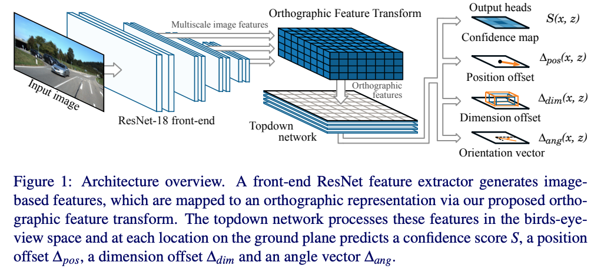

算法由五个部分组成:
1. 初始的resnet特征提取器进行原始图像多尺度的特征提取
2. oft, 将每个尺度上基于图像的特征转换为鸟瞰图的正射表达
3. 由一系列resnet残差单元组成的top-down网络来对oft中的feature map进行处理
4. 一组输出的head, 在地平面的每个位置预测置信得分，位置偏移，维度偏移和朝向向量
5. nms & decode stage, 峰值识别，生成离散边界框预测

oft part detail:

oft的目标是将前端特征提取器提取的feature map中的相关n维特征填充到3D体素特征图中.立体体素特征图定义在一个间隔均匀的3D网格，与地平面的距离固定，维度为W,H,D, 体素大小为r. 如下图所示:
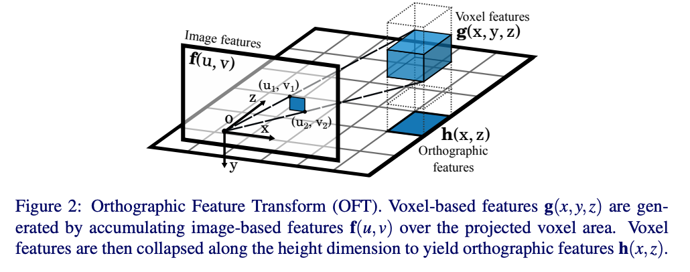

将体素对应的区域映射到图像上，用一个矩形框对映射的多边形进行近似，其坐标使用如下的公式进行计算:

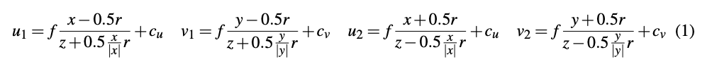

对投影区域内的值进行average pooling,得到g(x, y, z)的值，如下式所示:
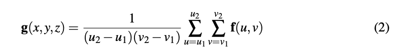

最终得到的体素特征图已经是一个不受透视影响场景表示，然而在这样的3D体素网格上运行深度神经网络非常的占据内存，由于自动驾驶的大部分目标在地平面上，因此将体素图分解到2D的表示图上，称为正交特征图h(x, z)

正交特征图通过学习到的权重矩阵和沿着竖直方向的轴与体素特征图相乘求和得到。

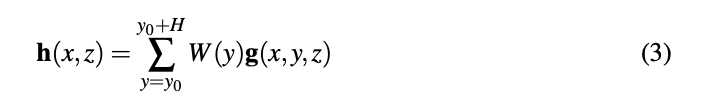

* 使用积分图的fast average pooling

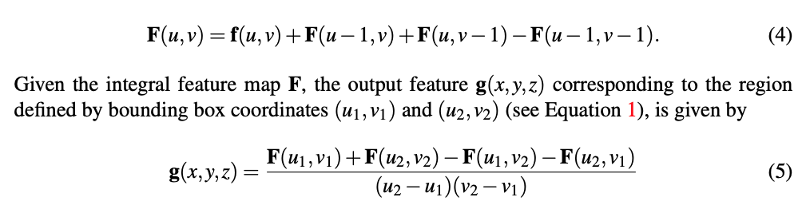

top-down network part detail:
top-down network是一个简单的卷积网络，使用resnet风格的skip连接，应用于oft阶段生成的2D特征图

* head output
置信图预测:
置信度图是个平滑函数，表示在(x, y0, z)位置是否存在以该位置为中心带边界框的目标存在的可能性。那如何生成GT confidence map呢? 假设给定N个真实目标的真实边界框中心pi = [xi, yi, zi], 计算ground truth confidence map为一个平滑的高斯区域. 如下式所示:
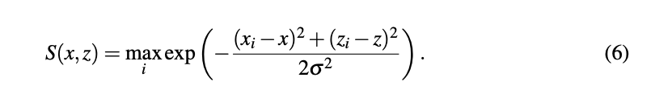

confidence map使用L1回归loss进行训练，由于正样本的数量要远远小于负样本，为了减少大量负样本的影响，引入常量因子0.01，将其乘以负样本的位置(S(x,z) < 0.05)

目标位置和bounding box估计:
增加一个额外的head来预测目标中心位置的相对偏移,如下式所示:
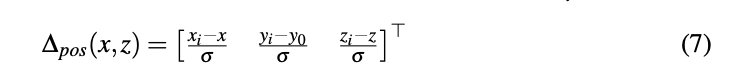

额外的两个head预测维度和朝向

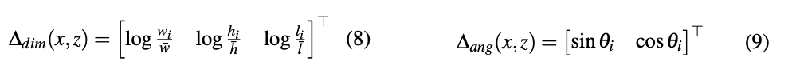

每个cell的position offset, dimension offset以及orientation vector使用l1 loss进行训练,忽略掉那些不包含任何object的cell

* NMS
使用NMS来获得最终的离散目标预测结果。不同于传统的二维目标检测边界框重叠计算，这里通过对置信度图进行平滑，找寻峰值位置，排除低于一定阈值的peak value

实验:
网络架构: 前端的特征提取器使用的是没有bottleneck层的resnet-18,在最后三个下采样层之前提取特征，得到一组feature map,其尺度为原始输入分辨率的1/8， 1/16， 1/32，用1*1的卷积核将特征图转换到特定的256大小，然后用oft产生正射的特征图h,文章中使用的体素网格尺寸为80m*4m*80m,网格分辨率为0.5m, top-down网络使用一个简单的16层resnet,没有下采样和bottltneck层，每个输出头由一个1*1卷积组成。使用gn而非bn,在小batch数据上gn会更好。

数据集:
kitti 3d object detection benchmark, training dataset: 3712, validation dataset: 3769

data augmentation:
random crop, scaling, horian flip

training procedure:
使用SGD, 600 epoch, batch size: 8, 动量:0.9 学习率: 1e-7

kitti benchmark上的performance:
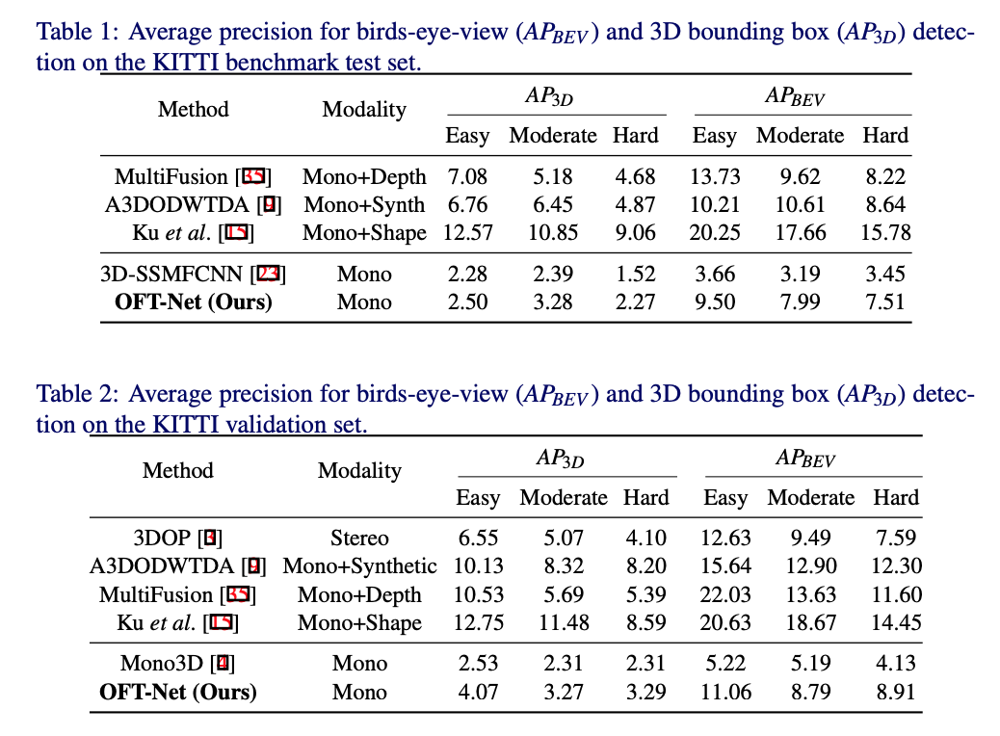

定性的评估:

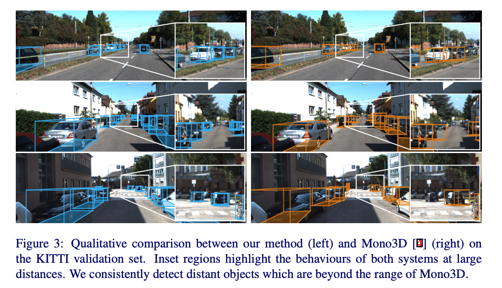

从图中可以看到远处的performance会更好一些

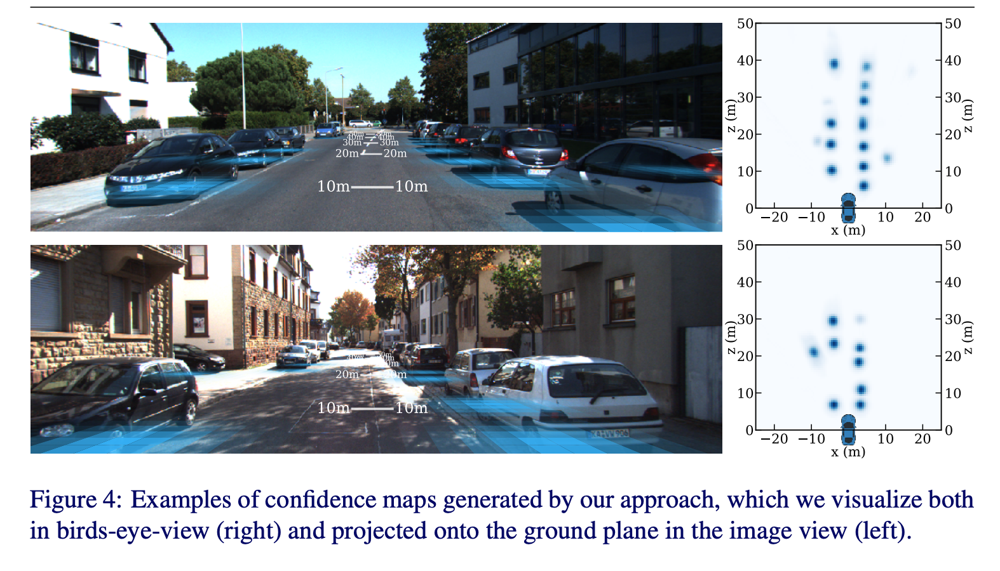

bev下的confidence map以及在原图上的一个投影

ablation study:
消融实验验证top-down网络的作用

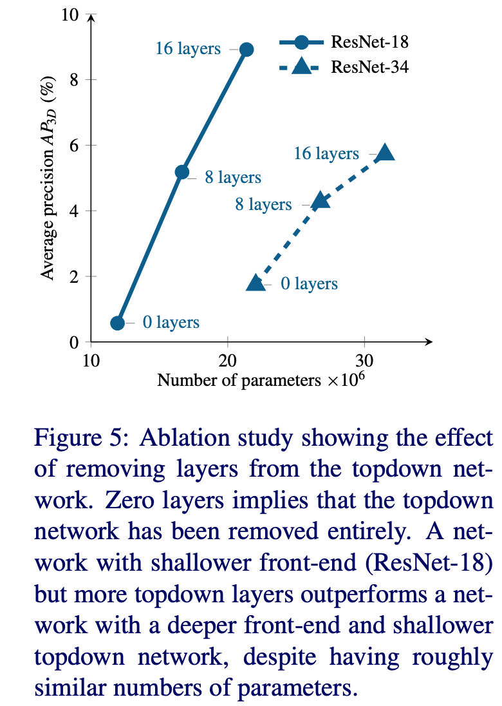

浅层的特征提取网络 + deep top-down network效果更好

如图为网络训练过程中confidence map的变化，初始的时候能够很快的定位到物体的大致区域，但是不确定度很大，随着训练的进行，定位不确定度越来越低，但远处的物体依然展示出不确定性，展示出远处物体定位的难度。
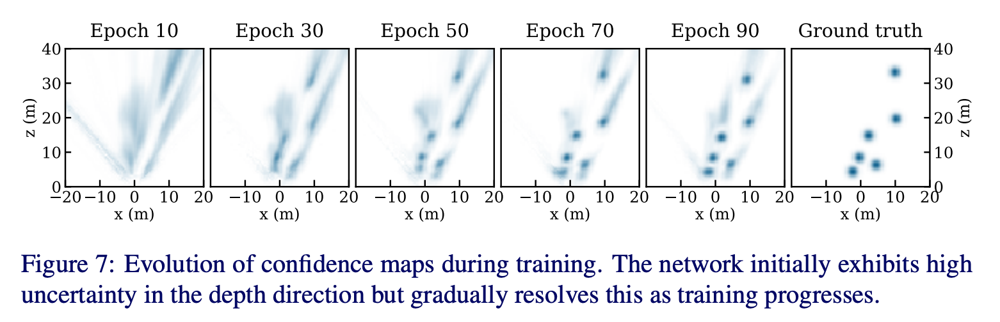

### [RoadMap: A Light-Weight Semantic Map for Visual Localization towards Autonomous Driving](https://arxiv.org/pdf/2106.02527.pdf)

提出了用sensor-rich车辆来作车端众包建图，众包的local map在云端作聚合，聚合后的全局地图在云端作压缩，压缩后传到车端解压缩，最后利用车端感知作定位。(当然最后如果低成本车端定位准确的化，使用低成本的车端也可以做众包的地图更新)，所以一个说的通的pipeline是这样的: 用第三方图商的地图或者robotaxi的车辆众包形成底图，然后云端维护，作地图融合，最后在消费级车端作定位的同时在做地图更新。

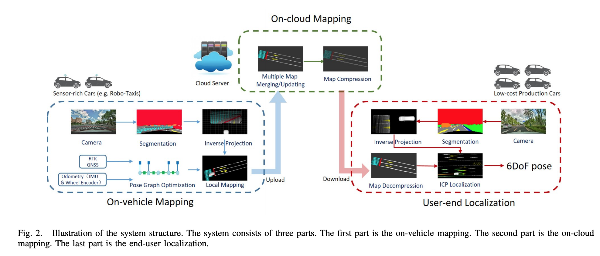

#### vehilce mapping
首先会对原始图像进行语义分割，然后利用相机相对于车辆的内外参将分割像素投影到车辆坐标系下，由于图像分割的噪声的影响，只对红色框内的roi区域进行逆投影。
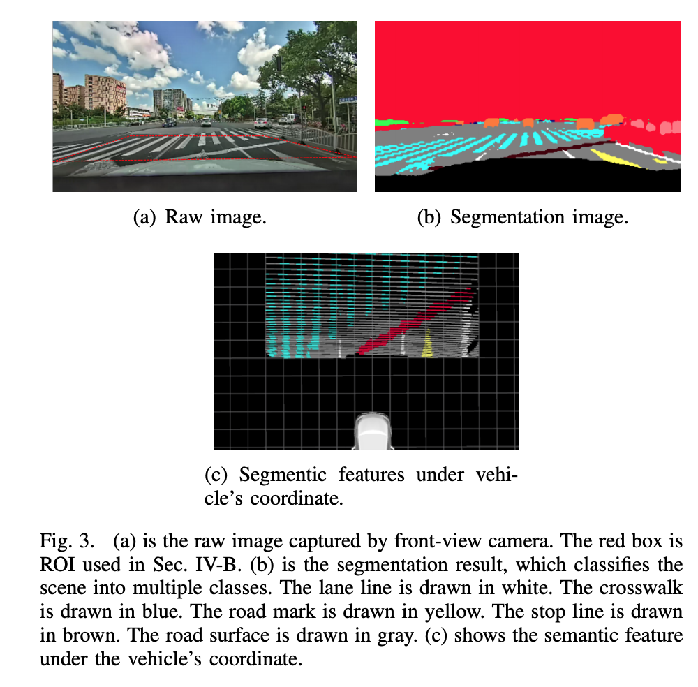

由于建图需要准确的位姿，无遮挡区域的rtk-gnss已经具有厘米级的定位定位，为了让遮挡区域也具有较高的定位精度，利用pose graph进行位姿误差平均，来获取连续一致的位姿。

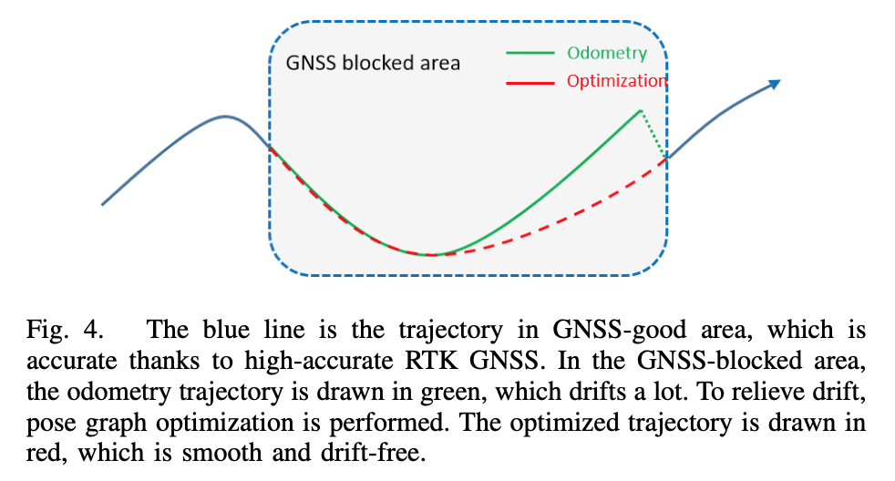
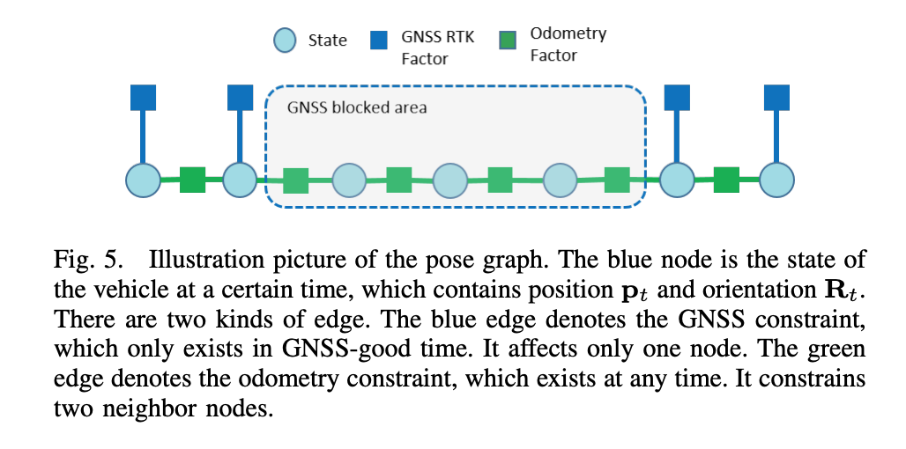

由于分割噪声的存在，利用多帧的观测来确定某一个地图位置所对应的类别,将地图划分为0.1 * 0.1 * 0.1的grid,每一个grid cell中包含位置，语义标签，以及每种语义标签的数量。当对应类别的语义点插入grid的时候，该grid的对应标签数量+1, 最终采样max voting, winner takes all的方式觉得grid类别

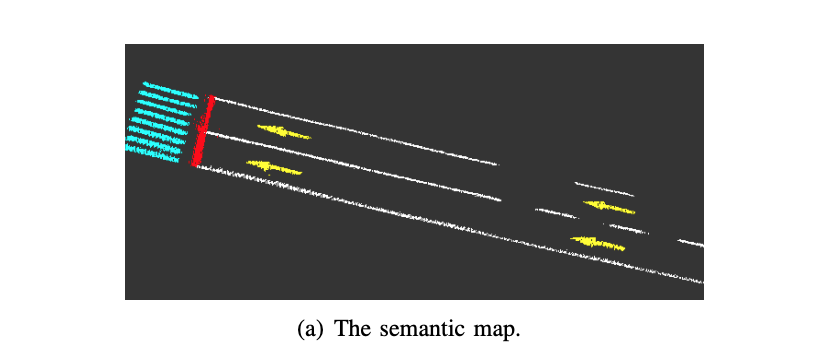

#### cloud mapping
云端负责对多次行驶的车辆构建的local map进行聚合，为了节省带宽度，仅上传occupied grid。 云端的语义地图也进行了grid划分，局部地图grid score会加到对应的全局地图的grid上面。

为了进一步节省带宽，对传输到车端的地图进行了压缩，通过轮廓提取进行地图容量压缩。

#### user vehicle localization
定位的时候利用感知的车辆坐标系下的当前地图点和语义地图中的地图点进行ICP配准来估计当前车辆的pose, 引入efk滤波来耦合里程计观测，输出平滑轨迹。

map update渐进式结果:

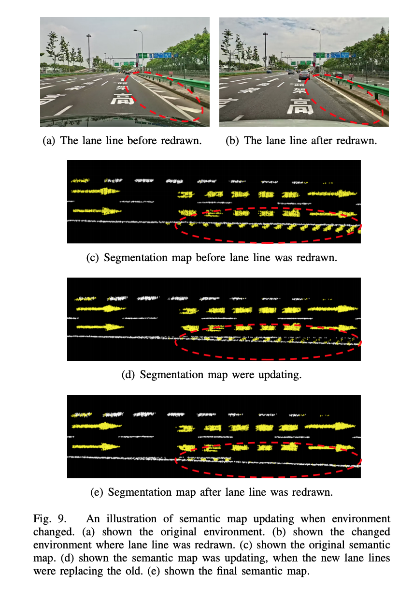

