### LVI-SAM: Tightly-coupled Lidar-Visual-Inertial Odometry via Smoothing and Mapping (ICRA 2021)

* 摘要: 
紧耦合的lidar, 视觉惯性里程计。 lvi-sam构建了一个因子图，由两个子系统构成lis, vis。这两个子系统都被设计为紧耦合模式，lis和vis可以相互促进。vis的初始化比较难，需要有一定的加速运动激励，vis可以借助lis的估计来完成初始化，同时视觉特征的深度估计是视觉slam中的一个基础组件，vis的视觉特征可以利用激光雷达的测量来获取深度信息，从而提高vis的精度。而lis在做基于scan-matching的位姿估计的时候，可以利用vis估计作为初值。在闭环部分，可以通过vis利用视觉apperance信息进行确认，然后经过lis经一步优化。由于这是两套互相促进的子系统，当其中之一失败的时候，lvi-sam仍然可以运行，如在纹理缺失(vis容易失败)或是几何特征缺失(lis容易失败)的时候。

* 介绍:
过去的20年，基于单个传感器的slam技术迅猛发展，camera based slam , lidar based slam以及radar based slam. 每一种都有显著的优缺点，因为从5，6年前开始，vi系统，li系统被大量的关注以及研究，单一视觉传感器或激光雷达和廉价的惯性测量单元的结合显著提高的各自的精度以及鲁棒性，对于li系统来说，imu可以帮助进行运动中的点云畸变校正，在解决短时间内的特征缺失问题。对于vi系统来说，快速运动，尺度恢复，状态估计的初值提供都可以通过imu信息来得到。本文将目前应用上较广的两个工作，vins-mono和lio-sam进行结合，提出了一个通过平滑建图的紧耦合的lvi-sam框架。
lio-sam中的vis执行视觉特征跟踪，并选择性的使用lidar帧获取特征深度，通过优化视觉重投影误差和imu测量误差获得的vio可以作为lis系统scan matching的初值。使用imu信息对点云进行纠偏后，lis提取边缘点云特征和平面点云特征，并将他们与滑动窗口中的特征图进行匹配。lis估计的状态可以发送给vis,以方便其初始化。来自vo, lo, imu预积分，闭环的约束在因子图中被共同优化。优化后的imu偏差用来对imu测量值进行传播，使得可以以imu的速率进行状态估计。lvio代表了vio和lio中最新技术的独特集成。

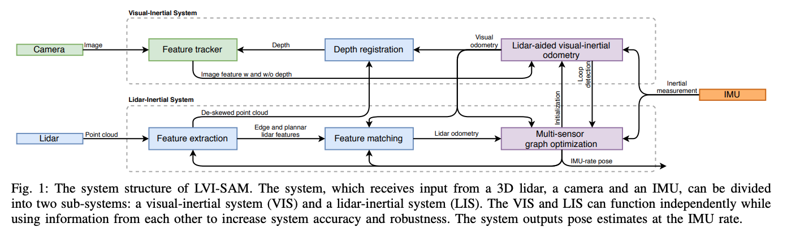
lvi-sam的系统架构图，vis和lis可以互相独立的运行，也可以利用对方的信息来提高精度和鲁棒性，系统最终输出imu频率的pose.

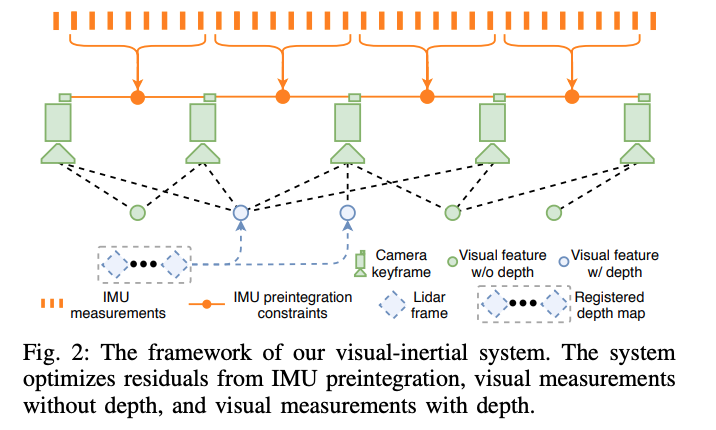
视觉惯导系统的流程图

GFTT作特征提取，KLT作帧间的特征跟踪，相对于原始的vins,改进了初始化和特征深度估计部分的内容。

* 初始化
vis系统初始化较难，其初始化质量取决于两个因素，传感器的初始运动和imu参数的准确性，当vins的传感器以较小或恒定的速度行进时，通常无法完成初始化，加速度激励不够时尺度不可观。imu参数包括缓慢时变的bias和白噪声，这会同时影响原始加速度和角速度的测量，初始化的时候对这些参数有一个比较好的估计有利于非线性优化问题的收敛。利用lis的状态估计帮助vis完成初始化，因为激光雷达的深度可观，可以直接利用lidar的测量对系统状态和imu的bias进行估计，然后根据估计的状态以及图像的时间戳对状态进行插值并将其关联到图像关键帧，最后将插值后的图像状态和imu bias作为vis初始化的初值，显著提高的初始化的速度和鲁棒性。
[vis init video](https://www.youtube.com/watch?v=8CTl07D6Ibc)

* 特征深度关联

为了将特征点和深度值进行关联，在相机中心的单位球体上投射视觉特征和激光雷达深度点，多帧lidar点云(单帧太稀疏)通过相机雷达外参投影到相机坐标系下，通过成像模型投影到归一化球面上。深度点被下采样，然后使用极坐标进行存储，利用视觉特征的极坐标搜索二维KD-TREE来找到球面上最近的三个深度点，最终特征的bearing vector与三个深度点在笛卡尔空间中形成的平面相交，如图所示:
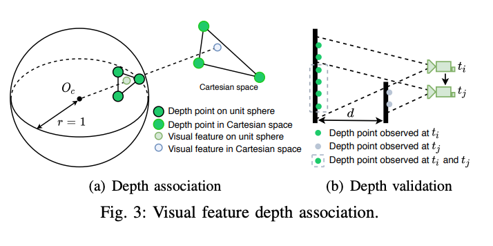

通过进一步检查三个特征点的深度的差值来进行有效性判断。

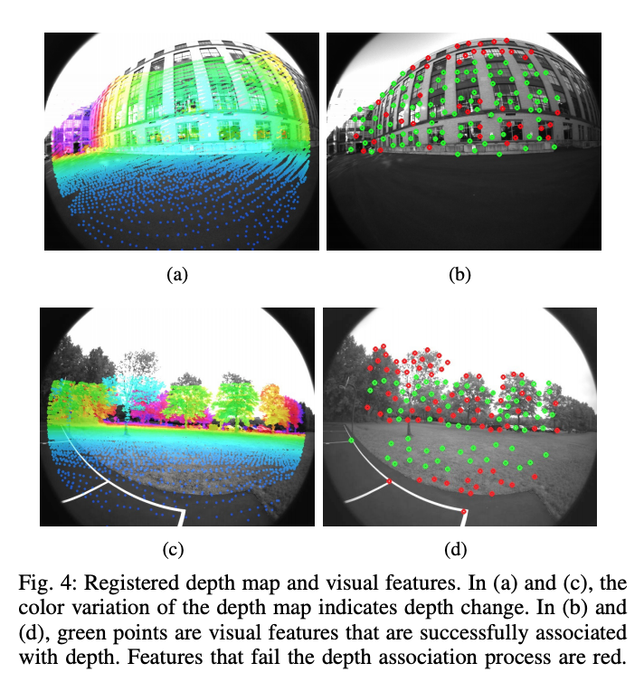

如上图是配准的深度图和视觉特征，绿色点是成功关联上深度的特征，红色点是深度关联失败的特征。

* 故障检测
在剧烈运动，照明变化以及缺失纹理的地方，vis容易失败。因此当跟踪的特征数量低于阈值的时候，或者估计的imu偏差超过阈值的时候，将报告vis失败，并重新初始化并通知lis

* 闭环检测
使用DBOW进行闭环检测，DBOW返回的候选闭环图像时间戳被发送给lins进行进一步验证

lis系统:

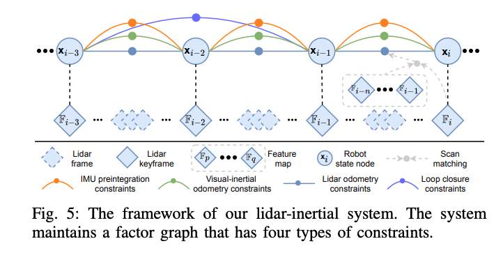

整个因子图中包含四种约束，关键帧间的imu预积分约束，视觉里程计约束，激光里程计约束和闭环约束。激光里程计约束来自于scan matching,将当前激光雷达关键帧与全局pointcloud feature map进行匹配，闭环约束的候选帧首先由vis提供，然后通过扫描匹配进一步优化。为激光点云局部地图维护一个激光关键帧的滑动窗口，当载体运动超过一定的阈值后，将新建一个关键帧，选择新的激光关键帧后，新的载体状态将作为节点添加到因子图中。提高系统鲁棒性的两个方面:

1. lis初始化
lis初始化之后，从两个来源获取初始估计，一个是校正偏差的IMU测量积分，一个是vis,当vis信息可用的时候，用vis作为scan-match的初始估计，如果vis失败，则切换到imu测量进行初始化。
2. 故障检测
判断scan matching的有效性，计算A^t * A的最小特征值，当其小于一定的阈值的时候判定lis失败，发生故障的时候，不会将激光雷达里程计约束添加到因子图当中。

$
min(||AT - b||)
$
scan matching所要解决的一个最小二乘问题
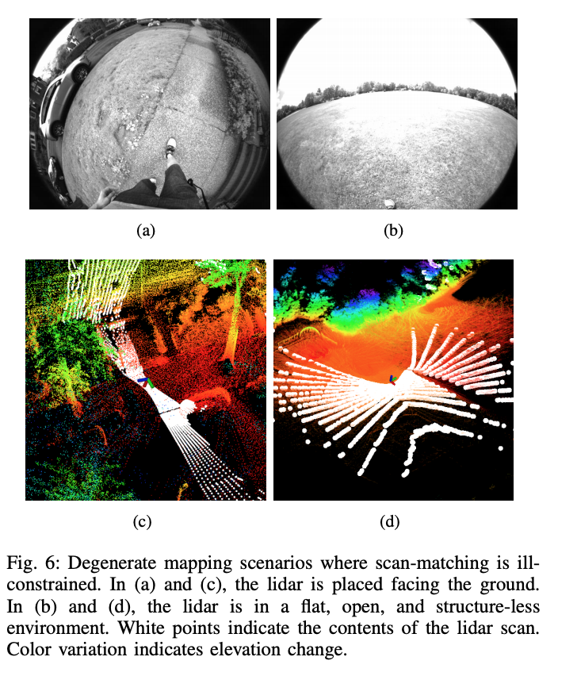

在空旷的地方，或者lidar朝下观测的时候，scan matching会发生退化，从而容易匹配失败。

#### 消融实验

* 
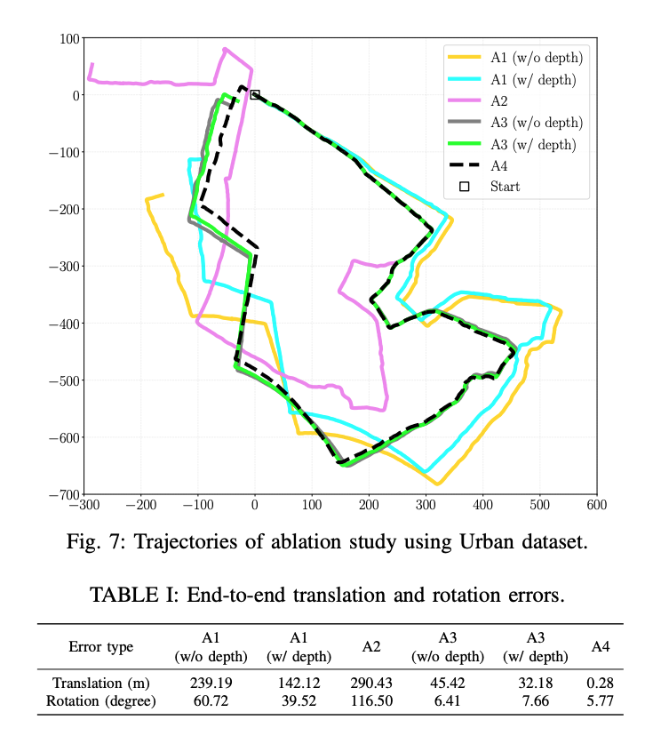

A1: 激光的特征点深度对vis的影响，禁用了lis中的scan matching,仅仅依赖vis进行位姿估计，可以看到相对于不用激光点云的深度线索，用激光点提供特征深度可以有效提升精度

A2: 禁用vis,仅用lis做位姿估计，可以看到当遇到退化场景的时候效果较差

A3: lis和vis一起使用，切换深度配准模块，可以看到位姿误差大幅减少

A4:启用闭环检测，消除了累积漂移

* Jackal 数据集

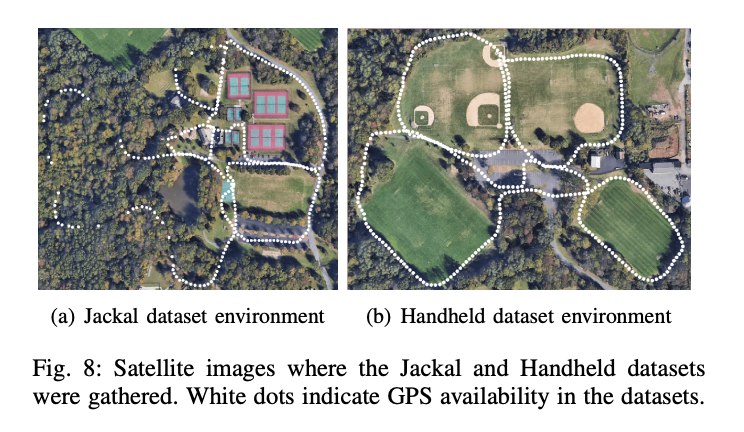

* 手持数据集

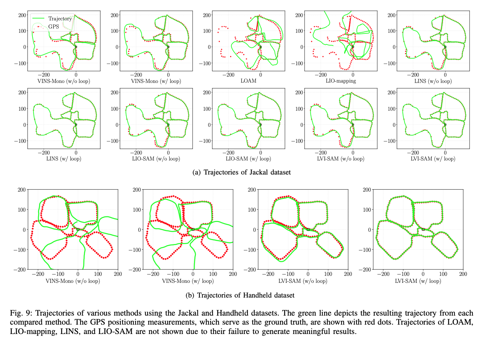

增加了传感器，结果上必然有所提高:

精度评估:
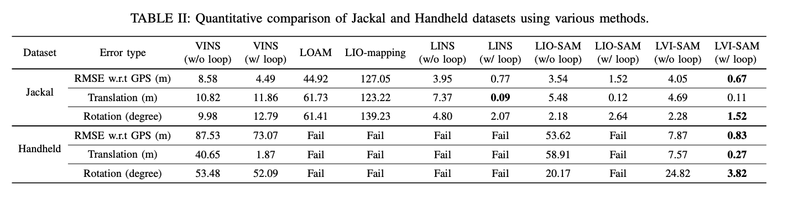

### Generalizing to the Open World: Deep Visual Odometry with Online Adaptation

在线自适应深度学习自适应里程计

经典的slam/vo算法依赖底层特征作为图像表达，在弱纹理，动态环境下表现较差，深度神经网络可以提取高级特征，并通过学习进行端到端的优化。在这些算法中，自监督vo算法能通过最小化光度误差同时对学习相机位姿，深度和光流。但是预训练的网络在面对不同的场景的时候，表现性能较差，因此预训练网络需要以自监督的方式实现online adaption.

整体结构如下图所示:
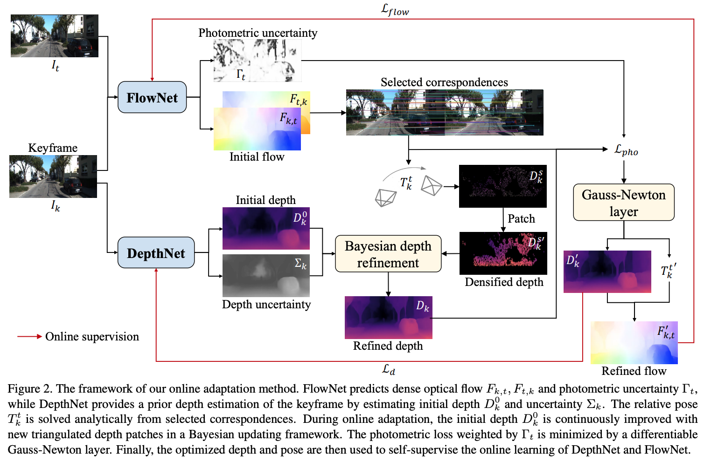

### OV2SLAM : A Fully Online and Versatile Visual SLAM for Real-Time Applications

