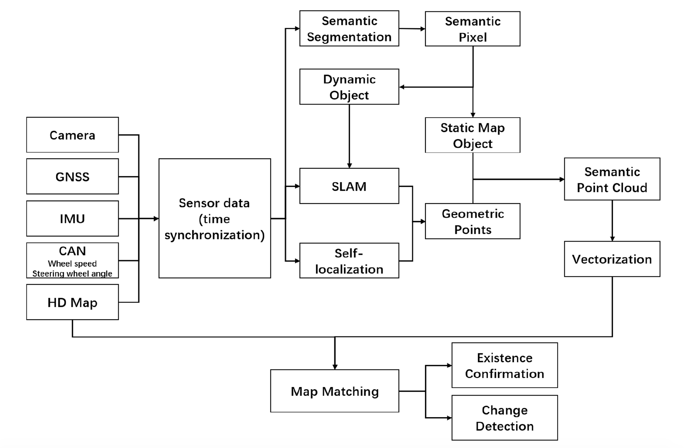

### Crowdsourced Mapping Summary

#### Mobileye
https://www.mobileye.com/our-technology/rem/

#### DeepMotion 

http://chizhang.me/ (vision based crowdsourced mapping, multi-journey fusion and auto lane topology deduction)

#### Argo.AI

http://www.cis.rit.edu/~glpci/vocvalc2021/speaker/ 

#### Huawei

[RoadMap: A Light-Weight Semantic Map for Visual Localization towards Autonomous Driving](https://arxiv.org/pdf/2106.02527.pdf)

提出了用sensor-rich车辆来作车端众包建图，众包的local map在云端作聚合，聚合后的全局地图在云端作压缩，压缩后传到车端解压缩，最后利用车端感知作定位。(当然最后如果低成本车端定位准确的化，使用低成本的车端也可以做众包的地图更新)，所以一个说的通的pipeline是这样的: 用第三方图商的地图或者robotaxi的车辆众包形成底图，然后云端维护，作地图融合，最后在消费级车端作定位的同时在做地图更新。

#### vehilce mapping
首先会对原始图像进行语义分割，然后利用相机相对于车辆的内外参将分割像素投影到车辆坐标系下，由于图像分割的噪声的影响，只对红色框内的roi区域进行逆投影。

由于建图需要准确的位姿，无遮挡区域的rtk-gnss已经具有厘米级的定位定位，为了让遮挡区域也具有较高的定位精度，利用pose graph进行位姿误差平均，来获取连续一致的位姿。

由于分割噪声的存在，利用多帧的观测来确定某一个地图位置所对应的类别,将地图划分为0.1 * 0.1 * 0.1的grid,每一个grid cell中包含位置，语义标签，以及每种语义标签的数量。当对应类别的语义点插入grid的时候，该grid的对应标签数量+1, 最终采样max voting, winner takes all的方式觉得grid类别

#### cloud mapping
云端负责对多次行驶的车辆构建的local map进行聚合，为了节省带宽度，仅上传occupied grid。 云端的语义地图也进行了grid划分，局部地图grid score会加到对应的全局地图的grid上面。

为了进一步节省带宽，对传输到车端的地图进行了压缩，通过轮廓提取进行地图容量压缩。

#### user vehicle localization
定位的时候利用感知的车辆坐标系下的当前地图点和语义地图中的地图点进行ICP配准来估计当前车辆的pose, 引入efk滤波来耦合里程计观测，输出平滑轨迹。

map update渐进式结果:

#### Momenta

https://www.momenta.cn/en/apply.html

#### KuanDeng

1. Real-Time HD Map Change Detection for Crowdsourcing
Update Based on Mid-to-High-End Sensors (sensors 2021)

#### Hanyang University (korean)
1. [Crowd-Sourced Mapping of New Feature Layer
for High-Definition Map (sensors, 2018)](https://www.ncbi.nlm.nih.gov/pmc/articles/PMC6308540/pdf/sensors-18-04172.pdf)

